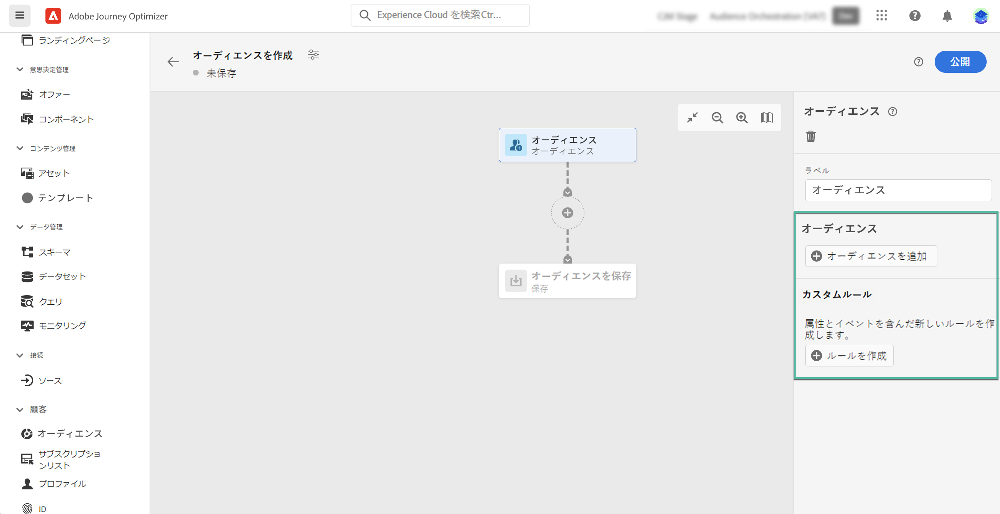
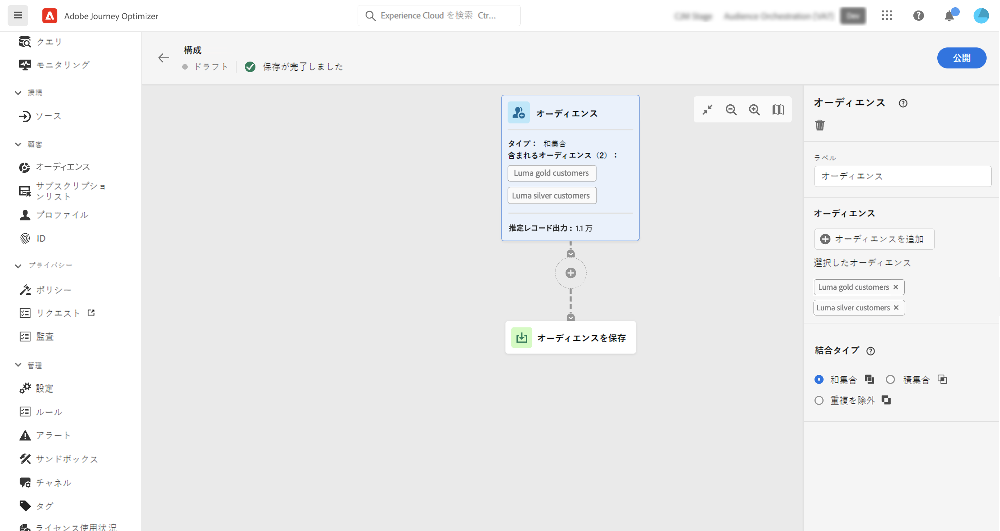
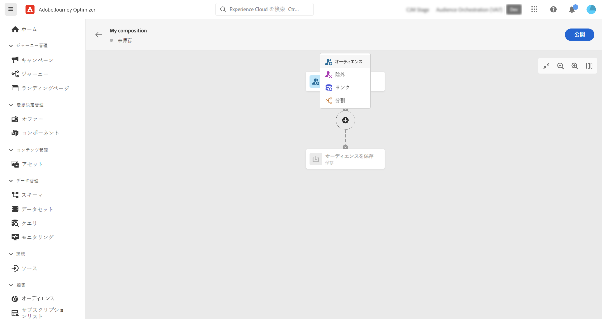
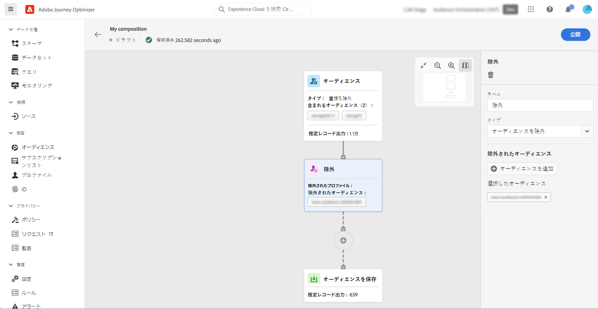
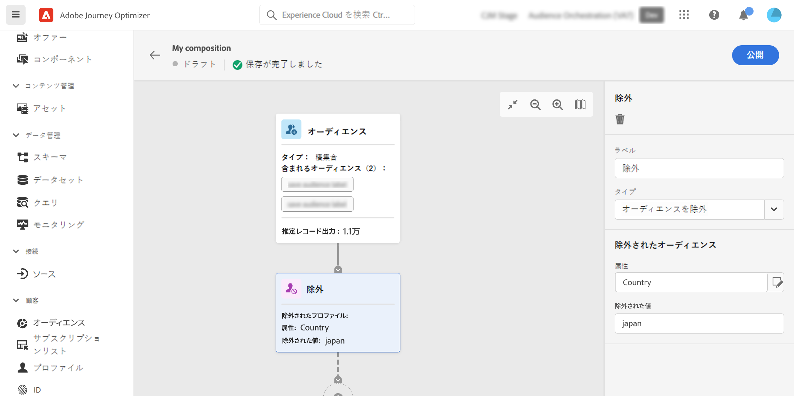
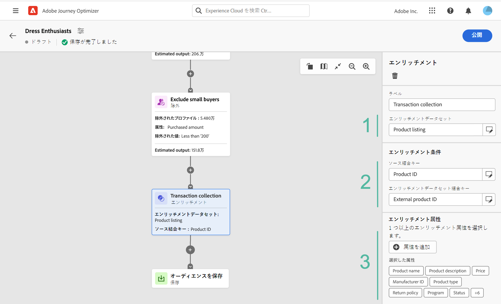
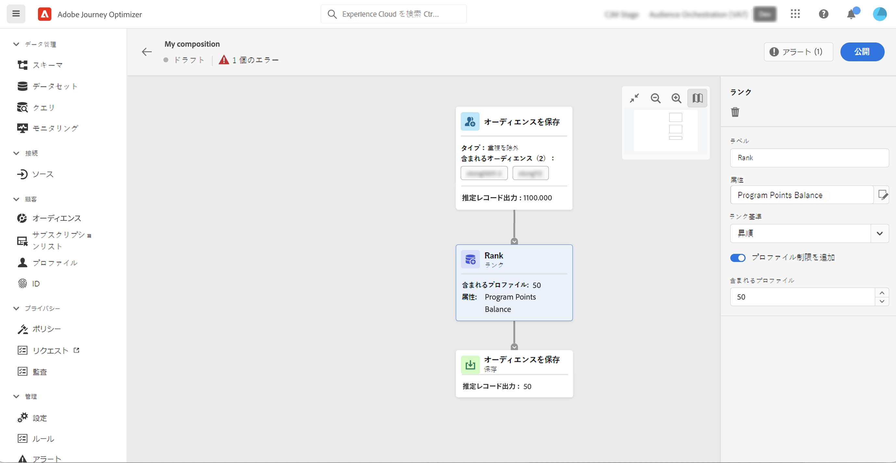
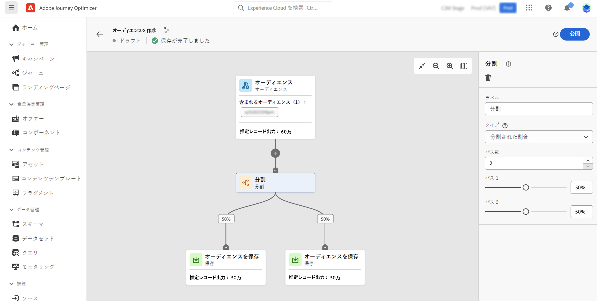
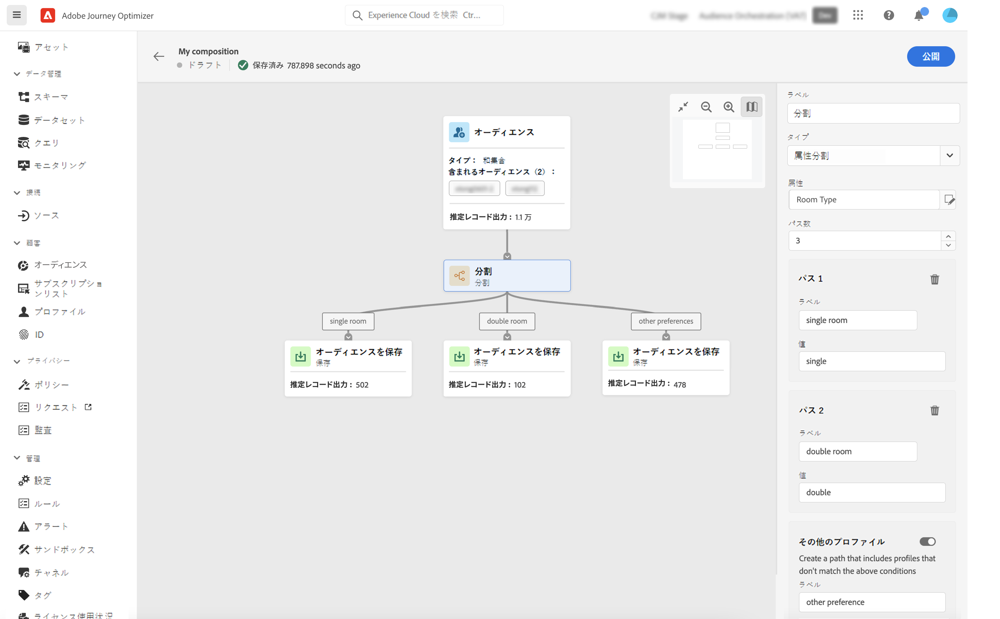

# コンポジションキャンバスの操作 {#composition-canvas}

>[!BEGINSHADEBOX]

このドキュメントでは、Adobe Journey Optimizer 内でオーディエンス構成を使用する方法について詳しく説明します。Adobe Journey Optimizer を使用していない場合は、[こちらをクリック](https://experienceleague.adobe.com/docs/experience-platform/segmentation/ui/audience-composition.html?lang=ja){target="_blank"}してください。

>[!ENDSHADEBOX]

オーディエンスコンポジションは、オーディエンスを作成し、様々なアクティビティ（分割、強化など）を使用できる視覚的なキャンバスを提供します。

キャンバスでオーディエンスを作成する手順は次のとおりです。

1. [開始オーディエンスを定義する](#starting-audience)
1. [1 つ以上のアクティビティを追加する](#action-activities)
1. [結果を新しいオーディエンスに保存する](#save)

## 開始オーディエンスを選択する {#starting-audience}

コンポジションを作成する最初の手順は、コンポジションの基礎となる 1 つ以上の既存のオーディエンスを選択します。

1. 「**[!UICONTROL オーディエンス]**」アクティビティを選択し、アクティビティのラベルを入力します。

1. ターゲットとするオーディエンスを選択します。

   * 「**[!UICONTROL オーディエンスを追加]**」ボタンをクリックして、1 つまたは複数の既存のオーディエンスを選択します。
   * 「**[!UICONTROL ルールを作成]**」ボタンをクリックすると、[セグメント化サービス](https://experienceleague.adobe.com/docs/experience-platform/segmentation/ui/overview.html?lang=ja)を使用して新しいオーディエンス定義を作成できます。

   

1. 複数のオーディエンスを選択する場合は、これらのオーディエンスのプロファイルの結合方法を指定します。

* **[!UICONTROL 和集合]**：選択したオーディエンスのすべてのプロファイルを含めます。
* **[!UICONTROL 積集合]**：選択したすべてのオーディエンスに共通のプロファイルを含めます。
* **[!UICONTROL 重複を除外]**：いずれかのオーディエンスにのみ属するプロファイルを含めます。複数のオーディエンスに属するプロファイルは含まれません。

この例では、ゴールドオーディエンスとシルバーオーディエンスに属するすべてのプロファイルをターゲットにします。

オーディエンスを選択すると、プロファイルの推定数がアクティビティの下部に表示されます。

## アクティビティを追加 {#action-activities}

開始オーディエンスを選択した後にアクティビティを追加して、選択を絞り込みます。

これを行うには、コンポジションパスの「+」ボタンをクリックし、目的のアクティビティを選択します。右側のパネルが開き、新しく追加したアクティビティを設定できます。

使用可能なアクティビティは次のとおりです。

* [オーディエンス](#audience)：1 つ以上のオーディエンスに属する追加のプロファイルを含めます。
* [除外](#exclude)：既存オーディエンスに属するプロファイルを除外したり、特定の属性に基づいてプロファイルを除外したりします。
* [エンリッチメント](#enrich)：Adobe Experience Platform データセットから取得した追加の属性を使用してオーディエンスを強化します。
* [ランク](#rank)：特定の属性に基づいてプロファイルをランク付けし、保持するプロファイルの数を指定してコンポジションに含めます。
* [分割](#split)：ランダムな割合または属性に基づいて、コンポジションを複数のパスに分割します。

必要な数の&#x200B;**[!UICONTROL オーディエンス]**&#x200B;アクティビティおよび&#x200B;**[!UICONTROL 除外]**&#x200B;アクティビティをコンポジションに追加できます。ただし、の後にアクティビティを追加することはできません **[!UICONTROL ランク]** および **[!UICONTROL 分割]** アクティビティ。

右側のパネルの削除ボタンをクリックして、アクティビティをキャンバスからいつでも削除できます。削除するアクティビティがコンポジション内の他のアクティビティの親である場合は、メッセージが表示され、選択したアクティビティのみを削除するか、そのすべての子アクティビティを削除するかを指定できます。

### オーディエンスアクティビティ {#audience}

>[!CONTEXTUALHELP]
>id="ajo_ao_audience"
>title="オーディエンスアクティビティ"
>abstract="オーディエンスアクティビティを使用すると、既存オーディエンスに属する追加のプロファイルをコンポジションに含めることができます。"

>[!CONTEXTUALHELP]
>id="ajo_ao_merge_types"
>title="結合タイプ"
>abstract="選択したオーディエンスのプロファイルを結合する方法を指定します。"

**[!UICONTROL オーディエンス]**&#x200B;アクティビティを使用すると、既存オーディエンスに属する追加のプロファイルをコンポジションに含めることができます。

このアクティビティの設定は、[オーディエンスアクティビティ](#starting-audience)の開始時と同様です。

### 除外アクティビティ {#exclude}

>[!CONTEXTUALHELP]
>id="ajo_ao_exclude_type"
>title="除外タイプ"
>abstract="除外オーディエンスタイプを使用して、既存オーディエンスに属するプロファイルを除外します。属性タイプを使用した除外では、特定の属性に基づいたプロファイルを除外できます。"

>[!CONTEXTUALHELP]
>id="ajo_ao_exclude"
>title="除外アクティビティ"
>abstract="除外アクティビティを使用すると、既存オーディエンスを選択するかルールを使用して、コンポジションからプロファイルを除外できます。"

**[!UICONTROL 除外]**&#x200B;アクティビティを使用すると、コンポジションからプロファイルを除外できます。次の 2 つのタイプの除外を使用できます。

* **[!UICONTROL オーディエンスを除外]**：既存オーディエンスに属するプロファイルを除外します。

  「**[!UICONTROL オーディエンスを追加]**」ボタンをクリックし、除外するオーディエンスを選択します。

  

* **[!UICONTROL 属性を使用して除外]**：特定の属性に基づいてプロファイルを除外します。

  検索する属性を選択し、除外する値を指定します。この例では、住所が日本にあるコンポジションプロファイルから除外します。

  >[!NOTE]
  >
  >指定できる除外値は 1 つのみです。

  

### エンリッチメントアクティビティ {#enrich}

>[!CONTEXTUALHELP]
>id="ajo_ao_enrich"
>title="エンリッチメントアクティビティ"
>abstract="エンリッチメントアクティビティを使用すると、Adobe Experience Platform データセットから取得した追加の属性でオーディエンスを強化できます。例えば、購入した製品に関する名前、価格、製造元 ID などの情報を追加し、これらの情報を活用して、オーディエンスに送信する配信をパーソナライズできます。"

>[!CONTEXTUALHELP]
>id="ajo_ao_enrich_dataset"
>title="エンリッチメントデータセット"
>abstract="オーディエンスに関連付けるデータを含むエンリッチメントデータセットを選択します。"

>[!CONTEXTUALHELP]
>id="ajo_ao_enrich_criteria"
>title="エンリッチメント条件"
>abstract="ソースデータセット（オーディエンスとエンリッチメントデータセット）間の紐付けキーとして使用するフィールドを選択します。"

>[!CONTEXTUALHELP]
>id="ajo_ao_enrich_attributes"
>title="エンリッチメント属性"
>abstract="オーディエンスに関連付ける 1 つ以上の属性をエンリッチメントデータセットから選択します。 コンポジションが公開されると、これらの属性がオーディエンスに関連付けられ、Journey Optimizer キャンペーンで配信をパーソナライズするために利用できます。"

**[!UICONTROL エンリッチメント]**&#x200B;アクティビティを使用すると、Adobe Experience Platform データセットから取得した追加の属性でオーディエンスを強化できます。 例えば、購入した製品に関する名前、価格、製造元 ID などの情報を追加し、これらの情報を活用して、オーディエンスに送信する配信をパーソナライズできます。

**[!UICONTROL エンリッチメント]**&#x200B;アクティビティを使用する場合は、次の制限事項に注意してください。

* エンリッチメント用の&#x200B;**データセット**&#x200B;は（イベントタイプではなく）レコードタイプにする必要があり、システムデータセットにすることも、プロファイル用にマークすることもできません。1 GB 未満にする必要があります。
* **エンリッチメントでは 1:1 結合をサポートしています**。つまり、エンリッチメントデータセット上で結合キーに複数の一致がある場合、システムは一致のうち 1 つを選択し、それを 1:1 結合に使用します。
* **オーディエンスは RTCDP 宛先でアクティブ化できます**&#x200B;が、エンリッチメント属性がある場合、それらはアクティブ化できません。
* エンリッチメント属性は、まだポリシー適用サービスと統合されていません。したがって、エンリッチメント属性に適用するデータ使用ラベルは、Journey Optimizer キャンペーンでは適用されません。

アクティビティを設定するには、次の手順に従います。

1. オーディエンスに関連付けるデータを含む&#x200B;**[!UICONTROL エンリッチメントデータセット]**&#x200B;を選択します。

1. 「**[!UICONTROL エンリッチメント条件]**」セクションで、ソースデータセット（オーディエンスとエンリッチメントデータセット）間の紐付けキーとして使用するフィールドを選択します。 この例では、購入した製品の ID を紐付けキーとして使用します。

1. 「**[!UICONTROL 属性を追加]**」ボタンをクリックし、オーディエンスに関連付ける 1 つ以上の属性をエンリッチメントデータセットから選択します。

   

コンポジションが公開されると、選択された属性がオーディエンスに関連付けられ、キャンペーンで配信をパーソナライズするために利用できます。

### ランクアクティビティ {#rank}

>[!CONTEXTUALHELP]
>id="ajo_ao_ranking"
>title="ランクアクティビティ"
>abstract="ランクアクティビティを使用すると、特定の属性に基づいてプロファイルをランク付けし、コンポジションに含めることができます。例えば、最大量のロイヤルティポイントを持つ 50 件のプロファイルを含めます。"

>[!CONTEXTUALHELP]
>id="ajo_ao_rank_profilelimit_text"
>title="プロファイル制限を追加"
>abstract="このオプションをオンにして、コンポジションに含めるプロファイルの最大数を指定します。"

**[!UICONTROL ランク]**&#x200B;アクティビティを使用すると、特定の属性に基づいてプロファイルをランク付けし、コンポジションに含めることができます。例えば、最大量のロイヤルティポイントを持つ 50 件のプロファイルを含めることができます。

1. 検索する属性を選択し、ランキング順（昇順または降順）を指定します。

   >[!NOTE]
   >
   >整数、数値、短整数のデータ型を持つ属性を選択できます。<!--(other?)-->

1. 「**[!UICONTROL プロファイル制限を追加]**」オプションをオンに切り替え、コンポジションに含めるプロファイルの最大数を指定します。

   

### 分割アクティビティ {#split}

<!-- [!CONTEXTUALHELP]
>id="ajo_ao_control_group_text"
>title="Control Group"
>abstract="Use control groups to isolate a portion of the profiles. This allows you to measure the impact of a marketing activity and make a comparison with the behavior of the rest of the population."-->

>[!CONTEXTUALHELP]
>id="ajo_ao_split"
>title="分割アクティビティ"
>abstract="分割アクティビティを使用すると、コンポジションを複数のパスに分割できます。コンポジションを公開すると、パスごとに 1 つのオーディエンスが Adobe Experience Platform に保存されます。"

>[!CONTEXTUALHELP]
>id="ajo_ao_split_type"
>title="分割タイプ"
>abstract="プロファイルを複数のパスにランダムに分割するには、「パーセント」分割タイプを使用します。「属性」分割タイプを使用すると、特定の属性に基づいてプロファイルを分割できます。"

>[!CONTEXTUALHELP]
>id="ajo_ao_split_otherprofiles_text"
>title="その他のプロファイル"
>abstract="他のパスで指定された条件に一致しない残りのプロファイルを含む追加のパスを作成する場合は、このオプションを切り替えてオンにします。"

**[!UICONTROL 分割]**&#x200B;アクティビティを使用すると、コンポジションを複数のパスに分割できます。

この操作により、各パスの最後にある&#x200B;**[!UICONTROL 保存]**&#x200B;アクティビティを自動的に追加できます。コンポジションを公開すると、パスごとに 1 つのオーディエンスが Adobe Experience Platform に保存されます。

次の 2 種類の分割操作を使用できます。

* **[!UICONTROL パーセント分割]**：プロファイルを 2 つ以上のパスにランダムに分割します。例えば、プロファイルをそれぞれ 50％の 2 つの異なるパスに分割できます。<!--and add an additional path for control group.-->

  

* **[!UICONTROL 属性の分割]**：特定の属性に基づいてプロファイルを分割します。この例では、部屋タイプの希望に基づいてプロファイルを分割します。

  

  属性ベースの分割アクティビティを設定するには、次の手順に従います。

   1. 「**[!UICONTROL 属性]**」フィールドの横にあるボタンをクリックして、分割条件として使用する属性を選択します。
   1. 必要に応じて、パスを追加します。パスごとにラベルを指定し、その特定のパスに含めるプロファイルを決定するために使用される値を指定します。

      >[!NOTE]
      >
      >各パスに指定できる値は 1 つだけです。

   1. 「**[!UICONTROL その他のプロファイル]**」オプションの切替スイッチをオンにして、他のパスで指定された条件に一致しない残りのプロファイルと共に、追加のパスを作成します。

## オーディエンスを保存する {#save}

Adobe Experience Platform に保存する結果のオーディエンスを設定します。

これを行うには、それぞれのパスの最後にある&#x200B;**[!UICONTROL オーディエンスを保存]**&#x200B;アクティビティを選択し、作成する新しいオーディエンスの名前を指定します。

コンポジションの準備ができたら、公開できます。[コンポジションの作成方法を説明します](create-compositions.md)
