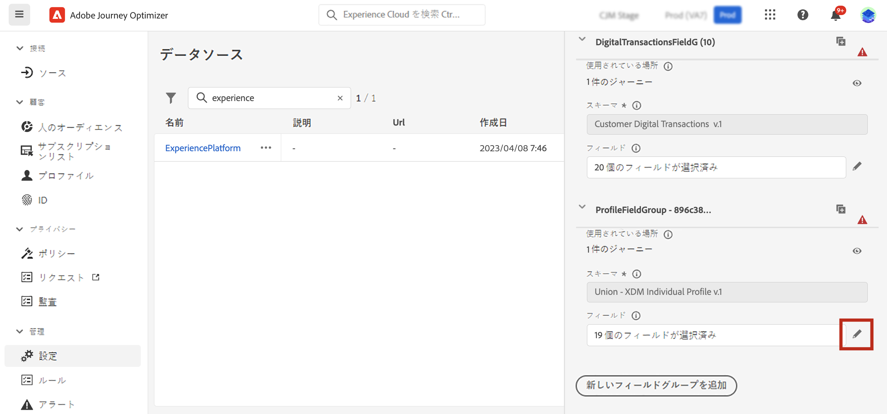
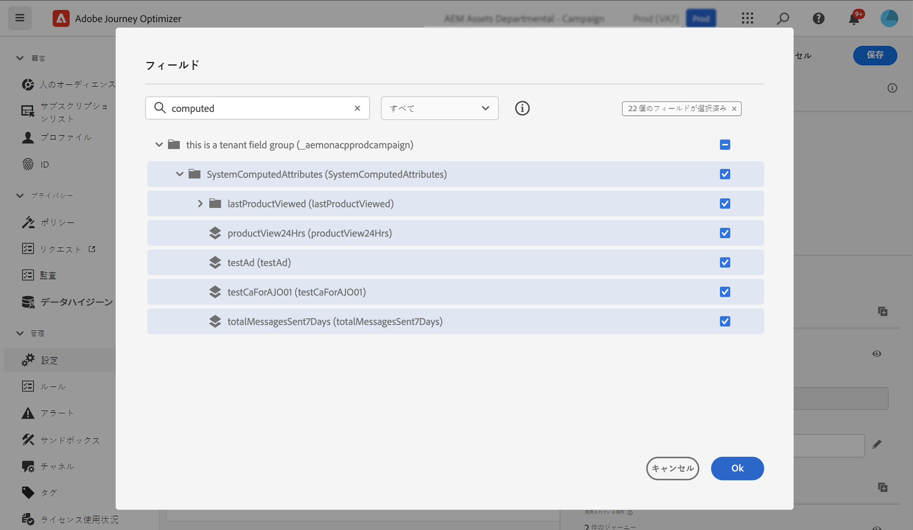
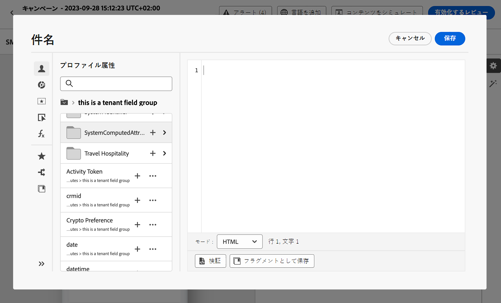

# 計算属性の操作 {#computed-attributes}

計算属性を使用すると、個々の行動イベントを、Adobe Experience Platform で使用可能な計算プロファイル属性に要約できます。これらの計算属性は、Adobe Experience Platform に取り込まれたプロファイル対応のエクスペリエンスイベントデータセットに基づいており、顧客プロファイル内に保存される集計データポイントとして機能します。

各計算属性は、ジャーニーやキャンペーンでのセグメント化、パーソナライゼーションおよびアクティブ化に活用できるプロファイル属性です。この簡素化により、さらにタイムリーで意味のあるパーソナライズされたエクスペリエンスを顧客に提供できるようになります。

>[!NOTE]
>
>計算属性にアクセスするには、適切な権限（**計算属性の表示**&#x200B;および&#x200B;**計算属性の管理**）が必要です。

## 計算属性の作成 {#manage}

計算属性を作成するには、左側にある&#x200B;**[!UICONTROL プロファイル]**&#x200B;メニューの「**[!UICONTROL 計算属性]**」タブに移動します。

この画面から、イベント属性、集計関数および指定のルックバック期間を組み合わせたルールを作成することで、計算属性を作成できます。例えば、過去 3 か月間の購入の合計を計算したり、過去 1 週間に購入を行っていないプロファイルが最近閲覧した商品を特定したり、各プロファイルが貯めた報酬ポイントの合計を集計したりできます。

ルールの準備が整ったら、計算属性を公開して、Journey Optimizer などの他のダウンストリームサービスで使用できるようにします。

計算属性の作成および管理方法について詳しくは、[計算属性のドキュメント](https://experienceleague.adobe.com/docs/experience-platform/profile/computed-attributes/overview.html?lang=ja)を参照してください

## Adobe Experience Platform データソースへの計算属性の追加 {#source}

計算属性を Journey Optimizer で活用できるようにするには、まず Journey Optimizer **Experience Platform** データソースに追加する必要があります。

Adobe Experience Platform のデータソースは、Adobe リアルタイム顧客プロファイルサービスへの接続を定義します。このデータソースは、リアルタイム顧客プロファイルサービスからプロファイルデータとエクスペリエンスイベントデータを取得するように設計されています。

データソースに計算属性を追加するには、次の手順に従います。

1. 左側の&#x200B;**[!UICONTROL 設定]**&#x200B;メニューに移動して、「**[!UICONTROL データソース]**」カードをクリックします。

1. **[!UICONTROL Experience Platform]** データソースを選択します。

   

1. 作成されたすべての計算属性を含んだ **[!UICONTROL SystemComputedAttributes]** フィールドグループを追加します。

   

これで、計算属性が Journey Optimizer で使用できるようになりました。[Journey Optimizer で計算属性を使用する方法の詳細情報](#use)

Adobe Experience Platform データソースにフィールドグループを追加する方法について詳しくは、[こちら](../datasource/adobe-experience-platform-data-source.md)を参照してください。

## Journey Optimizer での計算属性の使用 {#use}

>[!NOTE]
>
>開始する前に、計算属性が Adobe Experience Platform データソースに追加済みであることを確認してください。[この節](#source)でその方法を説明します。

計算属性は、Journey Optimizer 内の多目的な機能セットを提供します。メッセージコンテンツのパーソナライズ、新しいオーディエンスの作成、特定の計算属性に基づくジャーニーの分割など、様々な目的で使用できます。例えば、条件アクティビティに 1 つの計算属性を追加することで、過去 3 週間のプロファイルの合計購入数に基づいてジャーニーのパスを分割できます。また、最近閲覧された商品をプロファイルごとに表示して、メールをパーソナライズすることもできます。

計算属性はプロファイル結合スキーマで作成されたプロファイル属性フィールドなので、内のパーソナライゼーションエディターからアクセスできます **SystemComputedAttributes** フィールドグループ。 そこから、計算属性を式に追加し、他のプロファイル属性と同様に扱って、目的の操作を実行できます。

