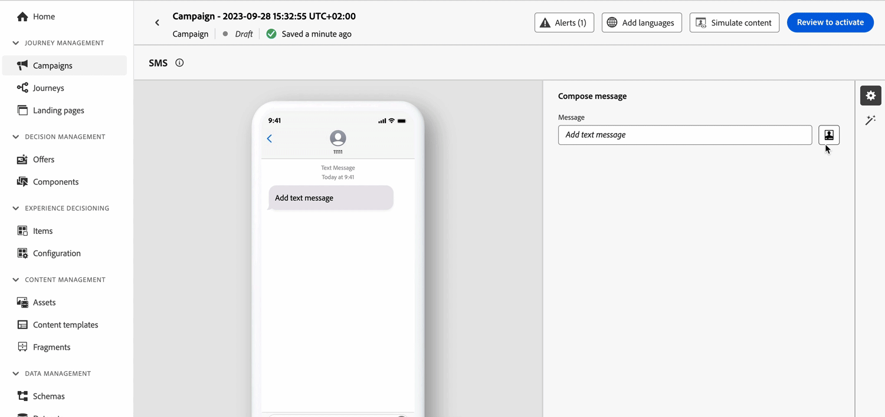
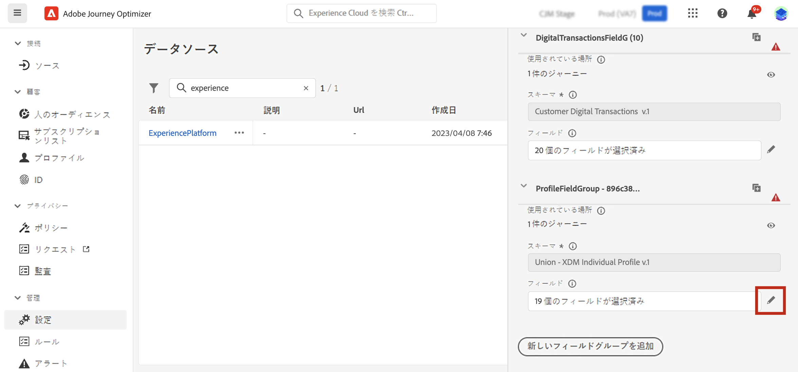
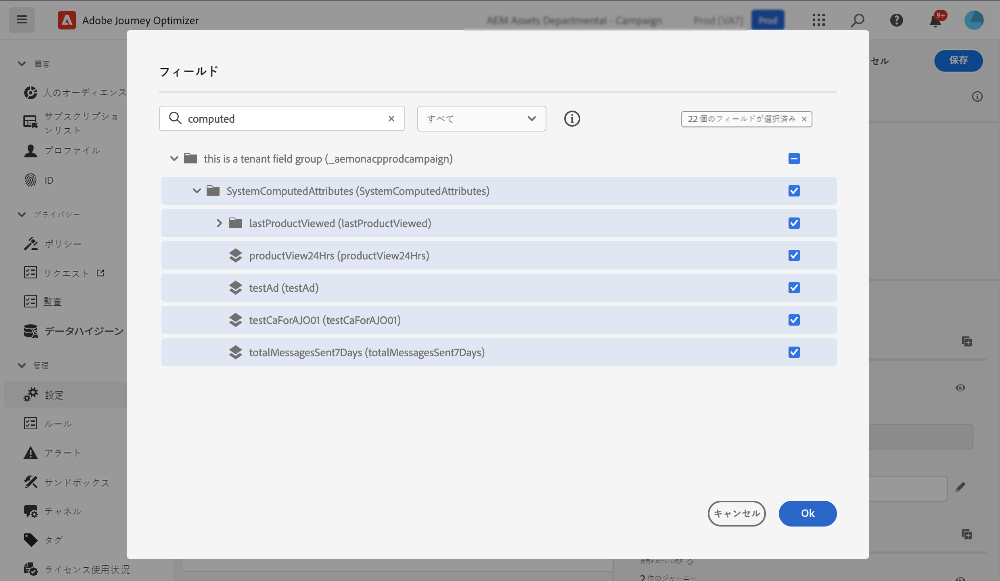
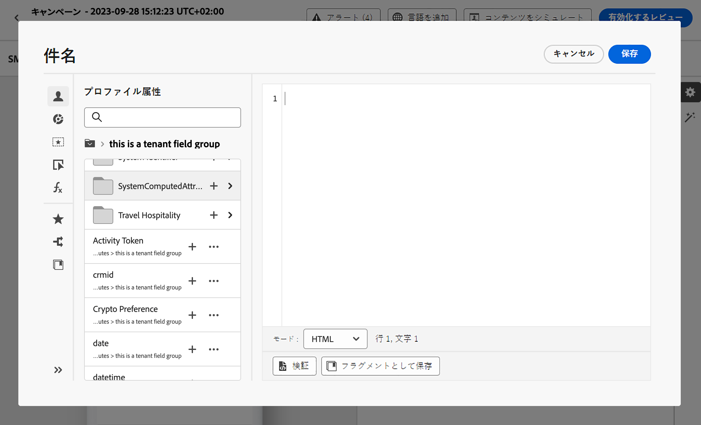

# 計算属性の操作 {#computed-attributes}

計算属性を使用すると、個々の行動イベントを、Adobe Experience Platform で使用可能な計算プロファイル属性に要約できます。 これらの属性は、Adobe Experience Platform に取り込まれたプロファイル対応のエクスペリエンスイベントデータセットに基づいており、顧客プロファイル内に保存される集計データポイントとして機能します。

各計算属性は、ジャーニーやキャンペーンでのセグメント化、パーソナライゼーションおよびアクティブ化に活用できるプロファイル属性です。 この簡素化により、さらにタイムリーで意味のあるパーソナライズされたエクスペリエンスを顧客に提供できるようになります。

>[!NOTE]
>
>計算属性にアクセスするには、適切な権限（**計算属性の表示**&#x200B;および&#x200B;**計算属性の管理**）が必要です。

## 計算属性の作成 {#manage}

計算属性を作成するには、左側にある&#x200B;**[!UICONTROL プロファイル]**&#x200B;メニューの「**[!UICONTROL 計算属性]**」タブを参照します。

この画面から、イベント属性、集計関数および指定のルックバック期間を組み合わせたルールを作成することで、計算属性を作成できます。 例えば、過去 3 か月間の購入の合計を計算したり、過去 1 週間に購入を行っていないプロファイルが最近閲覧した商品を特定したり、各プロファイルが貯めた報酬ポイントの合計を集計したりできます。

ルールの準備が整ったら、計算属性を公開して、Journey Optimizer などの他のダウンストリームサービスで使用できるようにします。

計算属性の作成および管理について詳しくは、[計算属性のドキュメント](https://experienceleague.adobe.com/docs/experience-platform/profile/computed-attributes/overview.html?lang=ja)を参照してください

## Adobe Experience Platform データソースへの計算属性の追加 {#source}

計算属性を Journey Optimizer で活用するには、計算属性を Journey Optimizer **Experience Platform** データソースに追加します。

Adobe Experience Platform のデータソースは、Adobe リアルタイム顧客プロファイルサービスへの接続を定義します。 このデータソースは、リアルタイム顧客プロファイルサービスからプロファイルデータとエクスペリエンスイベントデータを取得します。

データソースに計算属性を追加するには、次の手順に従います。

1. 左側の&#x200B;**[!UICONTROL 設定]**&#x200B;メニューを参照して、「**[!UICONTROL データソース]**」カードをクリックします。

1. **[!UICONTROL Experience Platform]** データソースを選択します。

   

1. 作成されたすべての計算属性を含んだ **[!UICONTROL SystemComputedAttributes]** フィールドグループを追加します。

   

これで、計算属性が Journey Optimizer で使用できるようになりました。 [Journey Optimizer で計算属性を使用する方法の詳細情報](#use)

Adobe Experience Platform データソースへのフィールドグループの追加について詳しくは、[この節](../datasource/adobe-experience-platform-data-source.md)を参照してください。

## Journey Optimizer での計算属性の使用 {#use}

>[!NOTE]
>
>開始する前に、計算属性が Adobe Experience Platform データソースに追加済みであることを確認してください。 [この節](#source)でその方法を説明します。

計算属性は、Journey Optimizer 内で多岐にわたる機能を提供します。 メッセージコンテンツのパーソナライズ、新しいオーディエンスの作成、特定の計算属性に基づくジャーニーの分岐など、様々な目的で使用します。 例えば、条件アクティビティに 1 つの計算属性を追加することにより、過去 3 週間のプロファイルの合計購入数に基づいてジャーニーのパスを分割します。 また、最近閲覧された商品をプロファイルごとに表示して、メールをパーソナライズすることもできます。

計算属性は、プロファイル結合スキーマに基づいて作成されたプロファイル属性フィールドなので、**SystemComputedAttributes** フィールドグループ内のパーソナライゼーションエディターからアクセスします。 そこから、計算属性を式に追加し、他のプロファイル属性と同様に扱って、目的の操作を実行します。

+++AI アシスタント – ページコンテキスト

- **TL;DR:** Adobe Experience Platformで計算属性を作成し、セグメンテーション、パーソナライゼーション、ジャーニーロジックのためにJourney Optimizerで活用する方法を説明します。

**インテント：**
- 計算属性とは何か、および標準プロファイル属性との違いを理解する
- イベント属性、集計関数、ルックバック期間を組み合わせて、計算属性を作成します
- AJOのExperience Platform データソースにSystemComputedAttributes フィールドグループを追加する
- ジャーニーの条件、オーディエンスの構築、メッセージのパーソナライゼーションで計算属性を使用すると

**用語集：**
- **計算属性**：集約された行動イベントデータから派生したプロファイル属性で、顧客プロファイル *（製品固有）*&#x200B;に保存されます
- **振り返り期間**：計算属性の集計ルールを計算する際に適用される時間ウィンドウ （例：「過去3か月」） *（製品固有）*
- **SystemComputedAttributes フィールドグループ**: ジャーニーとパーソナライゼーションで使用する公開済みのすべての計算属性を公開するAJOのExperience Platform データソースのフィールドグループ *（製品固有）*
- **プロファイル結合スキーマ**：計算属性が保存されている、特定のIDのすべてのプロファイルフラグメントを結合する結合スキーマ

**ガードレール：**
- この機能にアクセスするには、**計算属性の表示**&#x200B;および&#x200B;**計算属性の管理**&#x200B;権限が必要です
- 計算属性は、Journey Optimizerでダウンストリームで使用できるようになる前に、AEPで&#x200B;**公開**&#x200B;する必要があります
- 計算属性は、ジャーニーやパーソナライゼーションで使用する前に、AJOの&#x200B;**Experience Platform データソース**&#x200B;に明示的に追加する必要があります
- 計算属性は、Adobe Experience Platformに取り込まれたプロファイル対応のExperience Event データセットに基づきます

**用語：**
- 正式名称：Adobe Journey Optimizer – 頭字語：AJO – 変種：Journey Optimizer、A-JO
- 正式名称：Adobe Experience Platform – 頭字語：AEP
- 同義語：「計算属性」 = 「計算プロファイル属性」
- 「計算属性」（AEP/AJO固有の集計機能）≠汎用「プロファイル属性」は混同しないでください。

**FAQ:**
- **Q：計算属性とは何ですか？** — AEPにプロファイル属性として保存され、AJOで使用できる行動イベントデータ（購入総数、最終表示項目など）の集約。
- **Q：特別な権限が必要ですか？**  – はい：「計算属性の表示」と「計算属性の管理」の両方が必要です。
- **Q：計算属性をJourney Optimizerで使用できるようにするにはどうすればよいですか？**  – 設定/データソースの下のExperience Platform データソースに`SystemComputedAttributes` フィールドグループを追加します。
- **Q: AJOの計算属性はどこで使用できますか？**  – 条件アクティビティ（ジャーニー分割）、オーディエンス作成、パーソナライゼーションエディター。
- **Q: ルックバック期間とは何ですか？** — 「過去3週間の購入合計」など、集計ルールの範囲に使用された時間枠。
- **Q: リアルタイム ジャーニーで計算属性を使用できますか？**  – はい、公開してデータソースに追加すると、他のプロファイル属性と同様にアクセスできます。

+++
