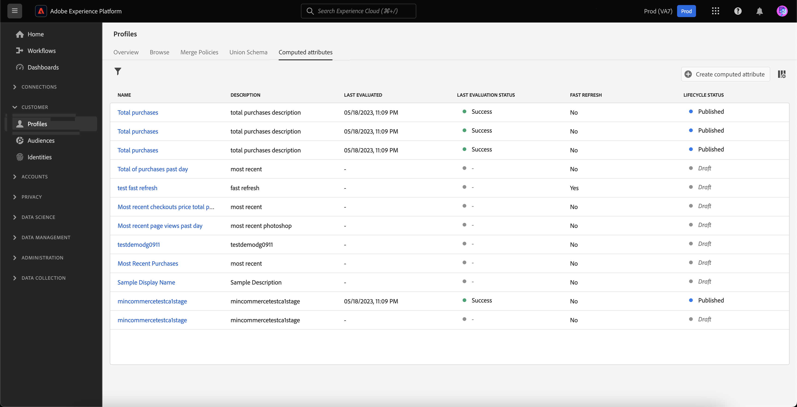

# 計算属性の操作 {#computed-attributes}

計算済み属性を使用すると、個々の行動イベントを、Adobe Experience Platformで使用可能な計算済みプロファイル属性に要約できます。 これらの計算済み属性は、Adobe Experience Platformに取り込まれ、顧客プロファイル内に保存される集計データポイントとして機能する、プロファイル対応のエクスペリエンスイベントデータセットに基づいています。

各計算済み属性は、ジャーニーやキャンペーンでのセグメント化、パーソナライゼーション、アクティブ化に利用できるプロファイル属性です。 このシンプル化により、パーソナライズされたエクスペリエンスをタイムリーで意味のある方法で顧客に提供できるようになります。

>[!NOTE]
>
>計算済み属性にアクセスするには、適切な権限 (**計算済み属性の表示** および **計算済み属性の管理**) をクリックします。

## 計算済み属性の作成 {#manage}

計算済み属性を作成するには、 **[!UICONTROL 計算済み属性]** 」タブをクリックします。 **[!UICONTROL プロファイル]** 左側のメニュー

この画面から、指定したルックバック期間内にイベント属性、集計関数を組み合わせたルールを作成することで、計算済み属性を作成できます。 例えば、過去 3 か月間の購入の合計を計算したり、過去 1 週間に購入を行っていないプロファイルが閲覧した最新の品目を特定したり、各プロファイルが累積した報酬ポイントの合計を集計したりできます。

ルールの準備が整ったら、計算済み属性を公開して、Journey Optimizerを含む他のダウンストリームサービスで使用できるようにします。

計算済み属性の作成および管理方法に関する詳細は、 [計算済み属性のドキュメント](https://experienceleague.adobe.com/docs/experience-platform/profile/computed-attributes/overview.html?lang=ja)

## 計算済み属性をAdobe Experience Platformデータソースに追加する {#source}

計算済み属性をJourney Optimizerで活用できるようにするには、まずJourney Optimizerに追加する必要があります **Experience Platform** データソース。

Adobe Experience Platform のデータソースは、Adobe リアルタイム顧客プロファイルサービスへの接続を定義します。このデータソースは、リアルタイム顧客プロファイルサービスからプロファイルデータとエクスペリエンスイベントデータを取得するように設計されています。

計算済み属性をデータソースに追加するには、次の手順に従います。

1. 次に移動： **[!UICONTROL 設定]** 左側のメニューから、 **[!UICONTROL データソース]** カード。

1. を選択します。 **[!UICONTROL Experience Platform]** データソース。

   

1. 次を追加： **[!UICONTROL SystemComputedAttributes]** 作成されたすべての計算済み属性を含むフィールドグループ。

   

計算済み属性をJourney Optimizerで使用できるようになりました。 [Journey Optimizerで計算済み属性を使用する方法を説明します。](#use)

Adobe Experience Platformのデータソースにフィールドグループを追加する方法について詳しくは、 [この節](../datasource/adobe-experience-platform-data-source.md).

## Journey Optimizerで計算済み属性を使用 {#use}

>[!NOTE]
>
>開始する前に、計算済み属性がAdobe Experience Platformデータソースに追加されていることを確認してください。 [この節](#source)でその方法を説明します。

計算済み属性は、Campaign Optimizer 内の汎用の機能セットを提供します。 メッセージコンテンツのパーソナライズ、新しいオーディエンスの作成、特定の計算済み属性に基づくジャーニーの分割など、様々な目的で使用できます。 例えば、過去 3 週間のプロファイルの合計購入数に基づいて、条件アクティビティに 1 つの計算済み属性を追加して、ジャーニーのパスを分割できます。 また、各プロファイルの最近表示された項目を表示することで、E メールをパーソナライズできます。

計算済み属性は、プロファイル和集合スキーマで作成されるプロファイル属性フィールドなので、 **SystemComputedAttributes** フィールドグループを使用します。 ここから、計算済み属性を式に追加して、他のプロファイル属性と同様に扱い、必要な操作を実行できます。

