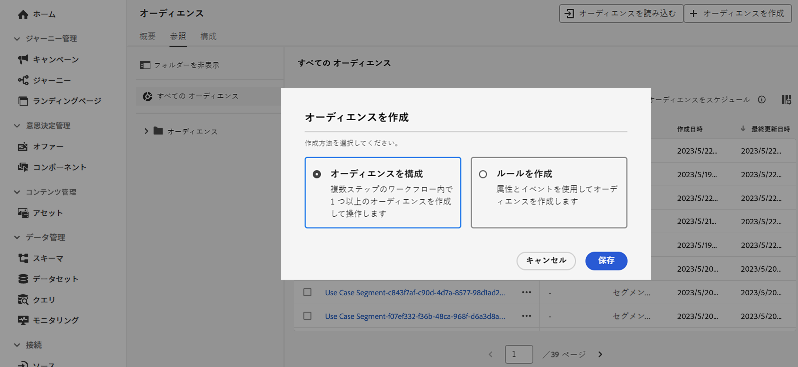
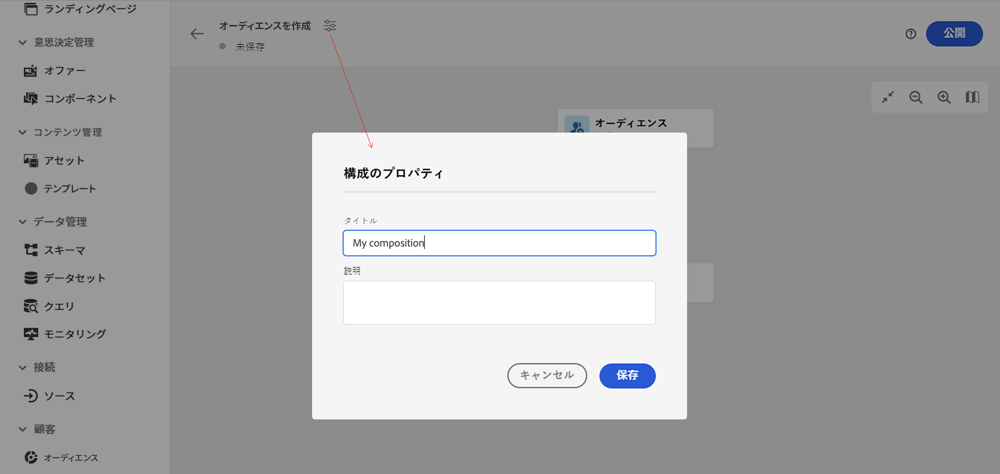
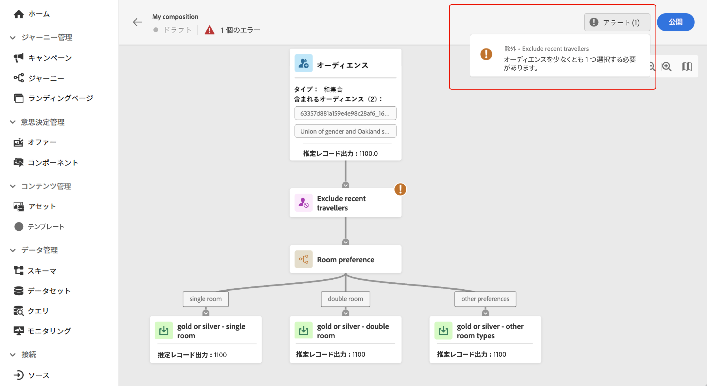
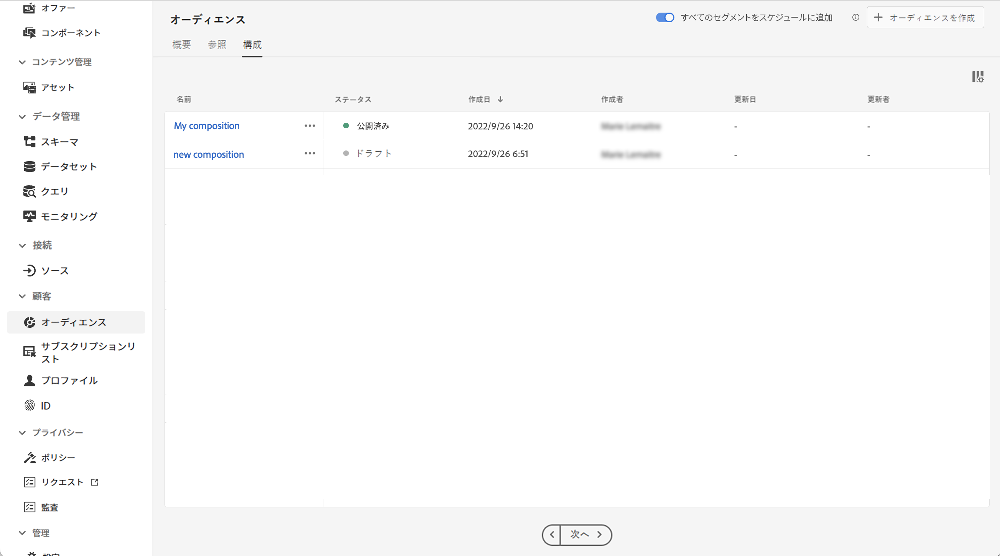

# 最初のコンポジションワークフローの作成 {#create-compositions}

>[!BEGINSHADEBOX]

このドキュメントでは、Adobe Journey Optimizer 内でオーディエンス構成を使用する方法について詳しく説明します。Adobe Journey Optimizer を使用していない場合は、[こちらをクリック](https://experienceleague.adobe.com/docs/experience-platform/segmentation/ui/audience-composition.html?lang=ja){target="_blank"}してください。

>[!ENDSHADEBOX]

## コンポジションワークフローの作成 {#create}

コンポジションワークフローを作成するには、次の手順に従います。

1. **[!UICONTROL オーディエンス]**&#x200B;メニューにアクセスし、「**[!UICONTROL オーディエンスを作成]**」を選択します。

1. 「**[!UICONTROL オーディエンスを作成]**」を選択します。

   

   >[!NOTE]
   >
   >**[!UICONTROL ルールを作成]**&#x200B;の作成方法を使用すると、[セグメント化サービス](https://experienceleague.adobe.com/docs/experience-platform/segmentation/ui/overview.html?lang=ja)を使用して新しいセグメント定義を作成できます。

1. コンポジションキャンバスには、次の 2 つのデフォルトアクティビティが表示されます。

   * **[!UICONTROL オーディエンス]**：コンポジションの出発点。このアクティビティを使用すると、ワークフローの基礎として 1 つ以上のオーディエンスを選択できます。

   * **[!UICONTROL 保存]**：コンポジションの最後の手順。このアクティビティを使用すると、ワークフローの結果を新しいオーディエンスに保存できます。

   コンポジションワークフローキャンバスでアクティビティを設定する方法について詳しくは、[コンポジションキャンバスの操作](composition-canvas.md)を参照してください。

1. コンポジションプロパティを開き、タイトルと説明を指定します。

   プロパティでタイトルが定義されていない場合、コンポジションのラベルが「コンポジション」に設定された後に、作成日時が続きます。

   

1. **[!UICONTROL オーディエンス]**&#x200B;アクティビティおよび&#x200B;**[!UICONTROL 保存]**&#x200B;アクティビティの間に必要な数のアクティビティを追加して、コンポジションを設定します。[詳しくは、コンポジションキャンバスの操作方法を参照してください](composition-canvas.md)

   

1. コンポジションの準備ができたら、「**[!UICONTROL 公開]**」ボタンをクリックして、コンポジションを公開し、結果のオーディエンスを Adobe Experience Platform に保存します。

   >[!IMPORTANT]
   >
   >特定のサンドボックス内で最大 10 個のコンポジションを公開できます。このしきい値に達した場合、新しいコンポジションを公開するためには、コンポジションを削除してスペースを解放する必要があります。

   公開中にエラーが発生した場合は、問題の解決方法に関する情報と共にアラートが表示されます。

   

1. コンポジションが公開されます。 結果のオーディエンスは Adobe Experience Platform に保存され、Journey Optimizer でターゲットにする準備が整います。[詳しくは、Journey Optimizer でオーディエンスをターゲットにする方法を参照してください](../audience/about-audiences.md#segments-in-journey-optimizer)

## コンポジションへのアクセス {#access}

>[!CONTEXTUALHELP]
>id="ajo_ao_publish"
>title="オーディエンスの公開"
>abstract="コンポジションを公開して、結果のオーディエンスを Adobe Experience Platform に保存します。"

「**[!UICONTROL コンポジション]**」タブから作成したすべてのコンポジションにアクセスできます。リストの省略記号ボタンを使用して、既存のコンポジションをいつでも複製または削除できます。

コンポジションには複数のステータスがあります。

* **[!UICONTROL ドラフト]**：コンポジションは進行中で、公開されていません。
* **[!UICONTROL 公開済み]**：コンポジションが公開され、結果オーディエンスが保存され、使用できるようになりました。

>[!NOTE]
>
>現在、オーディエンスコンポジションはサンドボックスのリセット機能と統合されていません。サンドボックスのリセットを開始する前に、コンポジションを手動で削除して、関連するオーディエンスデータが適切にクリーンアップされていることを確認する必要があります。詳しくは、Adobe Experience Platform [サンドボックスのドキュメント](https://experienceleague.adobe.com/docs/experience-platform/sandbox/ui/user-guide.html?lang=ja#delete-audience-compositions)を参照してください。
