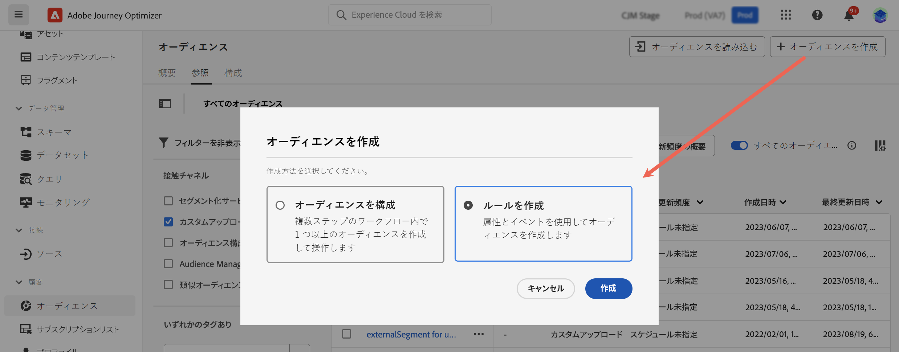
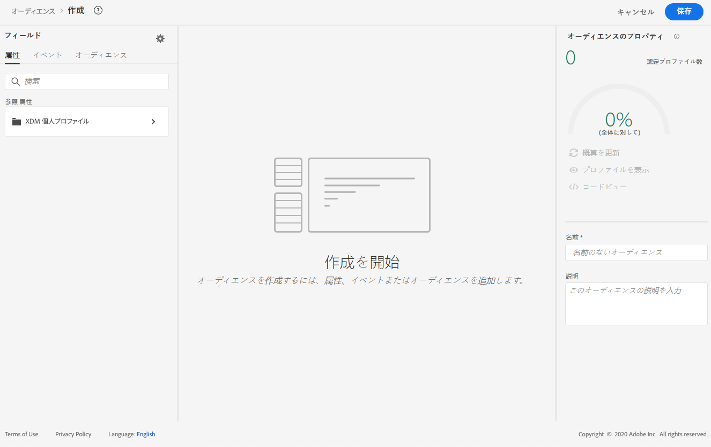
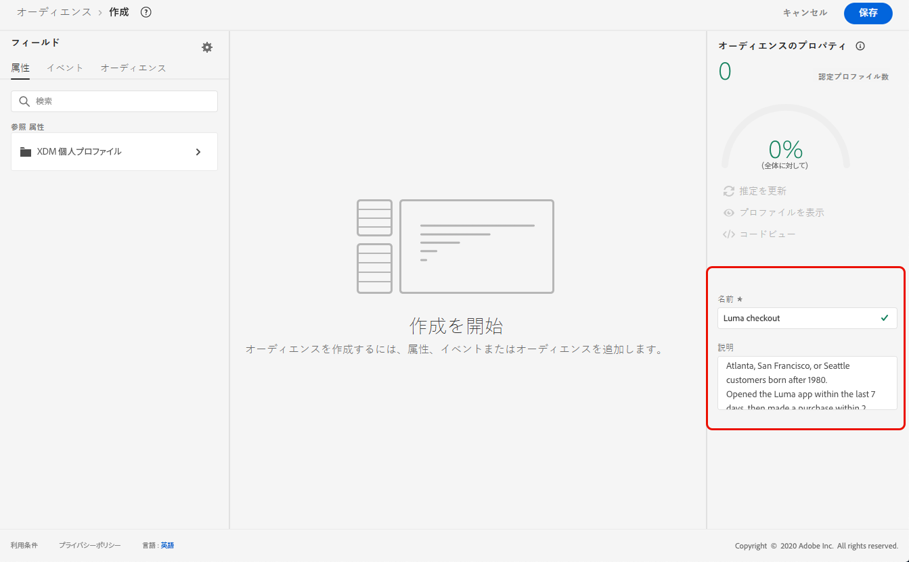
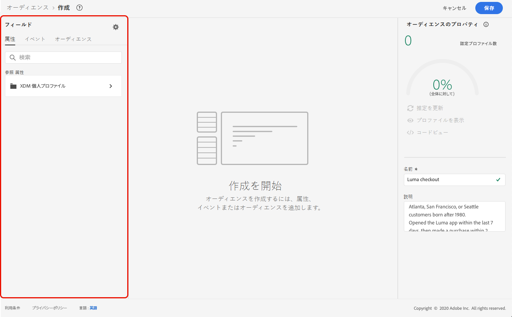
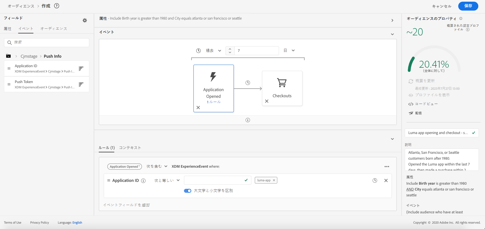
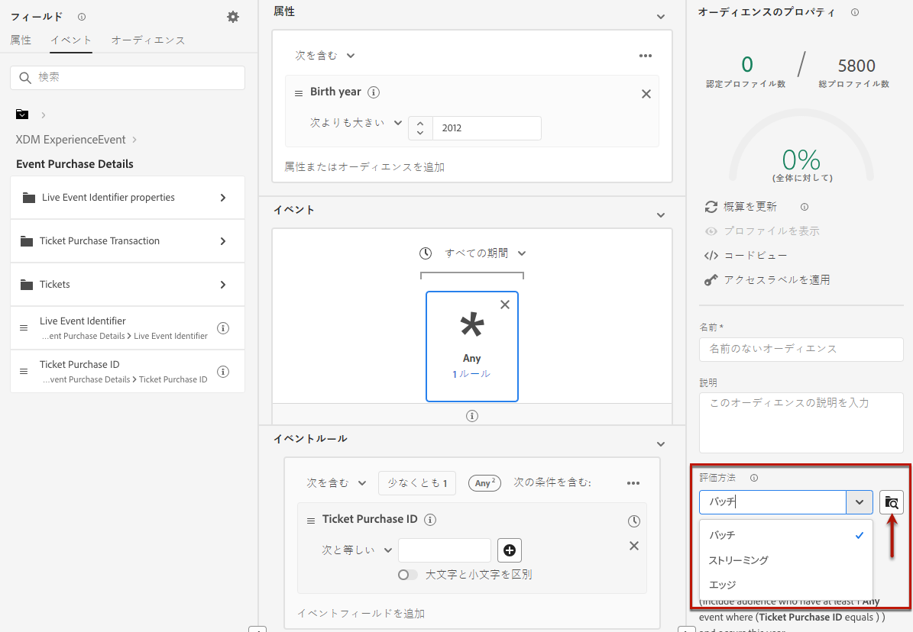

# セグメント定義の作成 {#build-segments}

>[!CONTEXTUALHELP]
>id="ajo_ao_create_rule"
>title="ルールの作成"
>abstract="「ルールを作成」の作成方法を使用すると、Adobe Experience Platform セグメント化サービスを使用して新しいオーディエンス定義を作成できます。"

## セグメント定義の作成 {#create}

この例では、アトランタ、サンフランシスコまたはシアトルに住み、1980年以降に生まれたすべての顧客をターゲットするオーディエンスを作成します。これらのお客様はすべて、過去 7 日以内に購入を行っている必要があります。

➡️ [オーディエンスの作成方法について詳しくは、このビデオをご覧ください](#video-segment)

1. **[!UICONTROL オーディエンス]**&#x200B;メニューで、「**[!UICONTROL オーディエンスを作成]**」ボタンをクリックし、「**[!UICONTROL ルールを作成]**」を選択します。

   

   セグメント定義画面では、必須フィールドをすべて設定してオーディエンスを定義できます。オーディエンスの設定方法については、[セグメント化サービスのドキュメント](https://experienceleague.adobe.com/docs/experience-platform/segmentation/ui/overview.html?lang=ja){target="_blank"}を参照してください。

   

1. **[!UICONTROL オーディエンスのプロパティ]**&#x200B;パネルで、オーディエンスの名前と説明（オプション）を入力します。

   

1. 必要なフィールドを左ペインから中央のワークスペースにドラッグ＆ドロップし、必要に応じて設定します。

   セグメント定義の基本的な構成要素は、**属性**&#x200B;と&#x200B;**イベント**&#x200B;です。また、既存のオーディエンスに含まれる属性とイベントを、新しい定義のコンポーネントとして使用することもできます。[詳しくは、セグメント化サービスのドキュメントを参照してください](https://experienceleague.adobe.com/ja/docs/experience-platform/segmentation/ui/segment-builder){target="_blank"}

   >[!NOTE]
   >
   >左側のペインに表示されるフィールドは、組織での **XDM 個人プロファイル**&#x200B;と **XDM ExperienceEvent** スキーマの設定方法によって異なります。詳しくは、[エクスペリエンスデータモデル（XDM）ドキュメント](https://experienceleague.adobe.com/docs/experience-platform/xdm/home.html?lang=ja){target="_blank"}を参照してください。

   

   この例では、**属性**&#x200B;と&#x200B;**イベント**&#x200B;のフィールドを使用してオーディエンスを作成する必要があります。

   * **属性**：1980年以降に生まれた、アトランタ、サンフランシスコ、シアトルに住む人のプロファイル。

     

   * **イベント**：過去 7 日以内に購入を行ったプロファイル。

     

1. ワークスペースに新しいフィールドを追加および設定すると、**[!UICONTROL オーディエンスのプロパティ]**&#x200B;パネルが自動的に更新され、オーディエンスに属する推定プロファイルに関する情報が反映されます。

   

1. オーディエンスの準備が整ったら、「**[!UICONTROL 保存]**」をクリックします。オーディエンスが Adobe Experience Platform オーディエンスのリストに表示されます。なお、リストで特定のオーディエンスを検索する際に役立つ検索バーが用意されています。

これで、オーディエンスをジャーニーで使用できるようになりました。詳しくは、[この節](../audience/about-audiences.md)を参照してください。

## オーディエンスの評価方法 {#evaluation-method-in-journey-optimizer}

Adobe Journey Optimizer では、オーディエンスは、次の 3 つの評価方法のいずれかを使用してセグメント定義から生成されます。

+++ ストリーミングセグメント化

新規データがシステムに流入するのに応じて、オーディエンスのプロファイルリストがリアルタイムで最新の状態に保たれます。

ストリーミングセグメント化は、ユーザーのアクティビティに応じてオーディエンスを更新する継続的なデータ選択プロセスです。セグメント定義を作成して、結果のオーディエンスを保存すると、Journey Optimizer への受信データに対してセグメント定義が適用されます。つまり、個人は、プロファイルデータの変更に応じてオーディエンスに追加またはオーディエンスから削除され、ターゲットオーディエンスが常に関連性の高いものとなります。[詳しくは、Adobe Experience Platform ドキュメントを参照してください](https://experienceleague.adobe.com/docs/experience-platform/segmentation/ui/streaming-segmentation.html?lang=ja){target="_blank"}

>[!IMPORTANT]
>
>2024年11月1日（PT）より、ストリーミングセグメント化では、Journey Optimizer のトラッキングデータセットとフィードバックデータセットからの&#x200B;**送信**&#x200B;イベントと&#x200B;**開封**&#x200B;イベントの使用がサポートされなくなりました。
>
>* この変更は、すべてのお客様のサンドボックスと組織に適用されます。
>* 影響を受けるのは、送信イベントと開封イベントのみです。クリックやその他のトラッキングイベントは、引き続きストリーミングセグメント化で使用できます。
>* この変更は、ストリーミングセグメント化にのみ適用されます。送信イベントと開封イベントは、バッチセグメントでも使用できますが、ストリーミングセグメントに含まれている場合は、バッチ方式で評価されます。さらに、送信イベントから生じる除外イベントとバウンス／遅延イベントもこの変更により影響を受けます。
>* トラッキングデータ収集は影響を受けません。送信イベントと開封イベントは引き続き通常どおりに収集されます。
>* この変更は、ジャーニーの反応イベントには影響しません。

+++

+++ バッチセグメント化

オーディエンスのプロファイルリストが 24 時間ごとに評価されます。

バッチセグメント化は、ストリーミングセグメント化の代わりに使用でき、セグメント定義を通じてすべてのプロファイルデータを一度に処理します。 これにより、オーディエンスのスナップショットが作成され、保存して使用するために書き出すことができます。 ただし、ストリーミングセグメント化とは異なり、バッチセグメント化ではオーディエンスリストがリアルタイムで継続的に更新されることはなく、バッチ処理後に取り込まれる新しいデータは次のバッチ処理までオーディエンスに反映されません。即時更新を適用しようとしても、毎日のサイクルは上書きされません。即時の増分更新の場合は、ストリーミングまたはオンデマンドのセグメント化オプションの使用を考慮します。

詳しくは、[Adobe Experience Platform セグメント化サービスのドキュメント](https://experienceleague.adobe.com/docs/experience-platform/segmentation/home.html?lang=ja#batch){target="_blank"}を参照してください

+++

+++ エッジセグメント化

エッジセグメント化は、Adobe Experience Platform のセグメントを[エッジで](https://experienceleague.adobe.com/docs/experience-platform/edge/home.html?lang=ja){target="_blank"}瞬時に評価する機能で、同じページおよび次のページのパーソナライゼーションのユースケースを可能にします。現在、エッジセグメント化で評価できるのは、選択されたクエリタイプのみです。詳しくは、[Adobe Experience Platform セグメント化サービスのドキュメント](https://experienceleague.adobe.com/docs/experience-platform/segmentation/ui/edge-segmentation.html?lang=ja#query-types){target="_blank"}を参照してください

+++

使用する評価方法を理解している場合は、ドロップダウンリストを使用して選択します。また、虫眼鏡の付いた参照アイコンフォルダーアイコンをクリックして、使用可能なセグメント定義の評価方法のリストを表示することもできます。詳しくは、[Adobe Experience Platform セグメント化サービスのドキュメント](https://experienceleague.adobe.com/docs/experience-platform/segmentation/ui/segment-builder.html?lang=ja#segment-properties){target="_blank"}を参照してください

<!--The determination between batch segmentation and streaming segmentation is made by the system for each audience, based on the complexity and the cost of evaluating the segment definition rule. You can view the evaluation method for each audience in the **[!UICONTROL Evaluation method]** column of the audience list.
    

>[!NOTE]
>
>If the **[!UICONTROL Evaluation method]** column does not display, you  need to add it using configuration button on the top right of the list.-->

まずオーディエンスを定義した後、プロファイルは認定されるたびにオーディエンスに追加されます。以前のデータからオーディエンスをバックフィルするには、最大 24 時間かかる場合があります。 オーディエンスがバックフィルされた後も、オーディエンスは常に最新の状態に保たれ、常にターゲティングの準備ができています。

## 柔軟なオーディエンス評価 {#flexible}

Adobe Experience Platform オーディエンスポータルを使用すると、選択したオーディエンスに対してオンデマンドでセグメント化ジョブを実行できるので、Journey Optimizer のジャーニーやキャンペーンにオーディエンスをターゲティングする前に、常に最新のオーディエンスデータを確保できます。

柔軟なオーディエンス評価を使用すると、次の操作を実行できます。

1. 最新のデータに基づいて、新しいセグメントを作成する。
1. 精度を確保することを目的に、オーディエンスをリアルタイムで評価する。これを行うには、評価するオーディエンスを選択し、特定の条件（人物ベース、セグメント化サービスのオリジンなど）を満たしている場合は、「オーディエンスを評価」を選択します。
1. 正確にターゲティングを行う目的で、評価済みオーディエンスを Adobe Journey Optimizer キャンペーンまたはジャーニーで使用します。

一度に最大 20 個のオーディエンスを評価でき、不適格なオーディエンスは自動的に除外されます。詳しくは、[Adobe Experience Platform セグメント化サービスのドキュメント](https://experienceleague.adobe.com/ja/docs/experience-platform/segmentation/ui/audience-portal#flexible-audience-evaluation)を参照してください。

## チュートリアルビデオ{#video-segment}

Journey Optimizer がルールを使用してオーディエンスを生成する方法を理解し、属性、イベント、既存のオーディエンスを使用してオーディエンスを作成する方法について説明します。

>[!VIDEO](https://video.tv.adobe.com/v/3425020?quality=12)
