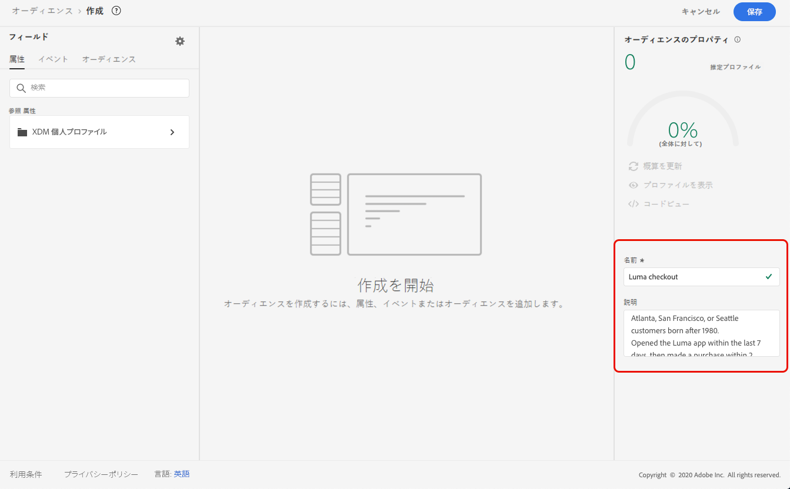
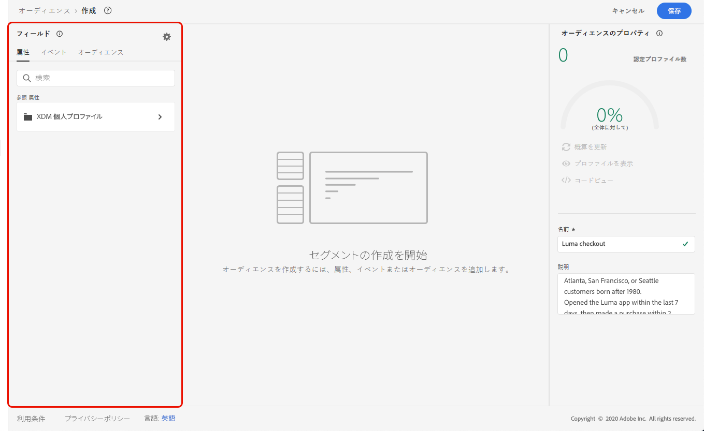

# セグメント定義の作成 {#build-segments}

>[!CONTEXTUALHELP]
>id="ajo_ao_create_rule"
>title="ルールの作成"
>abstract="「ルールを作成」の作成方法を使用すると、Adobe Experience Platform セグメント化サービスを使用して新しいオーディエンス定義を作成できます。"

この例では、アトランタ、サンフランシスコまたはシアトルに住み、1980 年以降に生まれたすべての顧客をターゲットするオーディエンスを作成します。これらのすべての顧客は、過去 7 日以内に Luma アプリケーションを開き、アプリケーションを開いてから 2 時間以内に購入している必要があります。

➡️ [オーディエンスの作成方法については、このビデオをご覧ください](#video-segment)

1. **[!UICONTROL オーディエンス]**&#x200B;メニューで、「**[!UICONTROL オーディエンスを作成]**」ボタンをクリックし、「**[!UICONTROL ルールを作成]**」を選択します。

   

   セグメント定義画面では、必須フィールドをすべて設定してオーディエンスを定義できます。オーディエンスの設定方法については、[セグメント化サービスのドキュメント](https://experienceleague.adobe.com/docs/experience-platform/segmentation/ui/overview.html?lang=ja){target="_blank"}を参照してください。

   

1. **[!UICONTROL オーディエンスのプロパティ]**&#x200B;パネルで、オーディエンスの名前と説明（オプション）を入力します。

   

1. 必要なフィールドを左ペインから中央のワークスペースにドラッグ＆ドロップし、必要に応じて設定します。

   >[!NOTE]
   >
   >左側のペインに表示されるフィールドは、組織での **XDM 個人プロファイル**&#x200B;と **XDM ExperienceEvent** スキーマの設定方法によって異なります。詳しくは、[エクスペリエンスデータモデル（XDM）ドキュメント](https://experienceleague.adobe.com/docs/experience-platform/xdm/home.html?lang=ja){target="_blank"}を参照してください。

   

   この例では、**属性**&#x200B;と&#x200B;**イベント**&#x200B;のフィールドを使用してオーディエンスを作成する必要があります。

   * **属性**：1980 年以降、アトランタ、サンフランシスコ、シアトルに住む人のプロファイル。

     

   * **イベント**：過去 7 日間に Luma アプリケーションを開き、アプリケーションを開いてから 2 時間以内に購入したプロファイル。

     

     >[!NOTE]
     >
     >アドビでは、ストリーミングセグメント化で開くイベントや送信イベントを使用しないことをお勧めします。代わりに、クリック数、購入数、ビーコンデータなどの実際のユーザーアクティビティのシグナルを使用します。頻度または抑制ロジックについては、イベントを送信するのではなくビジネスルールを使用します。[詳細情報](about-audiences.md#open-and-send-event-guardrails)

1. ワークスペースに新しいフィールドを追加および設定すると、**[!UICONTROL オーディエンスのプロパティ]**&#x200B;パネルが自動的に更新され、オーディエンスに属する推定プロファイルに関する情報が反映されます。

   

1. オーディエンスの準備が整ったら、「**[!UICONTROL 保存]**」をクリックします。オーディエンスが Adobe Experience Platform オーディエンスのリストに表示されます。なお、リストで特定のオーディエンスを検索する際に役立つ検索バーが用意されています。

これで、オーディエンスをジャーニーで使用できるようになりました。詳しくは、[この節](../audience/about-audiences.md)を参照してください。

## チュートリアルビデオ{#video-segment}

Journey Optimizer がルールを使用してオーディエンスを生成する方法を理解し、属性、イベント、既存のオーディエンスを使用してオーディエンスを作成する方法について説明します。

>[!VIDEO](https://video.tv.adobe.com/v/3425020?quality=12)
