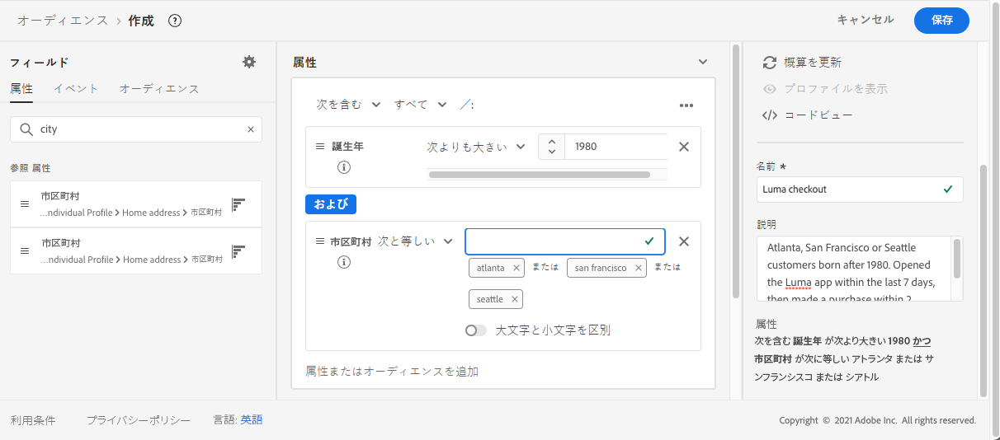
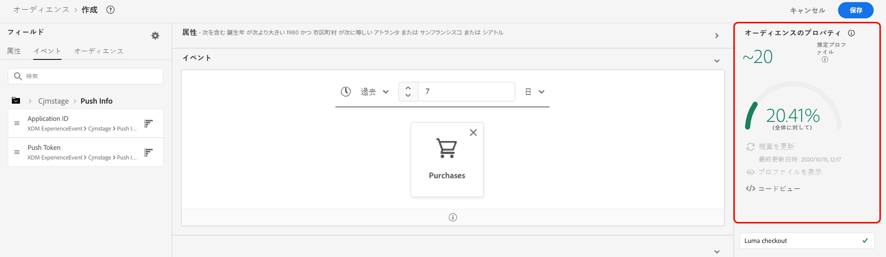

# セグメント定義の作成 {#build-segments}

>[!CONTEXTUALHELP]
>id="ajo_ao_create_rule"
>title="ルールの作成"
>abstract="ビルドルールの作成方法を使用すると、Adobe Experience Platform Audience Service を使用して新しいオーディエンス定義を作成できます。"

この例では、アトランタ、サンフランシスコまたはシアトルに住み、1980 年以降に生まれたすべての顧客をターゲットにするオーディエンスを作成します。 これらのすべての顧客は、過去 7 日以内に Luma アプリを開き、その後 2 時間以内に購入している必要があります。

➡️ [オーディエンスの作成方法については、このビデオを参照してください。](#video-segment)

1. 次にアクセス： **[!UICONTROL オーディエンス]** メニューで、 **[!UICONTROL オーディエンスを作成]** 」ボタンをクリックします。

   

   セグメント定義画面では、オーディエンスを定義するためのすべての必須フィールドを設定できます。 オーディエンスを設定する方法については、 [セグメント化サービスのドキュメント](https://experienceleague.adobe.com/docs/experience-platform/segmentation/ui/overview.html?lang=ja){target="_blank"}.

   

1. 内 **[!UICONTROL オーディエンスのプロパティ]** ウィンドウで、オーディエンスの名前と説明（オプション）を入力します。

   

1. 必要なフィールドを左ペインから中央のワークスペースにドラッグ＆ドロップし、必要に応じて設定します。

   >[!NOTE]
   >
   >左側のペインに表示されるフィールドは、組織での **XDM 個人プロファイル**&#x200B;と **XDM ExperienceEvent** スキーマの設定方法によって異なります。詳しくは、 [エクスペリエンスデータモデル (XDM) ドキュメント](https://experienceleague.adobe.com/docs/experience-platform/xdm/home.html?lang=ja){target="_blank"}.

   

   この例では、 **属性** および **イベント** オーディエンスを構築するためのフィールド：

   * **属性**：1980 年以降、アトランタ、サンフランシスコ、シアトルに住む人のプロファイル。

     

   * **イベント**：過去 7 日間に Luma アプリを開き、アプリを開いてから 2 時間以内に購入したプロファイル。

     

1. ワークスペースで新しいフィールドを追加および設定する際に、 **[!UICONTROL オーディエンスのプロパティ]** ペインは、オーディエンスに属する推定プロファイルに関する情報で自動的に更新されます。

   

1. オーディエンスの準備が整ったら、「 **[!UICONTROL 保存]**. これは、Adobe Experience Platformオーディエンスのリストに表示されます。 リスト内の特定のオーディエンスを検索するのに役立つ検索バーが使用できます。

オーディエンスをジャーニーで使用できるようになりました。 詳しくは、[この節](../audience/about-audiences.md)を参照してください。

## チュートリアルビデオ{#video-segment}

オーディエンスの作成方法を説明します。

>[!VIDEO](https://video.tv.adobe.com/v/334281?quality=12)
