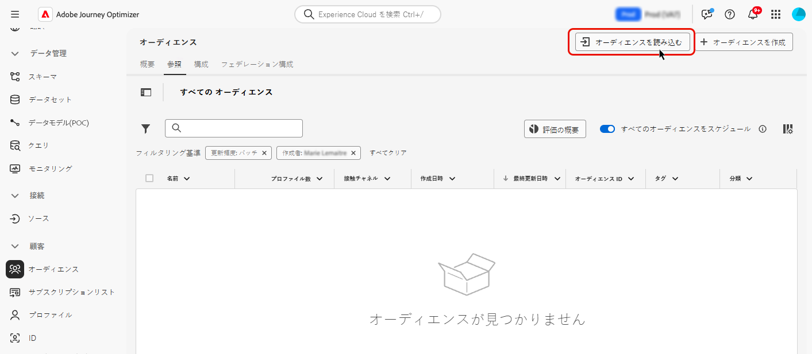

# カスタムアップロード {#custom-upload}

Adobe Experience Platform オーディエンスポータルでは、CSV ファイルを使用してオーディエンスを読み込むことができます。

カスタムアップロードプロセス中に、ID として使用する CSV 属性と、そのマッピング先のプロファイル ID を指定します。これにより、オーディエンスデータとプロファイルの間にリンクが作成されます。CSV ファイルに、プロファイルで見つからない ID 値が含まれている場合、その ID 値を使用して新しいプロファイルが作成されます。

>[!NOTE]
>
>カスタムアップロードオーディエンスでは、繰り返しジャーニーで「増分読み取り」が有効になっている場合、これらのオーディエンスは固定されているので、プロファイルは最初の繰り返しでのみ取得されます。

オーディエンスのインポート方法について詳しくは、Adobe Experience Platform[&#x200B; セグメント化サービスのドキュメント &#x200B;](https://experienceleague.adobe.com/ja/docs/experience-platform/segmentation/ui/audience-portal#import-audience){target="_blank"} を参照してください。

オーディエンスを CSV 形式でアップロードする方法について詳しくは、次のビデオをご覧ください。

>[!VIDEO](https://video.tv.adobe.com/v/3423359?captions=jpn&quality=12)
