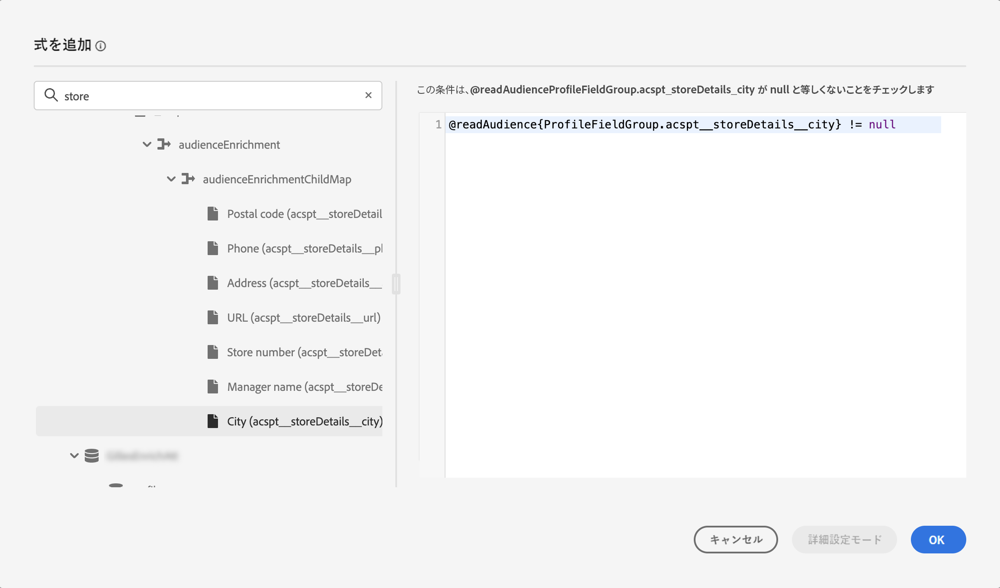
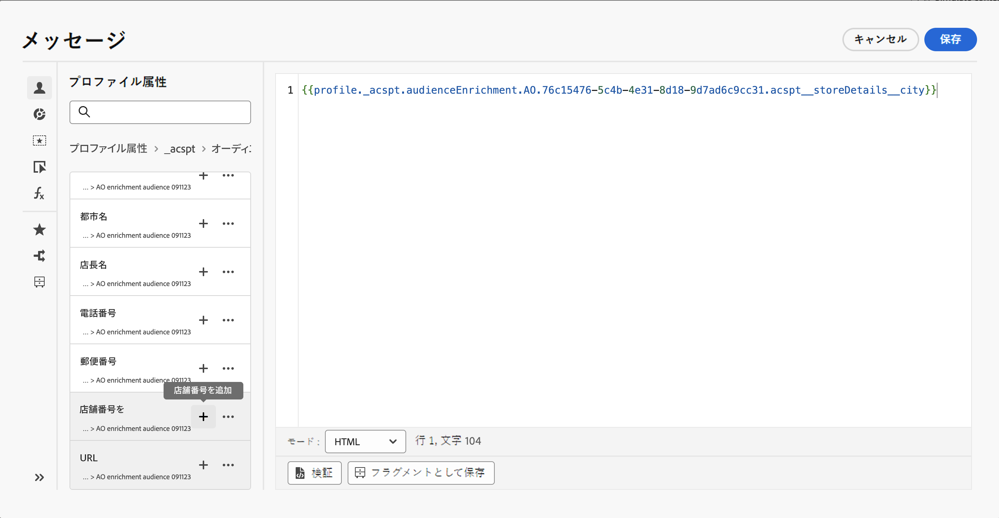

# オーディエンスエンリッチメント属性の使用 {#enrichment}

構成ワークフロー、カスタム（CSV ファイル）オーディエンスまたは連合オーディエンス構成を使用して生成されたオーディエンスをターゲットにする場合、これらのオーディエンスからのエンリッチメント属性を使用してジャーニーを作成し、メッセージをパーソナライズできます。

>[!NOTE]
>
>2024年10月1日（PT）より前に CSV ファイルのカスタムアップロードで作成されたオーディエンスは、パーソナライゼーションの対象となりません。これらのオーディエンスの属性を使用し、この機能を最大限に利用するには、この日付より前に読み込んだ外部 CSV オーディエンスを再作成および再アップロードしてください。
>
>同意ポリシーは、エンリッチメント属性をサポートしていません。したがって、同意ポリシールールは、プロファイル内にある属性のみに基づく必要があります。

オーディエンスのエンリッチメント属性を使用して実行できるアクションは次のとおりです。

* ターゲットオーディエンスのエンリッチメント属性を活用するルールに基づいて、**ジャーニー内に複数のパスを作成**&#x200B;します。これを行うには、「[オーディエンスを読み取り](../building-journeys/read-audience.md)」アクティビティを使用してオーディエンスをターゲットにし、オーディエンスのエンリッチメント属性に基づいて「[条件](../building-journeys/condition-activity.md)」アクティビティでルールを作成します。

  {width="70%" zoomable="yes"}

* パーソナライゼーションエディターでターゲットオーディエンスからエンリッチメント属性を追加して、ジャーニーまたはキャンペーンの&#x200B;**メッセージをパーソナライズ**&#x200B;します。[パーソナライゼーションエディターの操作方法を学ぶ](../personalization/personalization-build-expressions.md)

  {width="70%" zoomable="yes"}

>[!IMPORTANT]
>
>構成ワークフローを使用して作成されたオーディエンスからのエンリッチメント属性を使用するには、それらが「ExperiencePlatform」データソース内のフィールドグループに追加されていることを確認します。
>
+++ エンリッチメント属性をフィールドグループに追加する方法を学ぶ>
>
1. 「管理」／「設定」／「データソース」に移動します。
1. 「Experience Platform」を選択し、フィールドグループを作成または編集します。
1. スキーマセレクターで、適切なスキーマを選択します。スキーマの名前は、「Schema for audienceId:」 + オーディエンス ID の形式に従います。オーディエンスの ID は、オーディエンスインベントリのオーディエンスの詳細画面で確認できます。
1. フィールドセレクターを開き、追加するエンリッチメント属性を見つけて、その横にあるチェックボックスをオンにします。
1. 変更を保存します。
1. エンリッチメント属性がフィールドグループに追加されたら、上記の場所で Journey Optimizer で使用できます。
>
データソースについて詳しくは、次の節を参照してください。
>
* [Adobe Experience Platform データソースの操作](../datasource/adobe-experience-platform-data-source.md)
* [データソースの設定](../datasource/configure-data-sources.md)
>
+++

+++ エンリッチメント属性とは何ですか？

エンリッチメント属性は、コンテキストに即した、オーディエンスに固有の追加属性です。これらはプロファイルに関連付けられず、通常、パーソナライゼーションの目的で使用されます。

エンリッチメント属性は、オーディエンス構成のエンリッチアクティビティまたはカスタムアップロードプロセスを通じてオーディエンスにリンクされます。

+++

+++ Journey Optimizer 内のエンリッチメント属性はどこで使用できますか？

オーディエンス構成のエンリッチメント属性は、次の領域で活用できます。[オーディエンスのエンリッチメント属性の使用方法を学ぶ](#enrichment)

* 条件アクティビティ（ジャーニー）
* カスタムアクション属性（ジャーニー）
* メッセージのパーソナライゼーション（ジャーニーとキャンペーン）

+++

+++ ジャーニーでエンリッチメント属性を有効にする方法を教えてください。

構成ワークフローを使用してオーディエンスから作成されたエンリッチメント属性を使用するには、「ExperiencePlatform」データソース内のフィールドグループに属性が追加されていることを確認します。フィールドグループにエンリッチメント属性を追加する方法について詳しくは、[この節](#enrichment)を参照してください

+++

+++ エンリッチメント属性値はジャーニーの開始後に更新されますか？

現在の時点では、更新されません。待機ノードまたはイベントノードの後でも、エンリッチメント属性値はジャーニーの開始時と同じ値になります。

+++
