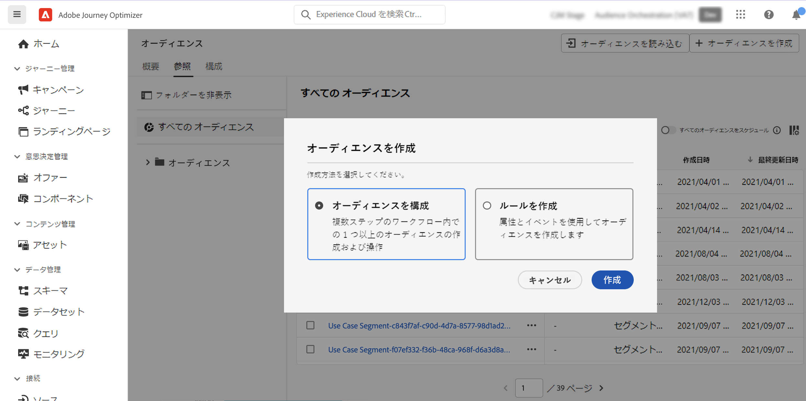
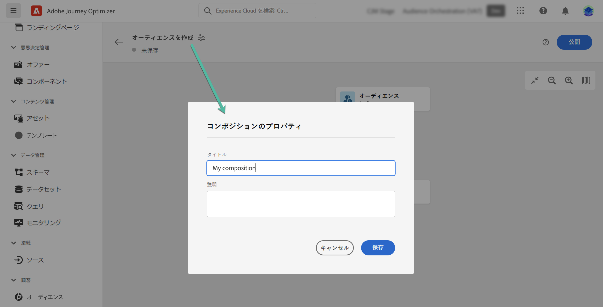
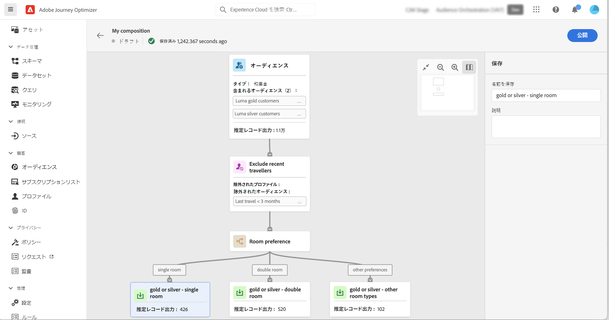
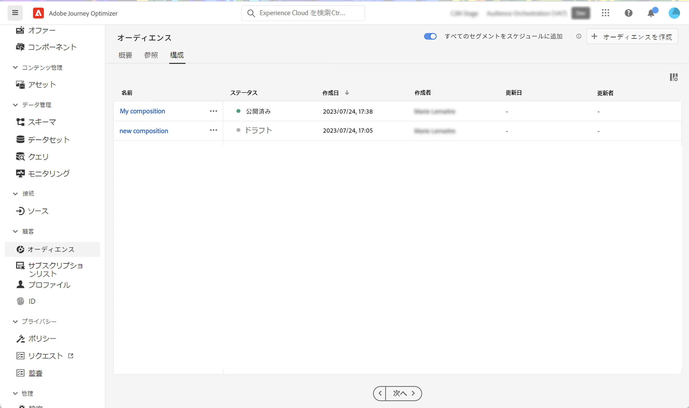

# オーディエンスコンポジションの基本を学ぶ {#get-start-audience-composition}

>[!CONTEXTUALHELP]
>id="ajo_ao_create_composition"
>title="コンポジションの作成"
>abstract="構成ワークフローを作成し、既存の Adobe Experience Platform オーディエンスを 1 つのビジュアルキャンバスにまとめ、様々なアクティビティ（分割、除外など）を活用して新しいオーディエンスを作成します。"

>[!BEGINSHADEBOX]

このドキュメントでは、Adobe Journey Optimizer 内でオーディエンス構成を使用する方法について詳しく説明します。リアルタイム顧客プロファイルのみの顧客で、Adobe Journey Optimizer を使用していない場合は、[こちらをクリック](https://experienceleague.adobe.com/docs/experience-platform/segmentation/ui/audience-composition.html?lang=ja)してください{target="_blank"}。

>[!ENDSHADEBOX]

オーディエンス構成を使用すると、**構成ワークフロー**&#x200B;を作成できます。このワークフローでは、既存の Adobe Experience Platform オーディエンスを 1 つのビジュアルキャンバスにまとめ、様々なアクティビティ（分割、除外など）を活用して新しいオーディエンスを作成できます。

完了すると、**結果のオーディエンス**は既存のオーディエンスと共に Adobe Experience Platform に保存され、Journey Optimizer のキャンペーンやターゲット顧客へのジャーニーに活用できます。Journey Optimizerでオーディエンスをターゲットにする方法を学ぶ

>[!IMPORTANT]
>
>オーディエンス構成からのオーディエンスおよび属性は現在、Healthcare Shield または Privacy and Security Shield では使用できません。
>
>エンリッチメント属性は、まだポリシー適用サービスと統合されていません。したがって、エンリッチメント属性に適用するデータ使用ラベルは、Journey Optimizer キャンペーンでは適用されません。

オーディエンスコンポジションには、Adobe Journey Optimizer の&#x200B;**[!UICONTROL オーディエンス]**&#x200B;メニューからアクセスできます。

* 「**[!UICONTROL 概要]**」タブには、組織のオーディエンスデータに関連する主要指標を含んだ専用のダッシュボードが表示されます。詳しくは、[Adobe Experience Platform のダッシュボードガイド](https://experienceleague.adobe.com/docs/experience-platform/dashboards/guides/segments.html?lang=ja)を参照してください。

* 「**[!UICONTROL 参照]**」タブには、Adobe Experience Platform に保存されている既存のオーディエンスがすべて表示されます。

* 「**[!UICONTROL コンポジション]**」タブを使用すると、オーディエンスを組み合わせて新しいオーディエンスを作成するコンポジションワークフローを作成できます。

## コンポジションワークフローの作成 {#create}

コンポジションワークフローを作成するには、次の手順に従います。

1. **[!UICONTROL オーディエンス]**&#x200B;メニューにアクセスし、「**[!UICONTROL オーディエンスを作成]**」を選択します。

1. 「**[!UICONTROL オーディエンスを作成]**」を選択します。

   

1. コンポジションキャンバスには、次の 2 つのデフォルトアクティビティが表示されます。

   * **[!UICONTROL オーディエンス]**：コンポジションの出発点。このアクティビティを使用すると、ワークフローの基礎として 1 つ以上のオーディエンスを選択できます。

   * **[!UICONTROL 保存]**：コンポジションの最後の手順。このアクティビティを使用すると、ワークフローの結果を新しいオーディエンスに保存できます。

1. コンポジションプロパティを開き、タイトルと説明を指定します。

   プロパティでタイトルが定義されていない場合、コンポジションのラベルが「コンポジション」に設定された後に、作成日時が続きます。

   

1. **[!UICONTROL オーディエンス]**&#x200B;アクティビティおよび&#x200B;**[!UICONTROL 保存]**&#x200B;アクティビティの間に必要な数のアクティビティを追加して、コンポジションを設定します。コンポジションの作成方法について詳しくは、[ オーディエンス コンポジションのドキュメント ](https://experienceleague.adobe.com/en/docs/experience-platform/segmentation/ui/audience-composition) を参照してください。

   

1. コンポジションの準備ができたら、「**[!UICONTROL 公開]**」ボタンをクリックして、コンポジションを公開し、結果のオーディエンスを Adobe Experience Platform に保存します。

   >[!IMPORTANT]
   >
   >特定のサンドボックス内で最大 10 個のコンポジションを公開できます。このしきい値に達した場合、新しいコンポジションを公開するためには、コンポジションを削除してスペースを解放する必要があります。

   公開中にエラーが発生した場合は、問題の解決方法に関する情報と共にアラートが表示されます。

   

1. コンポジションが公開されます。 結果のオーディエンスは Adobe Experience Platform に保存され、Journey Optimizer でターゲットにする準備が整います。[詳しくは、Journey Optimizer でオーディエンスをターゲットにする方法を参照してください](../audience/about-audiences.md#segments-in-journey-optimizer)

>[!NOTE]
>
>**オーディエンスコンポジション** のオーディエンスは毎日実行されるので、Journey Optimizerで使用するには最大 24 時間待つ必要がある場合があります。 オーディエンスコンポジションオーディエンスのエンリッチメントされた属性は、前回のコンポジション実行と同じくらい新しくなります（最大 24 時間前になる可能性があります）。

## コンポジションへのアクセス {#access}

>[!CONTEXTUALHELP]
>id="ajo_ao_publish"
>title="オーディエンスの公開"
>abstract="コンポジションを公開して、結果のオーディエンスを Adobe Experience Platform に保存します。"

「**[!UICONTROL コンポジション]**」タブから作成したすべてのコンポジションにアクセスできます。リストの省略記号ボタンを使用して、既存のコンポジションをいつでも複製または削除できます。

コンポジションには複数のステータスがあります。

* **[!UICONTROL ドラフト]**：コンポジションは進行中で、公開されていません。
* **[!UICONTROL 公開済み]**：コンポジションが公開され、結果オーディエンスが保存され、使用できるようになりました。

>[!NOTE]
>
>現在、オーディエンスコンポジションはサンドボックスのリセット機能と統合されていません。サンドボックスのリセットを開始する前に、コンポジションを手動で削除して、関連するオーディエンスデータが適切にクリーンアップされていることを確認する必要があります。詳しくは、Adobe Experience Platform [サンドボックスのドキュメント](https://experienceleague.adobe.com/docs/experience-platform/sandbox/ui/user-guide.html?lang=ja#delete-audience-compositions)を参照してください。
