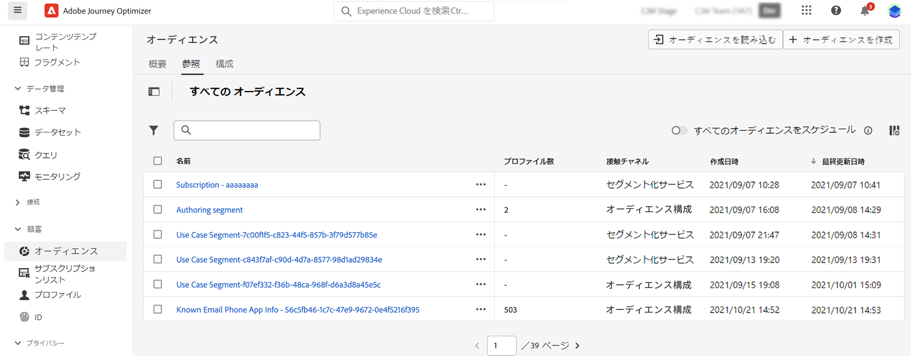

# オーディエンスコンポジションの基本を学ぶ {#get-start-audience-composition}

>[!CONTEXTUALHELP]
>id="ajo_ao_create_composition"
>title="コンポジションの作成"
>abstract="コンポジションワークフローを作成し、既存の Adobe Experience Platform オーディエンスをビジュアルキャンバスに組み合わせ、様々なアクティビティ（分割、除外など）を活用して新しいオーディエンスを作成します。"

>[!BEGINSHADEBOX]

このドキュメントでは、Adobe Journey Optimizer 内でオーディエンス構成を使用する方法について詳しく説明します。リアルタイム顧客プロファイルのみの顧客で、Adobe Journey Optimizer を使用していない場合は、[こちらをクリック](https://experienceleague.adobe.com/docs/experience-platform/segmentation/ui/audience-composition.html?lang=ja)してください{target="_blank"}。

>[!ENDSHADEBOX]

オーディエンス構成を使用すると、**コンポジションワークフロー**&#x200B;を作成できます。これにより、既存の Adobe Experience Platform オーディエンスをビジュアルキャンバスに組み合わせ、様々なアクティビティ（分割、除外など）を活用して新しいオーディエンスを作成できます。

完了すると、**結果オーディエンス**&#x200B;が既存のオーディエンスと共に Adobe Experience Platform に保存され、**キャンペーンで活用**&#x200B;して顧客をターゲットできます。[キャンペーンとの連携方法を学ぶ](../campaigns/get-started-with-campaigns.md)

>[!IMPORTANT]
>
>現時点では、ジャーニーへのコンポジションワークフローから生成されたオーディエンスの使用は、プライベートベータ版として使用可能です。詳しくは、アドビ担当者にお問い合わせください。
>
>Adobe Journey Optimizer のキャンペーンは、まだポリシー強制サービスと統合されていません。したがって、オーディエンス属性に適用するデータ使用ラベルは、Journey Optimizer キャンペーンでは適用されません。

オーディエンスコンポジションには、Adobe Journey Optimizer の&#x200B;**[!UICONTROL オーディエンス]**&#x200B;メニューからアクセスできます。

* 「**[!UICONTROL 概要]**」タブには、組織のオーディエンスデータに関連する主要指標を含んだ専用のダッシュボードが表示されます。詳しくは、[Adobe Experience Platform のダッシュボードガイド](https://experienceleague.adobe.com/docs/experience-platform/dashboards/guides/segments.html?lang=ja)を参照してください。

* 「**[!UICONTROL 参照]**」タブには、Adobe Experience Platform に保存されている既存のオーディエンスがすべて表示されます。

* 「**[!UICONTROL コンポジション]**」タブを使用すると、オーディエンスを組み合わせて新しいオーディエンスを作成するコンポジションワークフローを作成できます。

各カードをクリックして、オーディエンスコンポジションを使用する方法を確認してください。

<table style="table-layout:fixed"><tr style="border: 0;">
<td>

<a href="create-compositions.md"><strong>最初のコンポジションワークフローの作成</strong></a>
</td>
<td>

<a href="composition-canvas.md"><strong>コンポジションキャンバスの操作</strong></a>
</td>
<td>

<a href="access-audiences.md"><strong>オーディエンスへのアクセスと管理</strong></a>
</td>
</tr></table>
