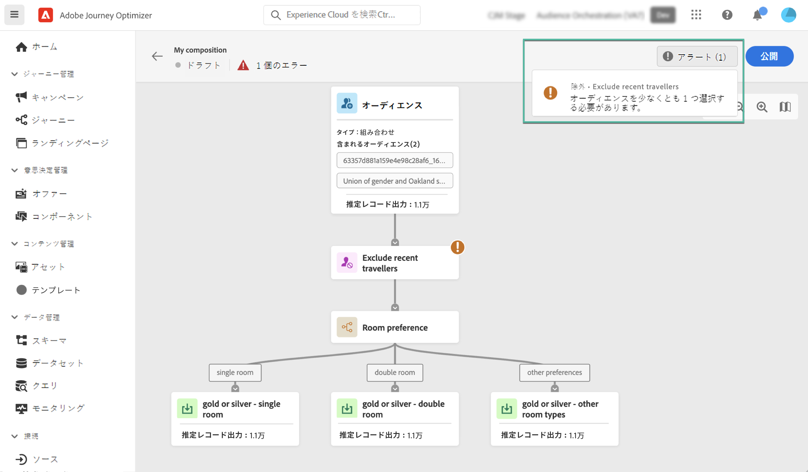

# オーディエンス構成の基本を学ぶ {#get-start-audience-composition}

>[!CONTEXTUALHELP]
>id="ajo_ao_create_composition"
>title="構成の作成"
>abstract="構成ワークフローを作成し、既存の Adobe Experience Platform オーディエンスを 1 つのビジュアルキャンバスにまとめ、様々なアクティビティ（分割、除外など）を活用して新しいオーディエンスを作成します。"

>[!CONTEXTUALHELP]
>id="ajo_ao_publish"
>title="オーディエンスの公開"
>abstract="構成を公開して、結果のオーディエンスを Adobe Experience Platform に保存します。"

>[!CONTEXTUALHELP]
>id="ajo_ao_audience"
>title="オーディエンスアクティビティ"
>abstract="オーディエンスアクティビティを使用すると、既存オーディエンスに属する追加のプロファイルを構成に含めることができます。"

>[!CONTEXTUALHELP]
>id="ajo_ao_merge_types"
>title="結合タイプ"
>abstract="選択したオーディエンスのプロファイルを結合する方法を指定します。"

>[!CONTEXTUALHELP]
>id="ajo_ao_exclude_type"
>title="除外タイプ"
>abstract="除外オーディエンスタイプを使用して、既存オーディエンスに属するプロファイルを除外します。属性タイプを使用した除外では、特定の属性に基づいたプロファイルを除外できます。"

>[!CONTEXTUALHELP]
>id="ajo_ao_exclude"
>title="除外アクティビティ"
>abstract="除外アクティビティを使用すると、既存オーディエンスを選択するかルールを使用して、構成からプロファイルを除外できます。"

>[!CONTEXTUALHELP]
>id="ajo_ao_enrich"
>title="エンリッチメントアクティビティ"
>abstract="エンリッチメントアクティビティを使用すると、Adobe Experience Platform データセットから取得した追加の属性でオーディエンスを強化できます。例えば、購入した製品に関する名前、価格、製造元 ID などの情報を追加し、これらの情報を活用して、オーディエンスに送信する配信をパーソナライズできます。"

>[!CONTEXTUALHELP]
>id="ajo_ao_enrich_dataset"
>title="エンリッチメントデータセット"
>abstract="オーディエンスに関連付けるデータを含むエンリッチメントデータセットを選択します。"

>[!CONTEXTUALHELP]
>id="ajo_ao_enrich_criteria"
>title="エンリッチメント条件"
>abstract="ソースデータセット（オーディエンスとエンリッチメントデータセット）間の紐付けキーとして使用するフィールドを選択します。"

>[!CONTEXTUALHELP]
>id="ajo_ao_enrich_attributes"
>title="エンリッチメント属性"
>abstract="オーディエンスに関連付ける 1 つ以上の属性をエンリッチメントデータセットから選択します。 構成が公開されると、これらの属性がオーディエンスに関連付けられ、Journey Optimizer キャンペーンで配信をパーソナライズするために利用できます。"

>[!CONTEXTUALHELP]
>id="ajo_ao_ranking"
>title="ランクアクティビティ"
>abstract="ランクアクティビティを使用すると、特定の属性に基づいてプロファイルをランク付けし、構成に含めることができます。例えば、最大量のロイヤルティポイントを持つ 50 件のプロファイルを含めます。"

>[!CONTEXTUALHELP]
>id="ajo_ao_rank_profilelimit_text"
>title="プロファイル制限を追加"
>abstract="このオプションをオンにして、構成に含めるプロファイルの最大数を指定します。"

<!-- [!CONTEXTUALHELP]
>id="ajo_ao_control_group_text"
>title="Control Group"
>abstract="Use control groups to isolate a portion of the profiles. This allows you to measure the impact of a marketing activity and make a comparison with the behavior of the rest of the population."-->

>[!CONTEXTUALHELP]
>id="ajo_ao_split"
>title="分割アクティビティ"
>abstract="分割アクティビティを使用すると、構成を複数のパスに分割できます。構成を公開すると、パスごとに 1 つのオーディエンスが Adobe Experience Platform に保存されます。"

>[!CONTEXTUALHELP]
>id="ajo_ao_split_type"
>title="分割タイプ"
>abstract="プロファイルを複数のパスにランダムに分割するには、「パーセント」分割タイプを使用します。「属性」分割タイプを使用すると、特定の属性に基づいてプロファイルを分割できます。"

>[!CONTEXTUALHELP]
>id="ajo_ao_split_otherprofiles_text"
>title="その他のプロファイル"
>abstract="他のパスで指定された条件に一致しない残りのプロファイルを含む追加のパスを作成する場合は、このオプションを切り替えてオンにします。"

>[!BEGINSHADEBOX]

このドキュメントでは、Adobe Journey Optimizer 内でオーディエンス構成を使用する方法について詳しく説明します。リアルタイム顧客プロファイルのみの顧客で、Adobe Journey Optimizer を使用していない場合は、[こちらをクリック](https://experienceleague.adobe.com/docs/experience-platform/segmentation/ui/audience-composition.html?lang=ja){target="_blank"}してください。

>[!ENDSHADEBOX]

オーディエンス構成を使用すると、**構成ワークフロー**&#x200B;を作成できます。このワークフローでは、既存の Adobe Experience Platform オーディエンスを 1 つのビジュアルキャンバスにまとめ、様々なアクティビティ（分割、除外など）を活用して新しいオーディエンスを作成できます。

完了すると、**結果のオーディエンス**は既存のオーディエンスと共に Adobe Experience Platform に保存され、Journey Optimizer のキャンペーンやターゲット顧客へのジャーニーに活用できます。詳しくは、Journey Optimizer でオーディエンスをターゲットにする方法を参照してください。

>[!IMPORTANT]
>
>* オーディエンス構成からのオーディエンスおよび属性は現在、Healthcare Shield または Privacy and Security Shield では使用できません。
>
>* エンリッチメント属性は、まだポリシー適用サービスと統合されていません。したがって、エンリッチメント属性に適用するデータ使用ラベルは、Journey Optimizer キャンペーンでは適用されません。

オーディエンス構成には、Adobe Journey Optimizer の&#x200B;**[!UICONTROL オーディエンス]**&#x200B;メニューからアクセスできます。

* 「**[!UICONTROL 概要]**」タブには、組織のオーディエンスデータに関連する主要指標を含んだ専用のダッシュボードが表示されます。詳しくは、[Adobe Experience Platform のダッシュボードガイド](https://experienceleague.adobe.com/docs/experience-platform/dashboards/guides/segments.html?lang=ja)を参照してください。

* 「**[!UICONTROL 参照]**」タブには、Adobe Experience Platform に保存されている既存のオーディエンスがすべて表示されます。

* 「**[!UICONTROL 構成]**」タブを使用すると、オーディエンスを組み合わせて新しいオーディエンスを作成する構成ワークフローを作成できます。

## 構成ワークフローの作成 {#create}

構成ワークフローを作成するには、次の手順に従います。

1. **[!UICONTROL オーディエンス]**&#x200B;メニューにアクセスし、「**[!UICONTROL オーディエンスを作成]**」を選択します。

1. 「**[!UICONTROL オーディエンスを作成]**」を選択します。

   

1. 構成キャンバスには、次の 2 つのデフォルトアクティビティが表示されます。

   * **[!UICONTROL オーディエンス]**：構成の出発点。このアクティビティを使用すると、ワークフローの基礎として 1 つ以上のオーディエンスを選択できます。

   * **[!UICONTROL 保存]**：構成の最後の手順。このアクティビティを使用すると、ワークフローの結果を新しいオーディエンスに保存できます。

1. 構成プロパティを開き、タイトルと説明を指定します。

   プロパティでタイトルが定義されていない場合、構成のラベルが「構成」に設定された後に、作成日時が続きます。

   

1. **[!UICONTROL オーディエンス]**&#x200B;アクティビティおよび&#x200B;**[!UICONTROL 保存]**&#x200B;アクティビティの間に必要な数のアクティビティを追加して、構成を設定します。コンポジションの作成方法について詳しくは、[オーディエンス構成のドキュメント](https://experienceleague.adobe.com/ja/docs/experience-platform/segmentation/ui/audience-composition)を参照してください。

   

1. 構成の準備が整ったら、「**[!UICONTROL 公開]**」ボタンをクリックして、コンポジションを公開し、結果のオーディエンスを Adobe Experience Platform に保存します。

   >[!IMPORTANT]
   >
   >特定のサンドボックス内で最大 10 個の構成を公開できます。このしきい値に達した場合、新しい構成を公開するためには、構成を削除してスペースを解放する必要があります。

   公開中にエラーが発生した場合は、問題の解決方法に関する情報と共にアラートが表示されます。

   

1. 構成が公開されます。結果のオーディエンスは Adobe Experience Platform に保存され、Journey Optimizer でターゲットにする準備が整います。[詳しくは、Journey Optimizer でオーディエンスをターゲットにする方法を参照してください](../audience/about-audiences.md#segments-in-journey-optimizer)

>[!NOTE]
>
>**オーディエンス構成**&#x200B;のオーディエンスは毎日実行されるので、Journey Optimizer で使用するには、場合によっては最大 24 時間待つ必要があります。オーディエンス構成オーディエンスの強化された属性は、最後の構成実行と同様に鮮度が高く、過去 24 時間まで遡ることができます。

## 構成へのアクセス {#access}

「**[!UICONTROL 構成]**」タブから作成したすべてのコンポジションにアクセスできます。リストの省略記号ボタンを使用して、既存の構成をいつでも複製または削除できます。

構成には複数のステータスがあります。

* **[!UICONTROL ドラフト]**：構成は進行中で、公開されていません。
* **[!UICONTROL 公開済み]**：構成が公開され、結果オーディエンスが保存され、使用できるようになりました。

>[!NOTE]
>
>現在、オーディエンス構成はサンドボックスのリセット機能と統合されていません。サンドボックスのリセットを開始する前に、構成を手動で削除して、関連するオーディエンスデータが適切にクリーンアップされていることを確認する必要があります。詳しくは、Adobe Experience Platform [サンドボックスのドキュメント](https://experienceleague.adobe.com/docs/experience-platform/sandbox/ui/user-guide.html?lang=ja#delete-audience-compositions)を参照してください。
