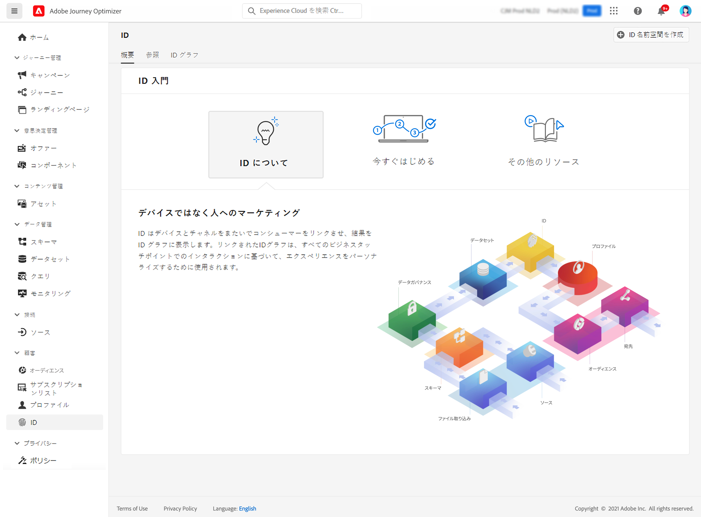

# ID の基本を学ぶ {#identities-gs}

ID は、エンティティ（通常は個人、ハードウェアデバイス、web ブラウザーなどの実際のオブジェクト）に一意のデータです。完全修飾 ID は、次の 2 つの要素で構成されます。

* **ID 名前空間**&#x200B;は、ID の関連先コンテキストのインジケーターとして機能します。
* **ID 値**&#x200B;は、エンティティを表す文字列です。

例えば、電話番号 555-555-1234 について考えます。この場合、文字列「555-555-1234」は **ID 値**&#x200B;で、「電話」**ID 名前空間**&#x200B;に分類できます。

[!DNL Adobe Journey Optimizer] の **ID** メニューでは、データベース内の顧客を構成する様々な ID を効率的に参照できます。

このメニューは、特定の顧客の異なる ID 間の関係のマップである **ID グラフ**&#x200B;を提供します。このグラフは、顧客が様々なチャネルでブランドとどのようにやり取りするかを視覚的に表現します。すべての顧客 ID グラフは、顧客のアクティビティに応じて、Adobe Experience Platform ID サービスによって一括管理および更新されます。

ID の操作について詳しくは、[ID サービスのドキュメント](https://experienceleague.adobe.com/docs/experience-platform/identity/home.html?lang=ja){target="_blank"}を参照してください。