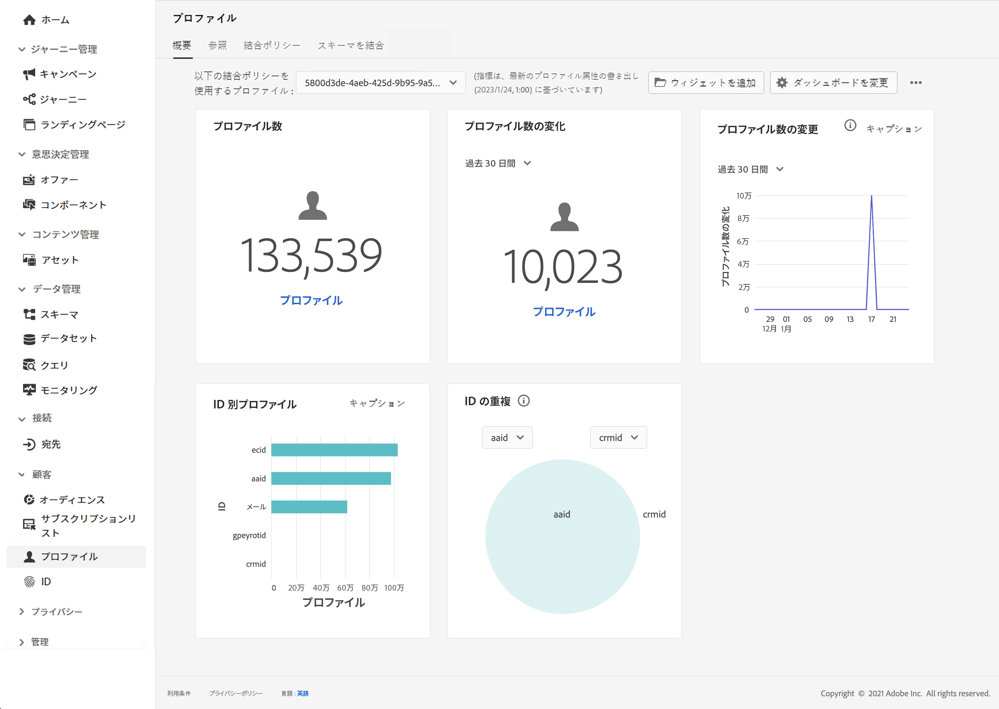

# プロファイルの基本を学ぶ {#profiles-gs}

>[!BEGINSHADEBOX]

**このページ：** Adobe Journey Optimizerのリアルタイム顧客プロファイルを使用して、オンライン、オフライン、サードパーティのソースからの顧客データを1つのビューに統合する方法と、プロファイルダッシュボードにアクセスする方法について説明します。

>[!ENDSHADEBOX]

## プロファイルについて

[!DNL Adobe Journey Optimizer] のリアルタイム顧客プロファイルを活用すると、オンライン、オフライン、CRM、サードパーティデータなど、複数のチャネルのデータを組み合わせて、個々の顧客の全体像を確認できます。 **プロファイル**&#x200B;を使用すると、顧客データを統合ビューにまとめて、顧客インタラクションごとにアクションにつながるタイムスタンプ付きアカウントを提供できます。

➡️ [この機能をビデオで確認](#video)

**リアルタイム顧客プロファイル&#x200B;** - オンライン、オフライン、匿名のソースからの顧客属性とイベントを、単一の統合プロファイルに統合します。&#x200B;プロファイルを活用して、複数の顧客接点をまたいで、パーソナライズされたリアルタイムのエクスペリエンスで顧客を惹きつけましょう&#x200B;

**データ取り込み** - 様々なデータソースに接続して、行動、トランザクション、財務、運用に関するデータを取り込みます。 リアルタイムまたはバッチアップロードでデータを取り込んで、プロファイルを常に最新の状態に保ちます。 プロファイルは、[!DNL Journey Optimizer] インターフェイス内で直接作成されません。データが取り込まれると、Adobe Experience Platformで自動的に作成または更新されます。

>[!NOTE]
>
>データを取り込む際、メールでは大文字と小文字が区別されます。 つまり、重複したプロファイル（例えば、John.Greene@luma.com のプロファイルと john.greene@luma.com の別のプロファイル）が作成され、[!DNL Journey Optimizer] ジャーニーとキャンペーンで対応する受信者をターゲティングする際に使用される場合があります。

**ID グラフ** - ロイヤルティ IDやCRM システム IDなどの顧客IDを使用して、様々なソースからのデータを結合します。&#x200B;ブランドのデータセット内のさまざまなID間の関係をマッピングすることで、顧客の包括的な全体像を構築できます。&#x200B;

**顧客エンゲージメント** - リアルタイム顧客プロファイルを使用して、ターゲットを絞ったオファーやメッセージなど、コンテキストに即してパーソナライズされたエクスペリエンスを配信します。&#x200B;マーケティングキャンペーン、カスタマーサポート、トランザクションアップデートなど、様々なチャネルをまたいで顧客をエンゲージ&#x200B;ます。

**データ共有** - Amazon Web Services、Microsoft Azure、Google Cloud などの大手クラウドストレージプロバイダーと顧客プロファイルを共有します。 共有プロファイルを使用して、ビジネスインテリジェンスツールによるレポート、データのアーカイブ、詳細な分析を行います。

## 魅力的なプロファイルとライセンス利用 {#engageable-profiles}

**エンゲージ可能なプロファイル**&#x200B;は、プロファイルサービスに保存され、ジャーニーまたはキャンペーンによってエンゲージされた個人を表す情報の記録です。 [!DNL Adobe Journey Optimizer]の主要ライセンス指標です。

主な特徴：

* **12か月間のローリングウィンドウ**：このカウントには、Journey Optimizerのオーサリング、決定、配信、実験、オーケストレーション機能を使用して、過去12か月間にエンゲージしようとした一意のプロファイルが反映されます。
* **サンドボックスごとに1回カウント**：サンドボックス内に複数のジャーニーまたはキャンペーンを入力するプロファイルは、そのサンドボックスの単一のエンゲージ可能プロファイルとしてカウントされます。
* **アドレス可能なオーディエンスに基づく**：エンゲージ可能なプロファイルは、アドレス可能なオーディエンスから計算されます。 カウントは、Journey Optimizerの機能を使用して過去12か月間にエンゲージしたオーディエンスを表し、アドレス可能なオーディエンスの合計です。
* **指標の動作**: エンゲージ可能なプロファイル数：
   * ジャーニーや施策を通じて新しいプロファイルがエンゲージする割合が増加する可能性がある
   * 12 カ月以上特定のプロファイルにエンゲージメントがない限り、顧客数は減少しません
   * 仮名プロファイルを既知のプロファイルに合成すると減少する可能性があります

>[!TIP]
>
>web、アプリ、コードベースのエクスペリエンスなどのインバウンドチャネルで仮名プロファイル（未認証の訪問者）をターゲティングする場合は、プロファイルを自動的に削除するTime-To-Live （TTL）を設定して、エンゲージ可能なプロファイル数と関連コストを管理することを検討してください。 [&#x200B; インバウンドチャネルのガードレールについて詳しく見る](../start/guardrails.md#profile-management-inbound)

組織のエンゲージ可能なプロファイル数は、**[!UICONTROL 管理]** > **[!UICONTROL ライセンス使用状況]**&#x200B;からいつでも監視できます。 カウントの急激な増加が確認された場合は、詳細なガイダンスについては、[&#x200B; トラブルシューティングの節](license-usage.md#troubleshooting-engageable-profiles)を参照してください。 [&#x200B; ライセンス使用状況ダッシュボードの詳細](license-usage.md)

>[!MORELIKETHIS]
>
>* [Journey Optimizer におけるデータ管理の基本を学ぶ](../data/gs-data.md)
>* [リアルタイム顧客プロファイルのドキュメント](https://experienceleague.adobe.com/docs/experience-platform/query/home.html?lang=ja){target="_blank"}
>* [リアルタイム顧客プロファイルデータおよびセグメント化用のデフォルトガードレール](https://experienceleague.adobe.com/ja/docs/experience-platform/profile/guardrails){target="_blank"}
>* [データ取り込みのドキュメント](https://experienceleague.adobe.com/ja/docs/experience-platform/ingestion/home){target="_blank"}

## プロファイルダッシュボード

プロファイルにアクセスするには、左側のナビゲーションパネルにある&#x200B;**[!UICONTROL 顧客]**／**[!UICONTROL プロファイル]**&#x200B;メニューに移動します。

>[!NOTE]
>
>[!DNL Adobe Journey Optimizer] を初めて使用する組織で、アクティブなプロファイルデータセットや結合ポリシーが作成されていない場合は、**プロファイル**&#x200B;ダッシュボードは表示されません。 代わりに、「**概要**」タブに、リアルタイム顧客プロファイルを初めて使用する際に役立つ Adobe Experience Platform ドキュメントへのリンクが表示されます。 **プロファイルダッシュボード**&#x200B;の操作方法と、ダッシュボードに表示される指標について詳しくは、[この節](https://experienceleague.adobe.com/docs/experience-platform/profile/ui/user-guide.html?lang=ja){target="_blank"}を参照してください。

複数のソースからのデータフラグメントをまとめ、それらを組み合わせて、個々の顧客の全体像を把握できます。 このデータを統合する際には、データの優先順位を設定する方法と統合ビューの作成に組み合わせるデータを決定するルールとして、結合ポリシーを使用します。 **結合ポリシー**&#x200B;について詳しくは、この[ドキュメント](https://experienceleague.adobe.com/docs/experience-platform/profile/merge-policies/ui-guide.html?lang=ja){target="_blank"}を参照してください。

## チュートリアルビデオ {#video}

Adobe Experience Platform がリアルタイム顧客プロファイルをアセンブルおよび更新する方法、これらのプロファイルにアクセスして使用する方法について説明します。

>[!VIDEO](https://video.tv.adobe.com/v/31660?captions=jpn&quality=12)
