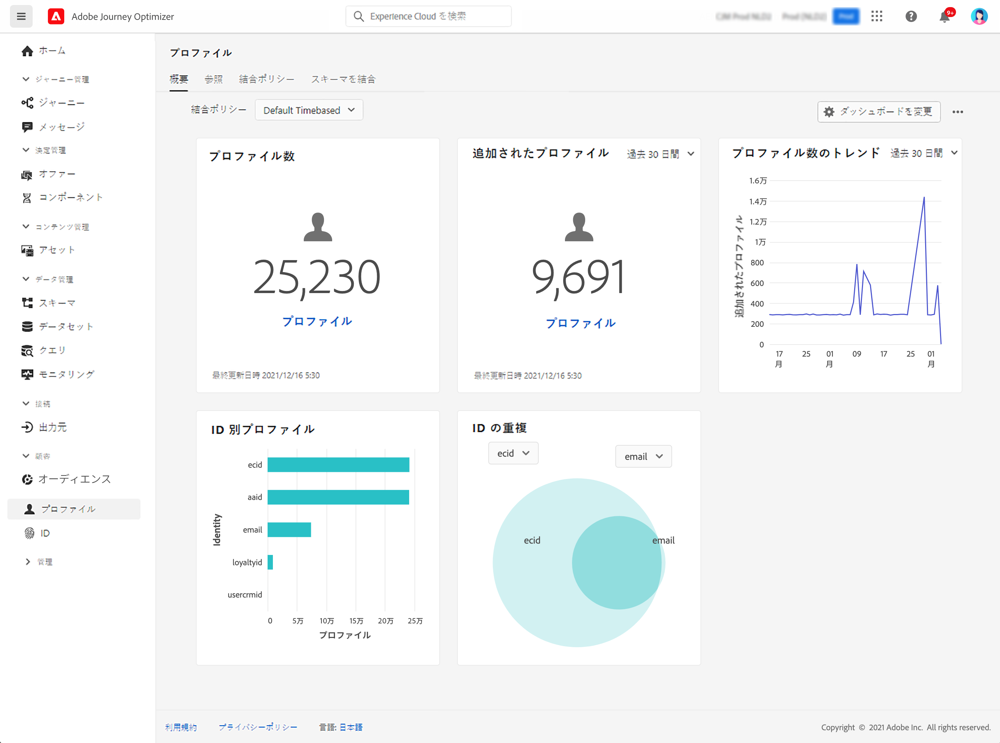

# プロファイルの基本を学ぶ {#profiles-gs}

## プロファイルについて

[!DNL Adobe Journey Optimizer] のリアルタイム顧客プロファイルを活用すると、オンライン、オフライン、CRM、サードパーティデータなど、複数のチャネルのデータを組み合わせて、個々の顧客の全体像を確認できます。**プロファイル**&#x200B;を使用すると、顧客データを統合ビューにまとめて、顧客インタラクションごとにアクションにつながるタイムスタンプ付きアカウントを提供できます。

➡️ [この機能をビデオで確認](#video)

**リアルタイム顧客プロファイル &#x200B;** – 顧客属性とイベントを、オンライン、オフライン、偽名のソースから統合した単一の統合プロファイルに統合します。&#x200B;プロファイルを使用して、複数のタッチポイントでパーソナライズされたリアルタイムのエクスペリエンスを顧客にエンゲージできます。

**データ取り込み** – 様々なデータソースに接続して、行動データ、トランザクションデータ、財務データ、運用データを取り込みます。 リアルタイムまたはバッチアップロードでデータを取り込み、プロファイルを常に更新します。

**ID グラフ** – 顧客 ID （ロイヤルティ ID や CRM システム ID など）を使用して、様々なソースからのデータを組み合わせます。&#x200B;ブランドのデータセット内の様々な ID 間の関係をマッピングして、顧客の包括的なビューを作成します。

**顧客エンゲージメント** - リアルタイム顧客プロファイルを使用すると、ターゲットにしたオファーやメッセージなど、コンテキストに応じてパーソナライズされたエクスペリエンスを提供できます。&#x200B;マーケティングキャンペーン、カスタマーサポート、トランザクションの更新など、様々なチャネルで顧客をエンゲージします。

**データ共有** - Amazon Web Services、Microsoft Azure、Google Cloud などの主要なクラウドストレージプロバイダーと顧客プロファイルを共有します。 共有プロファイルを使用して、ビジネスインテリジェンスツールによるレポート、データのアーカイブ、詳細な分析を行います。

>[!MORELIKETHIS]
>
>* [リアルタイム顧客プロファイルのドキュメント](https://experienceleague.adobe.com/docs/experience-platform/query/home.html?lang=ja){target="_blank"}
>* [ リアルタイム顧客プロファイルデータとセグメント化のデフォルトガードレール ](https://experienceleague.adobe.com/ja/docs/experience-platform/profile/guardrails){target="_blank"}
>* &#x200B;[ データ取り込みドキュメント ](https://experienceleague.adobe.com/en/docs/experience-platform/ingestion/home){target="_blank"}

## プロファイルダッシュボード

プロファイルにアクセスするには、左側のナビゲーションパネルにある&#x200B;**[!UICONTROL 顧客]**／**[!UICONTROL プロファイル]**&#x200B;メニューに移動します。

>[!NOTE]
>
>[!DNL Adobe Journey Optimizer] を初めて使用する組織で、アクティブなプロファイルデータセットや結合ポリシーが作成されていない場合は、**プロファイル**&#x200B;ダッシュボードは表示されません。代わりに、「**概要**」タブに、リアルタイム顧客プロファイルを初めて使用する際に役立つ Adobe Experience Platform ドキュメントへのリンクが表示されます。**プロファイルダッシュボード**&#x200B;を操作する方法と、ダッシュボードに表示される指標について詳しくは、[この節](https://experienceleague.adobe.com/docs/experience-platform/profile/ui/user-guide.html?lang=ja){target="_blank"}を参照してください。

個々の顧客の全体像を把握するには、複数のソースから得られたデータフラグメントを統合し組み合わせることができます。このデータを統合する際に、データの優先順位を設定する方法と統合ビューの作成に組み合わせるデータを決定するルールとして、結合ポリシーを使用します。**結合ポリシー**&#x200B;について詳しくは、この[ドキュメント](https://experienceleague.adobe.com/docs/experience-platform/profile/merge-policies/ui-guide.html?lang=ja){target="_blank"}を参照してください。

## チュートリアルビデオ {#video}

Adobe Experience Platform がリアルタイム顧客プロファイルをアセンブルおよび更新する方法、これらのプロファイルにアクセスして使用する方法について説明します。

>[!VIDEO](https://video.tv.adobe.com/v/27251?quality=12)
