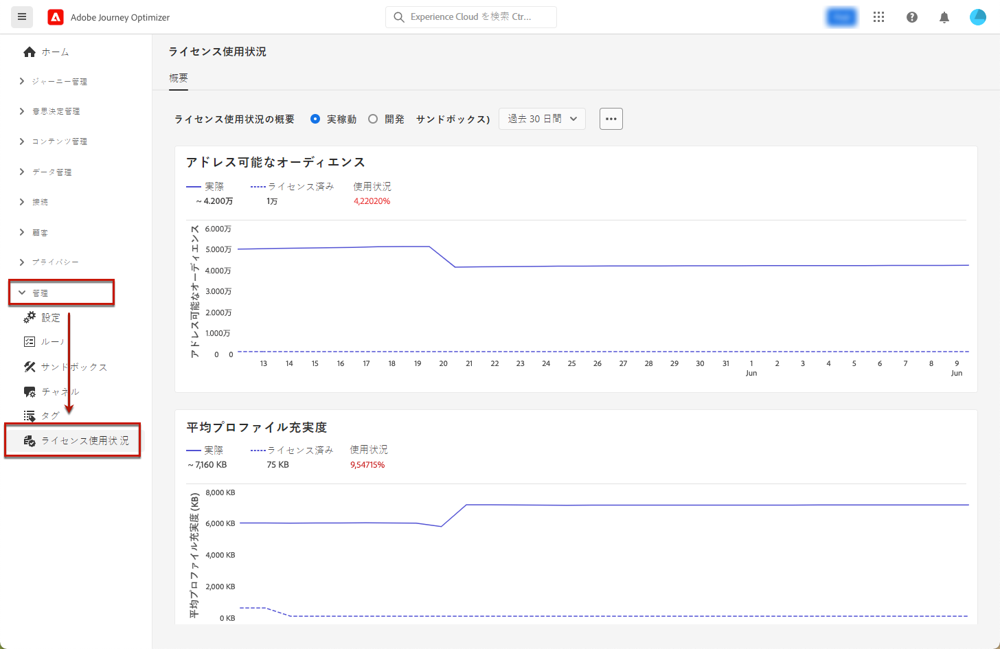

# ライセンス使用状況ダッシュボード {#license-usage}

[!DNL Adobe Journey Optimizer] [ユーザーインターフェイス](../start/user-interface.md)は、毎日のスナップショットでキャプチャされた、組織のライセンス使用状況に関する重要な情報を表示するダッシュボードを提供します。

このダッシュボードにアクセスするには、**[!UICONTROL 管理]**／**[!UICONTROL ライセンスの使用状況]**&#x200B;に移動します。これにより、ダッシュボードに表示される「**[!UICONTROL 概要]**」タブが開きます。

>[!NOTE]
>
>ダッシュボードを表示するには、[ライセンス使用状況ダッシュボードを表示](https://experienceleague.adobe.com/docs/experience-platform/dashboards/permissions.html?lang=ja#available-permissions){target="_blank"}権限を付与されている必要があります。

[!DNL Adobe Journey Optimizer] では、ダッシュボードで&#x200B;**エンゲージメント可能なプロファイル**&#x200B;の数を確認できます。エンゲージメント可能なプロファイルは、個人を表す情報のレコードで、プロファイルサービスに保存されます。これらのレコードは、過去 12 か月間に、Journey Optimizer のオーサリング、意思決定、配信、実験またはオーケストレーション機能を使用してエンゲージしようとしたプロファイルです。

詳しくは、Adobe Experience Platform ドキュメントを参照してください。

* [ライセンス使用状況ダッシュボードの概要](https://experienceleague.adobe.com/docs/experience-platform/dashboards/guides/license-usage.html?lang=ja){target="_blank"}
* [ライセンス使用状況ダッシュボードの確認](https://experienceleague.adobe.com/docs/experience-platform/dashboards/guides/license-usage.html?lang=ja#exploring-the-license-usage-dashboard){target="_blank"}
* [使用可能な指標](https://experienceleague.adobe.com/docs/experience-platform/dashboards/guides/license-usage.html?lang=ja#available-metrics){target="_blank"}
