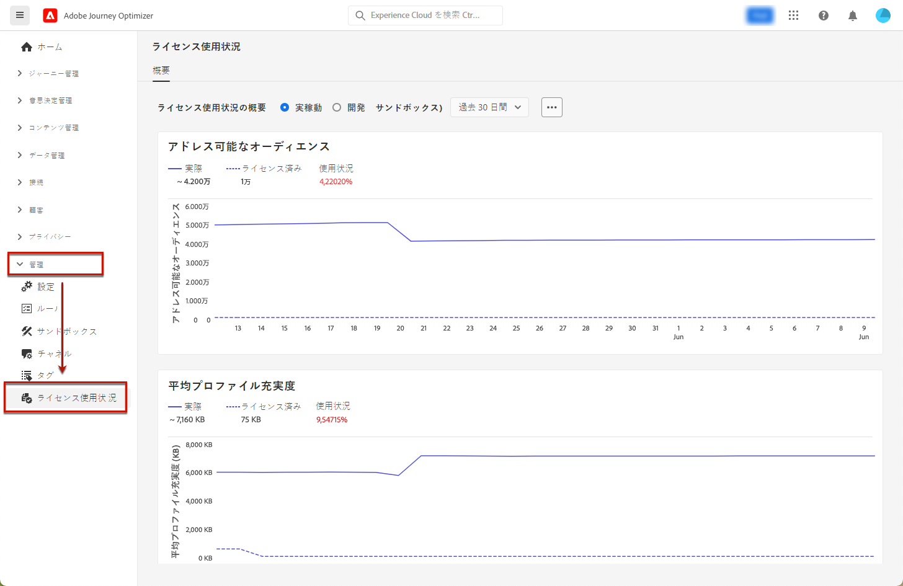

# ライセンス使用状況ダッシュボード {#license-usage}

>[!BEGINSHADEBOX]

**このページ：** Adobe Journey Optimizer ライセンス使用状況ダッシュボードを操作する方法と、エンゲージ可能プロファイル数の予期しない増加をトラブルシューティングする方法について説明します。

>[!ENDSHADEBOX]

[!DNL Adobe Journey Optimizer] [ユーザーインターフェイス](../start/user-interface.md)は、毎日のスナップショットでキャプチャされた、組織のライセンス使用状況に関する重要な情報を表示するダッシュボードを提供します。

このダッシュボードにアクセスするには、**[!UICONTROL 管理]**／**[!UICONTROL ライセンスの使用状況]**&#x200B;に移動します。 これにより、ダッシュボードに表示される「**[!UICONTROL 概要]**」タブが開きます。

>[!NOTE]
>
>* ダッシュボードを表示するには、[ライセンス使用状況ダッシュボードを表示](https://experienceleague.adobe.com/docs/experience-platform/dashboards/permissions.html?lang=ja#available-permissions){target="_blank"}権限を付与されている必要があります。
>
>* 開発サンドボックスの場合、割り当て量列に `N/A` と示されるので、特定の指標（例：計算時間、メールなど）は表示されません。 ダッシュボードには、null 以外の値のみが表示されます。指標がゼロまたはゼロに近い場合、これらの値は入力されません。

[!DNL Adobe Journey Optimizer]の場合、ダッシュボードを使用すると、**エンゲージ可能なプロファイル**&#x200B;の数を確認できます。このプロファイルは、12か月間のローリング期間を通じて、ジャーニー、キャンペーン、または意思決定を通じてエンゲージされた一意のプロファイルです。 エンゲージメント可能なプロファイルの定義と計算方法について詳しくは、[&#x200B; エンゲージメント可能なプロファイルとライセンスの使用状況](get-started-profiles.md#engageable-profiles)を参照してください。

>[!NOTE]
>
>エンゲージメント可能なプロファイル数が急激に増加した場合は、問題の理解と解決に関する詳細なガイダンスについては、以下の[&#x200B; トラブルシューティングの節](#troubleshooting-engageable-profiles)を参照してください。

## トラブルシューティング：エンゲージメント可能なプロファイル数が大幅に増加 {#troubleshooting-engageable-profiles}

エンゲージメント可能なプロファイル数が急激に増加した場合（例えば、1日以内にプロファイル数が数十万から数百万に増加した場合など）、このセクションでは、問題を理解し、対処するためのガイダンスを提供します。

### 増加について

「エンゲージメント可能なプロファイル」指標には、過去12 ヶ月間にジャーニーまたはキャンペーンによってエンゲージされた一意のプロファイルの数が反映されます。 突然の増加は次の要因から生じる可能性があります。

* 新しいジャーニーや施策のターゲットとなる大規模オーディエンス
* Profile Serviceに対して有効になっているデータセットの変更
* 最近エンゲージしていないオーディエンスのバッチ処理

### 解決ステップ

この問題に対処するには、次の手順に従います。

1. **プロファイル数のロジックについて：**

   * エンゲージメント可能なプロファイルは、過去12 ヶ月間のジャーニーやキャンペーンによってエンゲージされた独自のプロファイルにもとづいて計算されます。
   * プロファイルが複数のジャーニーにエントリした場合、そのサンドボックスの1つのエンゲージ可能なプロファイルとしてカウントされます。
   * 指標を低下させるには、特定のプロファイルに対して12 カ月以上エンゲージメントがない場合や、匿名のプロファイルを既知のプロファイルにつなぎ合わせる必要があります。
   * エンゲージメントプロファイルは、顧客のアドレス可能なオーディエンスを使用して計算されます。
   * 合計アドレス可能なオーディエンスのうち、Journey Optimizerの機能のいずれかを使用して過去12か月間にエンゲージしたオーディエンスは、エンゲージ可能プロファイルの数を決定します。

2. **大規模なオーディエンスを対象としたジャーニー、キャンペーン、決定の調査：**

   * [&#x200B; エンゲージ可能なプロファイルクエリ &#x200B;](../reports/query-examples.md#engageable-profiles-queries)または[&#x200B; クエリサービス &#x200B;](https://experienceleague.adobe.com/ja/docs/experience-platform/query/home){target="_blank"}を使用して、多数のプロファイルをターゲットにした最近のジャーニーとキャンペーンを確認します。
   * プロファイル数の急増に貢献した特定のジャーニーバージョンを特定できます。
   * 新しいプロファイルを含むジャーニー、キャンペーン、意思決定は、ジャーニーデータセットのイベント数の増加につながり、エンゲージ可能なプロファイル数の増加につながります。

3. **ジャーニーおよびキャンペーン レベルでオーディエンスをフィルタリング：**

   * ジャーニーやキャンペーンを開始する前にオーディエンスレベルでフィルターを適用し、エンゲージメント可能なプロファイルが不必要に増加するのを防ぎます。
   * エンゲージメント中は、関連オーディエンスのみがターゲットにされるようにします。

4. **アドレス可能なオーディエンスサイズを減らします：**

   * 必要に応じて、仮名プロファイルを削除します。 このアクションは、Journey OptimizerとReal-Time Customer Data Platformの両方に影響することに注意してください。
   * 匿名プロファイルデータの有効期限[について詳しくは、リアルタイム顧客プロファイルガイドを参照してください。](https://experienceleague.adobe.com/ja/docs/experience-platform/profile/pseudonymous-profiles){target="_blank"}
   * **メモ：**&#x200B;匿名プロファイルデータの有効期限は、Platform UIまたはAPIを使用して設定できません。 この機能を有効にするには、サポートにお問い合わせください。

5. **データセットの変更を監視：**

   * プロファイリングが有効になっているデータセットを確認し、過剰なECID （Experience Cloud ID）が含まれていないことを確認します。
   * 必要に応じて、ECID数の多いデータセットを削除し、レコードを減らして再作成します。

6. **長期的な削減戦略の策定：**

   * 特定のプロファイルが12 ヶ月以上エンゲージメントしていない場合、エンゲージメントプロファイルの数は自然に減少します。

**関連トピック：**

* [&#x200B; エンゲージメント可能なプロファイル クエリの例](../reports/query-examples.md#engageable-profiles-queries) - エンゲージメント可能なプロファイルを監視および分析するためのクエリのサンプル
* [Adobe Experience Platform Query Serviceの概要](https://experienceleague.adobe.com/ja/docs/experience-platform/query/home){target="_blank"}

## 関連ドキュメント {#related-documentation}

詳しくは、Adobe Experience Platform ドキュメントを参照してください。

* [ライセンス使用状況ダッシュボードの概要](https://experienceleague.adobe.com/docs/experience-platform/dashboards/guides/license-usage.html?lang=ja){target="_blank"}
* [ライセンス使用状況ダッシュボードの確認](https://experienceleague.adobe.com/docs/experience-platform/dashboards/guides/license-usage.html?lang=ja#exploring-the-license-usage-dashboard){target="_blank"}
* [使用可能な指標](https://experienceleague.adobe.com/docs/experience-platform/dashboards/guides/license-usage.html?lang=ja#available-metrics){target="_blank"}
* [偽名プロファイルデータの有効期限](https://experienceleague.adobe.com/docs/experience-platform/profile/pseudonymous-profiles.html?lang=ja){target="_blank"}
