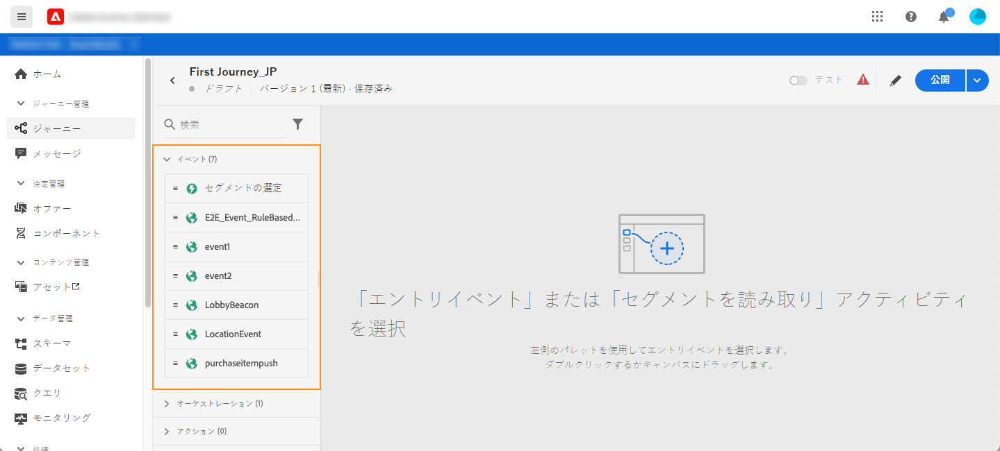
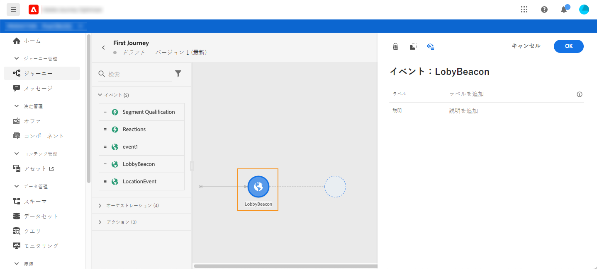
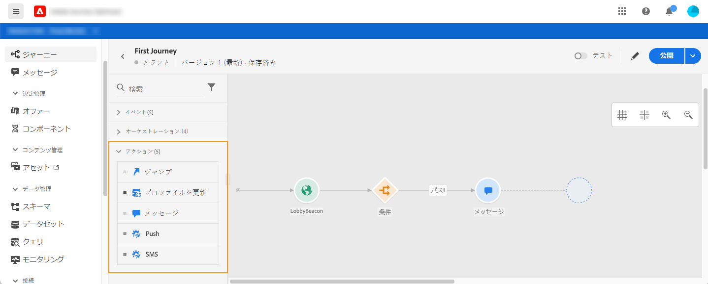

# ジャーニーアクティビティについて {#about-journey-activities}

様々なイベント、オーケストレーション、アクションなどのアクティビティを組み合わせて、複数のステップから成るクロスチャネルのシナリオを作成します。

## イベントアクティビティ {#event-activities}

技術ユーザーが設定したイベント（[このページ](../event/about-events.md)を参照）はすべて、画面左側のパレットの最初のカテゴリに表示されます。次のイベントアクティビティを使用できます。

* [一般イベント](../building-journeys/general-events.md)
* [反応](../building-journeys/reaction-events.md)
* [セグメントの選定](../building-journeys/segment-qualification-events.md)

ジャーニーを開始するには、イベントアクティビティをドラッグ＆ドロップします。ダブルクリックでも開始できます。

## オーケストレーションアクティビティ {#orchestration-activities}

画面左側にあるパレットで、次のオーケストレーションアクティビティを使用できます。

* [条件](../building-journeys/condition-activity.md)
* [終了](../building-journeys/end-activity.md)
* [待機](../building-journeys/wait-activity.md)
* [セグメントの読み取り](../building-journeys/read-segment.md)

## アクションアクティビティ {#action-activities}

画面左側にあるパレットの「**[!UICONTROL イベント]**」と「**[!UICONTROL オーケストレーション]**」の下には、**[!UICONTROL アクション]**&#x200B;カテゴリがあります。次のアクションアクティビティを使用できます。

* [メッセージ](../building-journeys/journeys-message.md)
* [カスタムアクション](../building-journeys/using-custom-actions.md)
* [ジャンプ](../building-journeys/jump.md)

これらのアクティビティは、様々な通信チャネルを表します。これらを組み合わせて、クロスチャネルシナリオを作成できます。

カスタムアクションを設定した場合は、ここに表示されます（[このページ](../building-journeys/using-custom-actions.md)を参照）。

## ベストプラクティス {#best-practices}

ほとんどのアクティビティでは、**[!UICONTROL ラベル]**&#x200B;を定義できます。これにより、キャンバスのアクティビティの下に表示される名前にサフィックスが追加されます。これは、ジャーニーで同じアクティビティを複数回使用し、より簡単に識別したい場合に便利です。また、エラーが発生した場合のデバッグも容易になり、レポートも読みやすくなります。また、オプションで&#x200B;**[!UICONTROL 説明]**&#x200B;を追加することもできます。

アクションまたは条件でエラーが発生すると、個人のジャーニーが停止します。この処理を続行する唯一の方法は、「**[!UICONTROL タイムアウトまたはエラーの場合に代替パスを追加]**」チェックボックスにチェックを付けることです。詳しくは、[この節](../building-journeys/using-the-journey-designer.md#paths)を参照してください。

