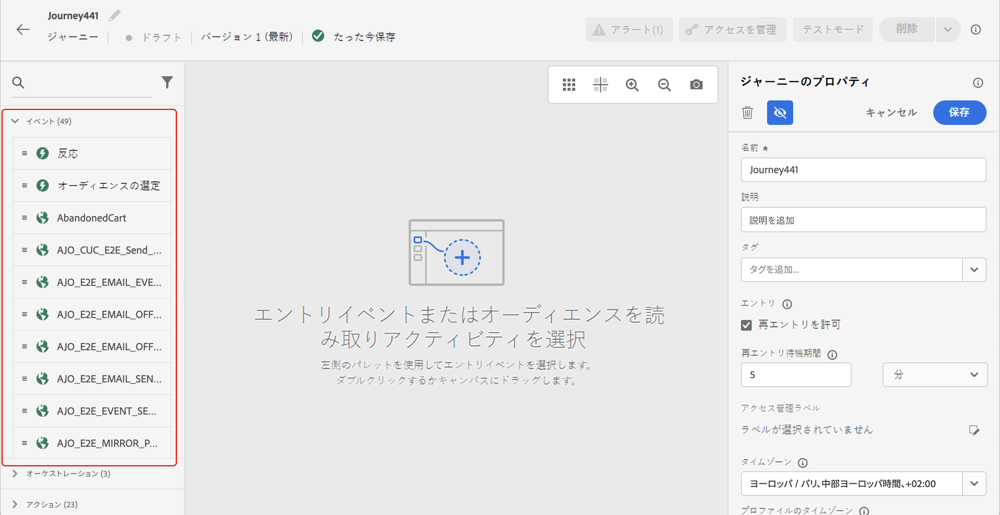
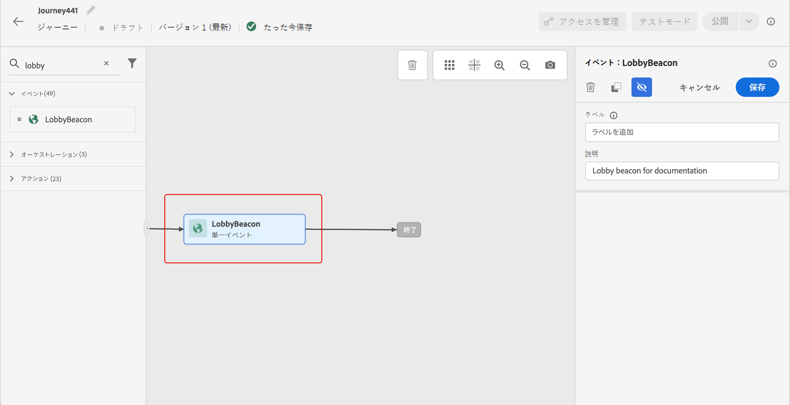
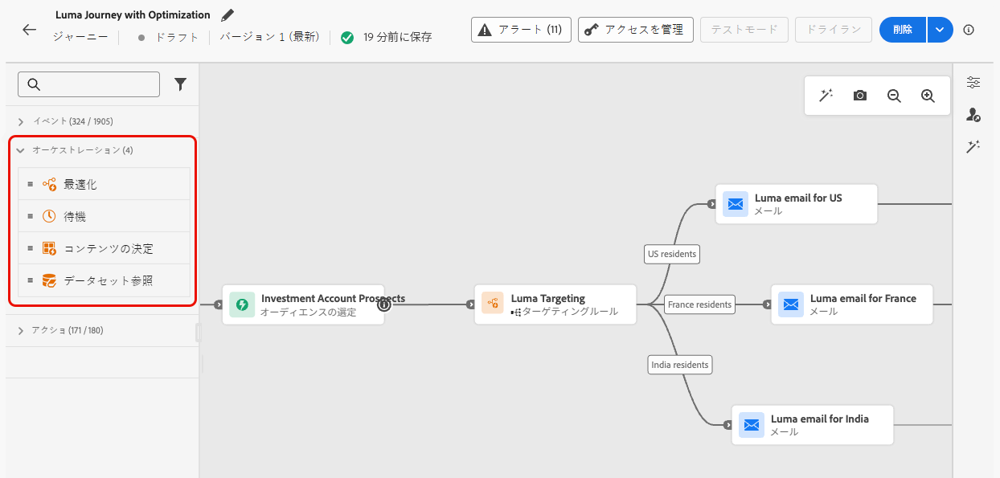
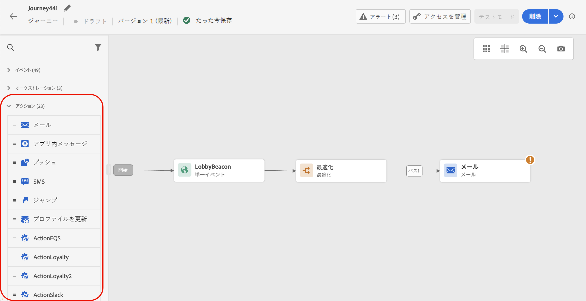
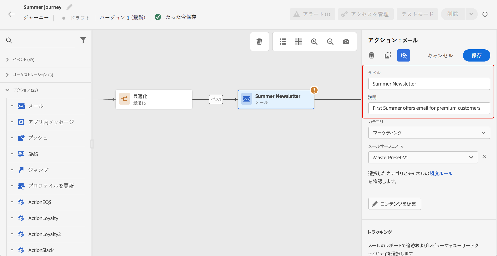
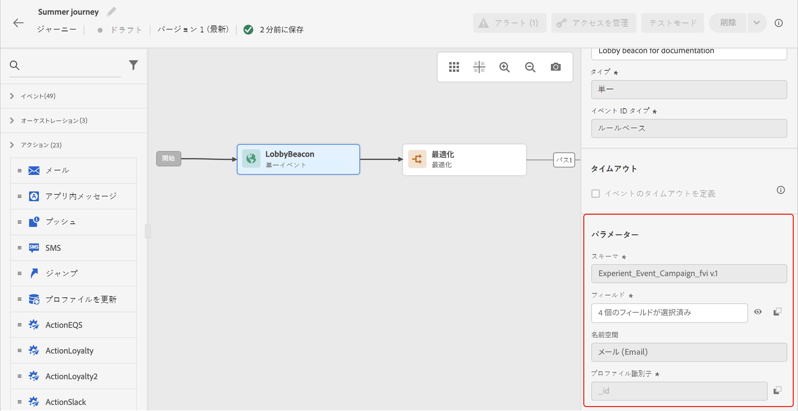
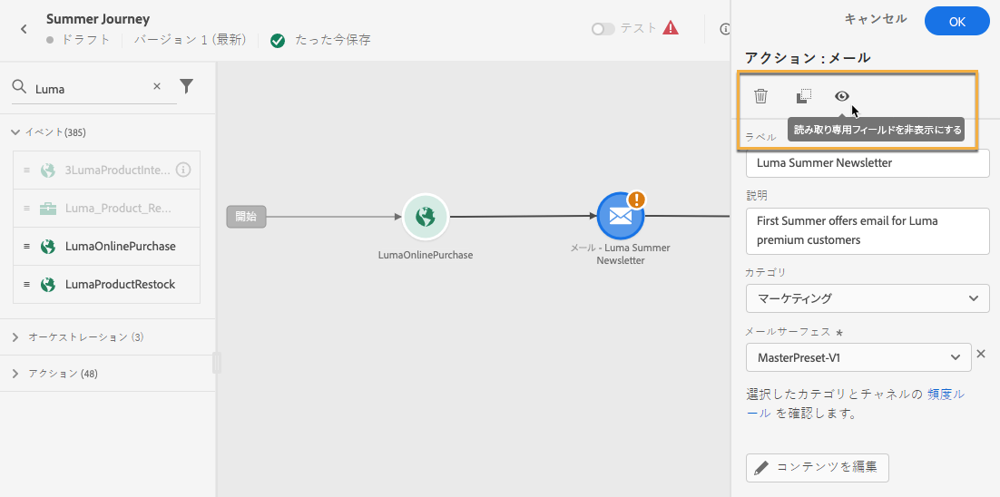
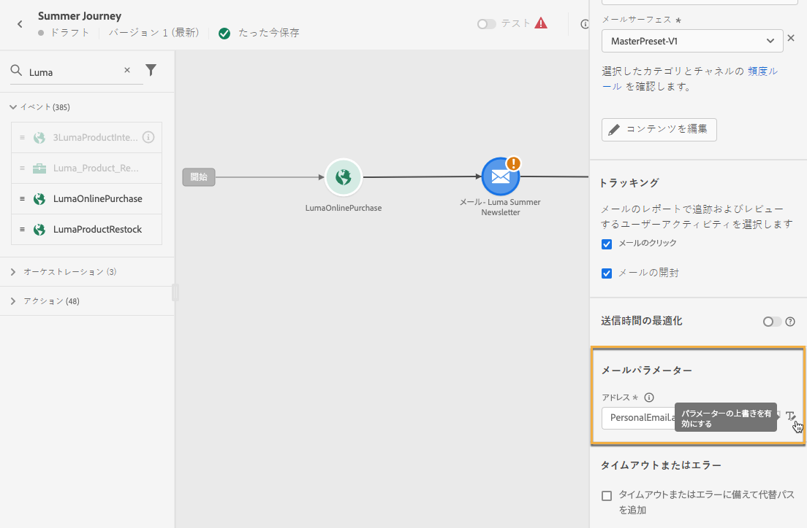
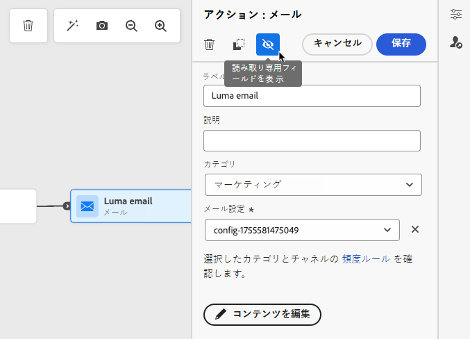
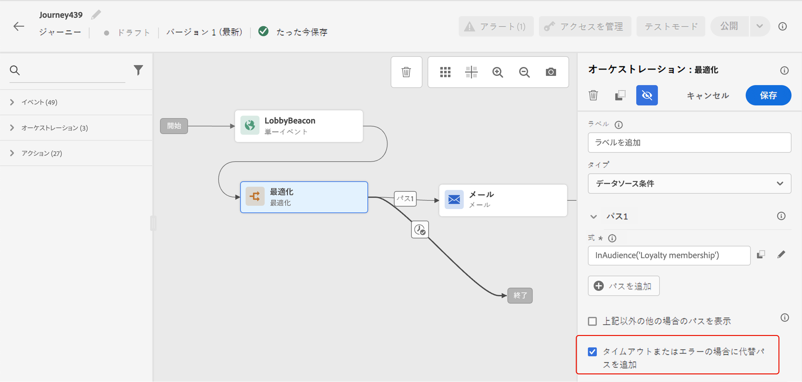

# ジャーニーのアクティビティの基本を学ぶ {#about-journey-activities}

イベント、オーケストレーション、アクションの各アクティビティを組み合わせて、複数の手順から成るクロスチャネルのシナリオを作成します。

## イベントアクティビティ {#event-activities}

パーソナライズされたジャーニーは、オンライン購入などのイベントから開始されます。 プロファイルは、ジャーニーにエントリすると、ジャーニー内を自然に移動します。 各プロファイルは、異なるパスとペースを取ることができます。 イベントから開始する場合は、イベントが到達するとジャーニーはトリガーになります。 各プロファイルは、ジャーニーで定義された手順に従います。

技術ユーザーが設定したイベント（[&#x200B; このページ &#x200B;](../event/about-events.md) を参照）は、パレットの最初のカテゴリに表示されます。 このカテゴリは画面の左側にあります。 次のイベントアクティビティを使用できます。

* [一般イベント](../building-journeys/general-events.md)
* [反応](../building-journeys/reaction-events.md)
* [オーディエンスの選定](../building-journeys/audience-qualification-events.md)

ジャーニーを開始するには、イベントアクティビティをドラッグ＆ドロップします。ダブルクリックでも開始できます。

## オーケストレーションアクティビティ {#orchestration-activities}

オーケストレーションアクティビティは、ジャーニーの次のステップを決定するのに役立つ条件です。 これらの条件には、未解決のサポートケースがあるかどうか、購入を完了したかどうかなどが含まれます。 また、地域の天気予報や、その人物が 10,000 ロイヤルティポイントに到達したかどうかも含めることができます。

画面左側にあるパレットで、次のオーケストレーションアクティビティを使用できます。

<!--* [Optimize](optimize.md)-->
* [オーディエンスを読み取り](read-audience.md)
* [待機](wait-activity.md)
* [コンテンツの決定](content-decision.md)
* [データセットの参照](dataset-lookup.md)

## アクションアクティビティ {#action-activities}

アクションは、メッセージの送信など、何らかのトリガーの結果として発生させるもので、顧客が体験するジャーニーの一部です。

画面左側のパレットの **[!UICONTROL イベント]** と **[!UICONTROL オーケストレーション]** の下には、**[!UICONTROL アクション]** カテゴリがあります。 次のアクションアクティビティを使用できます。

* [ビルトインのチャネルアクション](../building-journeys/journeys-message.md)
* [カスタムアクション](../building-journeys/using-custom-actions.md)
* [ジャンプ](../building-journeys/jump.md)

これらのアクティビティは、様々な通信チャネルを表します。これらを組み合わせて、クロスチャネルシナリオを作成できます。

また、メッセージを送信する特定のアクションを設定することもできます。

* サードパーティシステムを使用してメッセージを送信する場合は、特定のカスタムアクションを作成できます。[詳細情報](../action/action.md)

* [!DNL Adobe Campaign] および [!DNL Adobe Journey Optimizer] を使用する場合は、次の節を参照してください。

   * [[!DNL Adobe Journey Optimizer] および  [!DNL Adobe Campaign] v7/v8](../action/acc-action.md)
   * [[!DNL Adobe Journey Optimizer] and [!DNL Adobe Campaign] Standard](../action/acs-action.md)
   * [[!DNL Adobe Journey Optimizer] と  [!DNL Adobe Marketo Engage]](../action/marketo-engage.md)

## ベストプラクティス {#best-practices}

これらの推奨事項を使用して、ジャーニーを読みやすく、一貫性があり、トラブルシューティングしやすくします。

### ラベルの追加

ほとんどのアクティビティでは、**[!UICONTROL ラベル]**&#x200B;を定義できます。これにより、キャンバスのアクティビティの下に表示される名前にサフィックスが追加されます。これは、ジャーニーで同じアクティビティを複数回使用し、より簡単に識別したい場合に便利です。また、エラーが発生した場合のデバッグも容易になり、レポートも読みやすくなります。また、オプションで&#x200B;**[!UICONTROL 説明]**&#x200B;を追加することもできます。

>[!NOTE]
>
>一部のアクティビティでは、その ID もパネルに表示されます。この ID は、変更される可能性があるラベルよりも安定したキーとしてレポートに使用できます。

### 詳細パラメーターの管理 {#advanced-parameters}

ほとんどのアクティビティには、変更できない多数の詳細なパラメーターや技術的なパラメーターが表示されます。

読みやすくするには、右側のパネルの上部にある「**[!UICONTROL 読み取り専用フィールドを非表示]**」ボタンを使用して、これらのパラメーターを非表示にします。

一部のコンテキストでは、特定の用途でこれらのパラメーターの値を上書きできます。値を強制的に指定するには、フィールドの右側にある「**[!UICONTROL パラメーターの上書きを有効にする]**」アイコンをクリックします。[詳細情報](../configuration/primary-email-addresses.md#override-execution-address-journey)

>[!NOTE]
>
>詳細設定パラメーターが非表示になっている場合は、「**[!UICONTROL 読み取り専用フィールドを表示]**」ボタンをクリックします
>
>{width=60%}

### 代替パスの追加

アクションまたは条件でエラーが発生すると、個人のジャーニーが停止します。続行するには、「**[!UICONTROL タイムアウトまたはエラーの場合に代替パスを追加]**」チェックボックスをオンにするだけです。[この節](../building-journeys/using-the-journey-designer.md#paths)を参照してください。

## トラブルシューティング {#troubleshooting}

ジャーニーをテストおよび公開する前に、すべてのアクティビティが正しく設定されていることを確認します。システムでエラーが検出される場合は、テストまたは公開を実行できません。

アクティビティとジャーニーでのエラーのトラブルシューティング方法について詳しくは、[このページ](troubleshooting.md)を参照してください。

また、**[モニタリングとトラブルシューティング](../../rp_landing_pages/troubleshoot-journey-landing-page.md)**&#x200B;も参照してください。
