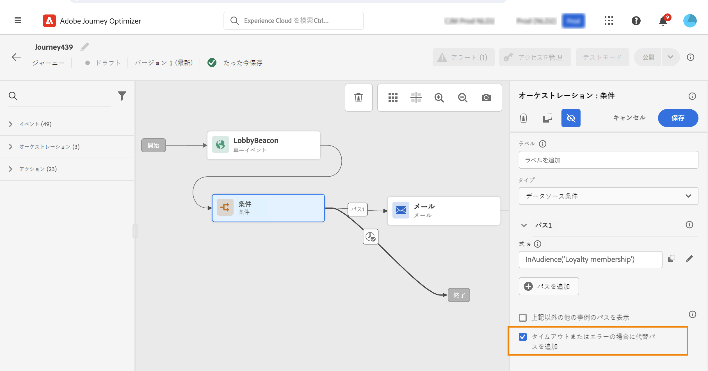

# 旅についての作業の開始 {#about-journey-activities}

様々なイベント、オーケストレーション、アクションの操作を組み合わせて、マルチステップのクロスチャンネルシナリオを構築します。

## イベントアクティビティー {#event-activities}

イベントは、オンライン購入のように、パーソナライズされた旅をトリガーするものです。 1人が旅に入ると、そのフライトは個別のメンバーとして移動します。また、同じレートまたは同じパスにある2人が移動することはありません。 イベントを使用して旅を開始すると、イベントの受信時に旅が開始されます。 各参加者は、次に、旅で定義された以下の手順に従います。

技術ユーザーによって設定されたイベント (このページ ](../event/about-events.md) を参照してください [ ) はすべて、画面の左側にあるパレットの1番目のカテゴリに表示されます。使用可能なイベントアクティビティーは、次のとおりです。

* [一般的なイベント](../building-journeys/general-events.md)
* [応答](../building-journeys/reaction-events.md)
* [セグメントの認定](../building-journeys/segment-qualification-events.md)

イベントアクティビティーをドラッグ &amp; ドロップすることによって、旅を開始することができます。 ダブルクリックすることもできます。

## オーケストレーションの操作 {#orchestration-activities}

オーケストレーションアクティビティは、次のステップを決定するために役立ちます。 このような場合は、サポート案件が開かれているかどうかを示します。このような場合は、その人物が現在の地域での気象予報において、購入を完了したかどうかに関係なく、または 10 000 のロイヤルティポイントに達します。

画面の左側にあるパレットから、次のオーケストレーションアクティビティーが使用可能になります。

* [条件](../building-journeys/condition-activity.md)
* [時間](../building-journeys/wait-activity.md)
* [セグメントの読み取り](../building-journeys/read-segment.md)

## アクションアクティビティ {#action-activities}

アクションは、ある種のトリガーの結果として発生するものです。これは、メッセージを送信するようなものです。 これは、お客様が経験する旅の1つです。

画面の左側にあるパレットから、下の部分の下 **[!UICONTROL Events]** **[!UICONTROL Orchestration]** にあるカテゴリに移動することができ **[!UICONTROL Actions]** ます。 使用可能なアクション操作は以下のとおりです。

* [電子メール、SMS、プッシュ](../building-journeys/journeys-message.md)
* [カスタムアクション](../building-journeys/using-custom-actions.md)
* [移っ](../building-journeys/jump.md)

これらのアクティビティーは、使用可能な様々な通信チャンネルを表しています。 これらを組み合わせると、クロスチャネルシナリオを作成することができます。

カスタムアクションを設定している場合は、ここにも表示されます。 [詳しく ](../building-journeys/using-custom-actions.md) は、こちらを参照してください)。

## ベストプラクティス {#best-practices}

ほとんどのアクティビティには、を **[!UICONTROL Label]** 定義することができます。 これにより、canvas 内のアクティビティの下に表示される名前に接尾記号が追加されます。 この機能は、1つの旅で同じ操作を何度も使用している場合に、それらをより簡単に識別できるようにする場合に便利です。 さらに、エラーが発生したときにデバッグが容易になり、レポートの読み取りが容易になります。 また、オプション **[!UICONTROL Description]** のを追加することもできます。

1つのアクションまたは条件でエラーが発生した場合、個々の個別の旅は停止します。 続行するには、チェックボックス **[!UICONTROL Add an alternative path in case of a timeout or an error]** をオンにする必要があります。 この項 ](../building-journeys/using-the-journey-designer.md#paths) を参照してください [ 。

