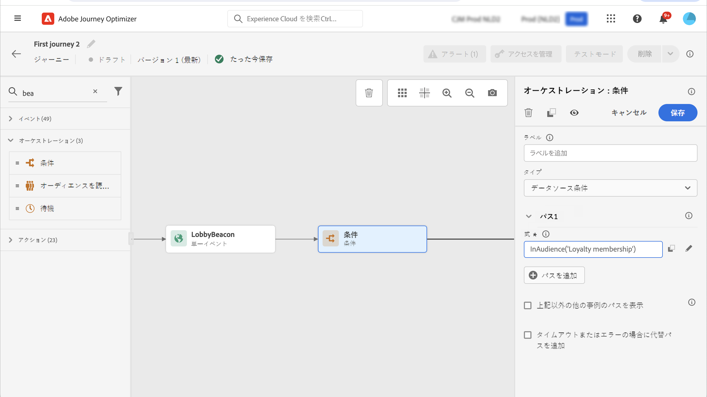

# ジャーニーのアクティビティの基本を学ぶ {#about-journey-activities}

様々なイベント、オーケストレーション、アクションなどのアクティビティを組み合わせて、複数のステップから成るクロスチャネルのシナリオを構築します。

## イベントアクティビティ {#event-activities}

パーソナライズされたジャーニーは、オンライン購入などのイベントによってトリガーされます。 プロファイルがジャーニーにエントリすると、個人として移動します。異なる個人が同じ速度や同じパスを進むことはありません。 イベントでジャーニーを開始する場合は、イベントを受信した時点でジャーニーがトリガーされます。ジャーニーの各ユーザーは、ジャーニーで定義された次のステップを個別にたどります。

技術ユーザーが設定したイベント（[このページ](../event/about-events.md)を参照）はすべて、画面左側のパレットの最初のカテゴリに表示されます。次のイベントアクティビティを使用できます。

* [一般イベント](../building-journeys/general-events.md)
* [反応](../building-journeys/reaction-events.md)
* [オーディエンスの選定](../building-journeys/audience-qualification-events.md)

ジャーニーを開始するには、イベントアクティビティをドラッグ＆ドロップします。ダブルクリックでも開始できます。

## オーケストレーションアクティビティ {#orchestration-activities}

オーケストレーションアクティビティは、ジャーニーの次のステップを決定するのに役立つ様々な条件です。オープンなサポートケースがあるかどうか、現在地の天気予報、購入を完了したかどうか、10,000 ロイヤルティポイントに達したかどうかなどが該当します。

画面左側にあるパレットで、次のオーケストレーションアクティビティを使用できます。

* [条件](../building-journeys/condition-activity.md)
* [待機](../building-journeys/wait-activity.md)
* [オーディエンスを読み取り](../building-journeys/read-audience.md)

## アクションアクティビティ {#action-activities}

アクションは、メッセージの送信など、何らかのトリガーの結果として発生させるもので、顧客が体験するジャーニーの一部です。

画面左側にあるパレットの「**[!UICONTROL イベント]**」と「**[!UICONTROL オーケストレーション]**」の下には、**[!UICONTROL アクション]**&#x200B;カテゴリがあります。次のアクションアクティビティを使用できます。

* [メール、SMS、プッシュ](../building-journeys/journeys-message.md)
* [カスタムアクション](../building-journeys/using-custom-actions.md)
* [ジャンプ](../building-journeys/jump.md)

これらのアクティビティは、様々な通信チャネルを表します。これらを組み合わせて、クロスチャネルシナリオを作成できます。

カスタムアクションを設定している場合は、こちらにも表示されます。[詳細情報](../building-journeys/using-custom-actions.md)）。

## ベストプラクティス {#best-practices}

### ラベルの追加

ほとんどのアクティビティでは、**[!UICONTROL ラベル]**&#x200B;を定義できます。これにより、キャンバスのアクティビティの下に表示される名前にサフィックスが追加されます。これは、ジャーニーで同じアクティビティを複数回使用し、より簡単に識別したい場合に便利です。また、エラーが発生した場合のデバッグも容易になり、レポートも読みやすくなります。また、オプションで&#x200B;**[!UICONTROL 説明]**&#x200B;を追加することもできます。

>[!NOTE]
>
>一部のアクティビティでは、その ID もパネルに表示されます。この ID は、変更される可能性があるラベルよりも安定したキーとしてレポートに使用できます。

### 詳細パラメーターの管理 {#advanced-parameters}

ほとんどのアクティビティには、変更できない多数の詳細なパラメーターや技術的なパラメーターが表示されます。

読みやすくするために、「**[!UICONTROL 読み取り専用フィールドを非表示]**」ボタンをクリックします。

一部のコンテキストでは、特定の用途でこれらのパラメーターの値を上書きできます。値を強制的に指定するには、フィールドの右側にある「**[!UICONTROL パラメーターの上書きを有効にする]**」アイコンをクリックします。[詳細情報](../configuration/primary-email-addresses.md#journey-parameters)

### 代替パスの追加

アクションまたは条件でエラーが発生すると、個人のジャーニーは停止します。 続行するには、チェックボックスをオンにするだけです **[!UICONTROL タイムアウトまたはエラーの場合に代替パスを追加]**. 詳しくは、[この節](../building-journeys/using-the-journey-designer.md#paths)を参照してください。

