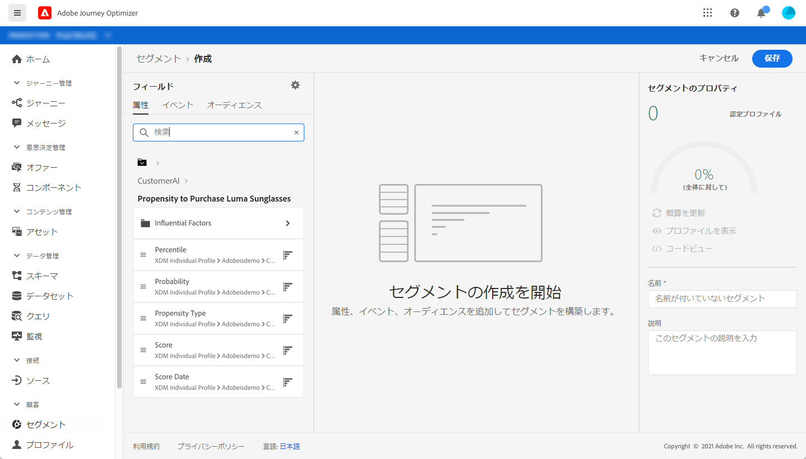

# インテリジェントサービスとの統合 {#ai-overview}

**[!DNL Adobe Intelligent Services]** との統合により、顧客体験の使用例で人工知能と機械学習の力を活用できます。 これにより、マーケティングアナリストは、データサイエンスの専門知識がなくても、ビジネスレベルの設定を使用して、会社のニーズに特化した予測を設定できます。

Adobe Experience Platform 上に構築された [!DNL Intelligent Services] は、カスタマーエクスペリエンスを担当するマーケターが AI-as-a-service にアクセスできるようにします。これにより、誰でも簡単に顧客の行動を予測し、キャンペーンの効果を測定したり、すべての投資に対するより良いリターンを確保したりできます。[!DNL Adobe Intelligent Services]について詳しくは、[Adobe Experience Platformのドキュメント](https://experienceleague.adobe.com/docs/experience-platform/intelligent-services/home.html?lang=ja){target=&quot;_blank&quot;}を参照してください。

[!DNL Journey Optimizer] と [!DNL Intelligent Services] の統合により、顧客の予測を活用できます。

顧客 AI は [!DNL Adobe Intelligent Services] の一部です。これは、顧客がとる可能性の高い行動を予測するのに役立ちます。 [Adobe Experience Platformのドキュメント](https://experienceleague.adobe.com/docs/experience-platform/intelligent-services/customer-ai/overview.html?lang=ja){target=&quot;_blank&quot;}を参照してください。

顧客 AI を使用すると、ブランドは、Adobe Experience Platform プロファイル（リアルタイム顧客プロファイル）のプロファイル属性として使用できる、チャーンまたはコンバージョンの機械学習に基づくスコアを作成できます。

その結果、これらは Journey Optimizer の条件（最適な決定を下すためのもの）、アクション、セグメントの作成において、他のプロファイル属性として使用できます。

