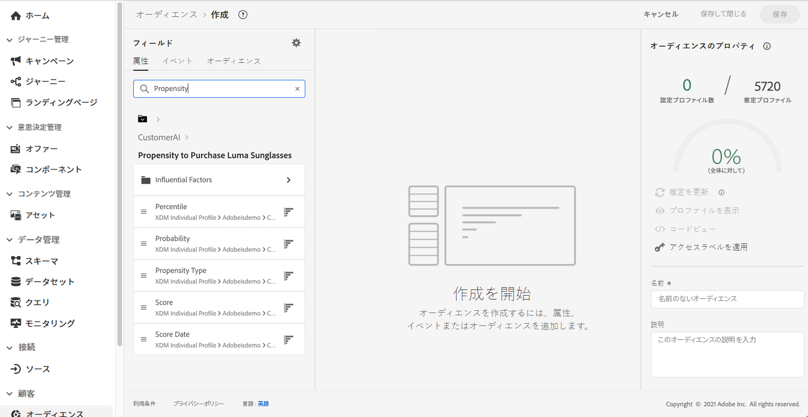

# インテリジェントサービスとの統合 {#ai-overview}

**[!DNL Adobe Intelligent Services]** との統合により、顧客体験のユースケースで人工知能と機械学習を活用できます。これにより、マーケティングアナリストは、データサイエンスの専門知識を必要とせずに、ビジネスレベルの設定を使用して、会社のニーズに合わせた予測を設定できます。

[!DNL Intelligent Services] 上に構築された [!DNL Adobe Experience Platform] は、カスタマーエクスペリエンスチームに AI-as-a-service を提供します。 顧客の行動を予測し、キャンペーンの影響を測定し、投資回収率を向上させるのに役立ちます。 詳しくは、[[!DNL Adobe Experience Platform]  ドキュメント ](https://experienceleague.adobe.com/docs/experience-platform/intelligent-services/home.html?lang=ja){target="_blank"} を参照してください。

[!DNL Journey Optimizer] と [!DNL Intelligent Services] の統合により、顧客の予測を活用できます。

[!DNL Adobe Intelligent Services] のコンポーネントである顧客 AI は、可能性の高い顧客アクションを予測します。[[!DNL Adobe Experience Platform] ドキュメント](https://experienceleague.adobe.com/docs/experience-platform/intelligent-services/customer-ai/overview.html?lang=ja){target="_blank"}を参照してください。

顧客 AI を使用すると、ブランドは、チャーンまたはコンバージョンの機械学習に基づくスコアを作成できます。これらのスコアは、プロファイルのプロファイル属性と [!DNL Adobe Experience Platform] て使用できます（リアルタイム顧客プロファイル）。

その結果、これらの属性は、Journey Optimizerの他のプロファイル属性と同様に使用できます。 決定、アクション、セグメントの作成の条件で使用します。

