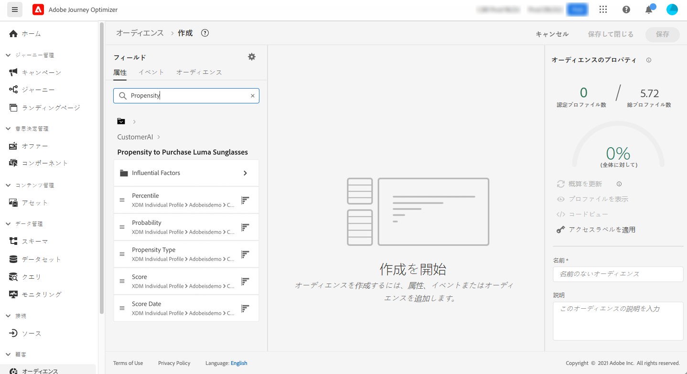

# インテリジェントサービスとの統合 {#ai-overview}

**[!DNL Adobe Intelligent Services]** との統合により、顧客体験のユースケースで人工知能と機械学習を活用できます。これにより、マーケティングアナリストは、データサイエンスの専門知識を必要とせずに、ビジネスレベルの設定を使用して、会社のニーズに合わせた予測を設定できます。

Adobe Experience Platform 上に作成された [!DNL Intelligent Services] は、顧客体験を担当するマーケターが AI as a Service （サービスとしての AI）にアクセスできるようにします。これにより、簡単に顧客行動を予測し、キャンペーンの効果を測定したり、すべての投資に対するより良いリターンを確保したりできます。[!DNL Adobe Intelligent Services] について詳しくは、[Adobe Experience Platform ドキュメント](https://experienceleague.adobe.com/docs/experience-platform/intelligent-services/home.html?lang=ja){target="_blank"}を参照してください。

[!DNL Journey Optimizer] と [!DNL Intelligent Services] の統合により、顧客の予測を活用できます。

[!DNL Adobe Intelligent Services] のコンポーネントである顧客 AI は、可能性の高い顧客アクションを予測します。[Adobe Experience Platform ドキュメント](https://experienceleague.adobe.com/docs/experience-platform/intelligent-services/customer-ai/overview.html?lang=ja){target="_blank"}を参照してください。

顧客 AI を使用すると、ブランドは、チャーンまたはコンバージョンの機械学習に基づくスコアを作成できます。これらのスコアは、Adobe Experience Platform プロファイル（リアルタイム顧客プロファイル）のプロファイル属性として使用できます。

その結果、これらの属性は Journey Optimizer の条件（最適な決定を下すためのもの）、アクション、セグメントの作成において、他のプロファイル属性として使用できます。

