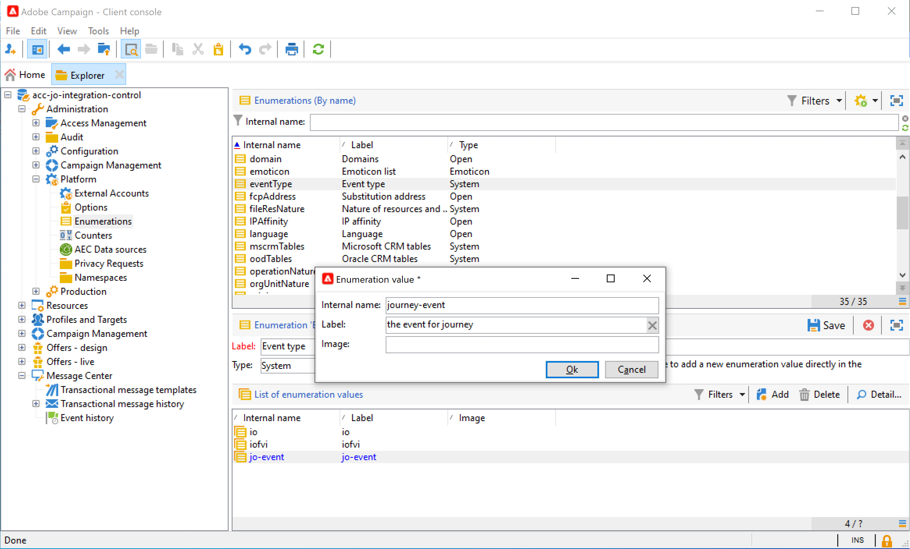
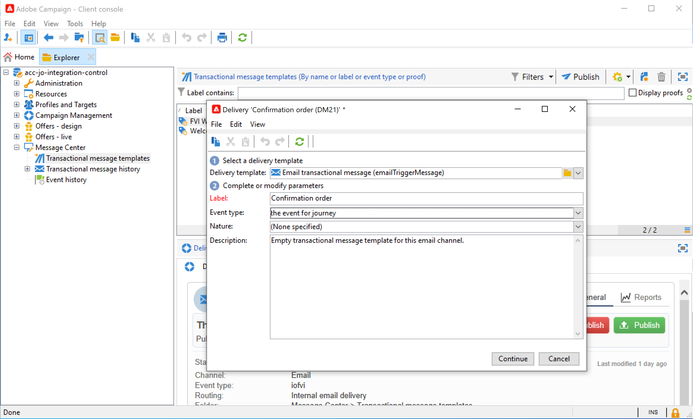
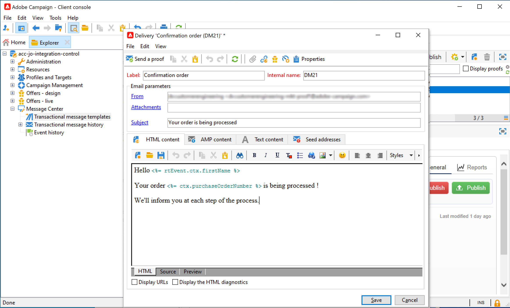
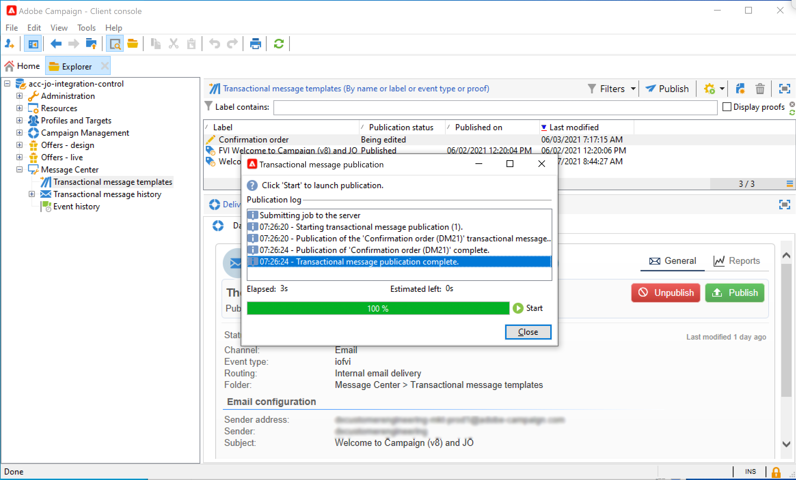
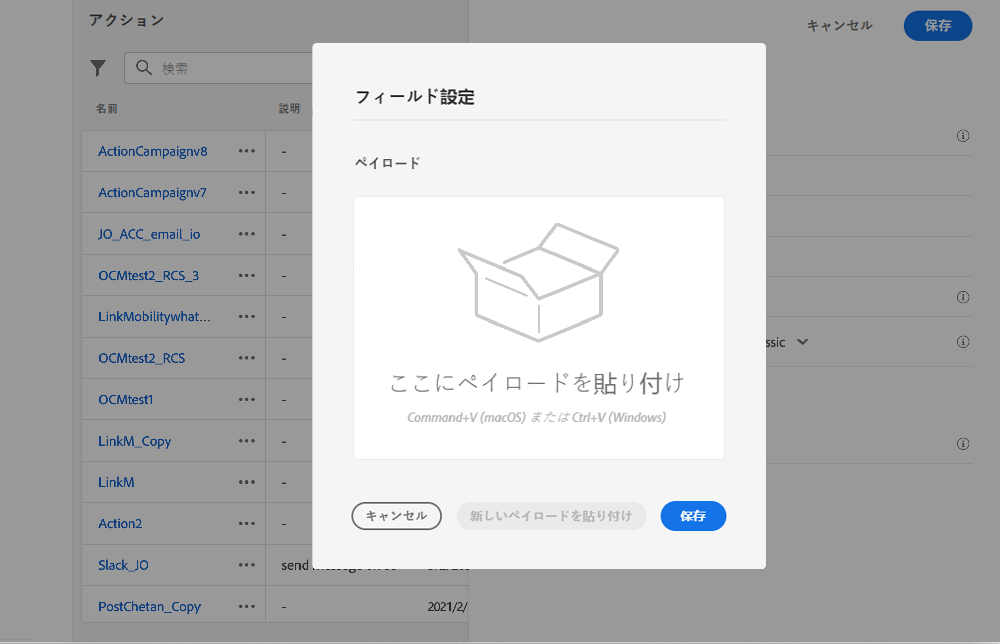
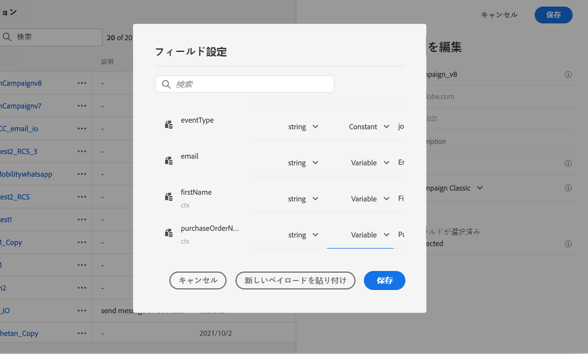
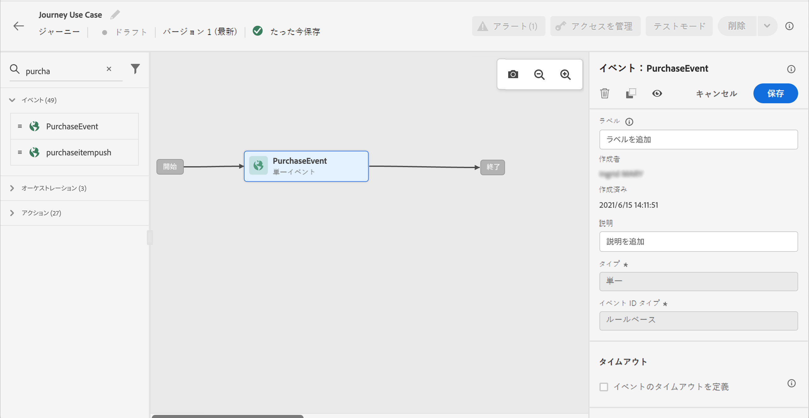
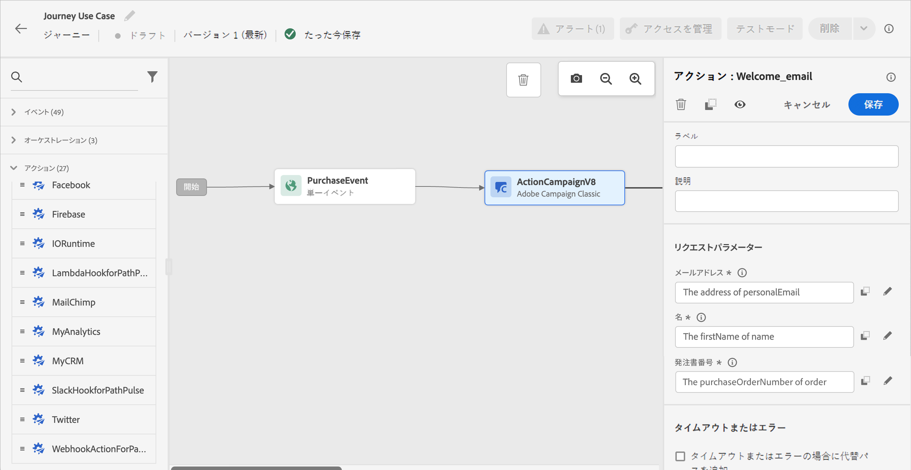
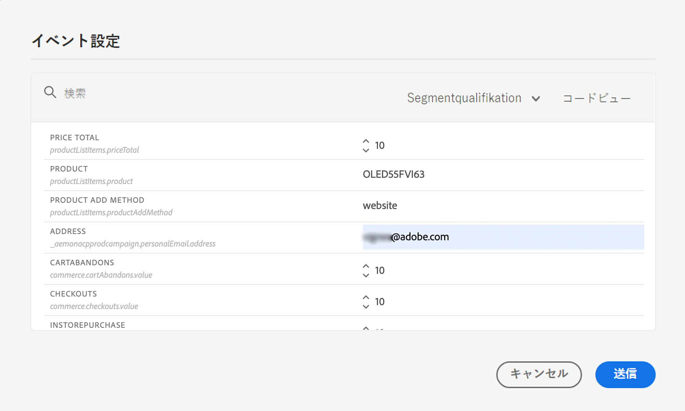

# Campaign v7／v8 を使用したメッセージの送信 {#campaign-v7-v8-use-case}

このユースケースでは、[!DNL Adobe Campaign] v7および[!DNL Adobe Campaign] v8との統合を使用してメールを送信するために必要なすべての手順について説明します。

>[!NOTE]
>
>この統合を使用するには、Campaign v7/v8 ビルド 9125 以降が必要です。

まず、Campaign でトランザクションメールテンプレートを作成します。 次に、Journey Optimizer で、イベント、アクションを作成し、ジャーニーをデザインします。

Campaign の統合について詳しくは、次のページを参照してください。

* [Campaign アクションの作成](../action/acc-action.md)
* [ジャーニーでのアクションの使用](../building-journeys/using-adobe-campaign-v7-v8.md)。

**[!DNL Adobe Campaign]**

Campaign インスタンスをこの統合用にプロビジョニングする必要があります。 トランザクションメッセージ機能を設定する必要があります。

1. Campaign コントロールインスタンスにログインします。

1. **管理**／**プラットフォーム**／**列挙**&#x200B;で、**イベントタイプ**（eventType）列挙を選択します。 新しいイベントタイプ（この例では「journey-event」）を作成します。 イベントタイプの内部名は、後で JSON ファイルを書き込む際に使用します。

   を使用して[!DNL Adobe Journey Optimizer]のイベントを設定します

1. 作成を有効にするには、インスタンスを切断して、再接続します。

1. **Message Center**／**トランザクションメッセージテンプレート**&#x200B;で、以前に作成したイベントタイプに基づいて新しいメールテンプレートを作成します。

   

1. テンプレートをデザインします。 この例では、プロファイルの名と注文番号にパーソナライゼーションを適用します。 名は[!DNL Adobe Experience Platform] データソースにあり、注文番号はJourney Optimizer イベントのフィールドです。 Campaign で正しいフィールド名を使用していることを確認します。

   

1. トランザクションテンプレートを公開します。

   

1. テンプレートに対応する JSON ペイロードを記述します。

```
{
     "channel": "email",
     "eventType": "journey-event",
     "email": "Email address",
     "ctx": {
          "firstName": "First name", "purchaseOrderNumber": "Purchase order number"
     }
}
```

* チャネルには、「email」と入力する必要があります。
* eventType には、以前に作成したイベントタイプの内部名を使用します。
* メールアドレスは変数なので、任意のラベルを入力できます。
* ctx では、パーソナライゼーションフィールドも変数です。

**Journey Optimizer**

1. イベントを作成します。 「purchaseOrderNumber」フィールドを含めます。

   [!DNL Adobe Campaign] Classic統合](assets/accintegration-uc-5.png)の![ カスタムアクション設定画面

1. Journey Optimizer で、Campaign テンプレートに対応するアクションを作成します。 「**アクションタイプ**」ドロップダウンで、「**[!DNL Adobe Campaign]Classic**」を選択します。

   [!DNL Adobe Campaign] クラシック オプション ](assets/accintegration-uc-6.png)を表示する![ アクションタイプの選択

1. 「**ペイロードフィールド**」をクリックし、以前に作成した JSON を貼り付けます。

   

1. メールアドレスと 2 つのパーソナライゼーションフィールドで、「**定数**」を「**変数**」に変更します。

   

1. 次に、新しいジャーニーを作成し、以前に作成したイベントから開始します。

   

1. アクションを追加し、Journey Optimizer の正しいフィールドに各フィールドをマッピングします。

   

1. ジャーニーのテスト：

   

1. これで、ジャーニーを公開できます。
