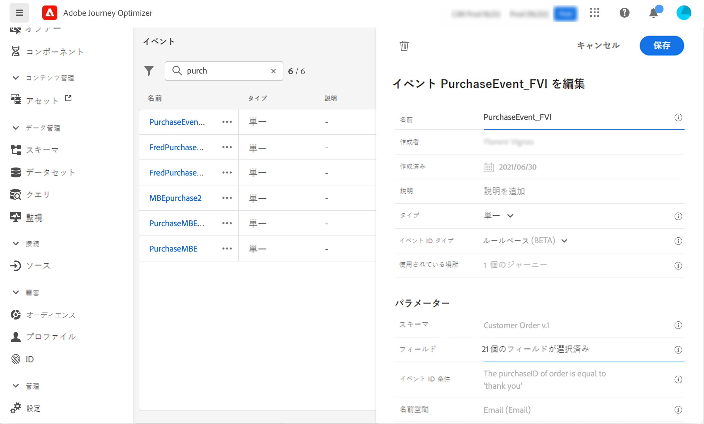
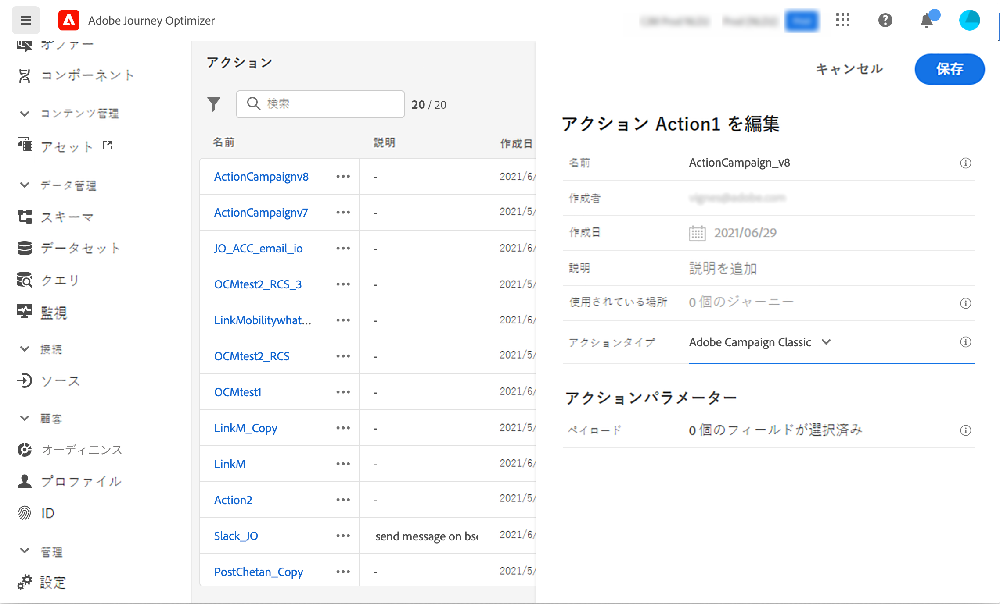

# 使用例: キャンペーン v7/v8 を使用したメッセージの送信 {#campaign-classic-use-case}

この用途には、Adobe キャンペーンの従来の v7 と Adobe キャンペーン v8 を使用して電子メールを送信するために必要な手順がすべて掲載されています。

最初に、キャンペーンでトランザクション電子メールテンプレートを作成します。 次に、旅のオプティマイザーがイベント、アクションを作成して、旅をデザインします。

キャンペーンの統合について詳しくは、次のページを参照してください。

* [キャンペーンアクションの作成](../action/acc-action.md)
* [フライト ](../building-journeys/using-adobe-campaign-classic.md) 中にアクションを使用します。

**Adobe キャンペーン**

この統合を行うには、キャンペーンインスタンスが準備されていなければなりません。 トランザクションメッセージング機能は、構成する必要があります。

1. キャンペーンコントロールインスタンスにログインします。

1. 「 **管理** > **Platform** > **列挙** 」で、「イベントタイプ (イベントタイプ **)」列挙を選択** します。新しいイベントタイプを作成します (この例では &quot;旅イベント&quot;)。 JSON ファイルを後で作成するときには、イベントタイプの内部名を使用する必要があります。

   

1. 作成したインスタンスを有効にするには、そのインスタンスを切り離して再リンクします。

1. 「メッセージセンター **」 >** 「 **トランザクションメッセージテンプレート** 」に、以前に作成したイベントタイプに基づいて新しい電子メールテンプレートを作成します。

   

1. テンプレートをデザインします。 この例では、プロファイルの名前と注文番号について、パーソナル化を行います。 最初の名前は、アドビシステムズ社のプラットフォームデータソースで、注文数は、旅オプティマイザーのイベントのフィールドです。 キャンペーンで、正しいフィールド名を使用しているかどうかを確認してください。

   

1. トランザクションテンプレートをパブリッシュします。

   

1. これで、テンプレートに対応する JSON ペイロードを作成する必要があります。

```
{
     "channel": "email",
     "eventType": "journey-event",
     "email": "Email address",
     "ctx": {
          "firstName": "First name", "purchaseOrderNumber": "Purchase order number"
     }
}
```

* チャネルについては、「email」を入力する必要があります。
* イベントの種類については、事前に作成したイベントタイプの内部名を使用します。
* 電子メールアドレスは変数になるので、任意のラベルを入力することができます。
* Ctx の場合、パーソナル化フィールドは変数にもなります。

**旅オプティマイザー**

1. 最初に、イベントを作成する必要があります。 &quot;PurchaseOrderNumber&quot; フィールドが含まれていることを確認してください。

   

1. その後で、キャンペーンテンプレートに対応するアクションを、旅のオプティマイザーに作成する必要があります。 **「アクションタイプ** 」ドロップダウンで、「Adobe キャンペーンクラシック **」を選択し** ます。

   

1. **「ペイロード」フィールド** をクリックして、以前に作成した JSON をペーストします。

   

1. 電子メールアドレスと2つの個人用設定フィールドに対して、定数 **を Variable** に **変更** します。

   

1. ここで、新しい旅を作成し、事前に作成したイベントから作業を開始します。

   

1. アクションを追加し、各フィールドを旅オプティマイザーの適切なフィールドにマップします。

   

1. 旅をテストしてください。

   

1. これで、旅をパブリッシュできるようになりました。
