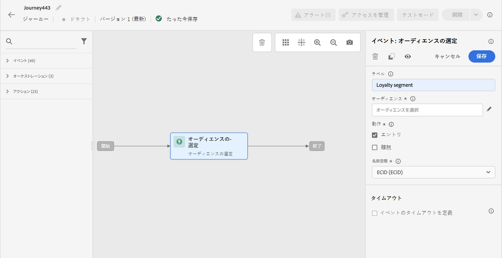
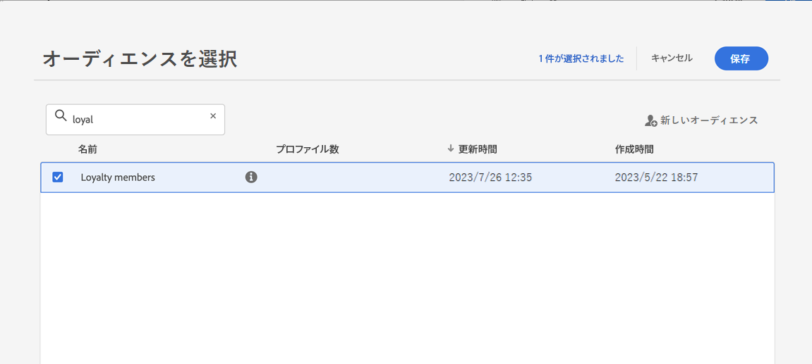
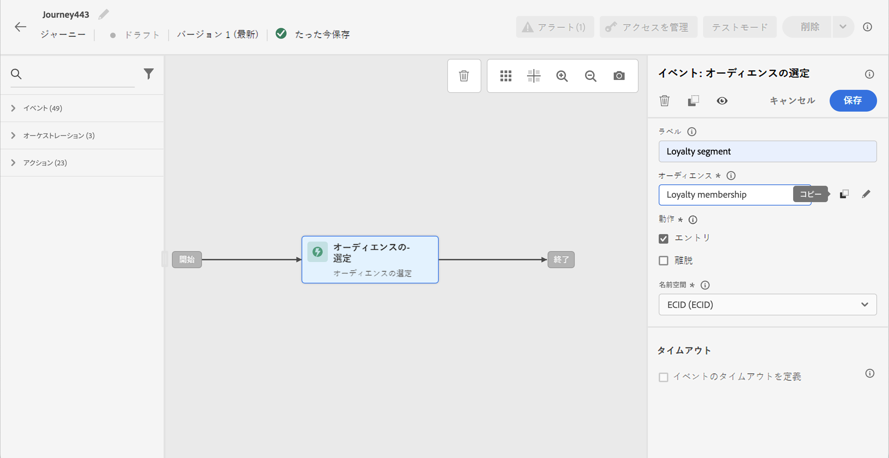
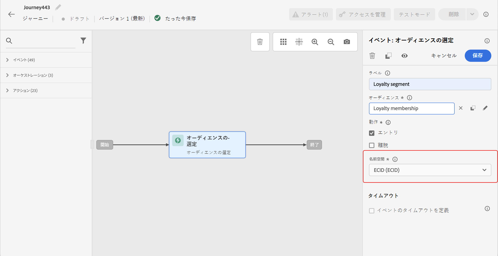
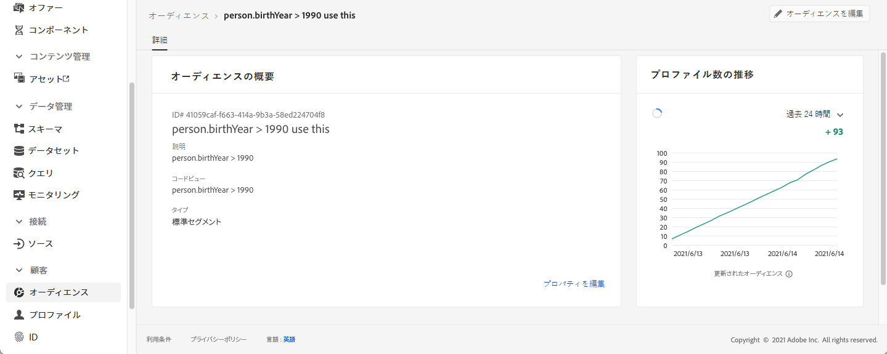

# オーディエンスの選定イベント {#segment-qualification}

>[!CONTEXTUALHELP]
>id="ajo_journey_event_segment_qualification"
>title="オーディエンスの選定イベント"
>abstract="このアクティビティは、オーディエンス内のプロファイルのエントリや離脱 [!DNL Adobe Experience Platform] リッスンして、個人をジャーニーに沿って移動させます。"

## オーディエンスの選定イベントについて{#about-segment-qualification}

このアクティビティは、オーディエンス内のプロファイルのエントリと離脱 [!DNL Adobe Experience Platform] リッスンします。 個人をジャーニーにエントリさせたり、前進させたりできます。 オーディエンスの作成について詳しくは、この[節](../audience/about-audiences.md)を参照してください。

「シルバー顧客」オーディエンスがあるとします。このアクティビティを使用すると、新しいシルバーの顧客全員をジャーニーにエントリさせ、パーソナライズされた一連のメッセージを送ることができます。

このタイプのイベントは、ジャーニーの最初または後半に配置できます。

➡️ [この機能をビデオで確認](#video)

>[!CAUTION]
>
>オーディエンスの選定の設定を開始する前に、[ガードレールと制限を参照してください](#audience-qualification-guardrails)。

## アクティビティの設定 {#configure-segment-qualification}

**[!UICONTROL オーディエンスの選定]**&#x200B;アクティビティを設定するには、次の手順に従います。

1. **[!UICONTROL イベント]**&#x200B;カテゴリを展開し、**[!UICONTROL オーディエンスの選定]**&#x200B;アクティビティをキャンバスにドロップします。

   

1. アクティビティに&#x200B;**[!UICONTROL ラベル]**&#x200B;を追加します。この手順はオプションです。

1. 「**[!UICONTROL オーディエンス]**」フィールドをクリックし、活用するオーディエンスを選択します。

   >[!NOTE]
   >
   >リストに表示される列はカスタマイズして並べ替えることができます。

   

   オーディエンスが追加されると、「**[!UICONTROL コピー]**」ボタンを使用して、オーディエンスの名前と ID をコピーできます。

   `{"name":"Loyalty membership","id":"8597c5dc-70e3-4b05-8fb9-7e938f5c07a3"}`

   

1. 「**[!UICONTROL 動作]**」フィールドで、オーディエンスへのエントリ、離脱またはその両方をリッスンするかどうかを選択します。

   >[!NOTE]
   >
   >**[!UICONTROL Enter]** および **[!UICONTROL Exit]** は、**のオーディエンス参加ステータス** 実現 **および** 離脱 [!DNL Adobe Experience Platform] に対応します。
   >詳しくは、[&#x200B; セグメント化サービスのドキュメント &#x200B;](https://experienceleague.adobe.com/docs/experience-platform/segmentation/tutorials/evaluate-a-segment.html?lang=ja#interpret-segment-results){target="_blank"} を参照してください。

1. 名前空間を選択します。これは、イベントがジャーニーの最初のステップとして位置付けられている場合にのみ必要です。デフォルトでは、このフィールドには、最後に使用した名前空間が事前に入力されています。

   >[!NOTE]
   >
   >ユーザーベースの ID 名前空間のみを選択できます。
   >参照テーブルの名前空間（製品参照用の製品 ID など）は、**名前空間** ドロップダウンリストでは使用できません。

   

ペイロードには、条件とアクションで使用できる次のコンテキスト情報が含まれています。

* 行動（エントリ、離脱）
* 選定のタイムスタンプ
* オーディエンス ID

**[!UICONTROL オーディエンスの選定]**&#x200B;アクティビティに続く条件またはアクションで式エディターを使用すると、**[!UICONTROL AudienceQualification]** ノードにアクセスできます。**[!UICONTROL 前回の選定時間]**&#x200B;と&#x200B;**[!UICONTROL ステータス]**&#x200B;のどちらかを選択できます（エントリまたは離脱）。

[条件アクティビティ](../building-journeys/condition-activity.md#about_condition)を参照してください。

**オーディエンスの選定**&#x200B;イベントを含む新しいジャーニーは、公開してから 10 分後に運用可能になります。この間隔は、専用サービスのキャッシュ更新間隔と一致します。 このジャーニーを使用する前に 10 分待ちます。

## ベストプラクティス {#best-practices-segments}

**[!UICONTROL オーディエンスの選定]** アクティビティを使用すると、[!DNL Adobe Experience Platform] オーディエンスの資格を得ている個人や資格を失っている個人を、直ちにジャーニーにエントリさせることができます。

この情報は瞬時に処理されます。測定値には、1 秒あたり 10,000 件のイベントが受信されたことが示されます。 エントリスパイクを計画し、可能であれば回避し、それらを処理するためにジャーニーを準備します。 ジャーニーの処理率とスループット制限について詳しくは、[この節](entry-management.md#journey-processing-rate)を参照してください。

### バッチオーディエンス {#batch-speed-segment-qualification}

バッチオーディエンスに対して「オーディエンスの選定」を使用する場合、エントリのピークは毎日の計算時に発生することに注意してください。ピークのサイズは、1 日にオーディエンスに入る個人またはオーディエンスから出る個人の数によって異なります。

さらに、バッチオーディエンスを新しく作成してジャーニーですぐに使用した場合は、最初の計算バッチで多くのエントリを実行できます。 このスパイクを計画します。

### ストリーミングオーディエンス {#streamed-speed-segment-qualification}

ストリーミングオーディエンスに対してオーディエンスの選定を使用すると、評価が継続的に行われるので、大きな入口と出口のピークのリスクが低くなります。 オーディエンス定義が一度に多くの顧客と認められた場合でも、ピークが発生する可能性があります。

ストリーミングセグメント化で開くイベントや送信イベントを使用しないでください。代わりに、クリック数、購入数、ビーコンデータなどの実際のユーザーアクティビティのシグナルを使用します。頻度または抑制ロジックの場合は、送信イベントの代わりにビジネスルールを使用します。 [詳細情報](../audience/about-audiences.md)

[[!DNL Adobe Experience Platform]  ストリーミングセグメント化のドキュメント &#x200B;](https://experienceleague.adobe.com/ja/docs/experience-platform/segmentation/methods/streaming-segmentation){target="_blank"} を参照してください。

>[!NOTE]
>
>ストリーミングセグメント化の場合、新しく取り込まれたデータが **内に完全に反映されてリアルタイムで使用されるまでに最大** 2 時間 [!DNL Adobe Experience Platform] かかる場合があります。 日ベースまたは時間ベースの条件（例：「今日発生したイベント」）に依存するオーディエンスでは、選定のタイミングがさらに複雑になる場合があります。ジャーニーが即時のオーディエンスの選定に依存する場合は、最初に短い [&#x200B; 待機アクティビティ &#x200B;](wait-activity.md) を追加することを検討します。 また、バッファー時間を許可して、正確な選定を確保することもできます。

#### 選定されるすべてのプロファイルがジャーニーにエントリできるわけではない理由 {#streaming-entry-caveats}

**オーディエンスの選定**&#x200B;アクティビティでストリーミングオーディエンスを使用する際、オーディエンスで選定されるすべてのプロファイルが必ずしもジャーニーにエントリするわけではありません。この動作が発生する理由は次のとおりです。

* **オーディエンスに既に含まれているプロファイル**：ジャーニーの公開後に新たにオーディエンスに選定されるプロファイルのみがエントリをトリガーします。 公開前にオーディエンスに既に含まれているプロファイルはエントリしません。

* **ジャーニーのアクティブ化時間**：ジャーニーを公開すると、**オーディエンスの選定**&#x200B;アクティビティがアクティブになり、プロファイルのエントリと退出のリッスンを開始するまでに最大 **10 分**&#x200B;かかります。[ジャーニーのアクティブ化の詳細情報](#configure-segment-qualification)。

* **オーディエンスからの迅速な退出**：プロファイルがオーディエンスに選定されているが、ジャーニーのエントリがトリガーされる前に退出した場合、そのプロファイルはジャーニーにエントリしないことがあります。

* **選定とジャーニー処理の間のタイミング**:[!DNL Adobe Experience Platform] ークフローの性質上、タイミングにギャップがある場合があります。 プロファイルは、ジャーニーが選定イベントを処理する前に選定できます。

**レコメンデーション：**

* ジャーニーを公開した後、プロファイルの選定をトリガーするイベントやデータを送信する前に、10 分以上待機します。これにより、ジャーニーが完全にアクティブ化され、エントリを処理する準備が整います。

* すべての認定プロファイルが確実にエントリする必要がある重要なユースケースについては、代わりに [&#x200B; オーディエンスを読み取り &#x200B;](read-audience.md) アクティビティの使用を検討してください。 特定の時間に、オーディエンス内のすべてのプロファイルを処理します。

* ジャーニーの[エントリ率とスループット](entry-management.md#profile-entrance-rate)を監視し、プロファイルのフローパターンを把握します。

* プロファイルが期待どおりにエントリしない場合、追加の診断手順について詳しくは、[トラブルシューティングガイド](troubleshooting-execution.md#checking-if-people-enter-the-journey)を参照してください。

### オーバーロードの回避方法 {#overloads-speed-segment-qualification}

ジャーニーで使用するシステム（データソース、カスタムアクション、チャネルアクションアクティビティ）の過負荷を回避する、いくつかのベストプラクティスを示します。

* **[!UICONTROL オーディエンスの選定]**&#x200B;アクティビティで作成直後にバッチオーディエンスを使用しないでください。これにより、最初の計算のピークを回避できます。まだ計算されていないオーディエンスを使用しようとすると、ジャーニーキャンバスに黄色の警告が表示されます。

  ![&#x200B; オーディエンスが [!DNL Adobe Experience Platform]](assets/segment-error.png) に見つからない場合のエラーメッセージ

* ジャーニーで使用するデータソースとアクションのキャップルールを設定して、データソースの過負荷を避けます。詳しくは、[Journey Orchestration のドキュメント](https://experienceleague.adobe.com/docs/journeys/using/working-with-apis/capping.html?lang=ja){target="_blank"}を参照してください。キャップルールには再試行がないことに注意してください。再試行が必要な場合は、条件やアクションで「**[!UICONTROL タイムアウトまたはエラーの場合に代替パスを追加]**」ボックスをオンにし、ジャーニーで代替パスを使用します。

* 本番稼働ジャーニーでオーディエンスを使用する前に、このオーディエンスに選定された個人の数を毎日評価します。それには、**[!UICONTROL オーディエンス]**&#x200B;メニューをチェックし、オーディエンスを開き、**[!UICONTROL プロファイルの推移]**&#x200B;グラフで確認します。

  

エントリ率の制限とスループットについて詳しくは、[この節](entry-management.md#profile-entrance-rate)を参照してください。

## ガードレールと制限 {#audience-qualification-guardrails}

以下のガードレールとレコメンデーションに従って、オーディエンスの選定ジャーニーを作成します。詳しくは、以下の[オーディエンス選定のベストプラクティス](#best-practices-segments)も参照してください。

* オーディエンスの選定ジャーニーは、主にストリーミングオーディエンスを操作するのに設計されています。この組み合わせにより、より優れたリアルタイムエクスペリエンスが保証されます。オーディエンスの選定アクティビティでは、**ストリーミングオーディエンス**&#x200B;を使用することを強くお勧めします。

  ただし、ストリーミングオーディエンスでバッチ取り込みベースの属性を使用する場合や、オーディエンスの選定ジャーニーでバッチオーディエンスを使用する場合は、オーディエンスの評価／アクティブ化の期間を考慮します。バッチ取り込み属性を使用するバッチオーディエンスやストリーミングオーディエンスは、セグメント化ジョブの完了後、約 **2 時間**&#x200B;で&#x200B;**オーディエンスの選定**&#x200B;アクティビティで使用できるようになります。このジョブは、アドビ組織管理者が定義した時間に 1 日 1 回実行されます。

* [!DNL Adobe Experience Platform] オーディエンスは、1 日に 1 回（**バッチ** オーディエンス）またはリアルタイム（**ストリーミング** オーディエンスの場合は、[!DNL Adobe Experience Platform] の「高頻度のオーディエンス」オプションを使用）で計算されます。

   * 選択したオーディエンスがストリーミングされる場合は、このオーディエンスに属する個人がリアルタイムでジャーニーにエントリする可能性があります。
   * オーディエンスがバッチの場合、新たにこのオーディエンスに選定されたユーザーは、オーディエンスの計算が [!DNL Adobe Experience Platform] で実行されるとジャーニーにエントリする可能性があります。

  ベストプラクティスとして、ストリーミングオーディエンスは、**オーディエンスの選定**&#x200B;アクティビティで使用します。バッチのユースケースについては、**[オーディエンスを読み取り](read-audience.md)**&#x200B;アクティビティを使用してください。

  >[!NOTE]
  >
  >構成ワークフローとカスタムアップロードを使用して作成されたオーディエンスのバッチ特性により、「オーディエンスの選定」アクティビティでこれらのオーディエンスをターゲットにすることはできません。このアクティビティでは、セグメント定義を使用して作成されたオーディエンスのみを利用できます。

* エクスペリエンスのイベントフィールドグループは、**オーディエンスを読み取り**&#x200B;アクティビティ、**オーディエンスの選定**&#x200B;アクティビティ、または&#x200B;**ビジネスイベント**&#x200B;アクティビティで始まるジャーニーでは使用できません。

* ジャーニーで&#x200B;**オーディエンスの選定**&#x200B;アクティビティを使用すると、そのアクティビティがアクティブになってオーディエンスにエントリまたは離脱するプロファイルをリッスンするのに、最大 10 分かかる場合があります。

>[!CAUTION]
>
>[リアルタイム顧客プロファイルデータとセグメント化のガードレール](https://experienceleague.adobe.com/docs/experience-platform/profile/guardrails.html?lang=ja){target="_blank"}は、[!DNL Adobe Journey Optimizer] にも適用されます。

## チュートリアルビデオ {#video}

オーディエンスの選定ジャーニーに当てはまるユースケースについて、このビデオで説明します。オーディエンスの選定を使用してジャーニーを構築する方法と、適用するベストプラクティスについて説明します。

>[!VIDEO](https://video.tv.adobe.com/v/3425028?quality=12)
