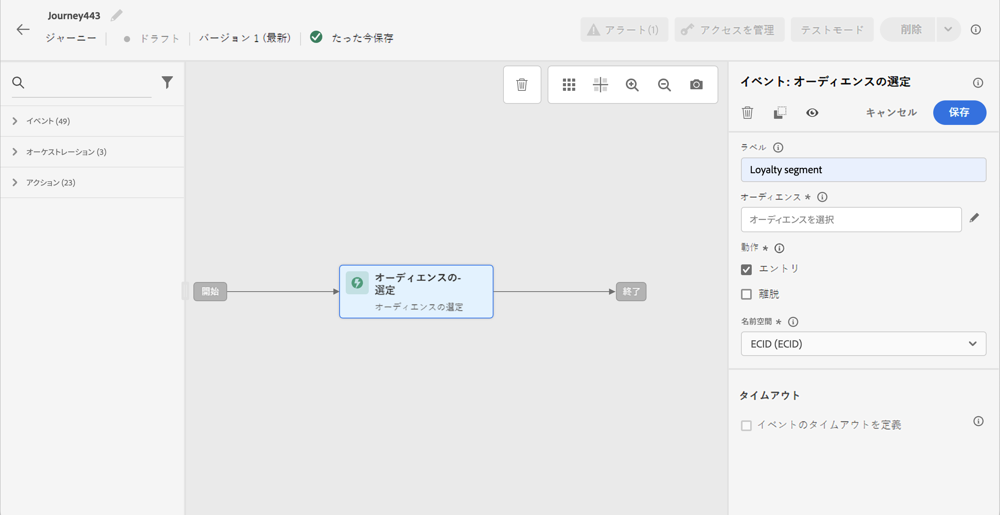
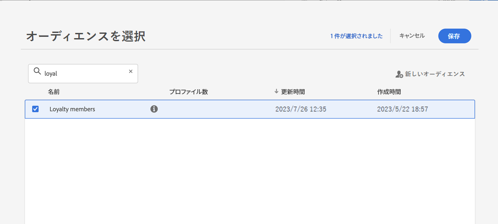
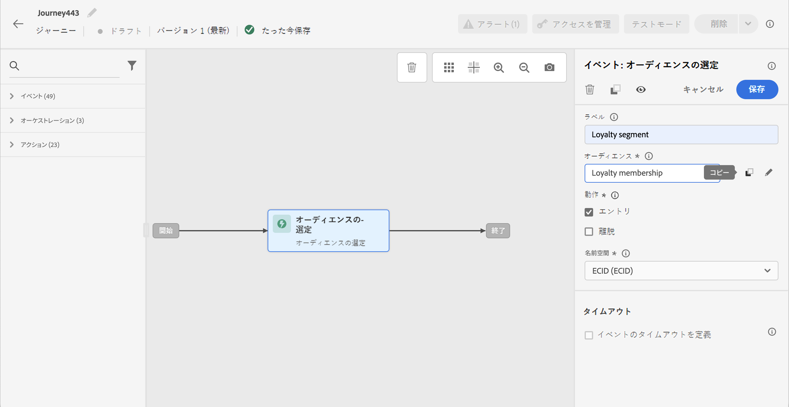
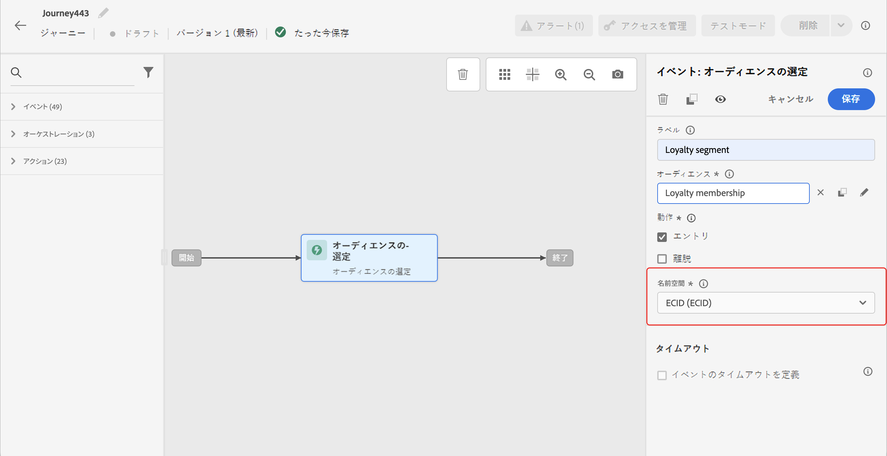
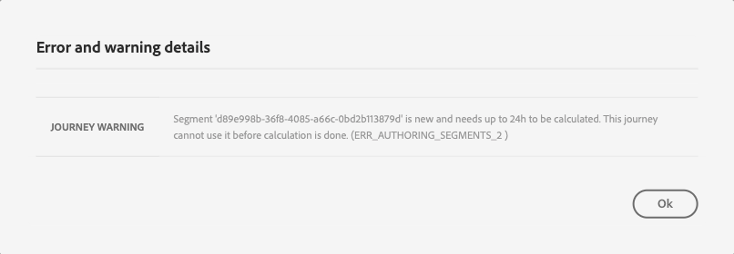
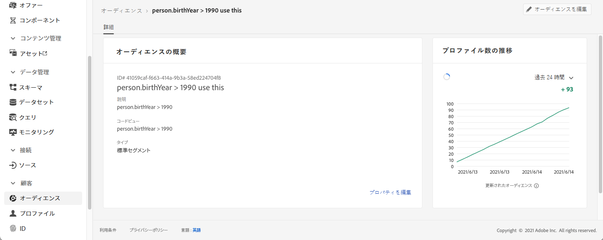

# オーディエンスの選定イベント {#segment-qualification}

>[!CONTEXTUALHELP]
>id="ajo_journey_event_segment_qualification"
>title="オーディエンスの選定"
>abstract="プロファイルが[!DNL Adobe Experience Platform] オーディエンスに適格または離脱した場合のトリガージャーニーの開始または継続。 ストリーミングオーディエンス向けの推奨。バッチシナリオには「オーディエンスを読み取り」アクティビティを使用します。"

## オーディエンスの選定イベントについて{#about-segment-qualification}

このアクティビティは、[!DNL Adobe Experience Platform] オーディエンスのプロファイルの出入りをリッスンします。 個人をジャーニーにエントリさせたり、先に進めたりすることができます。 オーディエンスの作成について詳しくは、この[節](../audience/about-audiences.md)を参照してください。

「シルバー顧客」オーディエンスがあるとします。 このアクティビティを使用すると、新しいシルバーの顧客全員をジャーニーにエントリさせ、パーソナライズされた一連のメッセージを送ることができます。

このタイプのイベントは、ジャーニーの最初または後半に配置できます。

➡️ [ビデオでこの機能を確認する](#video)

>[!CAUTION]
>
>オーディエンスの選定の設定を開始する前に、[ガードレールと制限を参照してください](#audience-qualification-guardrails)。

## アクティビティの設定 {#configure-segment-qualification}

**[!UICONTROL オーディエンスの選定]**&#x200B;アクティビティを設定するには、次の手順に従います。

>[!CONTEXTUALHELP]
>id="ajo_journey_event_segment_qualification_label"
>title="ラベル"
>abstract="レポートモードとテストモードのログでこのアクティビティを識別するためのオプションのラベルを追加します。"

>[!CONTEXTUALHELP]
>id="ajo_journey_event_segment_qualification_audience"
>title="オーディエンス"
>abstract="活用する[!DNL Adobe Experience Platform] オーディエンスを選択します。 ジャーニーは、プロファイルの出入りをリッスンします。"

>[!CONTEXTUALHELP]
>id="ajo_journey_event_segment_qualification_behavior"
>title="動作"
>abstract="オーディエンスの出入りをリッスンするかどうかを選択します。"

>[!CONTEXTUALHELP]
>id="ajo_journey_event_segment_qualification_identity"
>title="ID タイプ"
>abstract="個人の識別に使用するID タイプを選択します。 個人ベースのID名前空間のみが使用できます。"

>[!CONTEXTUALHELP]
>id="ajo_journey_event_segment_qualification_merge_policy"
>title="結合ポリシー"
>abstract="結合ポリシーは、選択したオーディエンスから自動的に取得され、ジャーニー全体に適用されます。"
>additional-url="https://experienceleague.adobe.com/ja/docs/journey-optimizer/using/orchestrate-journeys/create-journey/journey-properties#merge-policies" text="結合ポリシーについて詳しく見る"

1. **[!UICONTROL イベント]**&#x200B;カテゴリを展開し、**[!UICONTROL オーディエンスの選定]**&#x200B;アクティビティをキャンバスにドロップします。

   

1. アクティビティに&#x200B;**[!UICONTROL ラベル]**&#x200B;を追加します。 この手順はオプションです。

1. 「**[!UICONTROL オーディエンス]**」フィールドをクリックし、活用するオーディエンスを選択します。

   >[!NOTE]
   >
   >リストに表示される列はカスタマイズして並べ替えることができます。

   

   オーディエンスが追加されると、「**[!UICONTROL コピー]**」ボタンを使用して、オーディエンスの名前と ID をコピーできます。

   `{"name":"Loyalty membership","id":"8597c5dc-70e3-4b05-8fb9-7e938f5c07a3"}`

   

1. 「**[!UICONTROL 動作]**」フィールドで、オーディエンスへのエントリ、離脱またはその両方をリッスンするかどうかを選択します。

   >[!NOTE]
   >
   >**[!UICONTROL Enter]**&#x200B;と&#x200B;**[!UICONTROL Exit]**&#x200B;は、[!DNL Adobe Experience Platform]からの&#x200B;**Realized**&#x200B;と&#x200B;**Exited**&#x200B;のオーディエンス参加ステータスに対応しています。
   >[&#x200B; セグメント化サービスのドキュメント &#x200B;](https://experienceleague.adobe.com/docs/experience-platform/segmentation/tutorials/evaluate-a-segment.html?lang=ja#interpret-segment-results){target="_blank"}を参照してください。

1. 名前空間を選択します。 これは、イベントがジャーニーの最初のステップとして位置付けられている場合にのみ必要です。 デフォルトでは、このフィールドには、最後に使用した名前空間が事前に入力されています。

   >[!NOTE]
   >
   >ユーザーベースの ID 名前空間のみ選択できます。
   >ルックアップテーブル名前空間（製品ルックアップのProductIDなど）は、**名前空間** ドロップダウンリストでは使用できません。

   

ペイロードには、条件とアクションで使用できる次のコンテキスト情報が含まれています。

* 行動（エントリ、離脱）
* 選定のタイムスタンプ
* オーディエンス ID

**[!UICONTROL オーディエンスの選定]**&#x200B;アクティビティに続く条件またはアクションで式エディターを使用すると、**[!UICONTROL AudienceQualification]** ノードにアクセスできます。 **[!UICONTROL 前回の選定時間]**&#x200B;と&#x200B;**[!UICONTROL ステータス]**&#x200B;のどちらかを選択できます（エントリまたは離脱）。

[条件](../building-journeys/conditions.md#about_condition)を参照してください。

**オーディエンスの選定**&#x200B;イベントを含む新しいジャーニーは、公開してから 10 分後に運用可能になります。 この間隔は、専用サービスのキャッシュ更新間隔と一致します。 このジャーニーを使用する前に10分待ちます。

## ベストプラクティス {#best-practices-segments}

「**[!UICONTROL オーディエンスの選定]**」アクティビティを使用すると、[!DNL Adobe Experience Platform] オーディエンスの選定または不選定の個人に対して、ジャーニーにすばやくエントリできます。

この情報は瞬時に処理されます。 測定は、1秒あたり10,000件のイベントを受信したことを示しています。 エントリスパイクの計画を立て、可能な限り回避し、ジャーニーを準備して対処します。 ジャーニーの処理率とスループット制限について詳しくは、[この節](entry-management.md#journey-processing-rate)を参照してください。

### バッチオーディエンス {#batch-speed-segment-qualification}

バッチオーディエンスに対して「オーディエンスの選定」を使用する場合、エントリのピークは毎日の計算時に発生することに注意してください。 ピークの大きさは、1日に何人の個人がオーディエンスに出入りするかによって異なります。

さらに、バッチオーディエンスが新しく作成され、ジャーニーですぐに使用された場合、計算の最初のバッチは多くのエントリを駆動できます。 このスパイクの計画。

### セグメントメンバーシップの更新時期 {#timing-segment-membership}

ジャーニーでバッチスナップショットを使用する場合、新しいセグメントメンバーシップは、後続のスナップショットにのみ反映される場合があります。 即時または即日のセグメント追加が不可欠な場合は、ストリーミングセグメンテーションを検討するか、セグメント更新が次のスナップショットによって取得されることを確認することを検討してください。

### ストリーミングオーディエンス {#streamed-speed-segment-qualification}

ストリーミングオーディエンスにオーディエンスクオリフィケーションを使用する場合、評価が継続的であるため、大きなエントランスと離脱のピークのリスクが少なくなります。 オーディエンス定義で一度に多くの顧客が認定された場合でも、ピークが発生する可能性があります。

ストリーミングセグメント化で開くイベントや送信イベントを使用しないでください。 代わりに、クリック数、購入数、ビーコンデータなどの実際のユーザーアクティビティのシグナルを使用します。 頻度または抑制ロジックの場合は、送信イベントの代わりにビジネスルールを使用します。 [詳細情報](../audience/about-audiences.md)

[[!DNL Adobe Experience Platform]  ストリーミングセグメント化に関するドキュメント &#x200B;](https://experienceleague.adobe.com/ja/docs/experience-platform/segmentation/methods/streaming-segmentation){target="_blank"}を参照してください。

>[!NOTE]
>
>ストリーミングセグメントメンバーシップの伝播タイミングは、メンバーシップがどのように評価され、ジャーニーのどこで使用されるかによって異なります。
>
>* **Audience Qualification node + streaming segment:** プロファイルがEdgeでストリーミングセグメントに適格になると、ジャーニーがアクションを実行する前に、そのメンバーシップがEdgeからHubに予測されます。 このEdgeからハブへの伝搬には、通常&#x200B;**15 ～ 30分かかります**。 プロファイルが期待通りにオーディエンス選定ジャーニーに入っていない場合は、さらに調査する前に、（必要に応じて待機アクティビティを追加して）この伝播ウィンドウを許可します。 真のリアルタイム入力を必要とするユースケースについては、代わりに単一イベントトリガーを検討してください。

#### 選定されるすべてのプロファイルがジャーニーにエントリできるわけではない理由 {#streaming-entry-caveats}

**オーディエンスの選定**&#x200B;アクティビティでストリーミングオーディエンスを使用する際、オーディエンスで選定されるすべてのプロファイルが必ずしもジャーニーにエントリするわけではありません。 この動作は、次の理由で発生する可能性があります。

* **オーディエンスに既に含まれているプロファイル**：ジャーニーの公開後に新たにオーディエンスに選定されるプロファイルのみがエントリをトリガーします。 公開前にオーディエンスに既に含まれているプロファイルはエントリしません。 同様に、ストリーミングセグメントで&#x200B;**時間ベースの条件** （「次の8時間のイベント」など）を使用する場合、セグメントを作成する前にその条件を既に満たしたプロファイルは&#x200B;**過去にさかのぼって評価されません** - セグメントアクティベーション後にデータが変更されたプロファイルのみが条件に対して評価されます。

* **ジャーニーのアクティブ化時間**：ジャーニーを公開すると、**オーディエンスの選定**&#x200B;アクティビティがアクティブになり、プロファイルのエントリと退出のリッスンを開始するまでに最大 **10 分**&#x200B;かかります。 [ジャーニーのアクティブ化の詳細情報](#configure-segment-qualification)。

* **オーディエンスからの迅速な退出**：プロファイルがオーディエンスに選定されているが、ジャーニーのエントリがトリガーされる前に退出した場合、そのプロファイルはジャーニーにエントリしないことがあります。

* **選定とジャーニー処理の間のタイミング**: [!DNL Adobe Experience Platform]の分散性により、タイミングのギャップが生じる可能性があります。 プロファイルは、ジャーニーが選定イベントを処理する前に選定できます。

**レコメンデーション：**

* ジャーニーを公開した後、プロファイルの選定をトリガーするイベントやデータを送信する前に、10 分以上待機します。 これにより、ジャーニーが完全にアクティブ化され、エントリを処理する準備が整います。

* すべての適格なプロファイルが入力されることを確認する必要がある重要なユースケースについては、代わりに[&#x200B; オーディエンスを読み取り](read-audience.md) アクティビティを使用することを検討してください。 特定の時間に、オーディエンス内のすべてのプロファイルを処理します。

* ジャーニーの[エントリ率とスループット](entry-management.md#profile-entrance-rate)を監視し、プロファイルのフローパターンを把握します。

* プロファイルが期待どおりにエントリしない場合、追加の診断手順について詳しくは、[トラブルシューティングガイド](troubleshooting-execution.md#checking-if-people-enter-the-journey)を参照してください。

### オーバーロードの回避方法 {#overloads-speed-segment-qualification}

ジャーニーで使用するシステム（データソース、カスタムアクション、チャネルアクションアクティビティ）の過負荷を回避する、いくつかのベストプラクティスを示します。

* **[!UICONTROL オーディエンスの選定]**&#x200B;アクティビティで作成直後にバッチオーディエンスを使用しないでください。 これにより、最初の計算のピークを回避できます。 まだ計算されていないオーディエンスを使用しようとすると、ジャーニーキャンバスに黄色の警告が表示されます。

  [!DNL Adobe Experience Platform]にオーディエンスが見つからなかった場合の エラーメッセージ

* ジャーニーで使用するデータソースとアクションのキャップルールを設定して、データソースの過負荷を避けます。 詳しくは、[Journey Orchestration のドキュメント](https://experienceleague.adobe.com/docs/journeys/using/working-with-apis/capping.html?lang=ja){target="_blank"}を参照してください。 キャップルールには再試行がないことに注意してください。 再試行が必要な場合は、条件やアクションで「**[!UICONTROL タイムアウトまたはエラーの場合に代替パスを追加]**」ボックスをオンにし、ジャーニーで代替パスを使用します。

* 本番稼働ジャーニーでオーディエンスを使用する前に、このオーディエンスに選定された個人の数を毎日評価します。 それには、**[!UICONTROL オーディエンス]**&#x200B;メニューをチェックし、オーディエンスを開き、**[!UICONTROL プロファイルの推移]**&#x200B;グラフで確認します。

  

エントリ率の制限とスループットについて詳しくは、[この節](entry-management.md#profile-entrance-rate)を参照してください。

## ガードレールと制限 {#audience-qualification-guardrails}

以下のガードレールとレコメンデーションに従って、オーディエンスの選定ジャーニーを作成します。 詳しくは、以下の[オーディエンス選定のベストプラクティス](#best-practices-segments)も参照してください。

* オーディエンスの選定ジャーニーは、主にストリーミングオーディエンスを操作するのに設計されています。 この組み合わせにより、より優れたリアルタイムエクスペリエンスが保証されます。 オーディエンスの選定アクティビティでは、**ストリーミングオーディエンス**&#x200B;を使用することを強くお勧めします。

  ただし、ストリーミングオーディエンスでバッチ取り込みベースの属性を使用する場合や、オーディエンスの選定ジャーニーでバッチオーディエンスを使用する場合は、オーディエンスの評価／アクティブ化の期間を考慮します。 バッチ取り込み属性を使用するバッチオーディエンスやストリーミングオーディエンスは、セグメント化ジョブの完了後、約 **2 時間**&#x200B;で&#x200B;**オーディエンスの選定**&#x200B;アクティビティで使用できるようになります。 このジョブは、アドビ組織管理者が定義した時間に 1 日 1 回実行されます。

* [!DNL Adobe Experience Platform]人のオーディエンスは、1日1回（**バッチ**&#x200B;人のオーディエンス）またはリアルタイム（**ストリーミング**&#x200B;人のオーディエンスの場合、[!DNL Adobe Experience Platform]の「高頻度オーディエンス」オプションを使用）で計算されます。

   * 選択したオーディエンスがストリーミングされる場合は、このオーディエンスに属する個人がリアルタイムでジャーニーにエントリする可能性があります。
   * オーディエンスがバッチの場合、このオーディエンスに新たに適格になったユーザーは、オーディエンスの計算が[!DNL Adobe Experience Platform]に実行されたときにジャーニーにエントリする可能性があります。

  ベストプラクティスとして、ストリーミングオーディエンスは、**オーディエンスの選定**&#x200B;アクティビティで使用します。 バッチのユースケースについては、**[オーディエンスを読み取り](read-audience.md)**&#x200B;アクティビティを使用してください。

  >[!NOTE]
  >
  >構成ワークフローとカスタムアップロードを使用して作成されたオーディエンスのバッチ特性により、「オーディエンスの選定」アクティビティでこれらのオーディエンスをターゲットにすることはできません。 このアクティビティでは、セグメント定義を使用して作成されたオーディエンスのみを利用できます。

* エクスペリエンスのイベントフィールドグループは、**オーディエンスを読み取り**&#x200B;アクティビティ、**オーディエンスの選定**&#x200B;アクティビティ、または&#x200B;**ビジネスイベント**&#x200B;アクティビティで始まるジャーニーでは使用できません。

* ジャーニーで&#x200B;**オーディエンスの選定**&#x200B;アクティビティを使用すると、そのアクティビティがアクティブになってオーディエンスにエントリまたは離脱するプロファイルをリッスンするのに、最大 10 分かかる場合があります。

>[!CAUTION]
>
>[リアルタイム顧客プロファイルデータとセグメント化のガードレール](https://experienceleague.adobe.com/docs/experience-platform/profile/guardrails.html?lang=ja){target="_blank"}は、[!DNL Adobe Journey Optimizer] にも適用されます。

## チュートリアルビデオ {#video}

オーディエンスの選定ジャーニーに当てはまるユースケースについて、このビデオで説明します。 オーディエンスの選定を使用してジャーニーを構築する方法と、適用するベストプラクティスについて説明します。

>[!VIDEO](https://video.tv.adobe.com/v/3425028?quality=12)
