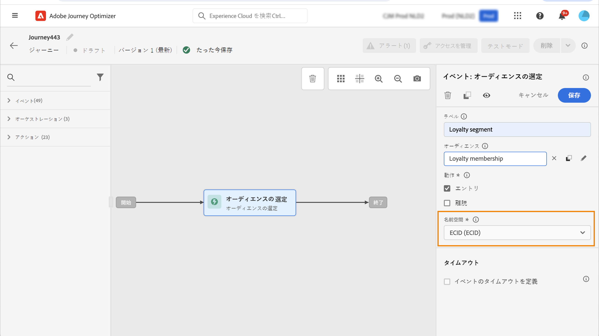

# オーディエンスの選定イベント {#segment-qualification}

## オーディエンスの選定イベントについて{#about-segment-qualification}

>[!CONTEXTUALHELP]
>id="ajo_journey_event_segment_qualification"
>title="オーディエンスの選定イベント"
>abstract="このアクティビティを使用すると、ジャーニーは Adobe Experience Platform オーディエンスへのプロファイルのエントリや離脱をリッスンして、個人をジャーニーにエントリさせたりジャーニー内で進行させたりすることができます。"

このアクティビティを使用すると、ジャーニーは Adobe Experience Platform オーディエンスへのプロファイルのエントリや離脱をリッスンして、個人をジャーニーにエントリさせたりジャーニー内で進行させたりすることができます。オーディエンスの作成について詳しくは、この[節](../audience/about-audiences.md)を参照してください。

「シルバー顧客」オーディエンスがあるとします。このアクティビティを使用すると、新しいシルバーの顧客全員をジャーニーにエントリさせ、パーソナライズされた一連のメッセージを送ることができます。

このタイプのイベントは、ジャーニーの最初または後半に配置できます。

➡️ [この機能をビデオで確認](#video)

### 重要な注意事項{#important-notes-segment-qualification}

* Adobe Experience Platform オーディエンスは、1 日に 1 回（**バッチ**&#x200B;オーディエンス）、またはリアルタイム（**ストリーム**&#x200B;オーディエンス）で計算されます（Adobe Experience Platform の「高頻度のオーディエンス」オプションを使用）。

   * 選択したオーディエンスがストリーミングされる場合、このオーディエンスに属する個人はリアルタイムでジャーニーにエントリする可能性があります。
   * バッチオーディエンスの場合、新たにこのオーディエンスに選定された訪問者は、オーディエンスの計算が Adobe Experience Platform で実行されるとジャーニーにエントリする可能性があります。

  ベストプラクティスとして、**オーディエンスの選定**&#x200B;アクティビティではストリーミングオーディエンスのみを使用することをお勧めします。バッチのユースケースについては、**[オーディエンスを読み取り](read-audience.md)**&#x200B;アクティビティを使用してください。

  >[!NOTE]
  >
  >コンポジションワークフローとカスタムアップロードを使用して作成されたオーディエンスのバッチ特性により、「オーディエンスの選定」アクティビティでこれらのオーディエンスをターゲットにすることはできません。このアクティビティでは、セグメント定義を使用して作成されたオーディエンスのみを利用できます。

* エクスペリエンスイベントフィールドグループは、「オーディエンスを読み取り」アクティビティや、オーディエンスの選定またはビジネスイベントアクティビティで始まるジャーニーでは使用できません。

* ジャーニーでオーディエンスの選定を使用すると、そのオーディエンスの選定アクティビティがアクティブになってオーディエンスにエントリまたは離脱するプロファイルをリッスンするのに、最大 10 分かかる場合があります。

### アクティビティの設定{#cnfigure-segment-qualification}

**[!UICONTROL オーディエンスの選定]**&#x200B;アクティビティを設定するには、次の手順に従います。

1. **[!UICONTROL イベント]**&#x200B;カテゴリを展開し、**[!UICONTROL オーディエンスの選定]**&#x200B;アクティビティをキャンバスにドロップします。

   

1. アクティビティに&#x200B;**[!UICONTROL ラベル]**&#x200B;を追加します。この手順はオプションです。

1. 「**[!UICONTROL オーディエンス]**」フィールドをクリックし、活用するオーディエンスを選択します。

   >[!NOTE]
   >
   >リストに表示される列は、カスタマイズして並べ替えることができます。

   

   オーディエンスが追加されると、「**[!UICONTROL コピー]**」ボタンを使用して、オーディエンスの名前と ID をコピーできます。

   `{"name":"Loyalty membership","id":"8597c5dc-70e3-4b05-8fb9-7e938f5c07a3"}`

   

1. 「**[!UICONTROL 動作]**」フィールドで、オーディエンスへのエントリ、離脱またはその両方をリッスンするかどうかを選択します。

   >[!NOTE]
   >
   >なお、**[!UICONTROL エントリ]**&#x200B;と&#x200B;**[!UICONTROL 離脱]**&#x200B;は、Adobe Experience Platform の&#x200B;**適合**&#x200B;と&#x200B;**離脱**&#x200B;のオーディエンス参加ステータスに対応します。オーディエンスの評価方法について詳しくは、[セグメント化サービスのドキュメント](https://experienceleague.adobe.com/docs/experience-platform/segmentation/tutorials/evaluate-a-segment.html?lang=ja#interpret-segment-results){target="_blank"}を参照してください。

1. 名前空間を選択します。これは、イベントがジャーニーの最初のステップとして位置付けられている場合にのみ必要です。デフォルトでは、このフィールドには、最後に使用した名前空間が事前に入力されています。

   >[!NOTE]
   >
   >ユーザーベースの ID 名前空間のみ選択できます。名前空間を参照テーブルに対して定義した場合（例：ProductID 名前空間を Product 参照に対して定義した場合）、その名前空間を&#x200B;**名前空間**&#x200B;ドロップダウンリストで使用することはできません。

   

ペイロードには、条件とアクションで使用できる次のコンテキスト情報が含まれています。

* 行動（エントリ、離脱）
* 選定のタイムスタンプ
* オーディエンス ID

**[!UICONTROL オーディエンスの選定]**&#x200B;アクティビティに続く条件またはアクションで式エディターを使用すると、**[!UICONTROL AudienceQualification]** ノードにアクセスできます。**[!UICONTROL 前回の選定時間]**&#x200B;と&#x200B;**[!UICONTROL ステータス]**&#x200B;のどちらかを選択できます（エントリまたは離脱）。

[条件アクティビティ](../building-journeys/condition-activity.md#about_condition)を参照してください。

オーディエンスの選定イベントを含む新しいジャーニーは、公開してから 10 分後に運用可能になります。この時間間隔は、専用サービスのキャッシュ更新間隔に対応します。したがって、このジャーニーを使用する前に 10 分待つ必要があります。

## ベストプラクティス {#best-practices-segments}

**[!UICONTROL オーディエンスの選定]**&#x200B;アクティビティを使用すると、Adobe Experience Platform オーディエンスから選定された個人または選定されなかった個人を、直ちにジャーニーにエントリさせることができます。

この情報は瞬時に処理されます。測定した値は、1 秒あたり 10,000 件の速度でイベントを受信したことを示しています。その結果、エントリのピークがどのように発生するか、その回避方法やジャーニーの準備方法を理解する必要があります。

### バッチオーディエンス{#batch-speed-segment-qualification}

バッチオーディエンスに対してオーディエンスの選定を使用する場合、エントリのピークは毎日の計算時に発生することに注意してください。ピークのサイズは、1 日にオーディエンスにエントリ（または離脱）する個人の数によって異なります。

また、バッチオーディエンスを新たに作成して即座にジャーニーで使用すると、最初の計算バッチによって、非常に多くの個人がジャーニーにエントリする可能性があります。

### ストリーミングオーディエンス{#streamed-speed-segment-qualification}

ストリーミングオーディエンスに対してオーディエンスの選定を使用すると、オーディエンスの継続的な評価により、エントリや離脱のピークが大きくなるリスクを軽減できます。ただし、オーディエンス定義の結果、大量の顧客が同時に選定されることになると、ピークも生じる可能性があります。

ストリーミングセグメント化で開くイベントや送信イベントを使用しないでください。代わりに、クリック数、購入数、ビーコンデータなどの実際のユーザーアクティビティのシグナルを使用します。頻度または抑制ロジックについては、イベントを送信するのではなくビジネスルールを使用します。[詳細情報](../audience/about-audiences.md#open-and-send-event-guardrails)

ストリーミングセグメント化について詳しくは、[Adobe Experience Platform のドキュメント](https://experienceleague.adobe.com/docs/experience-platform/segmentation/api/streaming-segmentation.html?lang=ja#api)を参照してください。

### オーバーロードの回避方法 {#overloads-speed-segment-qualification}

ジャーニーで使用するシステム（データソース、カスタムアクション、チャネルアクションアクティビティ）の過負荷を回避するのに役立つ、いくつかのベストプラクティスを示します。

**[!UICONTROL オーディエンスの選定]**&#x200B;アクティビティでは、作成直後のバッチオーディエンスを使用しないでください。それにより、最初の計算のピークが回避されます。なお、まだ計算されていないオーディエンスを使用しようとすると、ジャーニーキャンバスに黄色の警告が表示されます。

ジャーニーで使用するデータソースとアクションのキャッピングルールを設定して、データソースの過負荷を避けます。詳しくは、[Journey Orchestration のドキュメント](https://experienceleague.adobe.com/docs/journeys/using/working-with-apis/capping.html?lang=ja){target="_blank"}を参照してください。キャッピングルールには再試行がないことに注意してください。再試行が必要な場合は、条件やアクションで「**[!UICONTROL タイムアウトまたはエラーの場合に代替パスを追加]**」ボックスをオンにし、ジャーニーで代替パスを使用する必要があります。

実稼動ジャーニーでオーディエンスを使用する前に、必ず、このオーディエンスに選定された個人の数を評価してください。それには、**[!UICONTROL オーディエンス]**&#x200B;メニューをチェックし、オーディエンスを開いてから&#x200B;**[!UICONTROL プロファイルの推移]**&#x200B;グラフで確認します。

## チュートリアルビデオ {#video}

オーディエンスの選定ジャーニーに適用できるユースケースを理解します。オーディエンスの選定と適用するベストプラクティスを使用して、ジャーニーを構築する方法を説明します。

>[!VIDEO](https://video.tv.adobe.com/v/3425028?quality=12)
