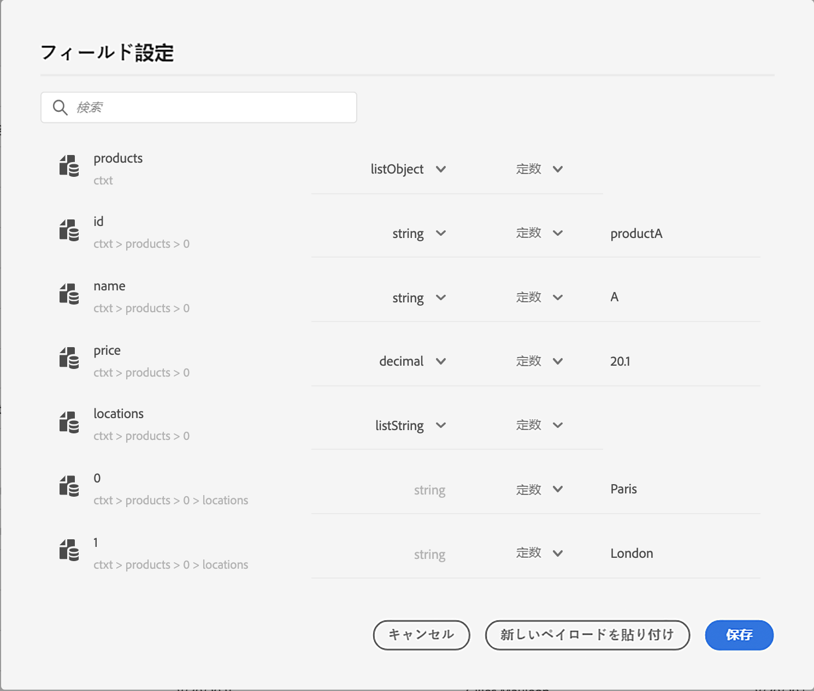
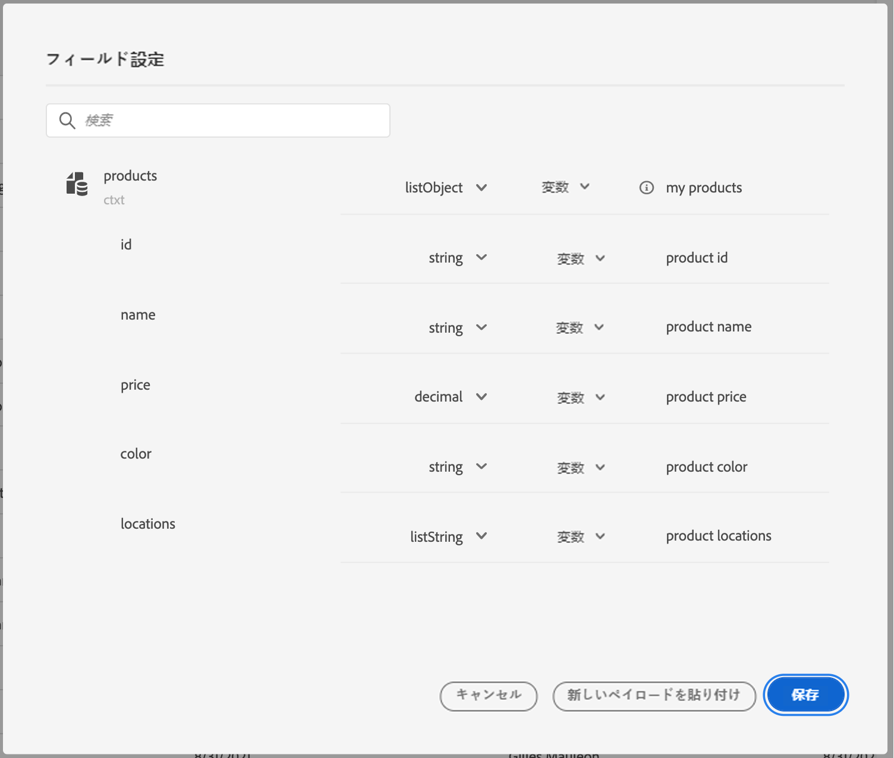
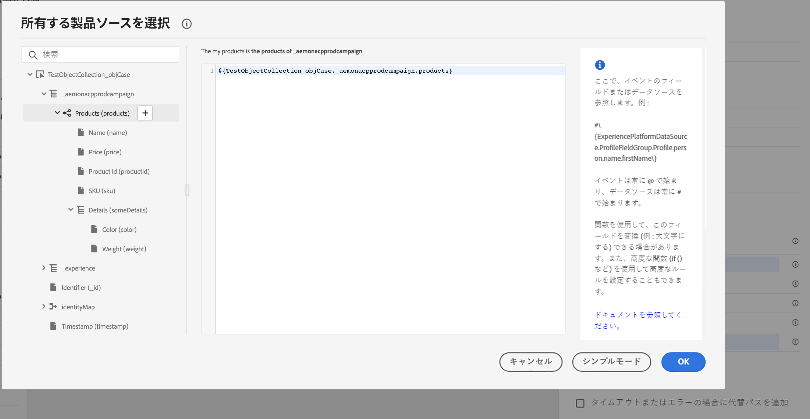
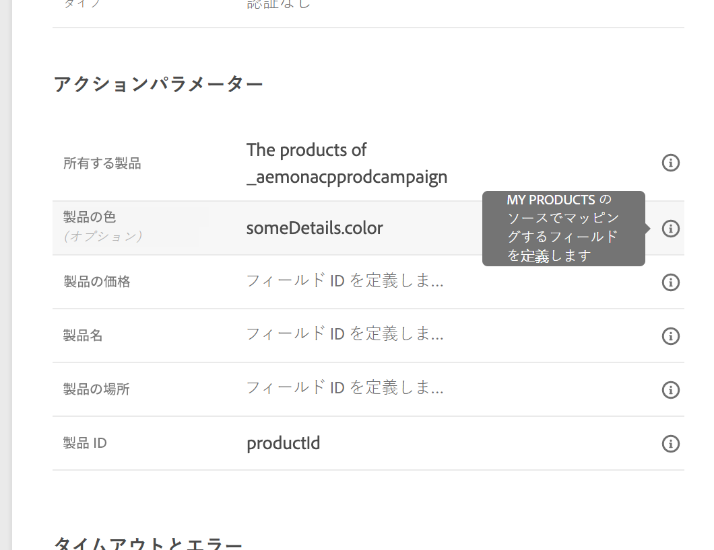
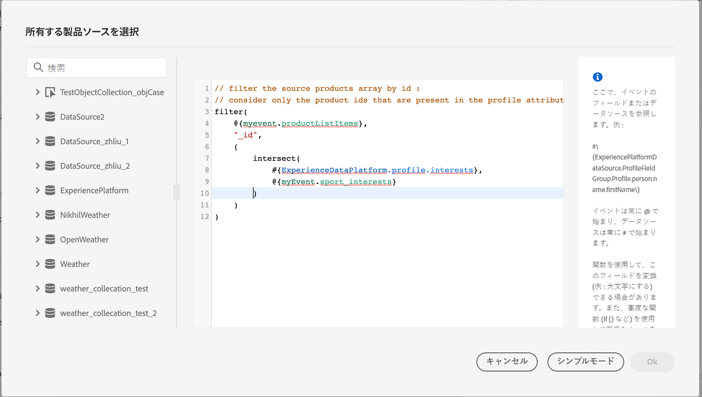
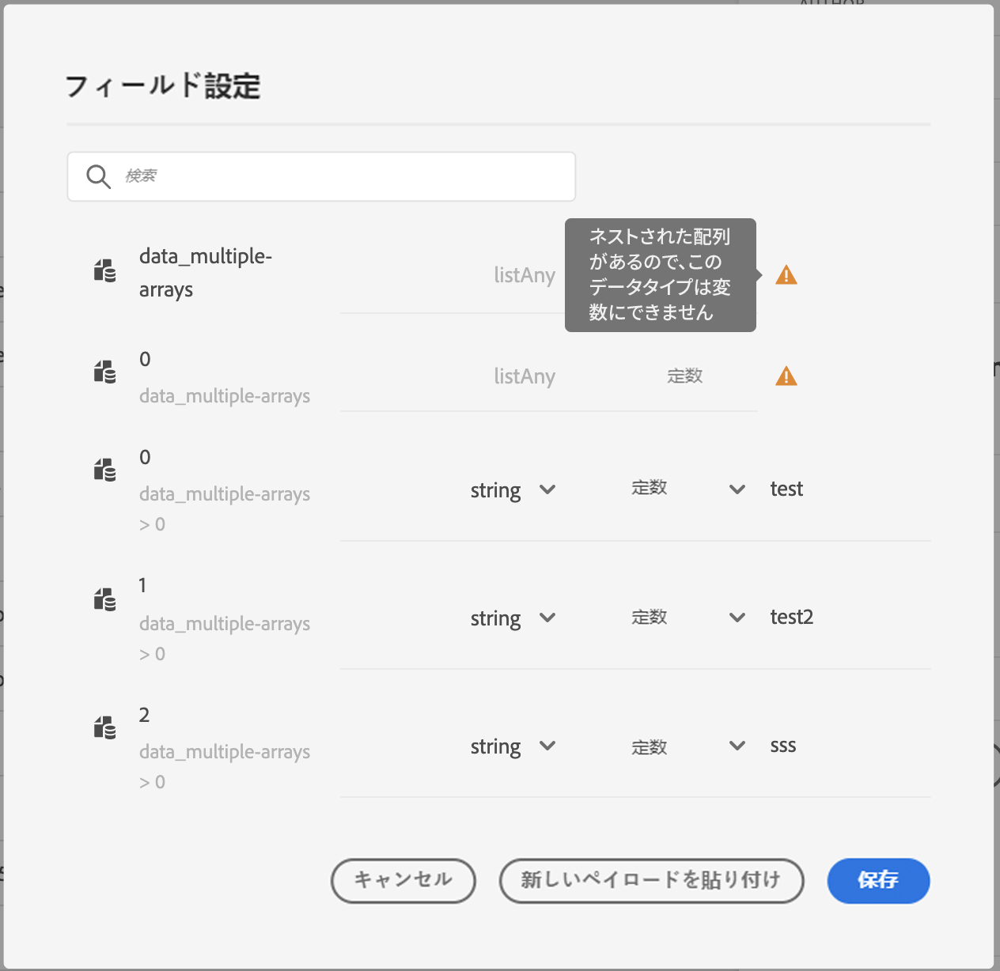

# カスタムアクションパラメーターへのコレクションの受け渡し {#passing-collection}

実行時に値が動的に設定されるカスタムアクションパラメーターにコレクションを渡すことができます。

次の 2 種類のコレクションがサポートされています。

* **単純なコレクション**

  文字列、数値、ブール値などの基本的な値のリストに対して単純なコレクションを使用します。 これらは、追加のプロパティを指定せずに項目のリストを渡すだけでよい場合に便利です。

  例えば、デバイスタイプのリストは次のようになります。

  ```json
  {
   "deviceTypes": [
       "android",
       "ios"
   ]
  }
  ```

* **オブジェクトコレクション**

  各項目に複数のフィールドまたはプロパティが含まれる場合は、オブジェクトコレクションを使用します。 これらは通常、製品の詳細、イベントレコード、項目属性などの構造化データを渡すために使用されます。

  例：

  ```json
  {
  "products":[
     {
        "id":"productA",
        "name":"A",
        "price":20.1
     },
     {
        "id":"productB",
        "name":"B",
        "price":10.0
     },
     {
        "id":"productC",
        "name":"C",
        "price":5.99
     }
   ]
  }
  ```

>[!NOTE]
>
>コレクション内のネストされた配列は、カスタムアクションリクエストペイロードでは部分的にのみサポートされます。 詳しくは、[ 制限事項 ](#limitations) を参照してください。

## 一般的な手順 {#general-procedure}

この節では、次の JSON ペイロードの例を使用します。 これは、単純なコレクションのフィールドを持つオブジェクトの配列です。

```json
{
  "ctxt": {
    "products": [
      {
        "id": "productA",
        "name": "A",
        "price": 20.1,
        "color":"blue",
        "locations": [
          "Paris",
          "London"
        ]
      },
      {
        "id": "productB",
        "name": "B",
        "price": 10.99
      }
    ]
  }
}
```

`products` は 2 つのオブジェクトの配列であることがわかります。 少なくとも 1 つのオブジェクトが必要です。

1. カスタムアクションを作成します。詳しくは、[このページ](../action/about-custom-action-configuration.md)を参照してください。

1. 「**[!UICONTROL アクションパラメーター]**」セクションに、JSON の例を貼り付けます。表示される構造は静的です。ペイロードを貼り付けたときに、すべてのフィールドが定数として定義されます。

   

1. 必要に応じて、フィールドタイプを調整します。コレクションでは、listString、listInteger、listDecimal、listBoolean、listDateTime、listDateTimeOnly、listDateOnly、listObject の各フィールドタイプがサポートされています。

   >[!NOTE]
   >
   >フィールドタイプは、ペイロードの例に従って自動的に推測されます。

1. オブジェクトを動的に渡す場合は、変数として設定する必要があります。この例では、変数として `products` を設定します。 オブジェクトに含まれているすべてのオブジェクトフィールドは、変数に自動的に設定されます。

   >[!NOTE]
   >
   >サンプルペイロードの最初のオブジェクトは、フィールドの定義に使用されます。

1. フィールドごとに、ジャーニーキャンバスに表示されるラベルを定義します。

   {width="70%" align="left"}

1. ジャーニーを作成し、作成したカスタムアクションを追加します。詳しくは、[このページ](../building-journeys/using-custom-actions.md)を参照してください。

1. 「**[!UICONTROL アクションパラメーター]**」セクションで、高度な式エディターを使用して配列パラメーター（この例では `products`）を定義します。

   

1. 次のオブジェクトフィールドごとに、ソース XDM スキーマ内の対応するフィールド名を入力します。名前が同じ場合は、この操作は不要です。この例では、「`product id`」と「color」のみを定義する必要があります。

   {width="50%" align="left"}

配列フィールドの場合は、高度な式エディターを使用してデータ操作を実行することもできます。次の例では、[filter](functions/list-functions.md#filter) 関数と [intersect](functions/list-functions.md#intersect) 関数を使用しています。



## 制限および制約事項 {#limitations}

カスタムアクションのコレクションでは、動的データを柔軟に渡すことができますが、注意が必要な構造上の制約もあります。

* **カスタムアクションでのネストされた配列のサポート**

  Adobe Journey Optimizerでは、カスタムアクション内のオブジェクトのネストされた配列 **レスポンスペイロード** をサポートしていますが、このサポートは **リクエストペイロード** では制限されています。

  リクエストペイロードでは、カスタムアクション設定で定義されているように、ネストされた配列に一定数の項目が含まれている場合にのみサポートされます。 例えば、ネストされた配列に常に 3 つの項目が含まれる場合は、定数として設定できます。 項目数を動的にする必要がある場合は、ネストされていない配列（下部レベルの配列）のみを変数として定義できます。

  例：

   1. 次の例は、**サポートされていないユースケース** を示しています。

      この例では、products 配列に、動的な項目数を持つネストされた配列（`locations`）が含まれています。これはリクエストペイロードではサポートされていません。

      ```json
      {
      "products": [
         {
            "id": "productA",
            "name": "A",
            "price": 20,
            "locations": [
            { "name": "Paris" },
            { "name": "London" }
            ]
         }
      ]
      }
      ```

   2. 定数として定義された固定項目でサポートされる例。

      この場合、ネストされた場所は固定フィールド（`location1`、`location2`）に置き換えられ、ペイロードはサポートされる設定内で有効なままになります。

      ```json
      {
      "products": [
         {
            "id": "productA",
            "name": "A",
            "price": 20,
            "location1": { "name": "Paris" },
            "location2": { "name": "London" }
         }
      ]
      }
      ```


* **コレクションのテスト**：テストモードを使用してコレクションをテストするには、コードビューモードを使用する必要があります。 コードビューモードは、ビジネスイベントではサポートされていないので、その場合は、1 つの要素を含むコレクションのみを送信できます。


## 特殊な例{#examples}

異種混在タイプと配列の配列の場合、配列は listAny タイプで定義されます。個々の項目のみをマッピングできますが、配列を変数に変更することはできません。

{width="70%" align="left"}

異種混在タイプの例：

```json
{
    "data_mixed-types": [
        "test",
        "test2",
        null,
        0
    ]
}
```

配列の配列の例：

```json
{
    "data_multiple-arrays": [
        [
            "test",
            "test1",
            "test2"
        ]
    ]
}
```

## その他のリソース

カスタムアクションの設定、使用、トラブルシューティングについて詳しくは、以下の節を参照してください。

* [ カスタムアクションの概要 ](../action/action.md) - カスタムアクションの概要と、カスタムアクションがサードパーティシステムへの接続にどのように役立つかを説明します
* [ カスタムアクションの設定 ](../action/about-custom-action-configuration.md) - カスタムアクションの作成および設定方法を説明します
* [ カスタムアクションの使用 ](../building-journeys/using-custom-actions.md) - ジャーニーでのカスタムアクションの使用方法を説明します
* [ カスタムアクションのトラブルシューティング ](../action/troubleshoot-custom-action.md) - カスタムアクションのトラブルシューティング方法を説明します。

