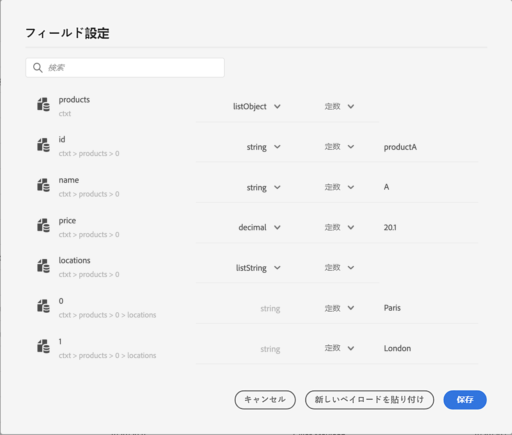
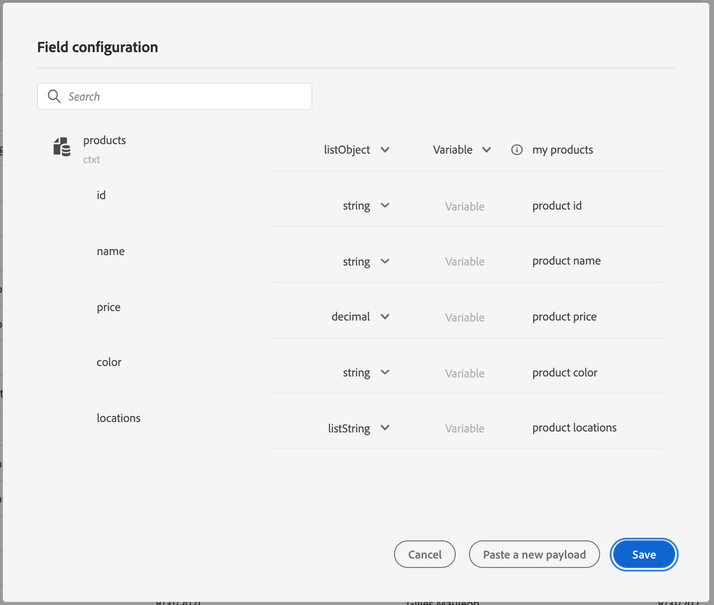
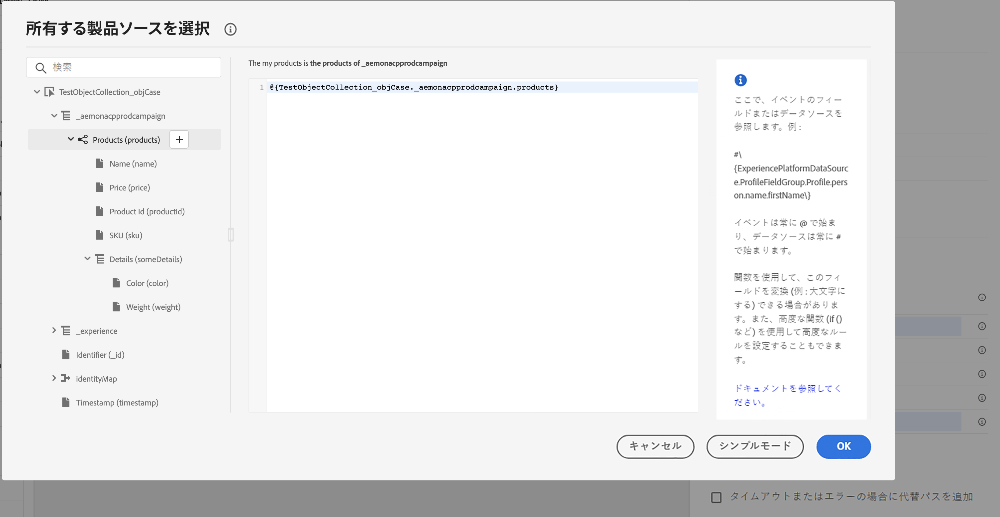
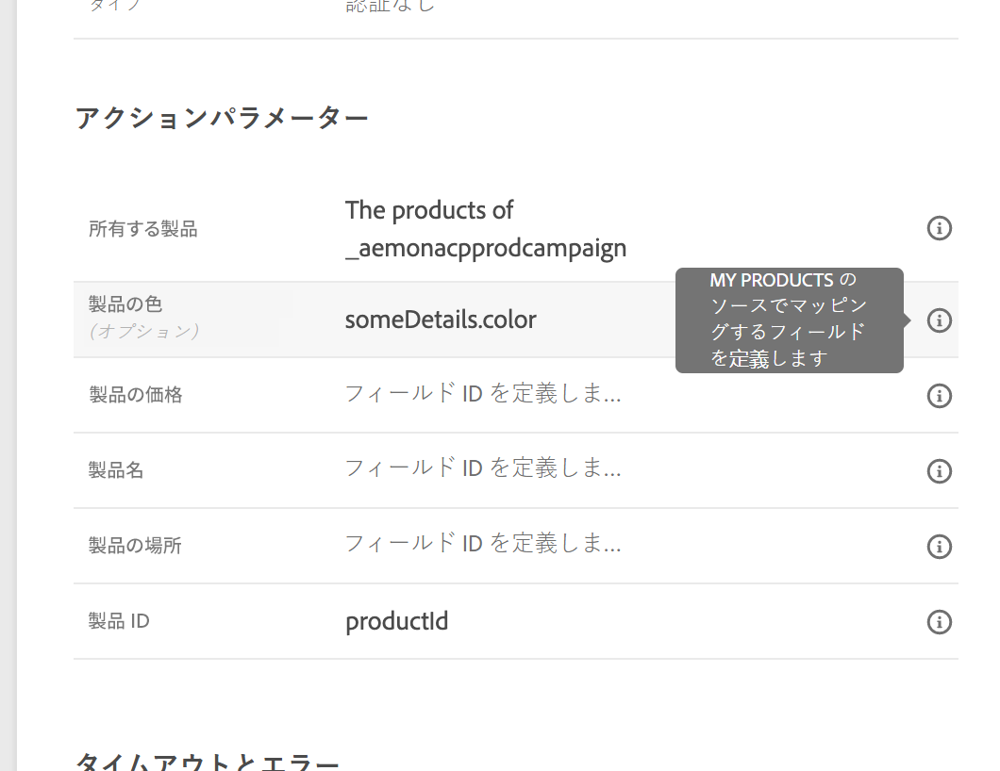
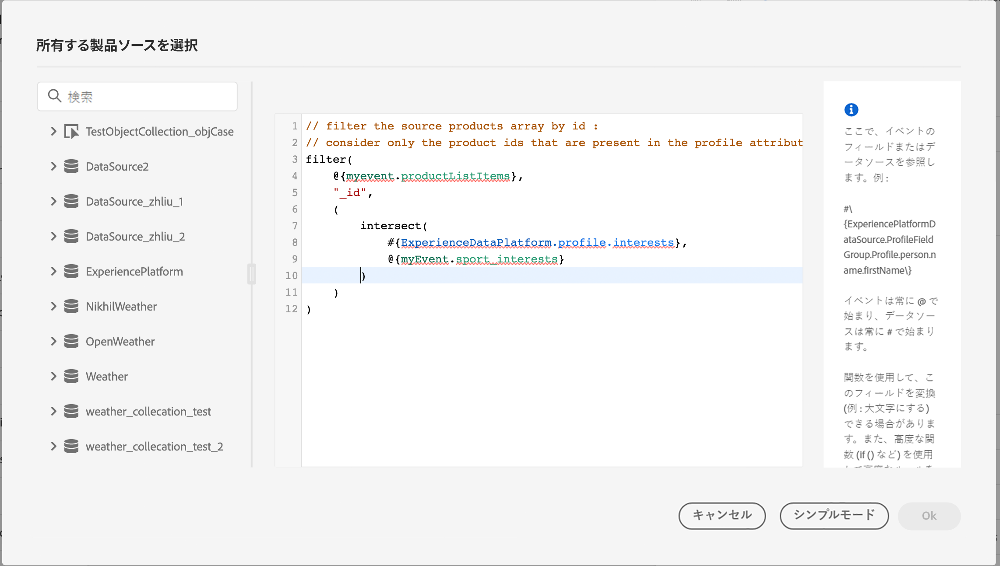
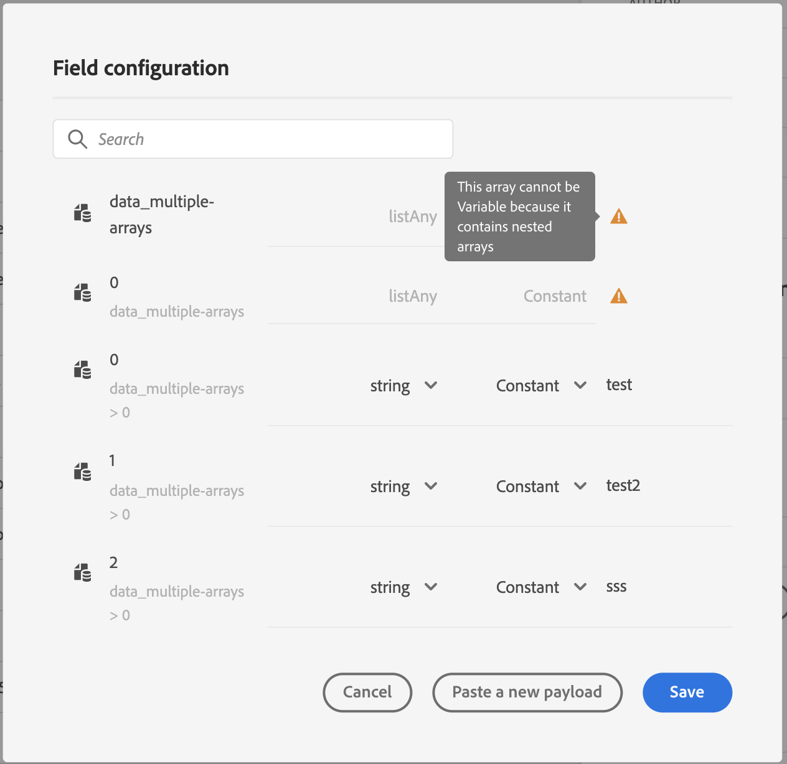

# カスタムアクションパラメーターへのコレクションの受け渡し {#passing-collection}

>[!BEGINSHADEBOX]

**このページ：**&#x200B;実行時に動的に入力されるように、シンプル コレクションとオブジェクト コレクションをカスタム アクション パラメーターに渡す方法を説明します。

>[!ENDSHADEBOX]

実行時に値が動的に入力されるコレクションをカスタムアクションパラメーターに渡すことができます。

次の 2 つのタイプのコレクションがサポートされています。

* **シンプルなコレクション**

  文字列、数値、ブール値などの基本的な値のリストには、シンプルなコレクションを使用します。 これらは、追加のプロパティなしで項目のリストのみを渡す必要がある場合に役立ちます。

  例えば、デバイスタイプのリストは次のようになります。

  ```json
  {
   "deviceTypes": [
       "android",
       "ios"
   ]
  }
  ```

* **オブジェクトコレクション**

  各項目に複数のフィールドやプロパティが含まれている場合は、オブジェクトコレクションを使用します。 これらは通常、製品の詳細、イベントレコード、項目属性などの構造化データを渡すために使用されます。

  次に例を示します。

  ```json
  {
  "products":[
     {
        "id":"productA",
        "name":"A",
        "price":20.1
     },
     {
        "id":"productB",
        "name":"B",
        "price":10.0
     },
     {
        "id":"productC",
        "name":"C",
        "price":5.99
     }
   ]
  }
  ```

>[!NOTE]
>
>コレクション内のネストされた配列は、カスタムアクションリクエストペイロードでは部分的にのみサポートされます。 詳しくは、[制限事項](#limitations)を参照してください。

## 一般的な手順 {#general-procedure}

この節では、次の JSON ペイロードの例を使用します。 これは、単純なコレクションのフィールドを持つオブジェクトの配列です。

```json
{
  "ctxt": {
    "products": [
      {
        "id": "productA",
        "name": "A",
        "price": 20.1,
        "color":"blue",
        "locations": [
          "Paris",
          "London"
        ]
      },
      {
        "id": "productB",
        "name": "B",
        "price": 10.99
      }
    ]
  }
}
```

`products` は 2 つのオブジェクトの配列であることがわかります。 少なくとも 1 つのオブジェクトが必要です。

1. カスタムアクションを作成します。 詳しくは、[このページ](../action/about-custom-action-configuration.md)を参照してください。

1. 「**[!UICONTROL アクションパラメーター]**」セクションに、JSON の例を貼り付けます。 表示される構造は静的です。ペイロードを貼り付けたときに、すべてのフィールドが定数として定義されます。

   

1. 必要に応じて、フィールドタイプを調整します。 コレクションでは、listString、listInteger、listDecimal、listBoolean、listDateTime、listDateTimeOnly、listDateOnly、listObject の各フィールドタイプがサポートされています。

   >[!NOTE]
   >
   >フィールドタイプは、ペイロードの例に従って自動的に推測されます。

1. オブジェクトを動的に渡す場合は、変数として設定する必要があります。 この例では、`products` を変数として設定します。 オブジェクトに含まれているすべてのオブジェクトフィールドは、変数に自動的に設定されます。

   >[!NOTE]
   >
   >サンプルペイロードの最初のオブジェクトは、フィールドの定義に使用されます。

1. フィールドごとに、ジャーニーキャンバスに表示されるラベルを定義します。

   {width="70%"}

1. ジャーニーを作成し、作成したカスタムアクションを追加します。 詳しくは、[このページ](../building-journeys/using-custom-actions.md)を参照してください。

1. 「**[!UICONTROL アクションパラメーター]**」セクションで、高度な式エディターを使用して配列パラメーター（この例では `products`）を定義します。

   

1. 次のオブジェクトフィールドごとに、ソース XDM スキーマ内の対応するフィールド名を入力します。 名前が同じ場合は、この操作は不要です。 この例では、`product id` と「color」のみを定義する必要があります。

   {width="50%"}

配列フィールドの場合は、高度な式エディターを使用してデータ操作を実行することもできます。 次の例では、[filter](functions/list-functions.md#filter) 関数と [intersect](functions/list-functions.md#intersect) 関数を使用しています。



## 制限事項 {#limitations}

カスタムアクションのコレクションは動的データを渡すための柔軟性を提供しますが、注意すべき特定の構造上の制約があります。

* **カスタムアクションでのネストされた配列のサポート**

  [!DNL Adobe Journey Optimizer]は、カスタムアクション **応答ペイロード**&#x200B;のオブジェクトのネストされた配列をサポートしていますが、このサポートは&#x200B;**要求ペイロード**&#x200B;に制限されています。

  リクエストペイロードでは、ネストされた配列は、カスタムアクション設定で定義されているように、固定数の項目が含まれている場合にのみサポートされます。 例えば、ネストされた配列に常に 3 つの項目が含まれる場合は、定数として設定できます。 項目の数を動的にする必要がある場合、ネストされていない配列（下部レベルの配列）のみを変数として定義できます。

  例：

   1. 次の例は、**サポートされていないユースケース**&#x200B;を示しています。

      この例では、products 配列に、動的な項目数を持つネストされた配列（`locations`）が含まれていますが、これはリクエストペイロードではサポートされていません。

      ```json
      {
      "products": [
         {
            "id": "productA",
            "name": "A",
            "price": 20,
            "locations": [
            { "name": "Paris" },
            { "name": "London" }
            ]
         }
      ]
      }
      ```

   2. 定数として定義された固定項目でサポートされる例。

      この場合、ネストされた場所は固定フィールド（`location1`、`location2`）に置き換えられ、サポートされる設定内でペイロードを有効なままにすることができます。

      ```json
      {
      "products": [
         {
            "id": "productA",
            "name": "A",
            "price": 20,
            "location1": { "name": "Paris" },
            "location2": { "name": "London" }
         }
      ]
      }
      ```


* **コレクションのテスト**：テストモードを使用してコレクションをテストするには、コードビューモードを使用する必要があります。 コードビューモードはビジネスイベントではサポートされていないので、その場合は 1 つの要素を含むコレクションのみを送信できます。


## 特殊な例{#examples}

異種混在タイプと配列の配列の場合、配列は listAny タイプで定義されます。 個々の項目のみをマッピングできますが、配列を変数に変更することはできません。

{width="70%"}

異種混在タイプの例：

```json
{
    "data_mixed-types": [
        "test",
        "test2",
        null,
        0
    ]
}
```

配列の配列の例：

```json
{
    "data_multiple-arrays": [
        [
            "test",
            "test1",
            "test2"
        ]
    ]
}
```

## その他のリソース

カスタムアクションの設定、使用、トラブルシューティングについて詳しくは、以下の節を参照してください。

* [カスタムアクションの基本を学ぶ](../action/action.md) - カスタムアクションの概要と、サードパーティシステムへの接続に役立つ仕組みについて説明します。
* [カスタムアクションの設定](../action/about-custom-action-configuration.md) - カスタムアクションの作成および設定方法について説明します
* [カスタムアクションの使用](../building-journeys/using-custom-actions.md) - ジャーニーでのカスタムアクションの使用方法について説明します
* [カスタムアクションのトラブルシューティング](../action/troubleshoot-custom-action.md) - カスタムアクションのトラブルシューティング方法について説明します
* [ コンテキストデータの繰り返し](../personalization/iterate-contextual-data.md#arrays-in-journeys) - メッセージ式の配列を操作する方法と、ジャーニーパーソナライゼーションのカスタムアクション応答、イベントデータ、データセット参照を繰り返す方法について説明します

+++ AI ナレッジリファレンス

このセクションには、このトピックに関連する解釈、検索、質問への回答をサポートすることを目的とした構造化された知識が含まれています。

理解を深めるには、この情報をこのページのドキュメントと組み合わせる必要があります。 どちらのソースも単独で使用することを意図していません。このページでは、機能について説明しますが、この節では、用語、意図、適用可能性、および制約の曖昧さを解消するのに役立つ追加のコンテキストを提供します。

* **TL;DR:**&#x200B;このページでは、シンプルなコレクションとオブジェクトコレクションをJourney Optimizerのカスタムアクションパラメーターに動的に渡す方法について説明します。これには、サポートされているフィールドタイプ、設定手順、ネストされた配列に関する既知の制限などが含まれます。

**インテント：**
* コレクション（単純またはオブジェクト）を動的パラメーターとして受け入れるためのカスタムアクションの設定
* ジャーニーの構築時に、高度な式エディターで配列パラメーターを変数として定義します
* 式エディターで配列データを操作するには、フィルター関数と相互変換関数を適用します
* カスタムアクションリクエストペイロードのネストされた配列制限内での理解と作業
* ジャーニーテストモードでコードビューモードを使用してコレクションパラメーターをテストする

**用語集：**
* **単純なコレクション**：カスタムアクションパラメーター&#x200B;*（製品固有）*&#x200B;として渡された基本的なスカラー値（文字列、数値、ブール値）のリスト
* **オブジェクトコレクション**：複数のフィールドを持つ構造化オブジェクトのリストで、カスタムアクションパラメーター&#x200B;*（製品固有）*&#x200B;として渡されます
* **listObject**: オブジェクト *（製品固有）*&#x200B;の配列を表すためにカスタムアクション設定で使用されるフィールドタイプ
* **listAny**：項目が混在タイプ *（製品固有）*&#x200B;を持つ、異種混在の配列または配列に使用されるフィールドタイプ
* **変数（定数に対して）**: アクションパラメーター設定では、ジャーニーコンテキストから実行時に「変数」に設定されたフィールドが動的に入力されます。一方、「定数」は、設定時&#x200B;*（製品固有）*&#x200B;に設定された固定値です

**ガードレール：**
* リクエストペイロード内のネストされた配列は、固定数の項目（定数として定義）が含まれている場合にのみサポートされます。動的なネストされた配列はサポートされていません
* テストモードでコレクションをテストするには、コードビューモードが必要です。ビジネスイベントではコードビューはサポートされていないので、その場合は単一エレメントのコレクションのみを送信できます
* コレクションフィールドの定義に使用するペイロードの例には、少なくとも1つのオブジェクトが存在する必要があります
* ペイロードの例の最初のオブジェクトは、コレクション全体のフィールドを定義します

**用語：**
* 正規名：コレクション – 頭字語：なし – バリアント：配列、リスト、動的コレクション
* 同義語：「simple collection」 = 「スカラー値のリスト」 ; 「object collection」 = 「array of objects」
* 混同しないでください：&quot;listAny&quot; ≠ &quot;listObject&quot; （listAnyは異種またはネストされた配列を処理します。listObjectは構造化オブジェクトの均一な配列を処理します）

**FAQ:**
* **Q：単純なコレクションとオブジェクトのコレクションの違いは何ですか？**  – 単純なコレクションには基本的なスカラー値（文字列、数値、ブール値）が含まれ、オブジェクトコレクションには複数の名前付きフィールドを持つ構造化オブジェクトが含まれます。
* **Q：実行時にコレクションパラメーターを動的にするにはどうすればよいですか？** — カスタムアクションの「アクションパラメーター」セクションで、配列フィールドを「変数」に設定します。その後、その中のすべてのオブジェクトフィールドが自動的に変数に設定されます。
* **Q: カスタムアクションリクエストペイロードでネストされた配列はサポートされていますか？**  – 一部のみ。 固定された既知の項目数を持つネストされた配列は、定数として定義できます。 動的な項目数を持つネストされた配列は、リクエストペイロードではサポートされていません。
* **Q: ジャーニーテストモードでコレクションをテストするにはどうすればよいですか？** — テストインターフェイスでコードビューモードを使用します。 ビジネスイベントはコードビューをサポートしていないので、そのコンテキストでは単一エレメントのコレクションのみをテストできます。
* **Q: コレクションでサポートされているフィールドタイプは何ですか？** — listString、listInteger、listDecimal、listBoolean、listDateTime、listDateTimeOnly、listDateOnly、listObjectはすべてサポートされています。

+++
