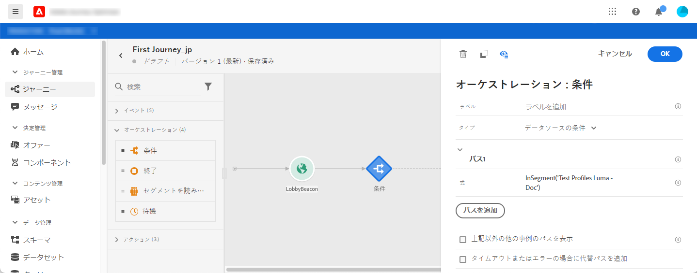
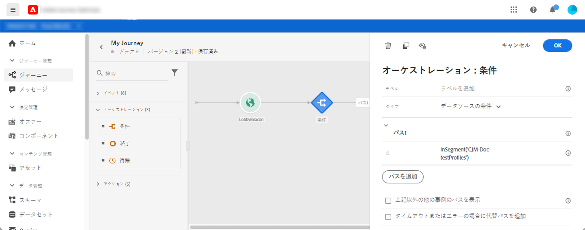
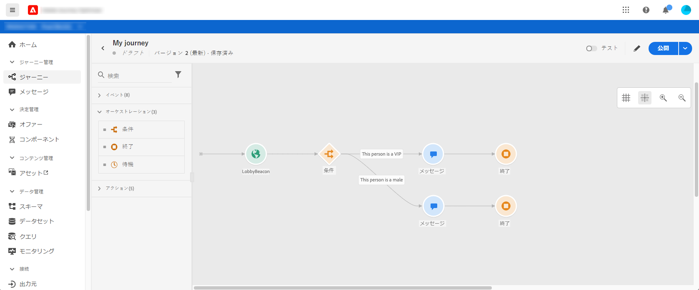
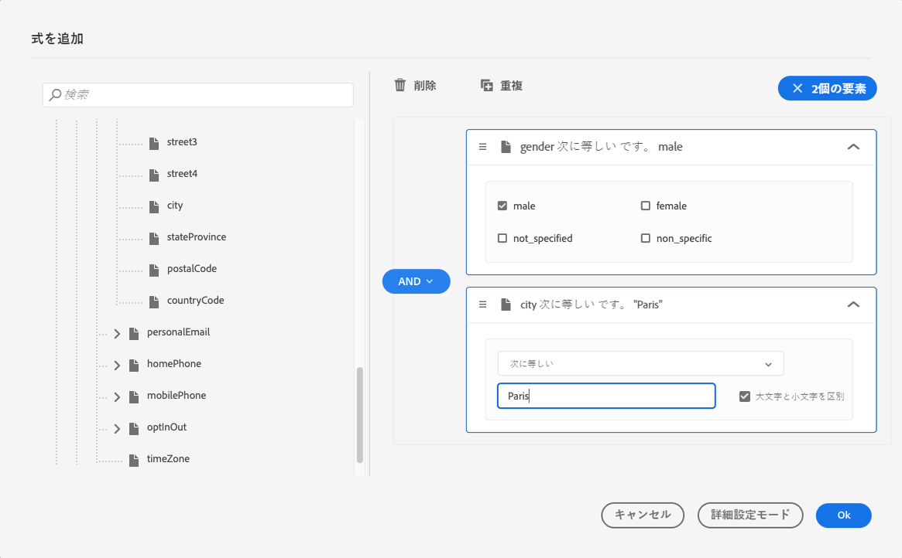
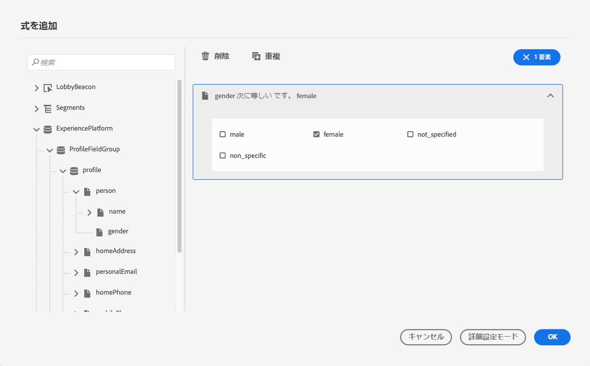
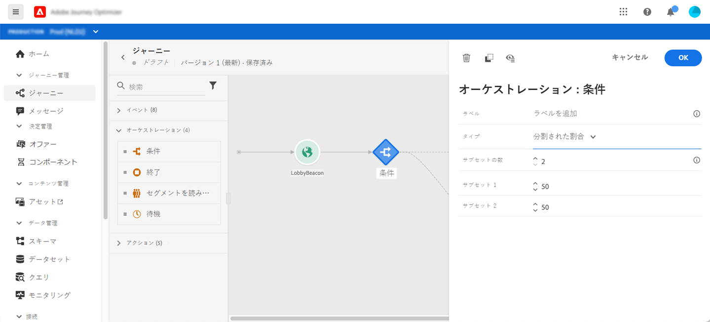
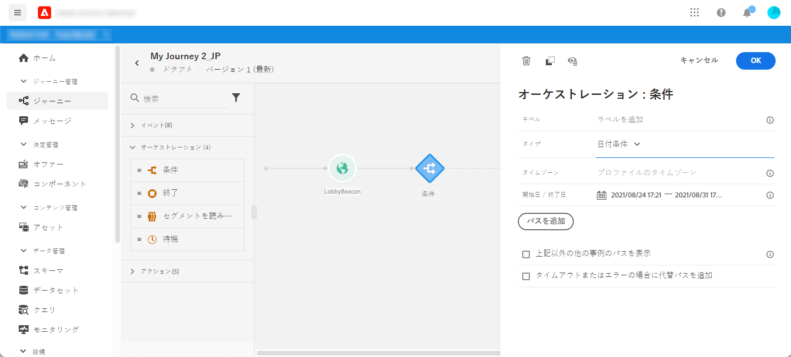
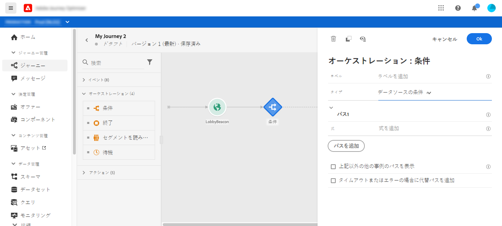
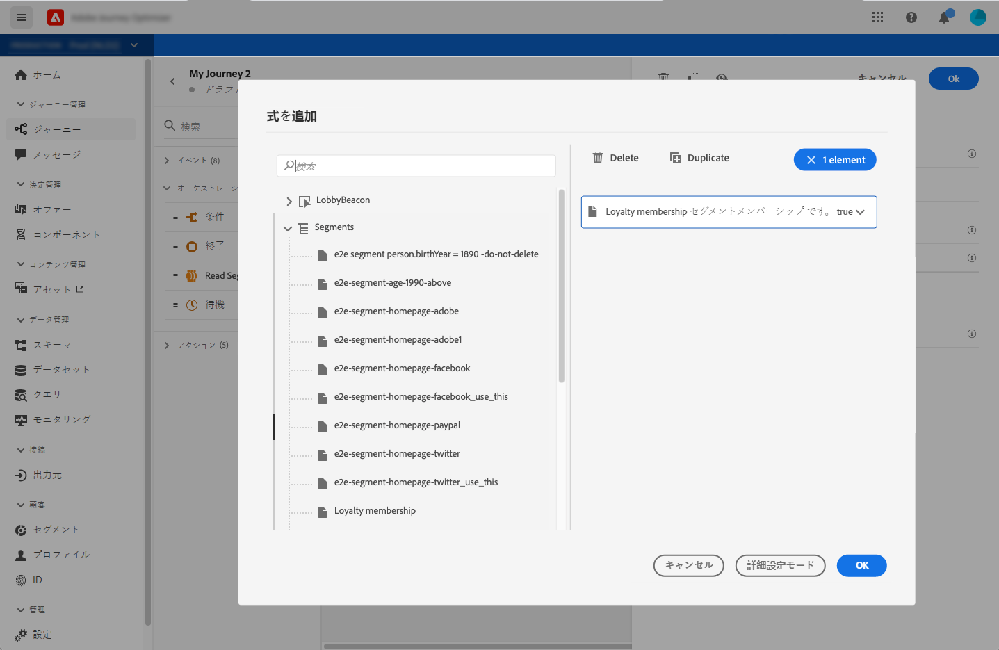

# 条件アクティビティ{#section_e2n_pft_dgb}

次の 4 種類の条件を使用できます。

* [データソースの条件](#data_source_condition)
* [時間条件](#time_condition)
* [パーセンテージ分割](#percentage_split)
* [日付条件](#date_condition)

## 条件アクティビティについて {#about_condition}

ジャーニーで複数の条件を使用する場合は、わかりやすくするために、各条件にラベルを定義できます。

複数の条件を定義する場合は、「は、**[!UICONTROL パスを追加]**」をクリックします。条件ごとに、キャンバスのアクティビティの後に新しいパスが追加されます。

ジャーニーの設計には、機能的な影響があることに注意してください。条件の後に複数のパスが定義された場合、最初の有効なパスのみが実行されます。つまり、パスを上下に配置することで、パスの優先順位を変更できます。

例えば、最初のパスの条件「この人物は VIP である」と2番目のパスの条件「この人物は男性である」を例にとってみましょう。両方の条件を満たす人 (VIPの男性 ) がこの手順を通過すると、最初のパスが「上」であるので、この人が 2 番目のパスにも該当する場合でも、最初のパスが選択されます。 この優先度を変更するには、アクティビティを別の垂直方向の順序に移動します。

定義された条件に該当しないオーディエンス向けに、別のパスを作成するには、「**[!UICONTROL 上記以外の事例のパスを表示]**」をオンにします。このオプションは、条件分岐では使用できません。[分割された割合](#percentage_split)を参照してください。

シンプルモードでは、フィールドの組み合わせに基づいて単純なクエリを実行できます。使用可能なすべてのフィールドが画面の左側に表示されます。フィールドをメインゾーンにドラッグ＆ドロップします。異なる要素を組み合わせるには、それらを相互に連動させて異なるグループやグループレベルを作成します。次に、論理演算子を選択して、同じレベルの要素を組み合わせることができます。

* AND：2 つの基準の積集合（共通部分）。すべて条件に一致する要素のみが考慮されます。
* OR：2つの基準の和集合。2 つの条件の少なくとも 1 つに一致する要素が考慮されます。

[Adobe Experience Platform Segmentation Service](https://experienceleague.adobe.com/docs/experience-platform/segmentation/home.html?lang=ja){target=&quot;_blank&quot;} を使用してセグメントを作成する場合は、それらのセグメントをジャーニー条件で利用できます。[条件でのセグメントの使用](../building-journeys/condition-activity.md#using-a-segment)を参照してください。

>[!NOTE]
>
>単純なエディターでは、時系列（購入のリスト、メッセージの過去のクリックなど）に対してクエリを実行できません。このためには、高度なエディターを使用する必要があります。[Adobe Journey Orchestration のドキュメント](https://experienceleague.adobe.com/docs/journeys/using/building-advanced-conditions-journeys/expressionadvanced.html?lang=ja){target=&quot;_blank&quot;}を参照してください。

アクションまたは条件でエラーが発生すると、個人のジャーニーが停止します。この処理を続行する唯一の方法は、「**[!UICONTROL タイムアウトまたはエラーの場合に代替パスを追加]**」チェックボックスにチェックを付けることです。[この節](../building-journeys/using-the-journey-designer.md#paths)を参照してください。

## データソースの条件 {#data_source_condition}

これにより、データソースのフィールドまたはジャーニー内で以前に配置されたイベントーに基づいて条件を定義できます。式エディターの使用方法については、[Adobe Journey Orchestration のドキュメント](https://experienceleague.adobe.com/docs/journeys/using/building-advanced-conditions-journeys/expressionadvanced.html){target=&quot;_blank&quot;}を参照してください。 高度な式エディターを使用すると、コレクションを操作する、またはパラメーターを渡す必要があるデータソースを使用する、より高度な条件を設定できます。[このページ](../datasource/external-data-sources.md)を参照してください。

## 時間条件{#time_condition}

これにより、時間帯や曜日に応じて異なるアクションを実行できます。例えば、日中に SMS メッセージを送信し、平日の夜にメールを送信するように指定できます。

>[!NOTE]
>
>タイムゾーンは条件に固有ではなくなり、ジャーニープロパティのジャーニーレベルで定義されるようになりました。[このページ](../building-journeys/timezone-management.md)を参照してください。

## パーセンテージ分割 {#percentage_split}

このオプションを使用すると、オーディエンスをランダムに分割して、グループごとに異なるアクションを定義できます。各パスの分割数と再分割数を定義します。分割計算は統計的なもので、システムはジャーニーのこのアクティビティに流れる人数を予測することはできません。その結果、分割の許容誤差は非常に小さくなります。この関数は、Java のランダムメカニズムに基づいています（この[ページ](https://docs.oracle.com/javase/7/docs/api/java/util/Random.html)を参照）。

テストモードでは、分割に達すると、常に上位の分岐が選択されます。 テストで別のパスを選択する場合は、分割された分岐の位置を再編成できます。[このページ](../building-journeys/testing-the-journey.md)を参照してください。

>[!NOTE]
>
>パーセンテージ条件分岐には、パスを追加するボタンはありません。パスの数は、分割数によって異なります。条件分岐では、他のケースではパスは発生しないので、パスを追加できません。ユーザーは常に、分割されたパスの 1 つに入ります。

## 日付条件 {#date_condition}

これにより、日付に基づいて異なるフローを定義できます。例えば、「セール」の期間中にステップにエントリしたユーザーには、特定のメッセージが送信されます。残りの期間には、別のメッセージを送信します。

>[!NOTE]
>
>タイムゾーンは条件に固有ではなくなり、ジャーニープロパティのジャーニーレベルで定義されるようになりました。[このページ](../building-journeys/timezone-management.md)を参照してください。

## 条件でのセグメントの使用 {#using-a-segment}

この節では、ジャーニー条件でセグメントを使用する方法について説明します。セグメントとその構築方法について詳しくは、[この節](../segment/about-segments.md)を参照してください。

ジャーニー条件でセグメントを使用するには、次の手順に従います。

1. ジャーニーを開いて&#x200B;**[!UICONTROL 条件]**&#x200B;アクティビティをドロップし、「**データソース条件**」を選択します。
   

1. 必要な追加パスごとに「**[!UICONTROL パスを追加]**」をクリックします。各パスに対して「**[!UICONTROL 式]**」フィールドをクリックします。

   

1. 左側で、**[!UICONTROL セグメント]**&#x200B;ノードを展開します。条件に使用するセグメントをドラッグ＆ドロップします。デフォルトでは、セグメントの条件は true です。

   

   >[!NOTE]
   >
   >セグメントの参加ステータスが「**実現**」および「**既存**」の個人のみが、セグメントのメンバーと見なされます。セグメントの評価方法について詳しくは、[Segmentation Service のドキュメント](https://experienceleague.adobe.com/docs/experience-platform/segmentation/tutorials/evaluate-a-segment.html?lang=ja#interpret-segment-results)を参照してください。
