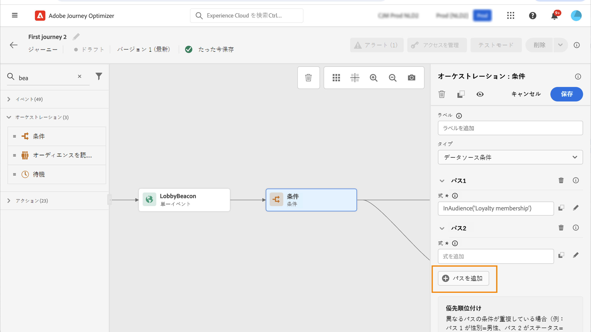

# Condition アクティビティ{#condition-activity}

>[!CONTEXTUALHELP]
>id="ajo_journey_condition"
>title="Condition アクティビティ"
>abstract="このアクティビティにより、各ユーザーが旅にどのように流れますかを定義することができます。 様々な criterias に基づいて、いくつかのパスが作成されます。 また、タイムアウトまたはエラーが発生したときに代替パスを作成することもできます。"

このような条件には、次の種類があります。

* [データソース条件](#data_source_condition)
* [時刻条件](#time_condition)
* [分割率](#percentage_split)
* [日付条件](#date_condition)
* [プロファイルキャップ](#profile_cap)

## Condition アクティビティについて {#about_condition}

>[!CONTEXTUALHELP]
>id="ajo_journey_expression_simple"
>title="単純なエクスプレッションエディターについて"
>abstract="単純な式エディターモードを使用すると、フィールドの組み合わせに基づいて単純なクエリーを実行できます。 使用可能なすべてのフィールドが画面の左側に表示されます。 フィールドをメインゾーンにドラッグ &amp; ドロップします。 異なるグループまたはグループレベルを作成するために、複数のエレメントを組み合わせるには、これらのエレメントを互いにインターロックします。 その後、論理演算子を選択して、同じレベルのエレメントを組み合わせることができます。"

1つの過程で複数の条件を使用するときには、それぞれのラベルを定義することにより、より簡単に識別できるようにすることができます。

複数の条件を定義するには、このボタンをクリックし **[!UICONTROL Add a path]** ます。 各条件に対して、キャンバスに新しいパスが追加されます。

Journeys のデザインには機能上の影響があることに注意してください。 条件の後に複数のパスが定義されている場合は、最初に対象となるパスだけが実行されます。 これにより、軌跡を上下に配置して、パスの優先度を変えることができます。

例えば、1つのパスの状態「人物は VIP である」と、もう1つは、「人物は男性」を入力するという状態になります。 このステップは、2つの条件 (1 番は1つの VIP) との間で両方の条件が満たされている場合に、第1のパスが選択されている場合でも、2番目のパスが「上」にあるため、最初のパスが選択されます。 この優先度を変更するには、アクティビティを別の垂直方向に移動します。

確認 **[!UICONTROL Show path for other cases than the one(s) above]** によって、定義された条件に適合しない対象ユーザーに対して別のパスを作成することができます。 このオプションは、分割条件では使用できません。 「分割 ](#percentage_split) 率」を参照して [ ください。

Simple モードでは、フィールドの組み合わせに基づいて単純なクエリーを実行することができます。 使用可能なすべてのフィールドが画面の左側に表示されます。 フィールドをメインゾーンにドラッグ &amp; ドロップします。 異なるグループまたはグループレベルを作成するために、複数のエレメントを組み合わせるには、これらのエレメントを互いにインターロックします。 次に、同じレベルのエレメントを組み合わせる論理演算子を選択できます。

* AND: 2 つの条件の積。 すべての条件に一致するエレメントのみが考慮されます。
* または、2つの条件の和。 2つの基準のうち少なくとも1つに一致するエレメントが考慮されます。

Adobe エクスペリエンス Platform セグメンテーションサービス ](https://experienceleague.adobe.com/docs/experience-platform/segmentation/home.html) を使用して [ いる場合は、セグメントを作成するために、_blank 移動状態で利用できます。「セグメントを使用した条件 ](../building-journeys/condition-activity.md#using-a-segment) 」を [ 参照してください。

>[!NOTE]
>
>タイムシリーズでは、単純なエディターを使用して、例えば購入リストのようなクエリーを実行することはできません。 そのためには、高度なエディターを使用する必要があります。 このページ ](expression/expressionadvanced.md) を参照してください [ 。

1つのアクションまたは条件でエラーが発生した場合、個々の個別の旅は停止します。 続行するには、チェックボックス **[!UICONTROL Add an alternative path in case of a timeout or an error]** をオンにする必要があります。 この項 ](../building-journeys/using-the-journey-designer.md#paths) を参照してください [ 。

単純なエディターには、「イベント」および「データソース」カテゴリーの下の「旅のプロパティ」カテゴリーも表示されます。 このカテゴリには、特定のプロファイルの旅に関する技術フィールドが含まれています。 これは、システムによって取得される情報 (journeys または発生した具体的なエラーなど) です。 [詳細情報](expression/journey-properties.md)

## データソース条件 {#data_source_condition}

これにより、データソースのフィールド、または前に移動していたイベントに基づいて条件を定義することができます。 この節 ](expression/expressionadvanced.md) で [ は、式エディターを使用する方法について説明します。

高度な式エディターを使用すると、コレクションの操作を実行したり、パラメーターの受け渡しが必要なデータソースを使用したりすることができます。 [詳しく ](../datasource/external-data-sources.md) は、こちらを参照してください。

## 時刻条件{#time_condition}

これにより、日、時刻、または曜日に応じて、異なるアクションを実行することができます。 例えば、夜間に夜に、日中に、夜に電子メールを送信することができます。

>[!NOTE]
>
>このタイムゾーンは、条件に固有のものではなく、旅のプロパティの旅レベルで定義されています。 このページ ](../building-journeys/timezone-management.md) を [ 参照してください。

次の3つのタイムフィルタリングオプションが使用できます。

* Hour: 時刻に基づいて条件を設定することができます。 次に、開始時刻と終了時刻を定義します。 各ユーザーは、指定された時間帯にのみパスを入力します。
* 曜日: 曜日に基づいて条件を設定することができます。 次に、各ユーザーがパスを入力する日付を選択します。
* 曜日と時刻の設定: このオプションは、最初の2つのオプションを組み合わせたものです。

## 分割率 {#percentage_split}

このオプションを使用すると、ユーザーをランダムに分割し、グループごとに異なるアクションを定義することができます。 分割の回数と各パスのパーティションの再設定を定義します。 Split 計算は、システムがこの過程でフローする人数を予測できないので、統計的情報になります。 その結果、スプリットによってエラーの余白が非常に小さくなります。 この関数は、Java のランダムなメカニズムをベースにしています (こ [ のページ ](https://docs.oracle.com/javase/7/docs/api/java/util/Random.html) を参照してください)。

テストモードでは、スプリットに達したときに、一番上のブランチが常に選択されます。 別のパスを選択してテストする場合は、分岐の位置を変更することができます。 このページを [ 参照してください。](../building-journeys/testing-the-journey.md)

>[!NOTE]
>
>Split 条件には、パスを追加するためのボタンがないことに注意してください。 パスの数は、分割の回数によって異なります。 スプリット条件においては、それが発生しない限り、他のケースのパスを追加することはできません。 他の人物は、常に分割パスのいずれかに移動します。

## 日付条件 {#date_condition}

これにより、日付に基づいて別のフローを定義することができます。 例えば、「販売」期間中に担当者がステップを入力した場合は、特定のメッセージを送信します。 その他の年は、別のメッセージを送信します。

>[!NOTE]
>
>このタイムゾーンは、条件に固有のものではないので、旅レベルでは旅のプロパティに定義されるようになりました。 このページ ](../building-journeys/timezone-management.md) を参照してください [ 。

## プロファイルキャップ {#profile_cap}

この条件タイプを使用して、旅のパスに最大数のプロファイルを設定します。 この制限に達した場合は、入力プロファイルによって代替パスが採用されます。 これにより、journeys が定義された制限値を超えないようにします。

>[!NOTE]
>
>高価値のプロファイルキャップを定義することをお勧めします。 人口が増加すると、その精度は、母集団が正確な数値に達したときにのみ適用されます。 数が少ない場合 (50 など)、プロファイルが代替パスを受け取る前に、その上限に達していないことがあります。

この条件タイプを使用して、送信物の量を増加させることができます。 この [ ような使用例 ](ramp-up-deliveries-uc.md) を参照してください。

初期設定では、「1000」に設定されています。

このカウンターは、選択したバージョンの旅にのみ適用されます。 カウンターは、1か月後にゼロにリセットされます。 リセット後、入力プロファイルは、カウンター制限に到達するまで、公称パスを取得します。

「基準パス」は、旅キャンバス上の基準パスより上に移動した場合でも、代替パスより常に優先されます。

ライブ journeys については、次のようなしきい値によって制限に達していることが確認されます。

* 1万より大きい cap については、注入される個別のプロファイル数は、少なくともキャップの1.3 倍でなければなりません。
* 1万未満の cap については、注入される個別のプロファイルの数は、1000にキャップが付いている必要があります。

テストモードでは、Profile cap は考慮されません。

## 条件でのセグメントの使用 {#using-a-segment}

この節では、1つのセグメントを順番に使用する方法について説明します。 セグメントとその構築方法について詳しくは、ここ ](../segment/about-segments.md) を [ 参照してください。

1つのセグメントを次のように使用するには、以下の手順を実行します。

1. 旅を開き、アクティビティを **[!UICONTROL Condition]** ドロップして、「データソース」条件 **を選択** します。
   

1. 各追加パスをクリックし **[!UICONTROL Add a path]** ます。 各パスについて、フィールドをクリック **[!UICONTROL Expression]** します。

   

1. ノードの左側 **[!UICONTROL Segments]** に展開します。 条件として使用するセグメントをドラッグ &amp; ドロップします。 デフォルトでは、セグメントの条件は true に設定されています。

   

   >[!NOTE]
   >
   >セグメントに参加していることを確認し **** ている個人 **** のみが、セグメントのメンバーとみなされます。セグメントを検証する方法について詳しくは、セグメンテーションサービスの [ マニュアル ](https://experienceleague.adobe.com/docs/experience-platform/segmentation/tutorials/evaluate-a-segment.html#interpret-segment-results) を参照してください {target = &quot;_blank&quot;} を参照してください。
