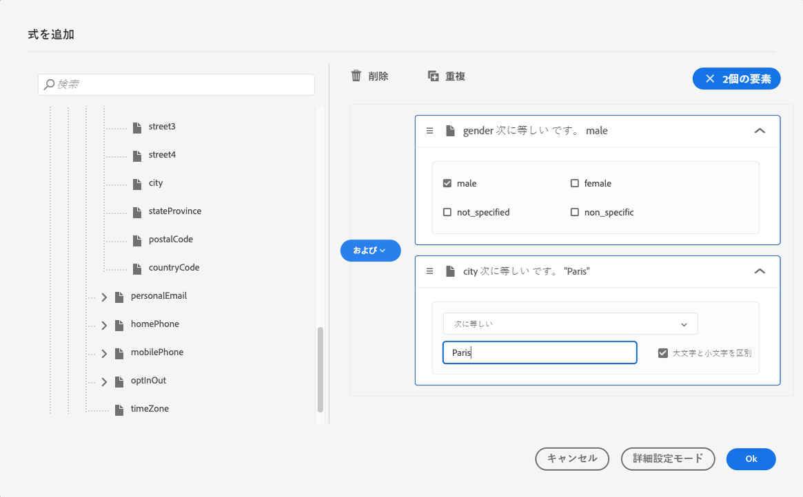
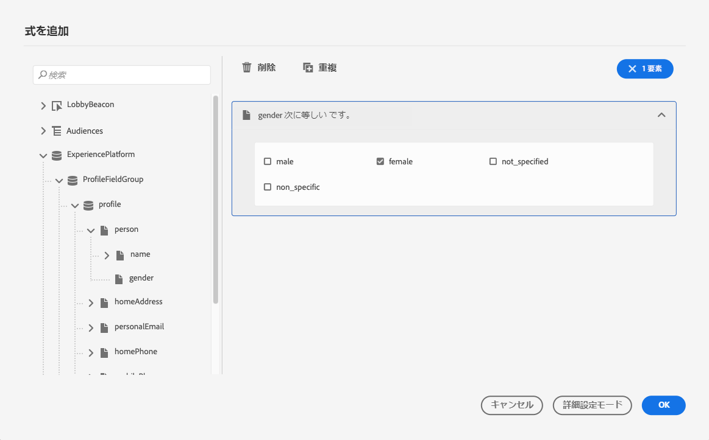

# 条件 {#conditions}

>[!CONTEXTUALHELP]
>id="ajo_journey_conditions"
>title="条件"
>abstract="条件を使用すると、特定の条件に基づいて複数のパスを作成することで、個人がジャーニーをどのように進めるかを定義できます。また、タイムアウトやエラーを処理するための代替パスを設定して、シームレスなエクスペリエンスを確保することもできます。"

**条件**&#x200B;を使用すると、特定の条件に基づいて複数のパスを作成することで、個人がジャーニーをどのように進めるかを定義できます。また、タイムアウトやエラーを処理するための代替パスを設定して、シームレスなエクスペリエンスを確保することもできます。

>[!AVAILABILITY]
>
>これらの条件は、限定提供でオンデマンドでアクセスできる&#x200B;**最適化**&#x200B;アクティビティを通じて使用できます。アクセス権を取得するには、アドビ担当者にお問い合わせください。
>
>この処理能力へのアクセス権がない場合は、従来の[条件アクティビティ](condition-activity.md)を引き続き使用できます。

## 条件の追加 {#add-condition-activity}

ジャーニーに条件を追加するには、次の手順に従います。

1. **[!UICONTROL 最適化]**&#x200B;アクティビティをジャーニーキャンバスにドロップします。[詳細情報](optimize.md)

1. レポートモードとテストモードのログでアクティビティを識別する、オプションのラベルを追加します。

1. **[!UICONTROL メソッド]**&#x200B;ドロップダウンリストから条件を選択します。

   {width=80%}

   使用可能な条件のタイプは次のとおりです。

   * [データソースの条件](#data_source_condition)
   * [時間条件](#time_condition)
   * [パーセンテージ分割](#percentage_split)
   * [日付条件](#date_condition)
   * [プロファイルキャップ](#profile_cap)
   * ジャーニー条件でオーディエンスを使用することもできます。[詳細情報](#using-a-segment)

## 条件のパスの管理 {#condition_paths}

>[!CONTEXTUALHELP]
>id="ajo_journey_expression_simple2"
>title="シンプルな式エディターについて"
>abstract="シンプルな式エディターモードでは、フィールドの組み合わせに基づいてシンプルなクエリを実行できます。使用可能なすべてのフィールドが画面の左側に表示されます。フィールドをメインゾーンにドラッグ＆ドロップします。異なる要素を組み合わせるには、それらを相互に連動させて異なるグループやグループレベルを作成します。次に、論理演算子を選択して、同じレベルの要素を組み合わせることができます。"

ジャーニーで複数の条件を使用する場合は、わかりやすくするために、各条件にラベルを定義できます。

複数の条件を定義する場合は、「**[!UICONTROL パスを追加]**」をクリックします。条件ごとに、キャンバスのアクティビティの後に新しいパスが追加されます。

{width=80%}

ジャーニーの設計には、機能的な影響があることに注意してください。条件の後に複数のパスが定義された場合、最初の有効なパスのみが実行されます。つまり、パスを上下に配置することで、パスの優先順位を変更できます。

最初のパスの条件「このユーザーは VIP である」と 2 番目のパスの条件「このユーザーは男性である」を例にとってみましょう。両方の条件を満たす人物（VIP の男性）がこのステップを通過した場合、最初のパスが「上」に配置されているため、この人物が 2 番目のパスに該当しても最初のパスが選択されます。この優先度を変更するには、アクティビティを別の垂直方向の順序に移動します。

定義された条件に該当しないオーディエンス向けに、別のパスを作成するには、「**[!UICONTROL 上記以外の事例のパスを表示]**」をオンにします。

>[!NOTE]
>
>このオプションは、分割条件では使用できません。[詳細情報](#percentage_split)

シンプルモードでは、フィールドの組み合わせに基づいて単純なクエリを実行できます。使用可能なすべてのフィールドが画面の左側に表示されます。フィールドをメインゾーンにドラッグ＆ドロップします。異なる要素を組み合わせるには、それらを相互に連動させて異なるグループやグループレベルを作成します。次に、論理演算子を選択して、同じレベルの要素を組み合わせることができます。

* **AND** - 2 つの条件の積集合。すべて条件に一致する要素のみが考慮されます。
* **OR** - 2 つの条件の和集合。2 つの条件の少なくとも 1 つに一致する要素が考慮されます。

{width=80%}

[Adobe Experience Platform セグメント化サービス](https://experienceleague.adobe.com/docs/experience-platform/segmentation/home.html?lang=ja){target="_blank"}を使用してオーディエンスを作成している場合は、ジャーニー条件で活用できます。詳しくは、[条件でのオーディエンスの使用](../building-journeys/condition-activity.md#using-a-segment)を参照してください。

>[!NOTE]
>
>単純なエディターでは、時系列（購入のリスト、メッセージの過去のクリックなど）に対してクエリを実行できません。このためには、高度なエディターを使用する必要があります。[このページ](expression/expressionadvanced.md)を参照してください。

アクションまたは条件でエラーが発生すると、個人のジャーニーが停止します。続行するには、「**[!UICONTROL タイムアウトまたはエラーの場合に代替パスを追加]**」チェックボックスをオンにするだけです。[詳細情報](../building-journeys/using-the-journey-designer.md#paths)

シンプルなエディターでは、イベントカテゴリとデータソースカテゴリの下に、「ジャーニーのプロパティ」カテゴリも表示されます。このカテゴリには、特定のプロファイルのジャーニーに関連するテクニカルフィールドが含まれています。これは、ジャーニー ID や発生した特定のエラーなど、システムによってライブジャーニーから取得される情報です。[詳細情報](expression/journey-properties.md)

## データソースの条件 {#data_source_condition}

**[!UICONTROL データソースの条件]**&#x200B;を使用すると、データソースのフィールドまたはジャーニー内で以前に配置されたイベントに基づいて条件を定義できます。このタイプの条件は、式エディターで定義されます。[式エディターにアクセスする方法の詳細情報](expression/expressionadvanced.md)

例えば、構成ワークフローまたはカスタムアップロード（CSV ファイル）を使用して生成されたエンリッチメント属性を持つオーディエンスをターゲティングしている場合、これらのエンリッチメント属性を活用して条件を作成できます。

高度な式エディターを使用すると、コレクションを操作したり、パラメーターを渡す必要があるデータソースを使用したり、より高度な条件を設定できます。[詳細情報](../datasource/external-data-sources.md)

{width=80%}

## 日付条件 {#date_condition}

これにより、日付に基づいて異なるフローを定義できます。例えば、「セール」期間中にステップにエントリした人には、特定のメッセージが送信されます。残りの期間には、別のメッセージを送信します。

>[!NOTE]
>
>タイムゾーンは条件に固有ではなくなり、ジャーニープロパティのジャーニーレベルで定義されるようになりました。[詳細情報](../building-journeys/timezone-management.md)

## パーセンテージ分割 {#percentage_split}

このオプションを使用すると、オーディエンスをランダムに分割して、グループごとに異なるアクションを定義できます。各パスの分割数と再分割数を定義します。分割計算は統計的なもので、システムはジャーニーのこのアクティビティに流れる人数を予測することはできません。その結果、分割の許容誤差は非常に小さくなります。この関数は、[Java のランダムメカニズム](https://docs.oracle.com/javase/7/docs/api/java/util/Random.html){target="_blank"}に基づいています。

テストモードでは、分割に達すると、常に上位の分岐が選択されます。テストで別のパスを選択する場合は、分割された分岐の位置を再編成できます。[詳細情報](../building-journeys/testing-the-journey.md)

>[!NOTE]
>
>割合条件分岐には、パスを追加するボタンはありません。パスの数は、分割数によって異なります。条件分岐では、他のケースではパスは発生しないので、パスを追加できません。ユーザーは常に、分割されたパスの 1 つに入ります。

## 時間条件 {#time_condition}

**[!UICONTROL 時間条件]**&#x200B;を使用すると、時刻や曜日に応じて異なるアクションを実行できます。例えば、日中にプッシュ通知、平日の夜にメールを送信するように指定できます。

>[!NOTE]
>
>* タイムゾーンは条件に固有のものではなく、ジャーニーのプロパティでジャーニーレベルで定義されます。[詳細情報](../building-journeys/timezone-management.md)
>
>* デフォルトでは、**[!UICONTROL 時間条件]**&#x200B;は 00:00 から 12:00 までの時間単位で設定されます。

次の 3 つの時間フィルターオプションを使用できます。

* **時間** - 時間帯に基づいて条件を設定できます。この場合は、開始時刻と終了時刻を定義します。個人は、定義された時間範囲内にのみパスを入力します。
* **曜日** - 曜日に基づいて条件を設定できます。この場合は、個人にパスを入力してもらう曜日を選択します。
* **曜日と時間** - このオプションでは、最初の 2 つのオプションを組み合わせます。

## プロファイルキャップ {#profile_cap}

この条件タイプを使用して、ジャーニーパスの最大プロファイル数を設定します。この制限に到達すると、エントリするプロファイルは代替パスを使用します。これにより、ジャーニーが定義された制限を超えないようにします。

>[!NOTE]
>
>プロファイルキャップには大きな値を定義することをお勧めします。母集団が正確なキャップ数に達する精度と可能性は、キャップが増加した分だけ高まります。小さい数（キャップが 50 など）の場合、プロファイルが代替パスを取る前に制限に達しない可能性があるので、数値は常に一致するとは限りません。

<!--You can use this condition type to ramp up the volume of your deliveries. See this [use case](ramp-up-deliveries-uc.md).-->

デフォルトのキャップは 1,000 です。

カウンターは、選択したジャーニーバージョンにのみ適用されます。ジャーニーが複製されるか、新しいバージョンが作成されると、カウンターはゼロにリセットされます。リセット後、エントリするプロファイルは、カウンターの上限に達するまで名目パスを再度たどります。

繰り返しジャーニーでプロファイルキャップを定義した場合、カウンターは各繰り返しの後でリセットされません。

ジャーニーキャンバス上で名目パスの上に代替パスを移動した場合でも、名目パスは常に代替パスよりも優先されます。

ライブジャーニーの場合、制限に到達したことを確認するために考慮すべきしきい値は次のとおりです。

* キャップが 10,000 より大きい場合、注入される個別プロファイルの数は、キャップの 1.3 倍以上にする必要があります。
* キャップが 10,000 未満の場合は、注入する個別プロファイルの数を 1,000 にキャップを加えた数にする必要があります。

テストモードでは、プロファイルキャップは考慮されません。

## 条件でのオーディエンスの使用 {#using-a-segment}

この節では、ジャーニー条件でオーディエンスを使用する方法を説明します。オーディエンスとその作成方法について詳しくは、[この節](../audience/about-audiences.md)を参照してください。

ジャーニー条件でオーディエンスを使用するには、次の手順に従います。

1. ジャーニーを開いて&#x200B;**[!UICONTROL 最適化]**&#x200B;アクティビティをドロップし、「**[!UICONTROL データソース条件]**」を選択します。

   

1. 必要な追加パスごとに「**[!UICONTROL パスを追加]**」をクリックします。各パスに対して「**[!UICONTROL 式]**」フィールドをクリックします。

1. 左側で、**[!UICONTROL オーディエンス]**&#x200B;ノードを展開します。条件に使用するオーディエンスをドラッグ＆ドロップします。デフォルトでは、オーディエンスの条件は true です。

   {width=80%}

   >[!NOTE]
   >
   >なお、オーディエンスの参加ステータスが「**適合**」の個人のみが、オーディエンスのメンバーと見なされます。オーディエンスの評価方法について詳しくは、[セグメント化サービスのドキュメント](https://experienceleague.adobe.com/docs/experience-platform/segmentation/tutorials/evaluate-a-segment.html?lang=ja#interpret-segment-results){target="_blank"}を参照してください。
