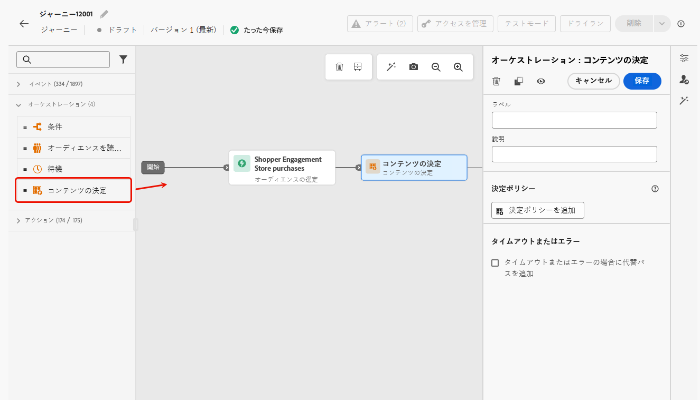
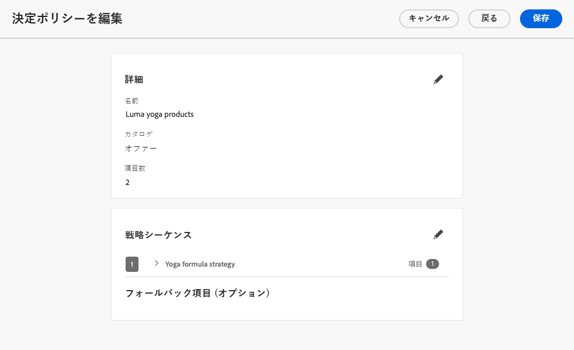
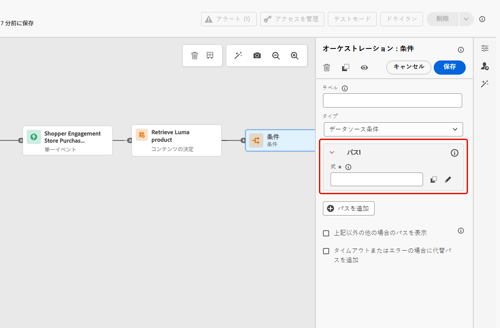
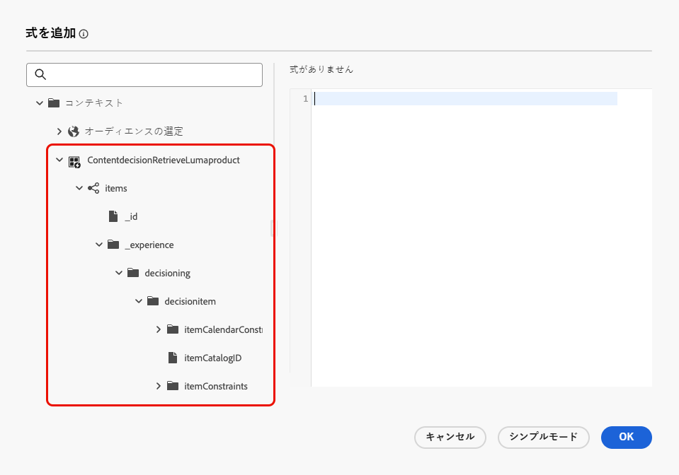
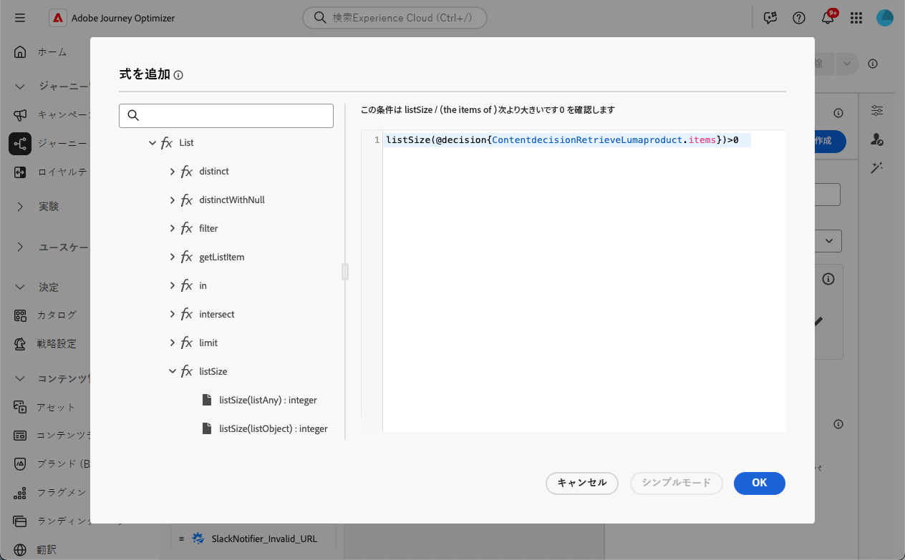
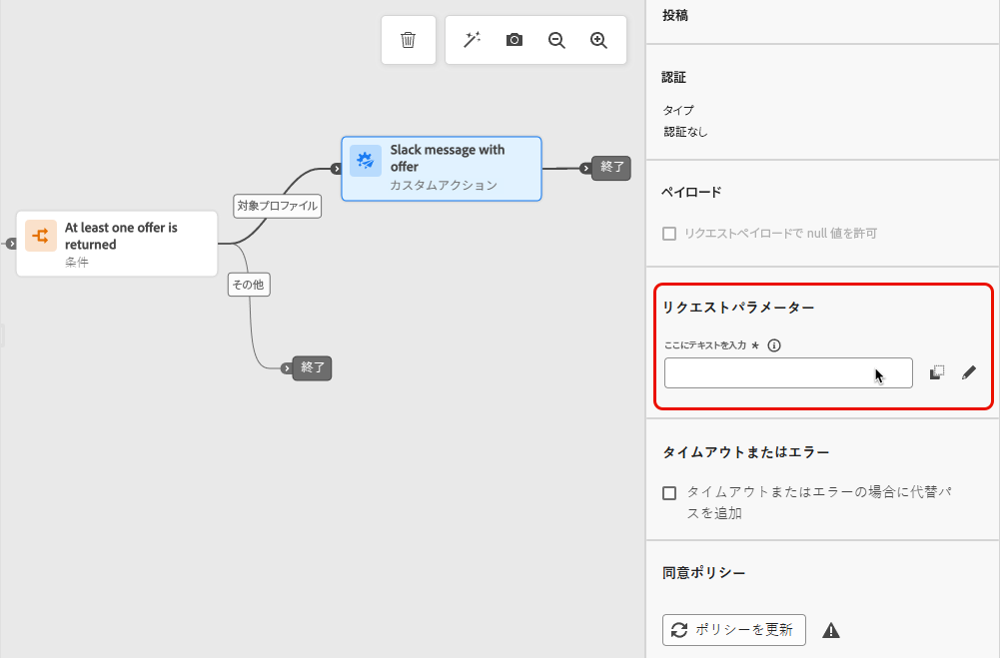
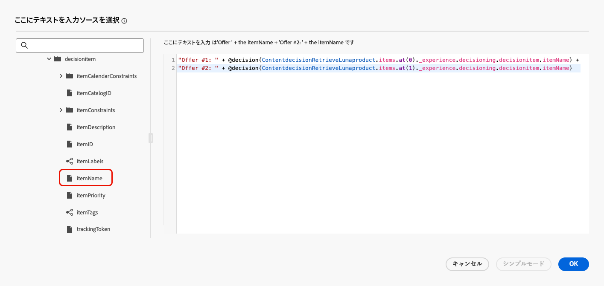
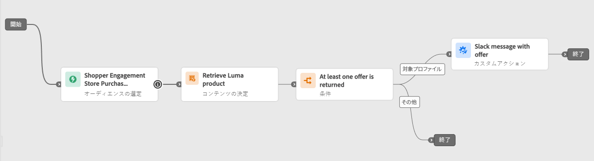

# コンテンツ決定アクティビティ {#content-decision}

>[!AVAILABILITY]
>
>この機能は、一連の組織でのみ使用でき（限定提供）、今後のリリースでグローバルにロールアウトされる予定です。

[!DNL Journey Optimizer] を使用すると、ジャーニーキャンバスの専用の&#x200B;**コンテンツ決定**&#x200B;アクティビティを通じて、ジャーニーにオファーを含めることができます。次に、他のアクティビティ（[カスタムアクション](../action/about-custom-action-configuration.md)など）をジャーニーに追加して、パーソナライズされたオファーでオーディエンスをターゲットにすることができます。

>[!NOTE]
>
>コンテンツ決定アクティビティの出力は、ネイティブチャネルアクティビティでは使用できません。

この機能を活用するには、[コンテンツ決定アクティビティ](#add-content-decision-activity)を追加して、実施要件を満たすプロファイルに提示するオファーを定義するジャーニーを作成します。

次に、コンテンツ決定アクティビティの出力は、以下の用途で使用できます。

* [条件アクティビティ](#add-condition-activity)：取得したオファーに基づいてプロファイルを特定のパスに移動します。

* [カスタムアクション](#add-custom-action)：これらのオファーを外部システムに送信できます。

## コンテンツ決定アクティビティの設定 {#add-content-decision-activity}

コンテンツ決定アクティビティを使用すると、[!DNL Journey Optimizer] 決定から最適な項目を選択し、適切なオーディエンスに配信できるようにする決定ポリシーを定義できます。

<!--Their goal is to select the best offers for each profile, while the campaign/journey authoring allows you to indicate how the selected decision items should be presented, including which item attributes to be included in the message.-->

**[!UICONTROL コンテンツ決定]**&#x200B;アクティビティを設定するには、次の手順に従います。

1. **[!UICONTROL オーケストレーション]**&#x200B;カテゴリを展開し、**[!UICONTROL コンテンツ決定]**&#x200B;アクティビティをキャンバスにドロップします。

   {width=100%}

1. オプションで、アクティビティにラベルと説明を追加します。

1. 「**[!UICONTROL 決定ポリシーを追加]**」をクリックします。[決定ルールの詳細情報](../experience-decisioning/create-decision.md)

   >[!NOTE]
   >
   >決定ポリシーを作成するには、決定権限が必要です。[詳細情報](../experience-decisioning/gs-experience-decisioning.md#steps)

1. 返される項目の数を選択します。例えば、「2」を選択した場合、最適な 2 つの実施要件を満たすオファーが表示されます。「**[!UICONTROL 次へ]**」をクリックします。

1. 「**[!UICONTROL 戦略シーケンス]**」セクションでは、決定ポリシーと共に提示する決定項目や選択戦略を選択します。[詳細情報](../experience-decisioning/create-decision.md#select)

1. 必要に応じて、評価順序を並べ替えます。

   複数の決定項目や戦略を追加すると、順番に評価され、各オブジェクトまたはオブジェクトのグループの左側に数字で示されます。デフォルトのシーケンスを変更するには、オブジェクトやグループをドラッグ＆ドロップして、任意の順序に並べ替えることができます。[詳細情報](../experience-decisioning/create-decision.md#evaluation-order)

1. （オプション）フォールバックオファーを追加します。[詳細情報](../experience-decisioning/create-decision.md#fallback)

1. 決定ポリシーをレビューして保存します。

   {width=70%}<!--reshoot or change screen-->

これで、このコンテンツ決定アクティビティの出力をジャーニーで活用する準備が整いました。

## ガードレールと制限 {#guardrails}

**同意ポリシー**

同意ポリシーの更新が有効になるまで最大 48 時間かかります。決定ポリシーが、最近更新された同意ポリシーに関連付けられた属性を参照している場合、変更は直ちに適用されません。

同様に、同意ポリシーの対象となる新しいプロファイル属性が決定ポリシーに追加された場合、その属性は使用可能になりますが、関連付けられた同意ポリシーは、遅延が経過するまで適用されません。

同意ポリシーは、Adobe Healthcare Shield または Privacy and Security Shield アドオンを導入している組織でのみ使用できます。

## コンテンツ決定アクティビティの出力の使用 {#use-content-decision-output}

コンテンツ決定の出力は、複数のジャーニーアクティビティで使用できます。例えば、[条件アクティビティ](#add-condition-activity)を使用すると、取得したオファーの数に基づいて、プロファイルをジャーニーの特定の分岐に移動できます。

また、コンテンツ決定アクティビティからのオファーを外部システムと共有することを目的に、[カスタムアクション](#add-custom-action)をジャーニーに追加することもできます。

### 条件アクティビティの場合 {#add-condition-activity}

コンテンツ決定アクティビティの出力を活用するには、オファーのデータを使用してプロファイルを特定のパスに移動する式を定義する条件をジャーニーに追加します。次の手順に従います。

1. **[!UICONTROL オーケストレーション]**&#x200B;カテゴリから、**[!UICONTROL 条件]**&#x200B;アクティビティをキャンバスにドロップします。[詳細情報](condition-activity.md#add-condition-activity)

1. （オプション）定義する最初の式に対応する **[!UICONTROL Path1]** の名前を、より関連性の高いラベルに変更します。

1. この最初のパスでは、「**[!UICONTROL 式]**」フィールド内をクリックするか、編集アイコンを使用して式を追加します。

   {width=80%}

1. 開いたポップアップウィンドウで、**[!UICONTROL 詳細設定モード]**&#x200B;に切り替えて、[高度な式エディター](expression/expressionadvanced.md)を使用します。

   >[!CAUTION]
   >
   >コンテンツ決定ノードの出力は、**[!UICONTROL 詳細設定モード]**&#x200B;でのみ使用できます。

1. **[!UICONTROL コンテキスト]**&#x200B;ノードを展開し、決定ポリシーに移動して、[オファーカタログスキーマ](../experience-decisioning/catalogs.md#access-catalog-schema)で使用可能なすべての属性を表示します。

   

   >[!NOTE]
   >
   >決定ルールで使用されるジャーニーエクスペリエンスイベント（コンテキストデータとして）または[オファースキーマ](../experience-decisioning/catalogs.md#access-catalog-schema)のいずれかで、属性に定義された制限ラベルは、DULE または同意のポリシー違反にはなりません。データガバナンスポリシーについて詳しくは、[この節](../action/action-privacy.md)を参照してください

1. ジャーニーにエントリするプロファイルに対してオファーが返されたかどうかを確認するには、構文 `listSize(@decision{ContentdecisionName.items})>0` で [listSize](functions/list-functions.md#listSize) 関数を使用します

   >[!NOTE]
   >
   >この例では、`Name` はジャーニーに追加したコンテンツ決定のラベルです。

   

1. 「**[!UICONTROL OK]**」をクリックします。

1. 必要に応じて、他の条件を定義するパスを追加します。

   また、「**[!UICONTROL 上記以外の事例のパスを表示]**」をオンにして、最初の条件を満たさないプロファイルの別のパスを作成することもできます。<!--These profiles will then exit the journey if no other activity is added in that path.-->

1. 条件アクティビティを保存します。

### カスタムアクションの場合 {#add-custom-action}

コンテンツ決定アクティビティの出力を活用するには、定義したオファーを外部システムと共有するカスタムアクションをジャーニーに追加します。次の手順に従います。

1. カスタムアクションをジャーニーに追加します。 [詳細情報](../action/about-custom-action-configuration.md)

1. アクションのラベルを入力します。

1. 「**[!UICONTROL リクエストパラメーター]**」セクションで、取得したオファーの属性にマッピングするパラメーターを選択します。

   編集可能なテキストフィールド内をクリックし、取得したオファーの属性にマッピングするパラメーターを選択します。

   

1. 開いたポップアップウィンドウで、**[!UICONTROL 詳細設定モード]**&#x200B;に切り替えます。[高度な式エディター](expression/expressionadvanced.md)で、**[!UICONTROL コンテキスト]**&#x200B;ノードを展開して、すべての決定ポリシー項目を表示します。

   >[!CAUTION]
   >
   >コンテンツ決定ノードの出力は、**[!UICONTROL 詳細設定モード]**&#x200B;でのみ使用できます。

1. `items` 配列を使用して[オファーカタログスキーマ](../experience-decisioning/catalogs.md#access-catalog-schema)を参照します。例えば、最初に取得したオファーの `itemName` と、2 番目に取得したオファーの `itemName` を使用します。

   

1. 「**[!UICONTROL OK]**」をクリックして式を保存します。

1. カスタムアクション設定を&#x200B;**[!UICONTROL 保存]**&#x200B;します。

### エンドツーエンドの例 {#use-case}

上記で説明したように、条件アクティビティとカスタムアクションを組み合わせたコンテンツ決定アクティビティを使用するジャーニーの完全な例を以下に示します。

<!--When all activities are properly configured and saved, [publish](publish-journey.md) your journey.-->

ジャーニーを[アクティブ化](publish-journey.md)すると、次の操作が行われます。

<!--* Profiles who enter the journey and are eligible for at least one offer are targeted by the custom action.

* If no offer is returned for a profile, they are excluded from the custom action.-->

1. プロファイルがそのオーディエンスを選定するたびに、そのプロファイルはジャーニーにエントリします。

1. コンテンツ決定アクティビティを通じて、[!DNL Journey Optimizer] は各プロファイルに関連するオファーを取得します。

1. 1 つ以上のオファーを取得したプロファイルのみが、ジャーニーを続行します（「実施要件を満たすプロファイル」パス経由）。

1. 条件が満たされると、対応するオファーがカスタムアクションを通じて外部システムに送信されます。
