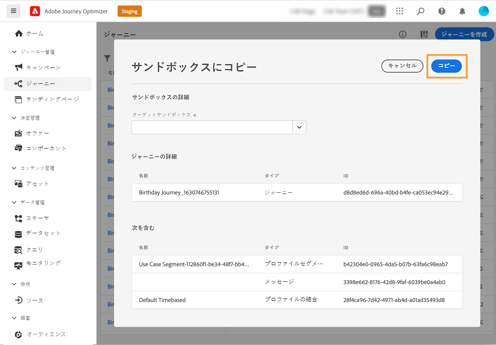
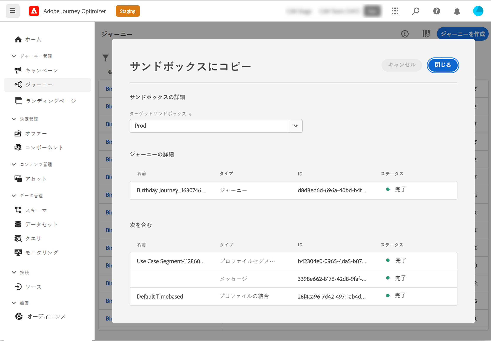

# 別のサンドボックスへのジャーニーのコピー {#copy-to-sandbox}

>[!CONTEXTUALHELP]
>id="ajo_journey_copy_main"
>title="別のサンドボックスへのジャーニーのコピー"
>abstract="Journey Optimizer では、1 つのサンドボックスから別のサンドボックスにジャーニー全体をコピーできます。例えば、ステージサンドボックス環境から実稼動サンドボックスにジャーニーをコピーできます。Journey Optimizer では、ジャーニー自体に加えて、ジャーニーに必要なオブジェクトのほとんどをコピーします。"

>[!CONTEXTUALHELP]
>id="ajo_journey_copy_sandbox_details"
>title="サンドボックスの詳細"
>abstract="ジャーニーのコピー先となる宛先サンドボックスを選択します。IMS 組織内のサンドボックスのみ使用できます。"

>[!CONTEXTUALHELP]
>id="ajo_journey_copy_object_details"
>title="オブジェクトの詳細"
>abstract="これがコピーするジャーニーです。"

>[!CONTEXTUALHELP]
>id="ajo_journey_copy_dependent_objects"
>title="依存オブジェクト"
>abstract="これは、ジャーニーで使用される関連オブジェクトのリストです。このリストには、名前、オブジェクトタイプおよび内部 Journey Optimizer ID が表示されます。"

Journey Optimizer では、1 つのサンドボックスから別のサンドボックスにジャーニー全体をコピーできます。例えば、ステージサンドボックス環境から実稼動サンドボックスにジャーニーをコピーできます。Journey Optimizer では、ジャーニー自体に加えて、ジャーニーに必要なオブジェクトのほとんど（セグメント、サーフェス（プリセットなど）、スキーマ、イベントおよびアクション）もコピーします。コピーされたオブジェクトについて詳しくは、この[節](../building-journeys/copy-to-sandbox.md#limitations)を参照してください。

>[!CAUTION]
>
>リンクされたすべての要素が宛先サンドボックスにコピーされるとは限りません。ジャーニーを公開する前に、徹底的に確認することを強くお勧めします。これにより、欠けている可能性のあるオブジェクトを特定できます。

ターゲットサンドボックスにコピーされたオブジェクトは一意で、既存の要素が上書きされるリスクはありません。ジャーニーとジャーニー内のあらゆるメッセージは、両方ともドラフトモードで引き継がれます。これにより、ターゲットサンドボックスで公開する前に、徹底的な検証を実行できます。コピープロセスでは、ジャーニーとそのジャーニー内のオブジェクトに関するメタデータのみをコピーします。プロファイルまたはデータセットのデータは、このプロセスの一環としてコピーされません。

ジャーニーを別のサンドボックスにコピーするには、次の手順に従います。

1. 「ジャーニー管理」メニューセクションで、「**[!UICONTROL ジャーニー]**」をクリックします。ジャーニーのリストが表示されます。

2. コピーするジャーニーを検索し、「**その他のアクション**」アイコン（ジャーニー名の横にある 3 つのドット）をクリックし、「**サンドボックスにコピー**」をクリックします。

   

   **サンドボックスにコピー**&#x200B;画面が表示されます。

   

3. ドロップダウンフィールドから「**ターゲットサンドボックス**」を選択します。IMS 組織内のサンドボックスのみ使用できます。

4. 「**依存オブジェクト**」セクションを確認します。これは、ジャーニーで使用される関連オブジェクトのリストです。このリストには、名前、オブジェクトタイプおよび内部 Journey Optimizer ID が表示されます。

5. 右上隅の「**コピー**」ボタンをクリックして、ターゲットサンドボックスへのジャーニーのコピーを開始します。

   

   コピー処理が開始され、個々のオブジェクトの進行状況が表示されます。コピー処理は、ジャーニーの複雑さや、コピーする必要のあるオブジェクトの数によって異なります。エラーが発生した場合は、関連するオブジェクトについてのメッセージが表示されます。

   

6. コピーが完了したら、「**閉じる**」をクリックします。

7. ターゲットサンドボックスにアクセスし、コピーしたすべてのオブジェクトを徹底的に確認します。

## コピープロセスと制限事項 {#limitations}

リンクされたすべての要素が宛先サンドボックスにコピーされるとは限りません。徹底的に確認することを強くお勧めします。欠けている可能性のあるオブジェクトを特定し、ジャーニーを公開する前に手動で作成します。

コピーされるオブジェクトは次のとおりです。

* セグメント

   セグメントは、一方のサンドボックスからもう一方のサンドボックスに 1 回だけコピーできます。セグメントをコピーした後は、宛先サンドボックスで編集することはできません。

* スキーマ

   このジャーニーで使用されているスキーマがコピーされます。

* メッセージ

   ジャーニーで使用されるチャネルアクションアクティビティ。メッセージ内のパーソナライゼーションに使用されるフィールドが完全かどうかはチェックされません。 コンテンツブロックはコピーされません。

* ジャーニー - キャンバスの詳細

   ジャーニー内のオブジェクト（条件、アクション、イベント、「セグメントを読み取り」など）を含む、キャンバス上のジャーニーの表示域。 ジャンプアクティビティは、コピーから除外されます。

* イベント

   ジャーニーで使用されるイベントとイベントの詳細がコピーされます。

* アクション

   ジャーニーで使用されるアクションとアクションの詳細がコピーされます。

サーフェス（プリセットなど）はコピーされません。メッセージのタイプとサーフェス名に基づいて、最も近いものが宛先サンドボックスで自動的に選択されます。ターゲットのサンドボックスでサーフェスが見つからない場合、サーフェスのコピーは失敗します。これは、メッセージの設定にサーフェスが必要なため、メッセージのコピーも失敗することを意味します。この場合、コピーを機能させるには、メッセージの適切なチャネル用に、少なくとも 1 つのサーフェスを作成する必要があります。

スキーマ、結合ポリシーおよびセグメントの場合、これらのオブジェクトのコピーが 2 回目に試みられると、参照のみが行われます。 既に存在するオブジェクトとして扱われ、再度コピーされます。 つまり、これらのオブジェクトは 1 回だけコピーできます。

Adobe Journey Optimizer が、キャンバスにエラーが表示されることなくスキーマ、結合ポリシーおよびセグメントを参照できるようになるまで、5 分の遅延が発生します。5 分待つと、これらの参照が使用可能になります。
