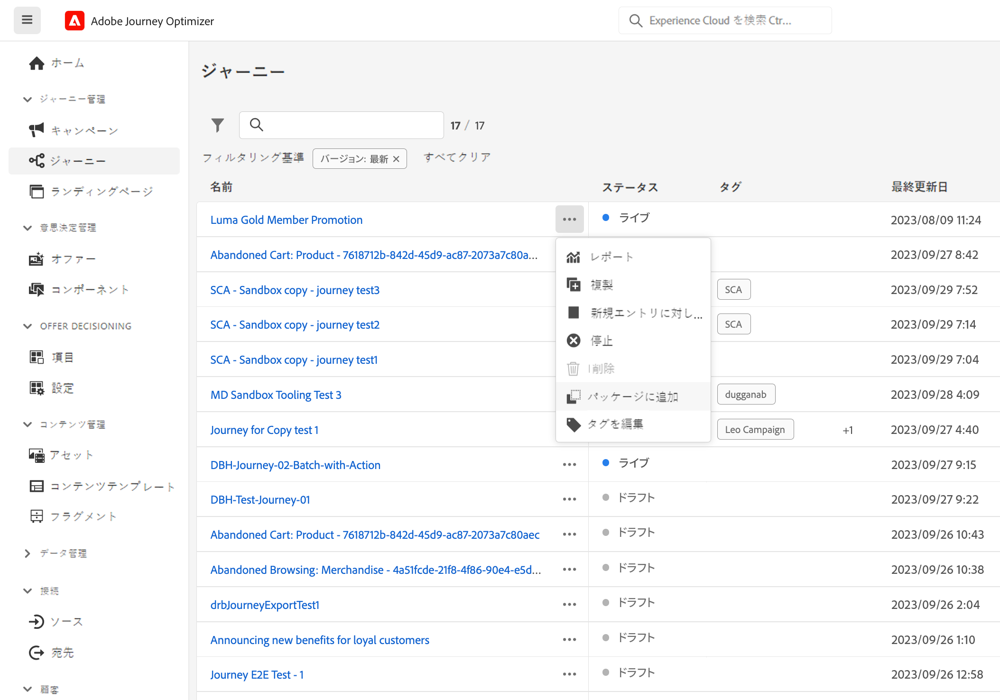
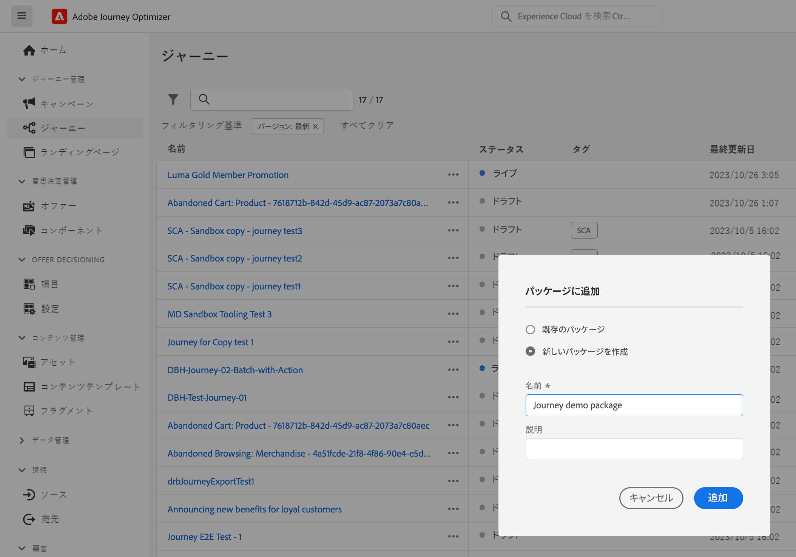
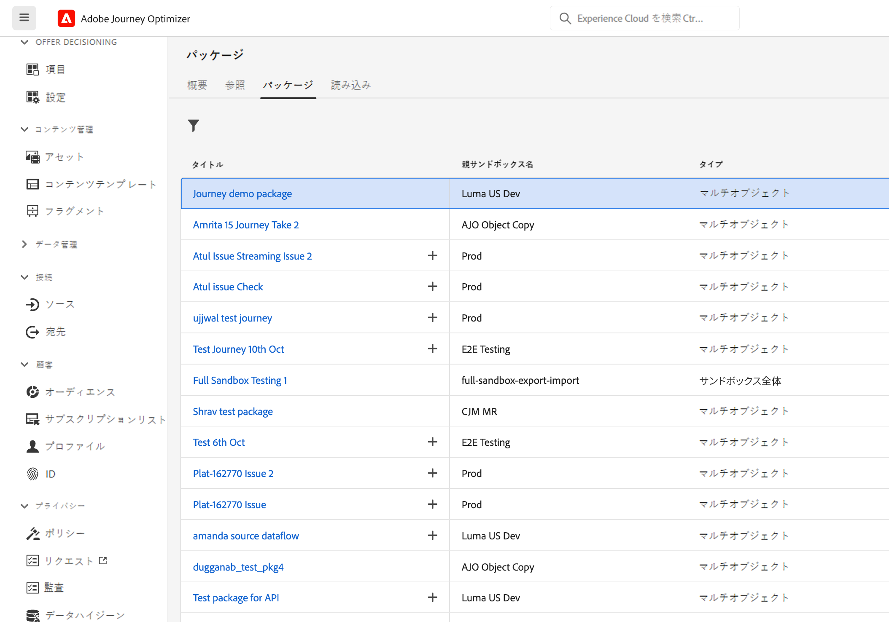
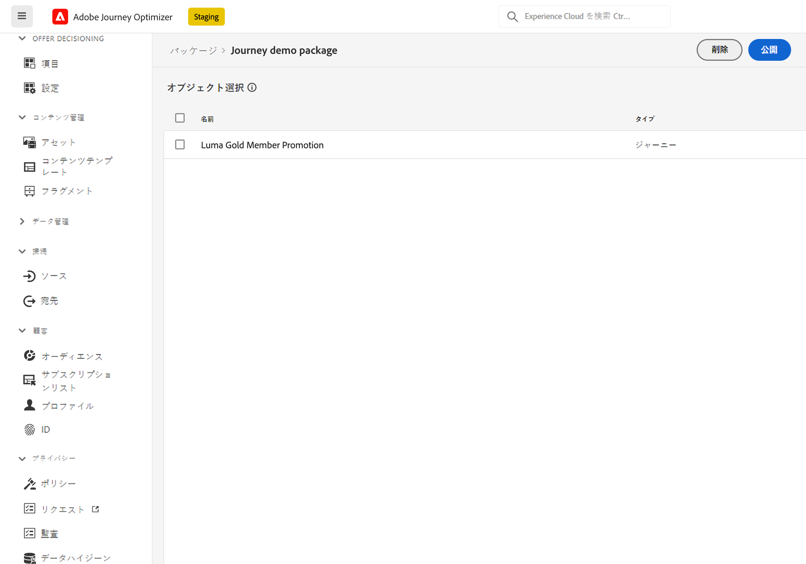
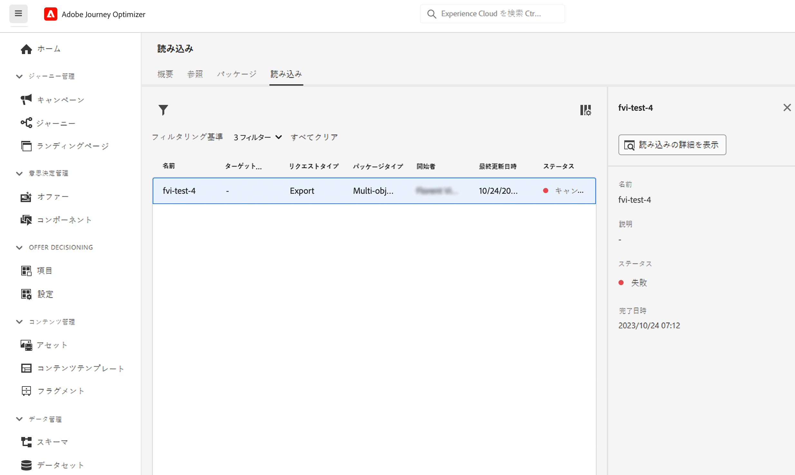
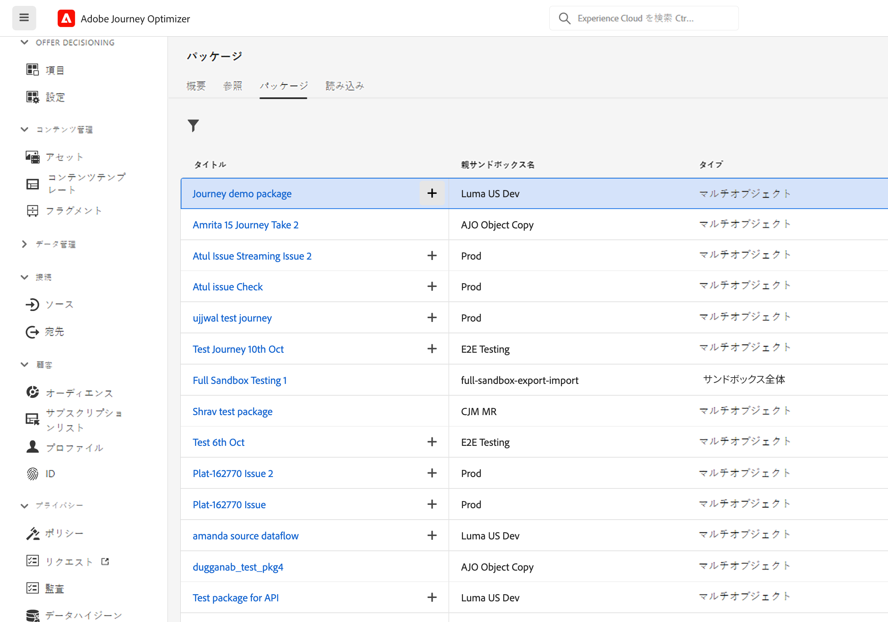
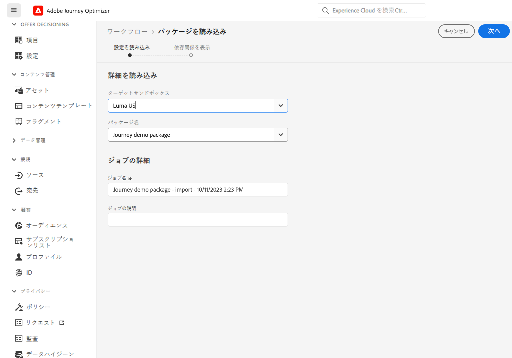
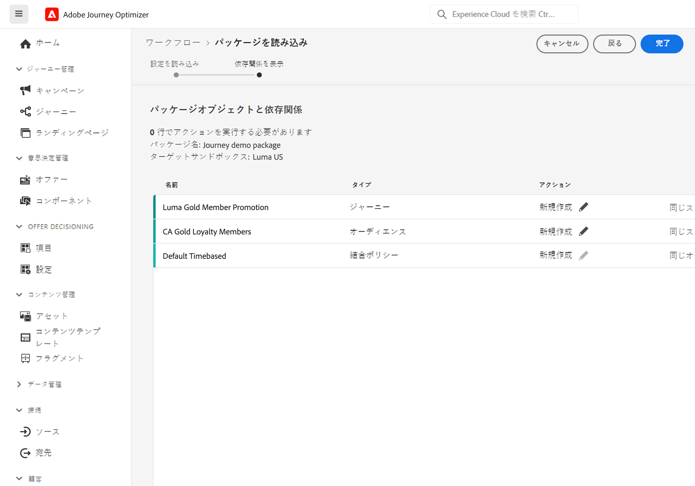
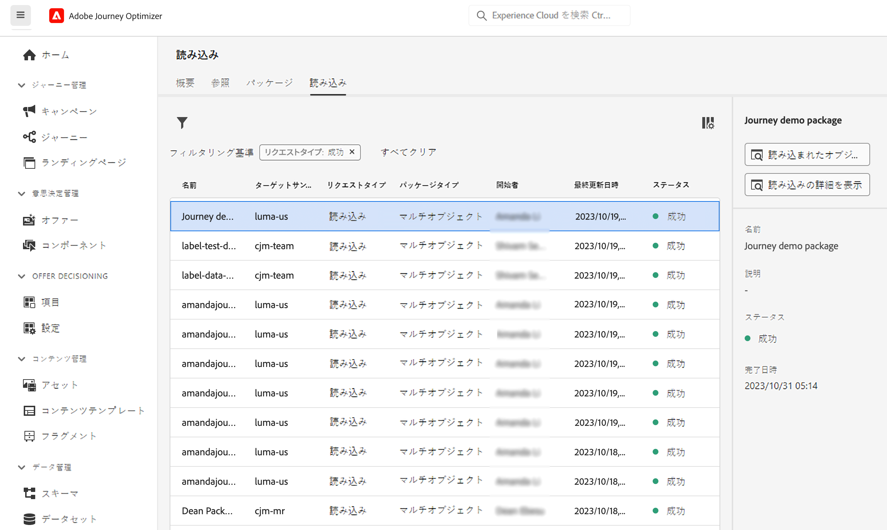

# 別のサンドボックスへジャーニーをコピー {#copy-to-sandbox}

<!--
>[!CONTEXTUALHELP]
>id="ajo_journey_copy_main"
>title="Copy a journey to another sandbox"
>abstract="Journey Optimizer allows you to copy an entire journey from one sandbox to another. For example, you can copy a journey from the Stage sandbox environment to your Production sandbox. In addition to the Journey itself, Journey Optimizer also copies most of the objects the journey depends on."

>[!CONTEXTUALHELP]
>id="ajo_journey_copy_sandbox_details"
>title="Sandbox details"
>abstract="Select the destination sandbox you want to copy the journey to. Only sandboxes within your organization are available."

>[!CONTEXTUALHELP]
>id="ajo_journey_copy_object_details"
>title="Object details"
>abstract="This is the journey you are going to copy."

>[!CONTEXTUALHELP]
>id="ajo_journey_copy_dependent_objects"
>title="Dependent objects"
>abstract="This is the list of associated objects used in the journey. This list displays the name, the object type, as well as the internal Journey Optimizer ID."
-->

サンドボックスツールを使用すると、パッケージの書き出しと読み込みを活用して、複数のサンドボックス間でオブジェクトをコピーできます。パッケージは、1 つのオブジェクトまたは複数のオブジェクトで構成できます。パッケージに含まれるオブジェクトは、同じサンドボックスからのものである必要があります。

このページでは、Journey Optimizer のコンテキストにおけるサンドボックスツールのユースケースについて説明します。機能自体について詳しくは、[Experience Platform ドキュメント](https://experienceleague.adobe.com/docs/experience-platform/sandbox/ui/sandbox-tooling.html?lang=ja)を参照してください。

>[!NOTE]
>
>この機能には、**サンドボックス管理**&#x200B;機能の権限（サンドボックスの管理（またはサンドボックスの表示）とパッケージの管理）が必要です。[詳細情報](../administration/ootb-permissions.md)

## サンドボックスツールの基本を学ぶ{#sandbox-gs}

Journey Optimizer では、1 つのサンドボックスから別のサンドボックスにジャーニー全体をコピーできます。例えば、ステージサンドボックス環境から実稼動サンドボックスにジャーニーをコピーできます。Journey Optimizer では、ジャーニー自体に加えて、ジャーニーに必要なほとんどのオブジェクト（オーディエンス、スキーマ、イベントおよびアクション）もコピーします。コピーされたオブジェクトについて詳しくは、この[節](https://experienceleague.adobe.com/docs/experience-platform/sandbox/ui/sandbox-tooling.html?lang=ja#abobe-journey-optimizer-objects)を参照してください。

>[!CAUTION]
>
>リンクされたすべての要素が宛先サンドボックスにコピーされるとは限りません。ジャーニーを公開する前に、徹底的に確認することを強くお勧めします。これにより、欠けている可能性のあるオブジェクトを特定できます。

ターゲットサンドボックスにコピーされたオブジェクトは一意で、既存の要素が上書きされるリスクはありません。ジャーニーとジャーニー内のあらゆるメッセージは、両方ともドラフトモードで引き継がれます。これにより、ターゲットサンドボックスで公開する前に、徹底的な検証を実行できます。コピープロセスでは、ジャーニーとそのジャーニー内のオブジェクトに関するメタデータのみをコピーします。プロファイルまたはデータセットのデータは、このプロセスの一環としてコピーされません。

コピープロセスは、ソースサンドボックスとターゲットサンドボックス間のパッケージの書き出しおよび読み込みを介して実行されます。1 つのサンドボックスから別のサンドボックスにジャーニーをコピーする一般的な手順を以下に示します。

1. ジャーニーをパッケージとしてソースサンドボックスに追加します。
1. パッケージをターゲットサンドボックスに書き出します。

また、Journey Optimizer の **Object Copy Service REST API** を活用すると、サンドボックスのオブジェクトを管理できます。[Object Copy Service REST API の使用方法を学ぶ](https://developer.adobe.com/journey-optimizer-apis/references/sandbox/)

## ジャーニーをパッケージとして追加{#export}

ジャーニーを別のサンドボックスにコピーするには、まずジャーニーをパッケージとしてソースサンドボックスに追加する必要があります。次の手順に従います。

1. 「ジャーニー管理」メニューセクションで、「**[!UICONTROL ジャーニー]**」をクリックします。ジャーニーのリストが表示されます。

1. コピーするジャーニーを検索し、「**その他のアクション**」アイコン（ジャーニー名の横にある 3 つのドット）をクリックし、「**パッケージに追加**」をクリックします。

   

   **パッケージに追加**&#x200B;ウィンドウが表示されます。

   

1. ジャーニーを既存のパッケージに追加するか、新しいパッケージを作成するかを選択します。

   * **既存のパッケージ**：ドロップダウンメニューからパッケージを選択します。
   * **新しいパッケージを作成**：パッケージ名を入力します。説明を追加することもできます。

1. 「管理」メニューセクションで、「**[!UICONTROL サンドボックス]**」をクリックし、「**パッケージ**」タブを選択して、書き出すパッケージをクリックします。

   

1. 書き出すオブジェクトを選択し、「**公開**」をクリックします

   

   公開が失敗した場合は、ログを確認して失敗の理由を特定できます。パッケージを開き、「**失敗したジョブを参照**」をクリックし、読み込みジョブを選択して、「**読み込みの詳細を表示**」をクリックします。

   

## パッケージをターゲットサンドボックスに書き出し {#import}

パッケージを公開したら、ターゲットサンドボックスに書き出す必要があります。

1. ソースサンドボックスで、**[!UICONTROL サンドボックス]**&#x200B;メニューをクリックし、「**パッケージ**」タブを選択して、書き出すパッケージの横にある「+」アイコンをクリックします。

   

1. ドロップダウンフィールドから「**ターゲットサンドボックス**」を選択し、「**次へ**」をクリックします。組織内のサンドボックスのみ使用できます。

   

1. パッケージオブジェクトと依存関係を確認します。これは、ジャーニーで使用される関連オブジェクトのリストです。このリストには、名前とオブジェクトタイプが表示されます。各オブジェクトに対して、新しいオブジェクトを作成するか、ターゲットサンドボックス内の既存のオブジェクトを使用するかを選択できます。

   

1. 右上隅の「**終了**」ボタンをクリックして、ターゲットサンドボックスへのパッケージのコピーを開始します。コピー処理は、ジャーニーの複雑さや、コピーする必要のあるオブジェクトの数によって異なります。

1. 読み込みジョブをクリックして、コピー結果を確認します。

   * 「**読み込み済みオブジェクトを表示**」をクリックし、コピーした個々のオブジェクトを表示します。
   * 「**読み込みの詳細を表示**」をクリックして、各オブジェクトの読み込み結果を確認します。

   

1. ターゲットサンドボックスにアクセスし、コピーしたすべてのオブジェクトを徹底的に確認します。
