# テストプロファイルの作成 {#create-test-profiles}

テストモードを使用する場合、テストプロファイルが必要です。ジャーニーでの[テストモード](../building-journeys/testing-the-journey.md)の使用方法、および[メッセージのプレビューとテスト](../preview.md)の方法を説明します。

次に、使用可能なテストプロファイルの作成方法を示します。

* [既存のプロファイル](#turning-profile-into-test)をテストプロファイルに変換できます。

* [csv ファイル](#create-test-profiles-csv)をアップロードするか、[API 呼び出し](#create-test-profiles-api)を使用して、テストプロファイルを作成できます。 これら 2 つの方法に加えて、Adobe Journey Optimizer には、テストプロファイルの作成を容易にする特定の[製品内ユースケース](#use-case-1)が用意されています。

* データセットで json ファイルをアップロードすることもできます。 詳しくは、[データ取得のドキュメント](https://experienceleague.adobe.com/docs/experience-platform/ingestion/tutorials/ingest-batch-data.html?lang=ja#add-data-to-dataset){target=&quot;_blank&quot;}を参照してください。

テストプロファイルの作成は、Adobe Experience Platform で通常のプロファイルを作成する場合と似ていることに注意してください。詳しくは、[リアルタイム顧客プロファイルのドキュメント](https://experienceleague.adobe.com/docs/experience-platform/profile/home.html?lang=ja){target=&quot;_blank&quot;}を参照してください。

## 前提条件 {#test-profile-prerequisites}

プロファイルを作成するには、まず Adobe [!DNL Journey Optimizer] でスキーマとデータセットを作成する必要があります。

まず、**スキーマを作成**&#x200B;する必要があります。次の手順に従います。

1. 「データ管理」メニュー セクションで、「**[!UICONTROL スキーマ]**」をクリックします。
   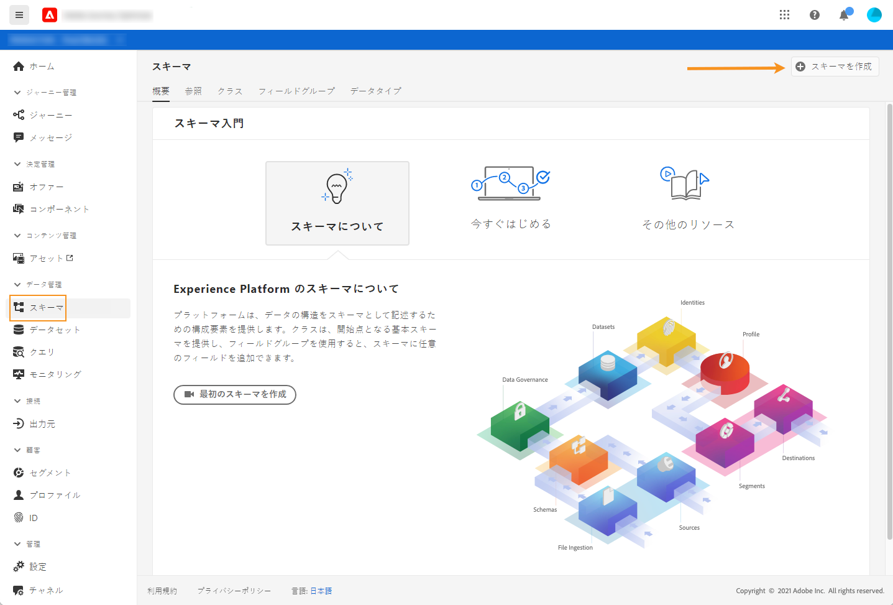
1. 右上の「**[!UICONTROL スキーマを作成]**」をクリックして、スキーマの種類を選択します（例：**XDM 個人プロファイル**）。
   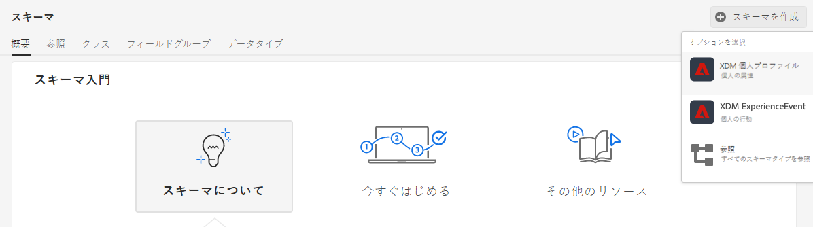
1. 適切なフィールドグループを選択します。 「**プロファイルテストの詳細**」フィールドグループを必ず追加してください。
   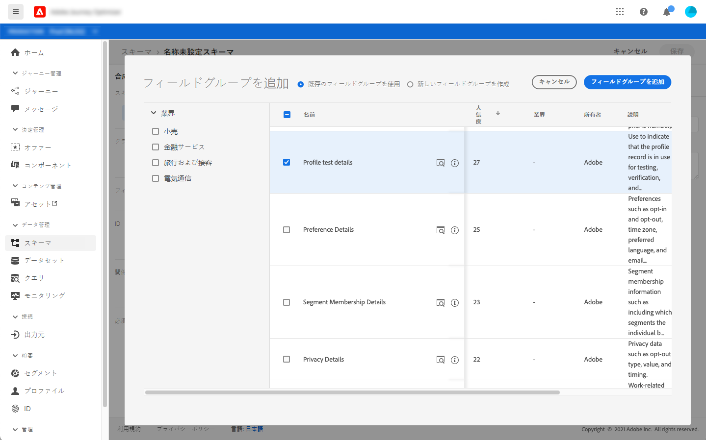
完了したら、「 **[!UICONTROL フィールドグループを追加]**」をクリックします。フィールドグループのリストが、スキーマの概要画面に表示されます。
   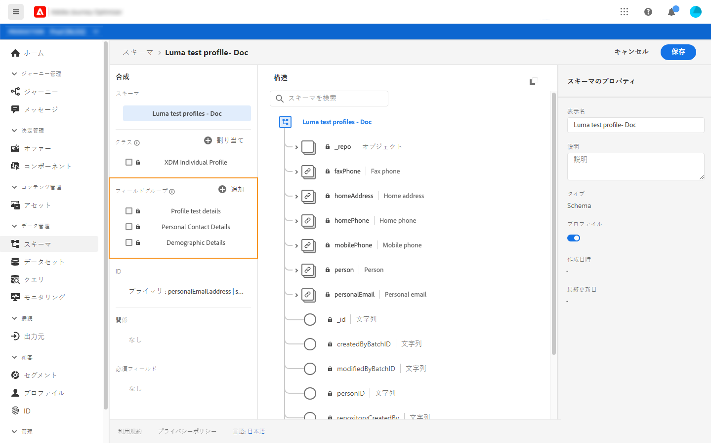

   >[!NOTE]
   >
   >* スキーマの名前をクリックして変更し、そのプロパティを更新します。
      >
      >
   * 「フィールドグループ」セクションの「**[!UICONTROL 追加]**」ボタンをクリックして、スキーマに追加する他のフィールドグループを選択します


1. フィールドのリストで、プライマリ ID として定義するフィールドをクリックします。
   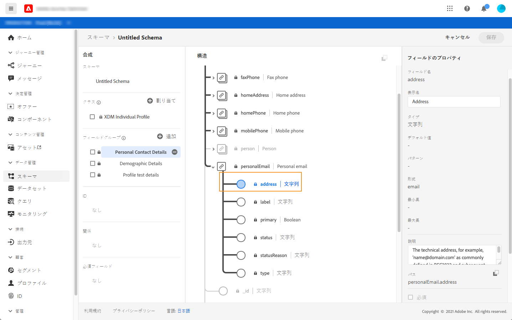
1. 右の&#x200B;**[!UICONTROL フィールドのプロパティ]**&#x200B;パネルで、「**[!UICONTROL ID]**」オプションと「**[!UICONTROL メイン ID]**」オプションをオンにし、名前空間を選択します。メールアドレスをプライマリ ID にする場合は、「**[!UICONTROL メール]**」名前空間を選択します。「**[!UICONTROL 適用]**」をクリックします。
   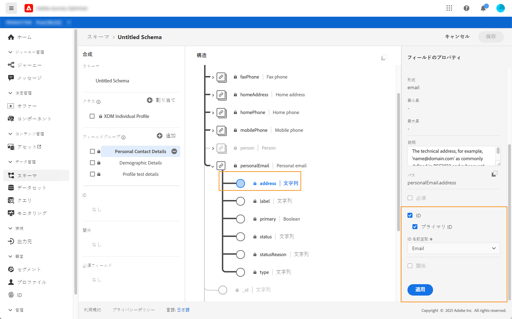
1. スキーマを選択し、**[!UICONTROL スキーマのプロパティ]**&#x200B;パネルで「**[!UICONTROL プロファイル]** 」オプションを有効にします。
   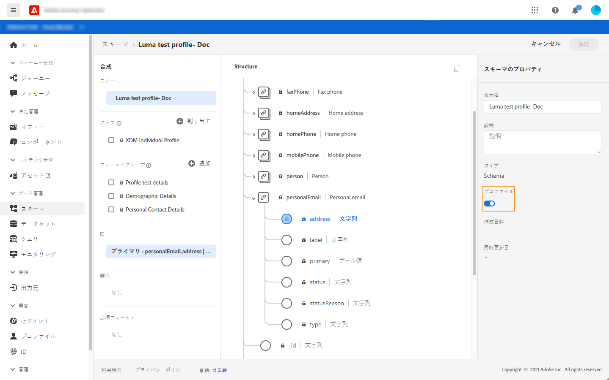
1. 「**保存**」をクリックします。

>[!NOTE]
>
>スキーマの作成について詳しくは、[XDMのドキュメント](https://experienceleague.adobe.com/docs/experience-platform/xdm/ui/resources/schemas.html?lang=ja#prerequisites){target=&quot;_blank&quot;}を参照してください。

次に、プロファイルのインポート先となる&#x200B;**データセットを作成**&#x200B;する必要があります。次の手順に従います。

1. **[!UICONTROL データセット]**&#x200B;を参照し、「**[!UICONTROL データセットを作成]**」をクリックします。
   
1. 「**[!UICONTROL スキーマからデータセットを作成]**」を選択します。
   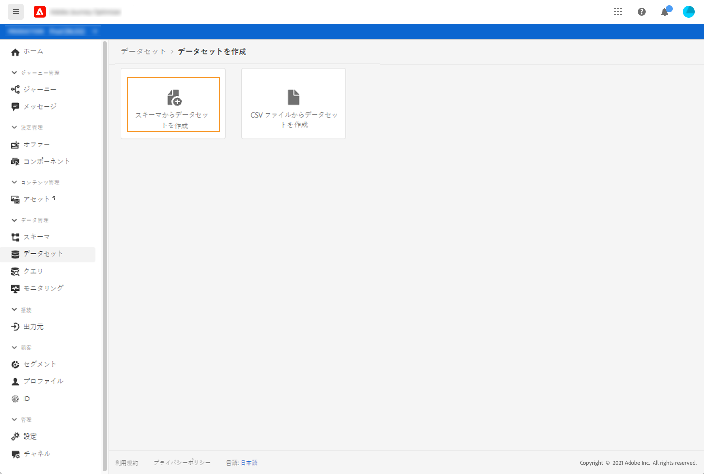
1. 作成済みのスキーマを選択し、「**[!UICONTROL 次へ]**」をクリックします。
   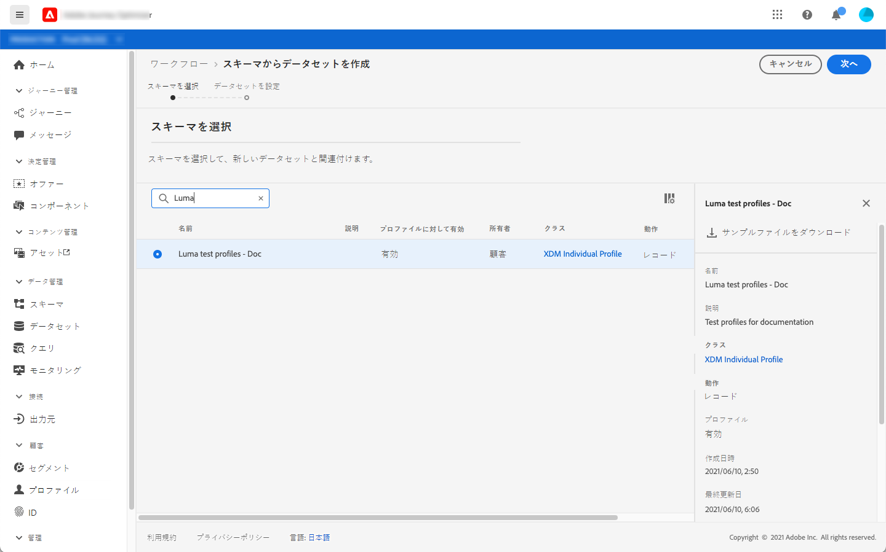
1. 名前を選択し、「**[!UICONTROL 終了]**」をクリックします。
   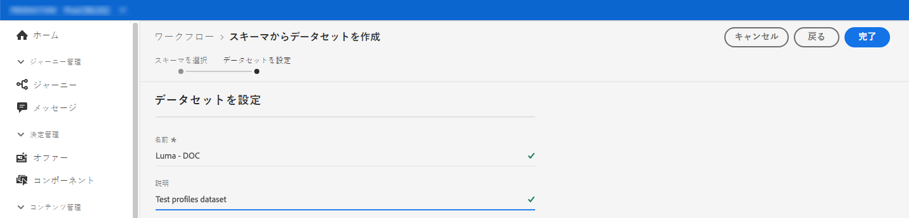
1. 「**[!UICONTROL プロファイル]**」オプションを有効にします。
   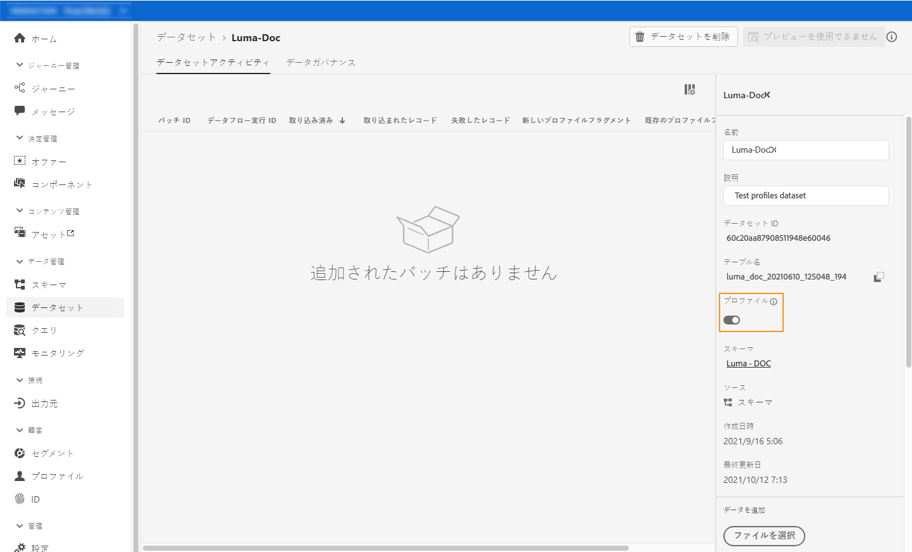

>[!NOTE]
>
> データセットの作成について詳しくは、[カタログサービスのドキュメント](https://experienceleague.adobe.com/docs/experience-platform/catalog/datasets/user-guide.html?lang=ja#getting-started){target=&quot;_blank&quot;}を参照してください。

## 製品内のユースケース{#use-case-1}

Adobe Journey Optimizer のホームページから、製品内ユースケースのテストプロファイルを活用できます。 このユースケースは、公開前にジャーニーのテストに使用するテストプロファイルの作成を容易にします。

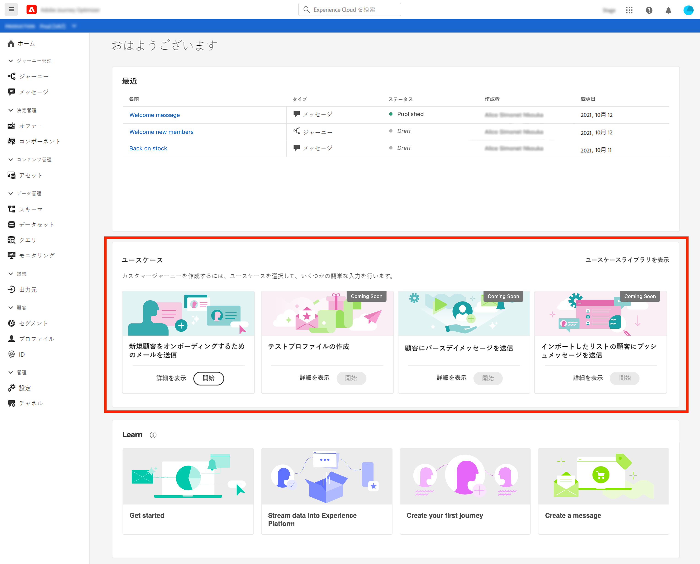

「**[!UICONTROL 開始]**」ボタンをクリックして、ユースケースを開始します。

次の情報が必要です。

1. **ID 名前空間**：[テストプロファイル](../get-started-identity.md) を一意に識別するために使用される ID 名前空間。例えば、メールを使用してテストプロファイルを識別する場合は、ID 名前空間の&#x200B;**メール**&#x200B;を選択する必要があります。 一意の識別子が電話番号の場合は、ID 名前空間の&#x200B;**電話**&#x200B;を選択する必要があります。

2. **CSV ファイル**：作成するテストプロファイルのリストを含む、コンマ区切りファイル。このユースケースでは、作成するテストプロファイルのリストを含む CSV ファイルに対し、形式を事前に定義しておく必要があります。 ファイルの各行には、次のフィールドが次のように正しい順序で含まれている必要があります。

   1. **人物 ID**：テストプロファイルを表す一意の識別子です。このフィールドの値は、選択した ID 名前空間を反映する必要があります。 （例えば、ID 名前空間に「**電話**」を選択した場合、このフィールドの値は電話番号にする必要があります。 同様に、「**メール**」を選択した場合、このフィールドの値は、メールにする必要があります）
   1. **メールアドレス**：テストプロファイルのメールアドレス。（ID 名前空間で「**メール**」を選択した場合、**人物 ID** フィールドと&#x200B;**メールアドレス**&#x200B;フィールドに同じ値が含まれる可能性があります）
   1. **名**：テストプロファイルの名。
   1. **姓**：テストプロファイルの姓。
   1. **市区町村**：テストプロファイルが居住している市区町村
   1. **国**：テストプロファイルの居住国
   1. **性別**：テストプロファイルの性別。指定可能な値は、**male**、**female**、**non_specified**&#x200B;です。

ID 名前空間を選択し、上記の形式に基づいて CSV ファイルを指定したら、右上の「**[!UICONTROL 実行]**」ボタンをクリックします。 このユースケースは、完了するまで数分かかる場合があります。 ユースケースがテストプロファイルの処理と作成を完了すると、ユーザーに通知が送信されます。

>[!NOTE]
>
>テストプロファイルは、既存のプロファイルを上書きする場合があります。 ユースケースを実行する前に、CSV にテストプロファイルのみが含まれ、正しいサンドボックスに対して実行されていることを確認してください。

## プロファイルからテストプロファイルへの変換{#turning-profile-into-test}

既存のプロファイルをテストプロファイルに変換したり、プロファイルの作成時と同じ方法でプロファイル属性を更新したりできます。

簡単な方法として、ジャーニーで「**[!UICONTROL プロファイルを更新]**」アクションアクティビティを使用し、ブール値フィールド testProfile を「false」から「true」に変更します。

ジャーニーは、「**[!UICONTROL セグメントを読み取り]** 」アクティビティと「**[!UICONTROL プロファイルを更新]**」アクティビティで構成されます。まず、テストプロファイルに変換するプロファイルをターゲットにしたセグメントを作成する必要があります。

>[!NOTE]
>
> **testProfile** フィールドを更新することになるので、選択したプロファイルには、このフィールドを含める必要があります。関連するスキーマには、「**プロファイルテストの詳細**」フィールドグループが必要です。[このセクション](../building-journeys/creating-test-profiles.md#test-profiles-prerequisites)をご覧ください。

1. **セグメント**&#x200B;を参照し、右上の「**セグメントを作成**」を選択します。
   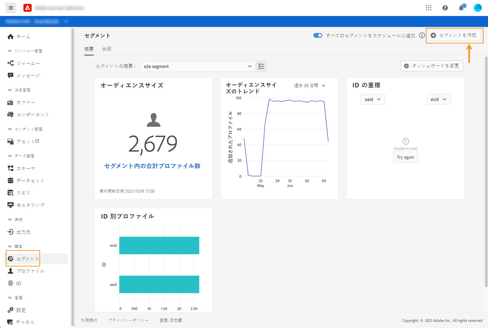
1. セグメント名を定義してセグメントを作成する：目的のプロファイルをターゲットするフィールドと値を選択します。
   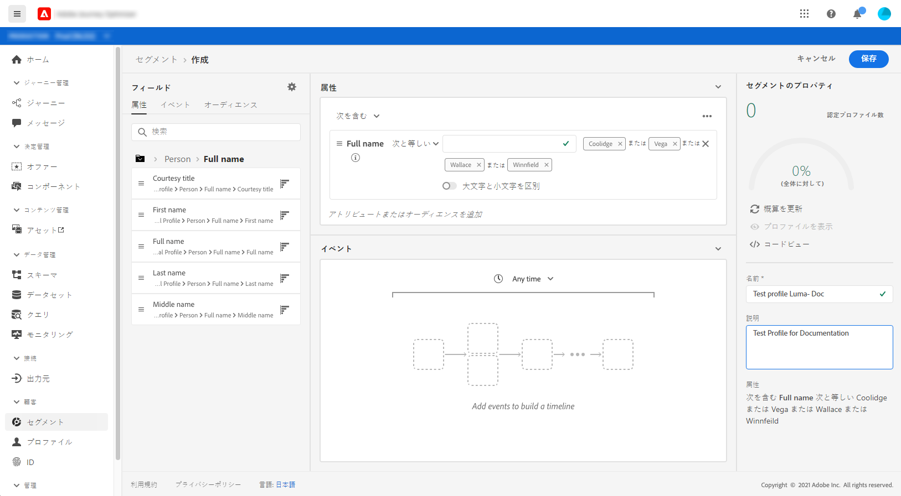
1. 「**保存**」をクリックし、セグメントによってターゲットとするプロファイルが正しくされていることを確認します。
   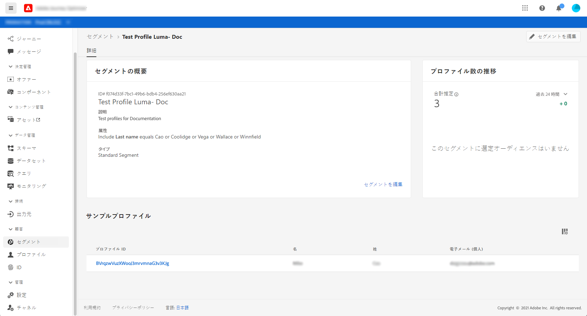

   >[!NOTE]
   >
   > セグメントの計算には時間がかかる場合があります。セグメントの詳細については、[この節](../segment/about-segments.md)を参照してください。

1. 次に、**[!UICONTROL セグメントの読み取り]**&#x200B;オーケストレーションアクティビティを使用して、新しいジャーニーを作成および開始します。
1. 以前に作成したセグメントと、プロファイルが使用する名前空間を選択します。
   
1. 「**[!UICONTROL プロファイルを更新]**」アクションアクティビティを追加します。
1. スキーマ、**testProfiles** フィールド、データセットを選択し、値を「**true**」に設定します。これを実行するには、「**[!UICONTROL 値]**」フィールドで、右側の「**ペン**」アイコンをクリックし、「**[!UICONTROL 詳細設定モード]**」を選択して、「**true**」と入力します。
   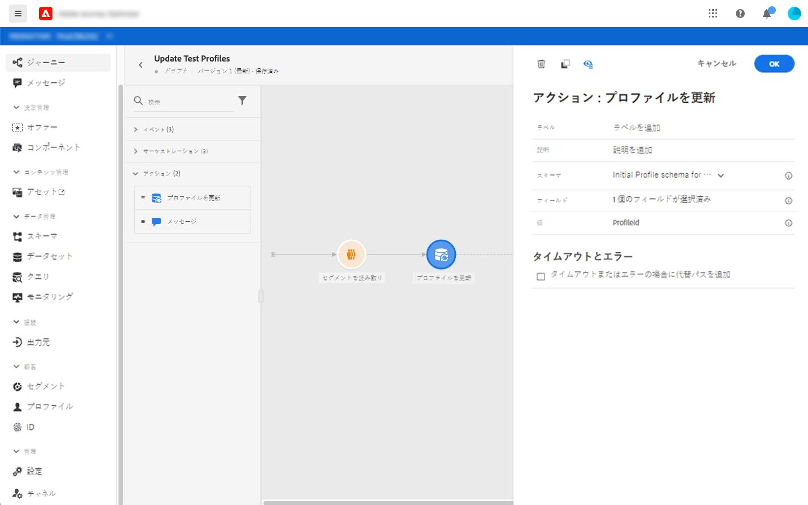
1. **終了**&#x200B;アクティビティを追加して、「**[!UICONTROL 公開]**」をクリックします。
1. 「**[!UICONTROL セグメント]**」セクションで、プロファイルが正しく更新されていることを確認します。
   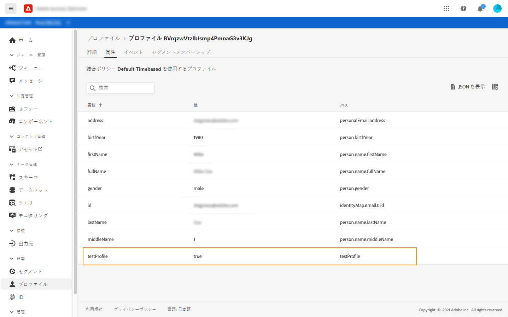

   >[!NOTE]
   >
   > 「**[!UICONTROL プロファイルを更新]**」アクティビティについては、[このセクション](../building-journeys/update-profiles.md)を参照してください。

## CSV ファイルを使用したテストプロファイルの作成{#create-test-profiles-csv}

Adobe Experience Platform では、様々なプロファイルフィールドを含む CSV ファイルをデータセットにアップロードして、プロファイルを作成できます。これが最も簡単なメソッドです。

1. スプレッドシートソフトウェアを使用して、単純な CSV ファイルを作成します。
1. 必要な各フィールドごとに 1 列ずつ追加しますプライマリ ID フィールド（上記の例では「personID」）を追加し、「testProfile」フィールドを「true」に設定するようにしてください。
   
1. プロファイルごとに 1 行追加し、各フィールドの値を入力します。
   
1. スプレッドシートを CSV ファイルとして保存します。カンマが区切り文字として使用されていることを確認します。
1. Adobe Experience Platform **ワークフロー**を参照します。
   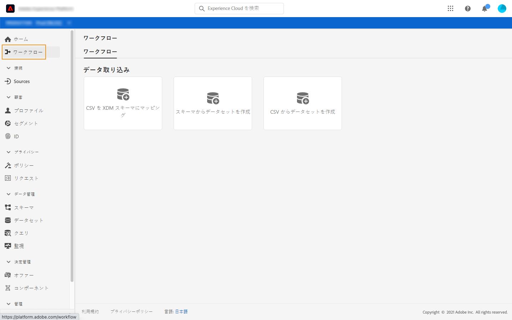
1. 「**CSV を XDM スキーマにマッピング**」を選択し、「**開始**」をクリックします。
   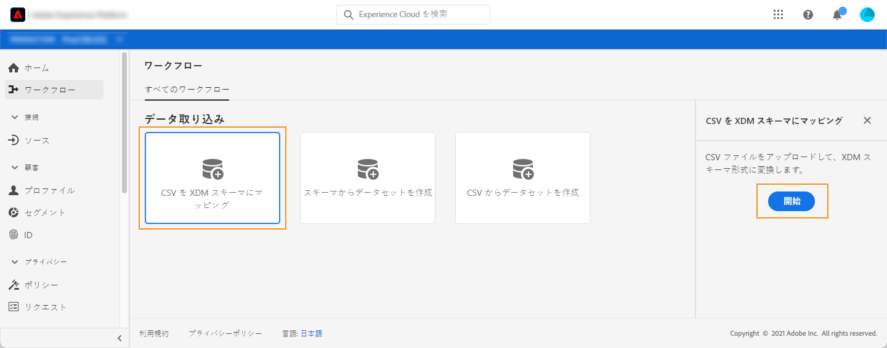
1. プロファイルの読み込み先となるデータセットを選択します。「**次へ**」をクリックします。
   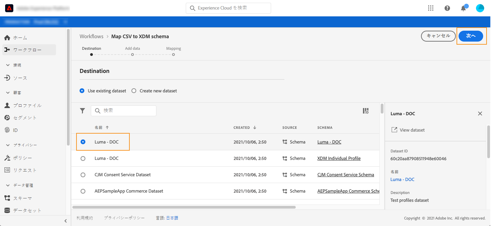
1. 「**ファイルを選択**」をクリックし、csv ファイルを選択します。ファイルをアップロードしたら、「**次へ**」をクリックします。
   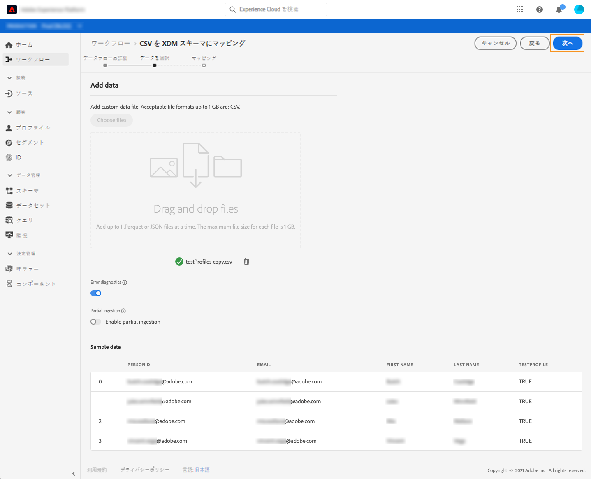
1. ソース csv フィールドをスキーマフィールドにマッピングし、「**終了**」をクリックします。
   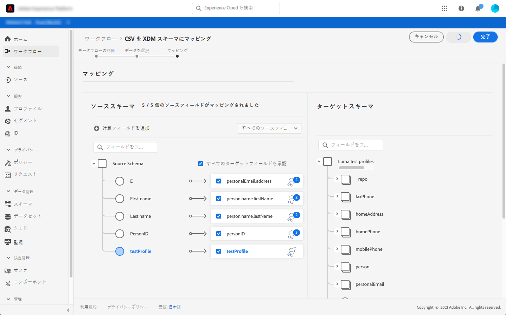
1. データの読み込みが開始します。ステータスが「**処理中**」から「**成功**」に変わります。右上の「**データセットのプレビュー**」をクリックします。
   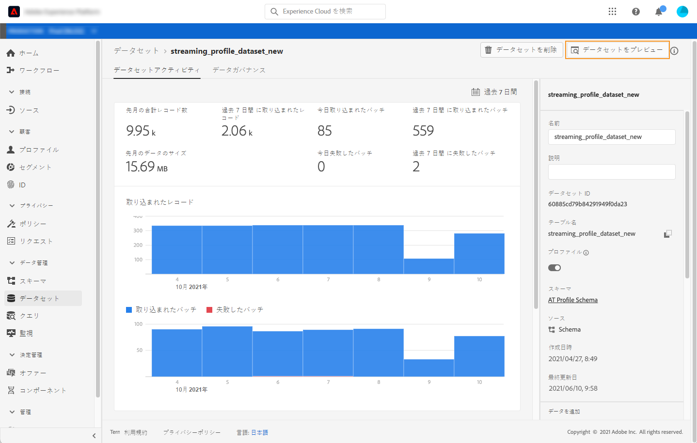
1. テストプロファイルが正しく追加されていることを確認します。
   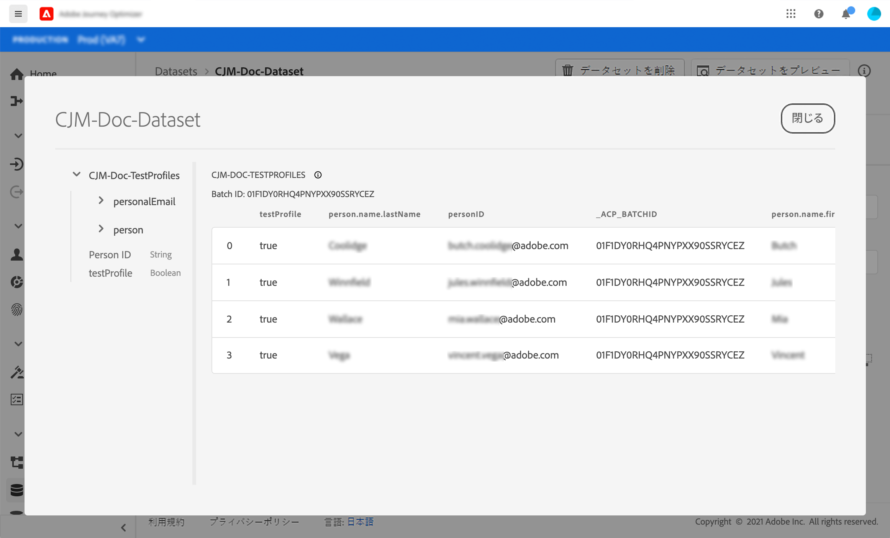

テストプロファイルが追加され、ジャーニーのテストで使用できるようになりました。[この節](../building-journeys/testing-the-journey.md)を参照してください。
>[!NOTE]
>
> csvのインポートについて詳しくは、[データ取得のドキュメント](https://experienceleague.adobe.com/docs/experience-platform/ingestion/tutorials/map-a-csv-file.html?lang=ja#tutorials){target=&quot;_blank&quot;}を参照してください。

## API 呼び出しを使用したテストプロファイルの作成{#create-test-profiles-api}

また、API 呼び出しを使用してテストプロファイルを作成することもできます。詳しくは、[Adobe Experience Platformのドキュメント](https://experienceleague.adobe.com/docs/experience-platform/profile/home.html){target=&quot;_blank&quot;}を参照してください。

「プロファイルテストの詳細」フィールドグループを含むプロファイルスキーマを使用する必要があります。testProfile フラグは、このフィールドグループの一部です。プロファイルを作成する場合は、次の値を渡す必要があります：testProfile = true

既存のプロファイルを更新して、testProfile フラグを「true」に変更することもできます。

テストプロファイルを作成するための API 呼び出しの例を以下に示します。

```
curl -X POST \
'https://dcs.adobedc.net/collection/xxxxxxxxxxxxxx' \
-H 'Cache-Control: no-cache' \
-H 'Content-Type: application/json' \
-H 'Postman-Token: xxxxx' \
-H 'cache-control: no-cache' \
-H 'x-api-key: xxxxx' \
-H 'x-gw-ims-org-id: xxxxx' \
-d '{
"header": {
"msgType": "xdmEntityCreate",
"msgId": "xxxxx",
"msgVersion": "xxxxx",
"xactionid":"xxxxx",
"datasetId": "xxxxx",
"imsOrgId": "xxxxx",
"source": {
"name": "Postman"
},
"schemaRef": {
"id": "https://example.adobe.com/mobile/schemas/xxxxx",
"contentType": "application/vnd.adobe.xed-full+json;version=1"
}
},
"body": {
"xdmMeta": {
"schemaRef": {
"contentType": "application/vnd.adobe.xed-full+json;version=1"
}
},
"xdmEntity": {
"_id": "xxxxx",
"_mobile":{
"ECID": "xxxxx"
},
"testProfile":true
}
}
}'
```
