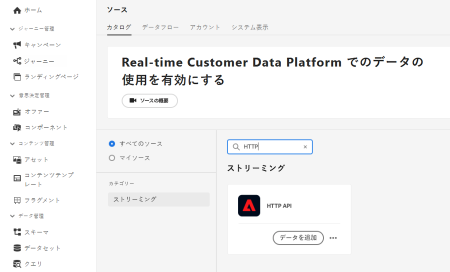

# カスタムアクションを使用した Experience Platform のジャーニーイベントの書き込み {#custom-action-aep}

>[!BEGINSHADEBOX]

**このページ：** カスタムアクションと認証済みAPI呼び出しを使用して、ジャーニーからAdobe Experience Platformにカスタムジャーニーイベントを書き込む方法を説明します。

>[!ENDSHADEBOX]

このユースケースでは、カスタムアクションと認証済み呼び出しを使用して、ジャーニーから[!DNL Adobe Experience Platform]にカスタムイベントを書き込む方法について説明します。

## 開発者プロジェクトの設定 {#custom-action-aep-IO}

1. Adobe Developer Console で、「**プロジェクト**」をクリックし、IO プロジェクトを開きます。

1. 「**資格情報**」セクションで、「**OAuth サーバー間**」をクリックします。

   

1. 「**cURL コマンドを表示**」をクリックします。

   ![[!DNL Adobe Experience Platform] アクションタイプの選択](assets/custom-action-aep-2.png)

1. cURL コマンドをコピーし、client_id、client_secret、grant_type および scope を保存します。

```
curl -X POST 'https://ims-na1.adobelogin.com/ims/token/v3' -H 'Content-Type: application/x-www-form-urlencoded' -d 'grant_type=client_credentials&client_id=1234&client_secret=5678&scope=openid,AdobeID,read_organizations,additional_info.projectedProductContext,session'
```

>[!CAUTION]
>
>Adobe Developer Console でプロジェクトを作成したら、開発者と API に対し、適切な権限のアクセス制御を付与してください。 詳しくは、[[!DNL Adobe Experience Platform]  ドキュメント &#x200B;](https://experienceleague.adobe.com/ja/docs/experience-platform/landing/platform-apis/api-authentication#grant-developer-and-api-access-control){target="_blank"}を参照してください

## HTTP API インレットを使用したソースの設定

1. ジャーニーからデータを書き込むエンドポイントを[!DNL Adobe Experience Platform]に作成します。

1. [!DNL Adobe Experience Platform]で、左側のメニューの&#x200B;**接続**&#x200B;の下にある&#x200B;**ソース**&#x200B;をクリックします。 **HTTP API** で「**データを追加**」をクリックします。

   [!DNL Adobe Experience Platform]の サンドボックス選択ドロップダウン

1. 「**新規アカウント**」を選択し、認証を有効にします。 「**ソースに接続**」を選択します。

   

1. 「**次へ**」を選択し、データを書き込むデータセットを選択します。 「**次へ**」、「**終了**」の順にクリックします。

   

1. 新しく作成したデータフローを開きます。 スキーマペイロードをコピーして、メモ帳に保存します。

```
{
"header": {
"schemaRef": {
"id": "https://ns.adobe.com/<your_org>/schemas/<schema_id>",
"contentType": "application/vnd.adobe.xed-full+json;version=1.0"
},
"imsOrgId": "<org_id>",
"datasetId": "<dataset_id>",
"source": {
"name": "Custom Journey Events"
}
},
"body": {
"xdmMeta": {
"schemaRef": {
"id": "https://ns.adobe.com/<your_org>/schemas/<schema_id>",
"contentType": "application/vnd.adobe.xed-full+json;version=1.0"
}
},
"xdmEntity": {
"_id": "test1",
"<your_org>": {
"journeyVersionId": "",
"nodeId": "", "customer_Id":""
},
"eventMergeId": "",
"eventType": "",
"producedBy": "self",
"timestamp": "2018-11-12T20:20:39+00:00"
}
}
}
```

## カスタムアクションの設定 {#custom-action-config}

カスタムアクションの設定について詳しくは、[このページ](../action/about-custom-action-configuration.md)を参照してください。

この例では、次の手順に従います。

1. [!DNL Adobe Journey Optimizer]を開き、左側のメニューの&#x200B;**管理**&#x200B;の下にある&#x200B;**設定**&#x200B;をクリックします。 **アクション**&#x200B;で、「**管理**」をクリックし、「**アクションを作成**」をクリックします。

1. URLを設定し、POST メソッドを選択します。

   `https://dcs.adobedc.net/collection/<collection_id>?syncValidation=false`

1. ヘッダー（Content-Type、Charset、sandbox-name）が設定されていることを確認します。

   

### 認証の設定 {#custom-action-aep-authentication}

1. 次のペイロードを持つ&#x200B;**カスタム**&#x200B;として&#x200B;**タイプ**&#x200B;を選択します。

1. client_secret、client_id、scope、grant_type を（以前に使用した IO プロジェクトペイロードから）貼り付けます。

   ```
   {
   "type": "customAuthorization",
   "authorizationType": "Bearer",
   "endpoint": "https://ims-na1.adobelogin.com/ims/token/v3",
   "method": "POST",
   "headers": {},
   "body": {
   "bodyType": "form",
   "bodyParams": {
   "grant_type": "client_credentials",
   "client_secret": "********",
   "client_id": "<client_id>",
   "scope": "openid,AdobeID,read_organizations,additional_info.projectedProductContext,session"
   }
   },
   "tokenInResponse": "json://access_token",
   "cacheDuration": {
   "duration": 28000,
   "timeUnit": "seconds"
   }
   }
   ```

1. 「**クリックして認証をテスト**」ボタンを使用して、接続をテストします。

   

### ペイロードの設定 {#custom-action-aep-payload}

1. 「**リクエスト**」フィールドと「**応答**」フィールドに、先ほど使用したソース接続からのペイロードを貼り付けます。

   ```
   {
   "xdmMeta": {
   "schemaRef": {
   "id": "https://ns.adobe.com/<your_org>/schemas/<schema_id>",
   "contentType": "application/vnd.adobe.xed-full+json;version=1.0"
   }
   },
   "xdmEntity": {
   "_id": "/uri-reference",
   "<your_org>": {
   "journeyVersionId": "Sample value",
   "nodeId": "Sample value",
   "customer_Id":""
   },
   "eventMergeId": "Sample value",
   "eventType": "advertising.completes,
   "producedBy": "self",
   "timestamp": "2018-11-12T20:20:39+00:00"
   }
   }
   ```

1. 動的に入力されるフィールドのフィールド設定を、**定数**&#x200B;から&#x200B;**変数**&#x200B;に変更します。

1. カスタムアクションを保存します。

## ジャーニー

1. 最後に、ジャーニーでこのカスタムアクションを使用して、カスタムジャーニーイベントを書き込みます。

1. ユースケースに応じて、ジャーニーバージョン ID、ノード ID、ノード名およびその他の属性を入力します。

   
