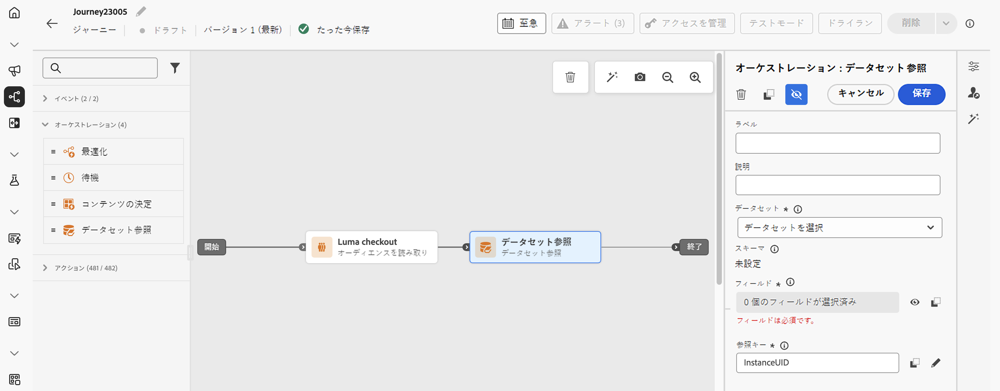
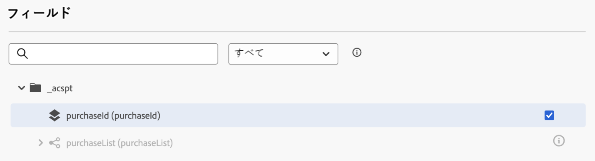
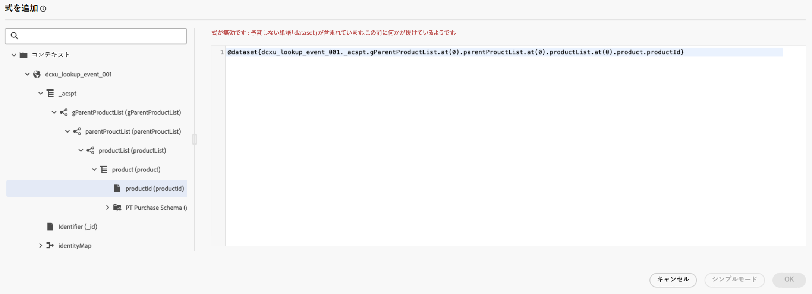

# ジャーニーでの [!DNL Adobe Experience Platform] データの使用 {#datalookup}

>[!CONTEXTUALHELP]
>id="ajo_journey_dataset_lookup"
>title="データセット参照アクティビティ"
>abstract="**[!UICONTROL データセット参照]**&#x200B;アクティビティを使用すると、実行時に Adobe Experience Platform レコードデータセットからデータを動的に取得できます。この機能を活用することで、プロファイルやイベントペイロードに存在しない場合があるデータにアクセスできるので、顧客とのインタラクションが関連性が高く、タイムリーなものになります。"

**[!UICONTROL データセット参照]**&#x200B;アクティビティを使用すると、実行時に Adobe Experience Platform レコードデータセットからデータを動的に取得できます。この機能を活用することで、プロファイルやイベントペイロードに存在しない場合があるデータにアクセスできるので、顧客とのインタラクションが関連性が高く、タイムリーなものになります。

主な利点：

* **リアルタイムパーソナライゼーション**：強化されたデータを使用して、カスタマーエクスペリエンスをカスタマイズします。
* **動的な意思決定**：外部データを使用して、ジャーニーのロジックとアクションを推進します。
* **データアクセスの強化**：特定のキーに関連付けられた製品メタデータ、価格テーブルまたはリレーショナルデータを取得します。

>[!AVAILABILITY]
>
>このアクティビティは、一連の組織のみが使用できます（限定提供）。アクセスするには、アドビ担当者にお問い合わせください。

## 必読 {#must-read}

### データセットのイネーブルメント

Adobe Experience Platform で参照するには、データセットを有効にする必要があります。詳しくは、[Adobe Experience Platform データの使用](../data/lookup-aep-data.md)の節を参照してください。

### 制限および制約事項

* ジャーニーあたり最大 10 個のデータセット参照アクティビティ。
* 最大 20 個の選択フィールド。
* 参照キー配列内に最大 50 個のキー。
* 強化されたデータサイズは 10 KB に制限されています。

### その他のパフォーマンスに関する考慮事項

以下のレコメンデーションは、配信品質の遅延を回避するガイダンスです。

| 考慮事項 | 推奨される制限 | 説明 |
| ------- | ------- | ------- |
| 参照あたりの属性 | 最大 20 個 | 単一の参照アクティビティでレコードごとに取得されるデータフィールドの数。 |
| 参照アクティビティ | ジャーニーあたり最大 5 個 | 各ジャーニーには、最大 5 個の個別の参照アクティビティを含めることができます。各参照は、異なるデータセットをターゲットにすることができます。 |

## データセット参照アクティビティの設定 {#configure}

**[!UICONTROL データセット参照]**&#x200B;アクティビティを設定するには、次の手順に従います。

1. **[!UICONTROL オーケストレーション]**&#x200B;カテゴリを展開し、**[!UICONTROL データセット参照]**&#x200B;アクティビティをキャンバスにドロップします。

   

1. ラベルと説明を追加します。

1. 「**[!UICONTROL データセット]**」フィールドで、必要な属性を持つデータセットを選択します。

   >[!NOTE]
   >
   >探しているデータセットがリストに表示されない場合は、参照に対してデータセットが有効になっていることを確認します。詳しくは、[必読](#must-read)の節を参照してください。

1. データセットから取得する特定のフィールドを選択します。

   * リーフノード（スキーマの最下位レベルのフィールド）のみを選択できます。フィールドは、プリミティブ値（文字列、数値、ブール値、日付など）にする必要があります。

   * リスト（配列）とマップ（キーと値のオブジェクト）は選択できません。

   +++例

   

   +++

1. 「**[!UICONTROL 参照キー]**」フィールドで、決定項目の属性とデータセットの両方に存在する結合キーを選択します。このキーは、システムで選択したデータセット内を検索するのに使用されます。

   * キーは、SKU、メール ID、その他の識別子など、ジャーニーコンテキストから派生した式にすることができます。例：`@profile.email` または `list(@event{purchase_event.products.sku})`。

   * **文字列**&#x200B;または&#x200B;**文字列のリスト**&#x200B;のみがサポートされます。

   +++例

   

   +++

## ジャーニーでの強化されたデータの使用

**[!UICONTROL データセット参照]**&#x200B;アクティビティで取得されたデータは、オブジェクトの配列としてジャーニーコンテキストに保存されます。これは、ジャーニー式エディターとパーソナライゼーションエディターで使用でき、強化されたデータに基づいて条件付きロジックとパーソナライズされたメッセージを有効にします。

* **ジャーニー式エディター**：

  **[!UICONTROL 詳細設定モード]**&#x200B;エディターにアクセスし、`@datasetLookup{MyDatasetLookUpActivity1.entities}` 構文を使用します。[詳しくは、高度な式エディターの操作方法を参照してください。](../building-journeys/expression/expressionadvanced.md)

* **パーソナライゼーションエディター**：

  `{{context.journey.datasetLookup.1482319411.entities}}` 構文を使用します。

>[!NOTE]
>
>強化されたデータは一時的なもので、ジャーニーのランタイム中と、アウトバウンドアクティビティ（メール、プッシュ、SMS など）のパーソナライゼーションにのみ使用できます。

## ユースケースの例

+++製品カテゴリベースのフィルタリング

**シナリオ**:Send&#x200B;家庭用品に 40 ドル以上を費やすユーザーへのクーポン。

**ジャーニーフロー**：

1. **購入イベント**：ユーザーの買い物かごから SKU を取得します。

1. **データセット参照アクティビティ**：

   * データセット：`products-dataset`（プライマリキーとしての SKU）。
   * 参照キー：`list(@event{purchase_event.products.sku})`。
   * 返されるフィールド：`["SKU", "category", "price"]`。

1. **条件アクティビティ**：

   * カテゴリが「household」の SKU をフィルタリングします。

     ```
     @event{purchase_event.products.all( in(currentEventField.sku, @datasetlookup{MyDatasetLookupActivity1.entities.all(currentDatasetLookupField.category == 'household').sku} ) )} 
     ```

   または

   * 家庭用品に対する総支出を集計し、40 ドルのしきい値と比較します。

     ```
     sum(@event{purchase_event.products.all( in(currentEventField.sku, @datasetlookup{MyDatasetLookUpActivity1.entities.all(currentDatasetLookupField.category == 'household').sku} ) )}.price}, ',', true ) > 40
     ```

1. **パーソナライゼーションエディター**：

   強化されたデータを使用して、メールのコンテンツをパーソナライズします。

   ```
   
   {{#each journey.datasetlookup.3709000.entities as |product|}}
   
   
   {{/each}}
   "Hi, thanks for spending " +  + " on household products. Here is your reward!"
   ```

+++

+++外部ロイヤルティデータを使用したパーソナライゼーション

**シナリオ**：プラチナロイヤルティステータスを持っているプロファイルのメールアカウントを特定します。このシナリオでは、ロイヤルティアカウントはメール ID に関連付けられており、ロイヤルティデータは標準のプロファイル参照ストアでは使用できません。

**ジャーニーフロー**：

1. **プロファイルイベントトリガー**：プロファイルまたはイベントコンテキストからメール ID を取得します。

1. **データセット参照アクティビティ**：
   * データセット：`loyalty-member-dataset`（プライマリキーとしてのメール）。
   * 参照キー：`@profile.email`。
   * 返されるフィールド：`["email", "loyaltyTier"]`。

1. **条件アクティビティ**：

   ロイヤルティ層に基づいてジャーニーを分岐します。

   ```
   @datasetLookup{MyDatasetLookUpActivity1.entity.loyaltyMember.loyaltyTier} == 'Platinum'
   ```

1. **パーソナライゼーションエディター**：

   強化されたロイヤルティ層のデータを使用して、アウトバウンド通信をパーソナライズします。

   ```
   {{context.journey.datasetLookup.1482319411.entity.loyaltyMember.loyaltyTier}}
   ```
