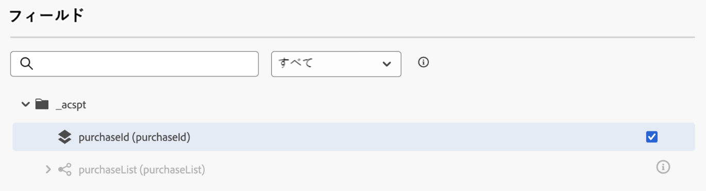
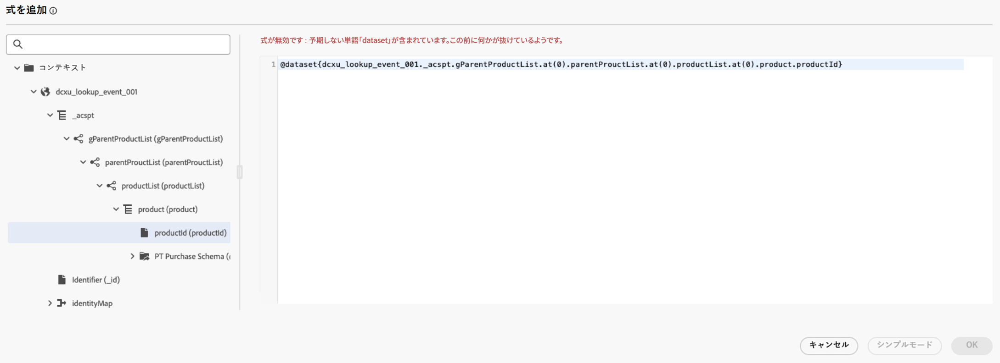

# ジャーニーで[!DNL Adobe Experience Platform] データを使用 {#datalookup}

>[!CONTEXTUALHELP]
>id="ajo_journey_dataset_lookup"
>title="データセット検索アクティビティ"
>abstract="**[!UICONTROL データセット検索]** アクティビティを使用すると、実行時に[!DNL Adobe Experience Platform]個のレコードデータセットからデータを動的に取得できます。 この機能を活用することで、プロファイルやイベントペイロードに格納されていない可能性のあるデータにアクセスし、顧客とのインタラクションが適切かつタイムリーであるようにすることができます。"

**[!UICONTROL データセット検索]** アクティビティを使用すると、実行時に[!DNL Adobe Experience Platform]個のレコードデータセットからデータを動的に取得できます。 この機能を活用することで、プロファイルやイベントペイロードに格納されていない可能性のあるデータにアクセスし、顧客とのインタラクションが適切かつタイムリーであるようにすることができます。

>[!AVAILABILITY]
>
>この機能は現在、すべてのユーザーが限定提供リリースとして利用できます。

主な特長：

* **リアルタイム パーソナライゼーション**：強化されたデータを使用して顧客体験をカスタマイズします。
* **動的な意思決定**：外部データを使用して、ジャーニーのロジックとアクションを推進します。
* **拡張データアクセス**：特定のキーに関連付けられた製品メタデータ、価格表、またはリレーショナルデータを取得します。

## 必読 {#must-read}

データセット検索を設定する前に、これらの要件を確認してください。

### データセットの有効化

[!DNL Adobe Experience Platform]で検索するには、データセットを有効にする必要があります。 詳細については、この節「[使用 [!DNL Adobe Experience Platform]  データ &#x200B;](../data/lookup-aep-data.md)」を参照してください。

### 制限と制限

* ジャーニーごとに最大10個のデータセットルックアップアクティビティ。
* 最大20個の選択されたフィールド。
* ルックアップキー配列の最大50個のキー。
* 強化されたデータサイズは10 KBに制限されています。

### その他のパフォーマンスに関する考慮事項

以下の推奨事項は、配信品質の遅延を回避するためのガイダンスです。

| 検討事項 | 推奨される制限 | 効果 |
| ------- | ------- | ------- |
| ルックアップごとの属性 | 最大20 | 1つのルックアップアクティビティでレコードごとに取得されたデータフィールドの数。 |
| ルックアップアクティビティ | ジャーニーごとに5つまで | 各ジャーニーには、最大5つの個別のルックアップアクティビティを含めることができます。 各ルックアップで異なるデータセットをターゲットにすることができます。 |

## データセット検索アクティビティの設定 {#configure}

**[!UICONTROL データセット ルックアップ]** アクティビティを設定するには、次の手順に従います。

1. **[!UICONTROL オーケストレーション]** カテゴリを展開し、**[!UICONTROL データセット ルックアップ]** アクティビティをキャンバスにドロップします。

   ジャーニーの[!DNL Adobe Experience Platform] データセット検索アクティビティ

1. ラベルと説明を追加します。

1. 「**[!UICONTROL データセット]**」フィールドで、必要な属性を含むデータセットを選択します。

   >[!NOTE]
   >
   >探しているデータセットがリストに表示されない場合は、参照のためにデータセットを有効にしていることを確認してください。 詳しくは、[必ず](#must-read)の節を参照してください。

1. データセットから取得する特定のフィールドを選択します。

   * リーフノード（スキーマの最下位レベルのフィールド）のみを選択できます。 フィールドはプリミティブ値（文字列、数値、ブール値、日付など）である必要があります。

   * リスト（配列）とマップ（キー値オブジェクト）は選択できません。

   +++例

   プリミティブ データ型と構造を示す

   +++

1. **[!UICONTROL 参照キー]** フィールドで、決定項目属性とデータセットの両方に存在する結合キーを選択します。 このキーは、選択したデータセット内の検索にシステムによって使用されます。

   * キーには、SKU、メール ID、その他の識別子など、ジャーニーコンテキストから派生した式を使用できます。 例：`@profile.email`または`list(@event{purchase_event.products.sku})`。

   * 文字列&#x200B;**の**&#x200B;文字列&#x200B;**または** リストのみがサポートされています。

   >[!IMPORTANT]
   >
   >**詳細モード**&#x200B;を使用してルックアップキーを定義する必要があります。 シンプル モードを使用してキーを設定する場合、データセット参照アクティビティの出力は、ダウンストリームアクティビティのコンテキスト属性として使用できず、条件アクティビティで「データセット参照が見つかりません」エラーが発生して`@datasetLookup{}`構文が失敗します。

   +++例

   

   +++

## 強化されたデータをジャーニーに活用

**[!UICONTROL データセット検索]** アクティビティによって取得されたデータは、オブジェクトの配列としてジャーニーコンテキストに保存されます。 ジャーニー式エディターとパーソナライゼーションエディターで使用でき、詳細なデータにもとづく条件付きロジックとパーソナライズされたメッセージを有効にできます。

* **ジャーニー式エディター**:

  **[!UICONTROL 詳細モード]** エディターにアクセスし、構文`@datasetLookup{MyDatasetLookUpActivity1.entities}`を使用します。 [高度な式エディターの操作方法を学ぶ](../building-journeys/expression/expressionadvanced.md)

* **Personalization Editor**:

  構文`{{context.journey.datasetLookup.1482319411.entities}}`を使用します。

>[!NOTE]
>
>強化されたデータは一時的なもので、ジャーニーの実行時、およびアウトバウンドアクティビティ（電子メール、プッシュ、SMSなど）のパーソナライゼーションでのみ使用できます。

## 事例

+++製品カテゴリベースのフィルタリング

**シナリオ**:Send&#x200B;家庭用品に40 ドル以上を費やしたユーザーにクーポンを提供します。

**ジャーニーフロー**:

1. **購入イベント**: ユーザーのカートからSKUをキャプチャします。

1. **データセット検索アクティビティ**:

   * データセット：`products-dataset` （プライマリキーとしてのSKU）。
   * 参照キー：`list(@event{purchase_event.products.sku})`。
   * 返すフィールド：`["SKU", "category", "price"]`。

1. **状況アクティビティ**:

   * カテゴリが「世帯」のSKUをフィルタリングします。

     ```
     @event{purchase_event.products.all( in(currentEventField.sku, @datasetlookup{MyDatasetLookupActivity1.entities.all(currentDatasetLookupField.category == 'household').sku} ) )} 
     ```

   または

   * 世帯商品への総支出を集計し、40 ドルのしきい値と比較します。

     ```
     sum(@event{purchase_event.products.all( in(currentEventField.sku, @datasetlookup{MyDatasetLookUpActivity1.entities.all(currentDatasetLookupField.category == 'household').sku} ) )}.price}, ',', true ) > 40
     ```

1. **Personalization Editor**:

   強化されたデータを使用して、メールコンテンツをパーソナライズします。

   ```
   
   {{#each journey.datasetlookup.3709000.entities as |product|}}
   
   
   {{/each}}
   "Hi, thanks for spending " +  + " on household products. Here is your reward!"
   ```

+++

+++外部ロイヤルティデータを活用したPersonalization

**シナリオ**: プロファイルのロイヤルティステータスがプラチナであるメールアカウントを特定します。 このシナリオでは、ロイヤルティアカウントは電子メール IDに関連付けられており、ロイヤルティデータは標準プロファイル検索ストアで使用できません。

**ジャーニーフロー**:

1. **プロファイルイベントトリガー**: プロファイルまたはイベントコンテキストからメール IDをキャプチャします。

1. **データセット検索アクティビティ**:
   * データセット：`loyalty-member-dataset` （電子メールをプライマリキーとして）。
   * 参照キー：`@profile.email`。
   * 返すフィールド：`["email", "loyaltyTier"]`。

1. **状況アクティビティ**:

   ロイヤルティ層に基づいてジャーニーを分岐させる：

   ```
   @datasetLookup{MyDatasetLookUpActivity1.entity.loyaltyMember.loyaltyTier} == 'Platinum'
   ```

1. **Personalization Editor**:

   強化されたロイヤルティ層データを使用して、アウトバウンドコミュニケーションをパーソナライズします。

   ```
   {{context.journey.datasetLookup.1482319411.entity.loyaltyMember.loyaltyTier}}
   ```

+++

## トラブルシューティング {#troubleshooting}

### 条件アクティビティの「データセット参照が見つかりません」エラー {#troubleshooting-not-found}

**症状：**&#x200B;条件アクティビティの高度な式エディターの`@datasetLookup{}`構文は、ジャーニーでデータセット検索アクティビティが正しく設定されていても、「データセット検索が見つかりません」エラーを返します。

**原因：** データセット ルックアップ アクティビティのルックアップ キーがシンプル モードを使用して設定されました。 キーが詳細モードで定義されていない場合、アクティビティ出力は、ダウンストリームアクティビティのコンテキスト属性として公開されません。

**修正：** データセット参照アクティビティを開き、**[!UICONTROL 参照キー]** フィールドを見つけ、**詳細モード**&#x200B;に切り替えてキー式を再定義します。 アクティビティを保存し、ジャーニーを再公開します。
