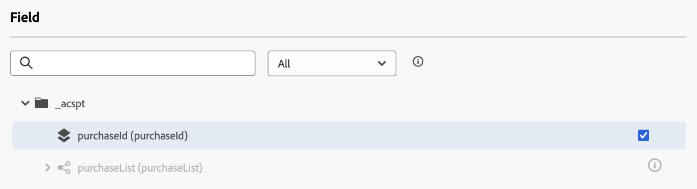

# ジャーニーでの [!DNL Adobe Experience Platform] データの使用 {#datalookup}

>[!CONTEXTUALHELP]
>id="ajo_journey_dataset_lookup"
>title="データセット参照アクティビティ"
>abstract="**[!UICONTROL データセット参照]**&#x200B;アクティビティを使用すると、実行時に Adobe Experience Platform レコードデータセットからデータを動的に取得できます。この機能を活用することで、プロファイルやイベントペイロードに存在しない場合があるデータにアクセスできるので、顧客とのインタラクションが関連性が高く、タイムリーなものになります。"

**[!UICONTROL データセット参照]**&#x200B;アクティビティを使用すると、実行時に Adobe Experience Platform レコードデータセットからデータを動的に取得できます。この機能を活用することで、プロファイルやイベントペイロードに存在しない場合があるデータにアクセスできるので、顧客とのインタラクションが関連性が高く、タイムリーなものになります。

主なメリット：

* **リアルタイムパーソナライゼーション**：強化されたデータを使用して顧客体験をカスタマイズします。
* **動的な意思決定**：外部データを使用して、ジャーニーのロジックとアクションを推進します。
* **拡張データアクセス**：特定のキーに関連付けられた製品メタデータ、価格テーブルまたはリレーショナルデータを取得します。

>[!AVAILABILITY]
>
>このアクティビティは、一連の組織でのみ使用できます（使用制限あり）。 アクセスするには、アドビ担当者にお問い合わせください。

## 必読 {#must-read}

### データセットの有効化

Adobe Experience Platformで参照するには、データセットを有効にする必要があります。 詳しくは、「Adobe Experience Platform データの使用 [&#x200B; を参照してくだ &#x200B;](../data/lookup-aep-data.md) い。

### 制限と制限

* 1 つのジャーニーにつき最大 10 個のデータセットルックアップアクティビティ。
* 選択したフィールドは最大 20 個です。
* ルックアップキー配列の最大 500 キー。
* エンリッチメントされたデータのサイズは 10 KB に制限されています。

### その他のパフォーマンスに関する考慮事項

以下のレコメンデーションは、配信品質の遅延を回避するガイダンスです。

| 考慮事項 | 推奨される制限 | 説明 |
| ------- | ------- | ------- |
| 参照あたりの属性 | 最大 20 個 | 単一の参照アクティビティでレコードごとに取得されるデータフィールドの数。 |
| 参照アクティビティ | ジャーニーあたり最大 5 個 | 各ジャーニーには、最大 5 個の個別の参照アクティビティを含めることができます。各参照は、異なるデータセットをターゲットにすることができます。 |

## データセットルックアップアクティビティの設定 {#configure}

**[!UICONTROL データセットルックアップ]** アクティビティを設定するには、次の手順に従います。

1. **[!UICONTROL オーケストレーション]** カテゴリを展開し、**[!UICONTROL データセットルックアップ]** アクティビティをキャンバスにドロップします。

   

1. ラベルと説明を追加します。

1. **[!UICONTROL データセット]** フィールドで、必要な属性を持つデータセットを選択します。

   >[!NOTE]
   >
   >探しているデータセットがリストに表示されない場合は、そのデータセットの検索を有効にしていることを確認してください。 詳しくは、[&#x200B; 必ずお読みください &#x200B;](#must-read) の節を参照してください。

1. データセットから取得する特定のフィールドを選択します。

   * リーフノード（スキーマの最下位レベルのフィールド）のみを選択できます。 フィールドはプリミティブ値（文字列、数値、ブール値、日付など）である必要があります。

   * リスト（配列）とマップ（キー値オブジェクト）は選択できません。

   +++例

   

   +++

1. **[!UICONTROL ルックアップキー]** フィールドで、決定項目属性とデータセットの両方に存在する結合キーを選択します。 このキーは、システムで選択したデータセットを検索するために使用されます。

   * キーは、SKU、電子メール ID、その他の識別子など、ジャーニーコンテキストから派生した式にすることができます。 例：`@profile.email` または `list(@event{purchase_event.products.sku})`。

   * **string** または **string のリスト** のみがサポートされます。

   +++例

   

   +++

## ジャーニーでのエンリッチメントされたデータの使用

**[!UICONTROL データセットルックアップ]** アクティビティで取得されたデータは、オブジェクトの配列としてジャーニーコンテキストに保存されます。 ジャーニー式エディターとパーソナライゼーションエディターで使用でき、条件付きロジックと、強化されたデータに基づいてパーソナライズされたメッセージングを有効にします。

* **ジャーニー式エディター**:

  **[!UICONTROL 詳細設定モード]** エディターにアクセスし、構文 `@datasetLookup{MyDatasetLookUpActivity1.entities}` を使用します。 [&#x200B; 高度な式エディターの操作方法を学ぶ &#x200B;](../building-journeys/expression/expressionadvanced.md)

* **Personalization エディター**:

  構文 `{{context.journey.datasetLookup.1482319411.entities}}` を使用します。

>[!NOTE]
>
>エンリッチメントされたデータは一時的なもので、ジャーニーの実行中、アウトバウンドアクティビティ（メール、プッシュ、SMS など）のパーソナライズ時にのみ使用できます

## 使用例

+++製品カテゴリベースのフィルタリング

**シナリオ**:Send 家庭用品に 40 ドル以上を費やすユーザーへのクーポン。

**ジャーニーフロー**:

1. **購入イベント**：ユーザーの買い物かごから SKU をキャプチャします。

1. **データセットルックアップアクティビティ**:
* データセット：`products-dataset` （プライマリキーとしての SKU）。
* 参照キー：`list(@event{purchase_event.products.sku})`。
* 返されるフィールド：`["SKU", "category", "price"]`。

1. **条件アクティビティ**:

   * カテゴリが「household」の場合は SKU をフィルタリングします。

     ```
     @event{purchase_event.products.all( in(currentEventField.sku, @datasetlookup{MyDatasetLookupActivity1.entities.all(currentDatasetLookupField.category == ‘household’).sku} ) )} 
     ```

   または

   * 家庭用品に対する総支出を集計し、$40 のしきい値と比較します。

     ```
     sum(@event{purchase_event.products.all( in(currentEventField.sku, @datasetlookup{MyDatasetLookUpActivity1.entities.all(currentDatasetLookupField.category == ‘household’).sku} ) )}.price}, ',', true ) > 40
     ```

1. **Personalization エディター**:

   エンリッチメントされたデータを使用してメールコンテンツをパーソナライズします。

   ```
   
   {{#each journey.datasetlookup.3709000.entities as |product|}}
   
   
   {{/each}}
   "Hi, thanks for spending " +  + " on household products. Here is your reward!"
   ```

+++

+++外部ロイヤルティデータを使用したPersonalization

**シナリオ**：プロファイルのどのメールアカウントがロイヤルティステータスがプラチナかを特定します。 このシナリオでは、ロイヤルティアカウントはメール ID に関連付けられており、標準のプロファイル参照ストアではロイヤルティデータを利用できません。

**ジャーニーフロー**:

1. **プロファイルイベントトリガー**：プロファイルまたはイベントのコンテキストからメール ID を取得します。

1. **データセットルックアップアクティビティ**:
   * データセット：`loyalty-member-dataset` （プライマリキーとしてメール）。
   * 参照キー：`@profile.email`。
   * 返されるフィールド：`["email", "loyaltyTier"]`。

1. **条件アクティビティ**:

   ロイヤルティ層に基づいてジャーニーを分岐します。

   ```
   @datasetLookup{MyDatasetLookUpActivity1.entity.loyaltyMember.loyaltyTier} == 'Platinum'
   ```

1. **Personalization エディター**:

   エンリッチメントされたロイヤルティ層のデータを使用して、アウトバウンド通信をパーソナライズします。

   ```
   {{context.journey.datasetLookup.1482319411.entity.loyaltyMember.loyaltyTier}}
   ```
