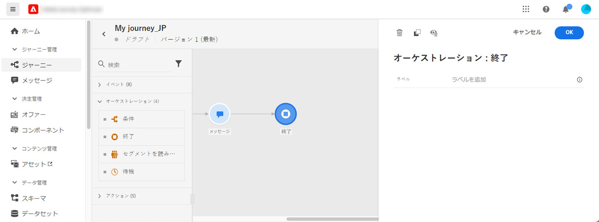

# 終了アクティビティ{#end-activity}

**[!UICONTROL 終了]**&#x200B;アクティビティを使用すると、ジャーニーの各パスの終了箇所をマークできます。必須ではありませんが、見やすくするためにお勧めします。実際に、ジャーニーに複数の終了アクティビティがある場合は、レポートを読みやすくするために、各終了箇所にラベルを追加することをお勧めします。[このページ](../reports/live-report.md)を参照してください。

