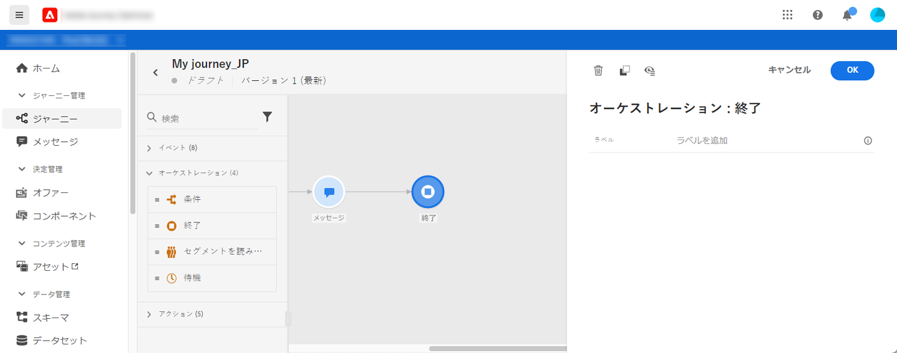

# 終了アクティビティ{#section_vqp_4ft_dgb}

**[!UICONTROL End]**&#x200B;アクティビティを使用すると、ジャーニーの各パスの終わりをマークできます。 必須ではありませんが、Visual Clarityのためにお勧めします。 実際、ジャーニーに複数のエンドアクティビティがある場合は、レポートを読みやすくするために、各エンドにラベルを追加することをお勧めします。 [このページ](../reports/live-report.md)を参照してください。

