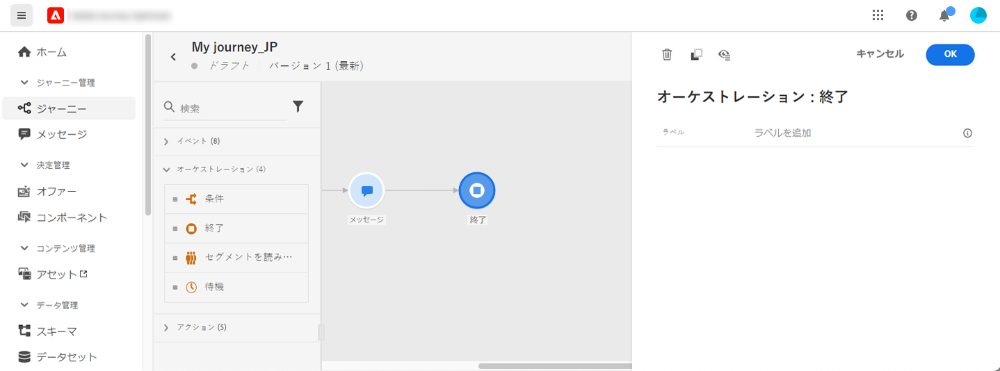

# 終了アクティビティ{#end-activity}

>[!BEGINSHADEBOX]

**このページ：**&#x200B;では、「終了」アクティビティを使用して、各ジャーニーパスの終了をマークし、ジャーニーレポートを読みやすくするためのラベルを追加する方法を説明します。

>[!ENDSHADEBOX]

>[!CONTEXTUALHELP]
>id="ajo_journey_end"
>title="終了アクティビティ"
>abstract="終了アクティビティを使用すると、ジャーニーの各パスの終了箇所をマークできます。 必須ではありませんが、見やすくするためにお勧めします。 実際に、ジャーニーに複数の終了アクティビティがある場合は、レポートを読みやすくするために、各終了箇所にラベルを追加することをお勧めします。"

**[!UICONTROL 終了]**&#x200B;アクティビティを使用すると、ジャーニーの各パスの終了箇所をマークできます。 必須ではありませんが、見やすくするためにお勧めします。 実際に、ジャーニーに複数の終了アクティビティがある場合は、レポートを読みやすくするために、各終了箇所にラベルを追加することをお勧めします。 [このページ](../reports/live-report.md)を参照してください。

<!--

-->
