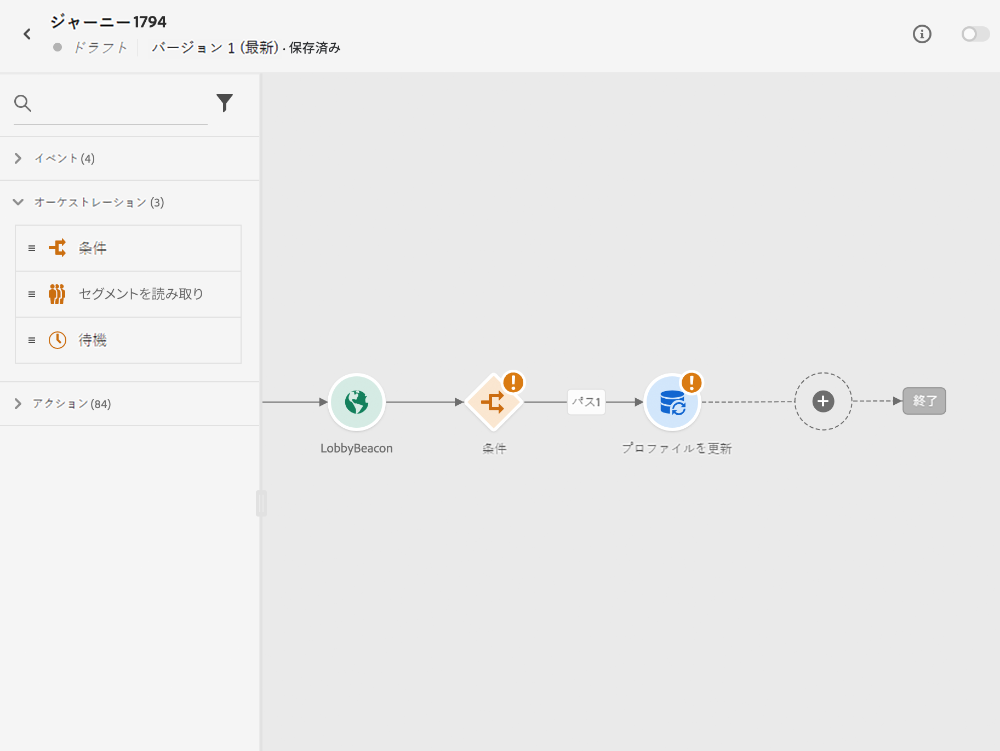
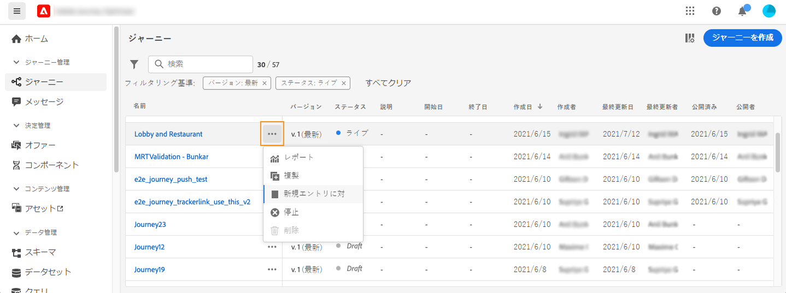
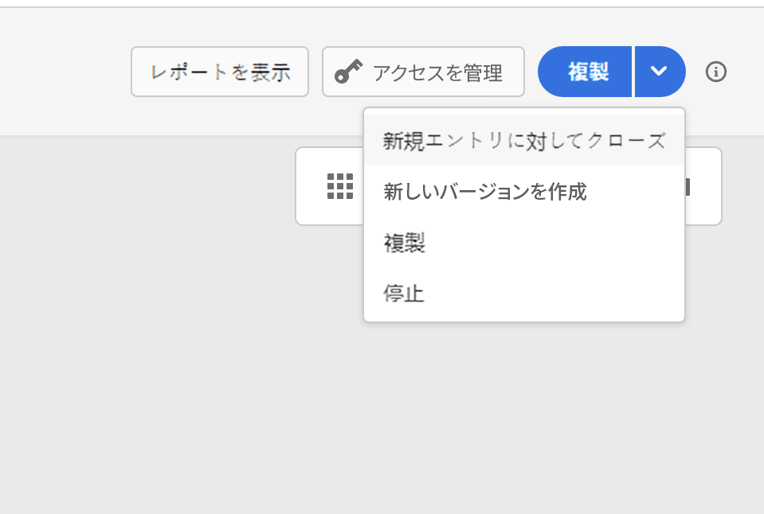
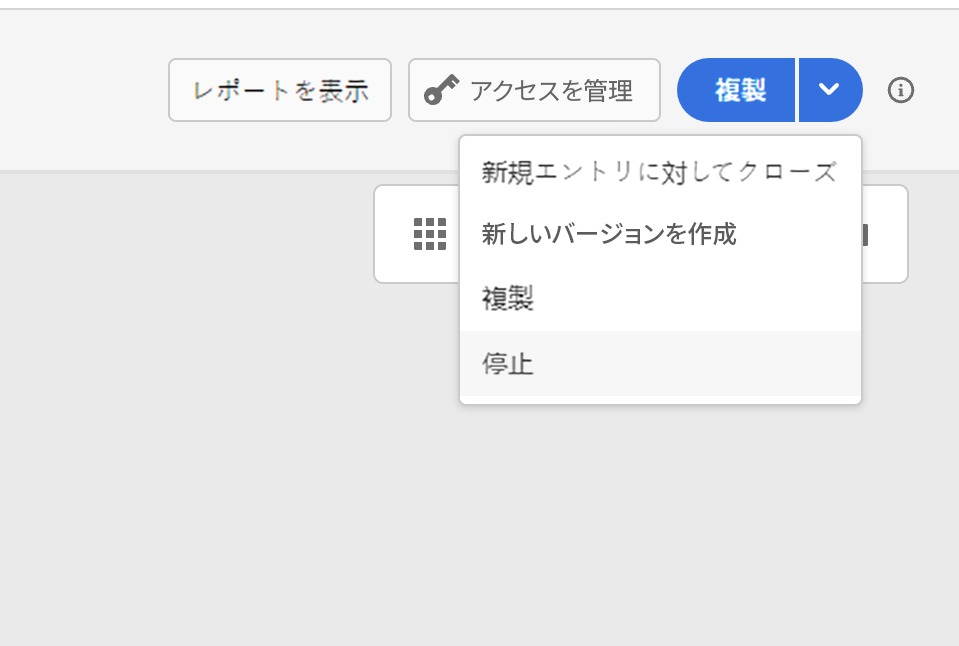

# ジャーニーの終了 {#journey-ending}

>[!BEGINSHADEBOX]

**このページでは、**&#x200B;個々のプロファイルと全体の両方でジャーニーが終了する方法と、新しいエントリまたはすべての処理を停止する必要がある場合にライブジャーニーを閉じたり停止したりする方法について説明します。

>[!ENDSHADEBOX]

>[!TIP]
>
>プロファイルがジャーニーを終了する必要があるタイミングと方法に関する実用的なガイダンスをお探しですか？ 実際の終了シナリオ、ベストプラクティス、設定ガイダンスを含む、[ジャーニーのエントリ条件と終了条件に関する包括的なガイド](entry-exit-criteria-guide.md)を参照してください。

## ライブジャーニーの終了方法

ジャーニーは、グローバルジャーニーのタイムアウトに到達した際や、オーディエンスベースの繰り返しジャーニーが最後に実行された後にクローズされます。 [詳しくは、ジャーニーをクローズする方法を参照してください](#close-journey)。

ライブジャーニーを終了する場合は、手動で[クローズ](#close-to-new-entrances)することをお勧めします。 そうすると、ジャーニーでの新規顧客のエントリはブロックされます。 既にジャーニーにエントリしているプロファイルは、最後までジャーニーを進めることができます。

また、緊急事態が発生した場合とすべてのジャーニー処理を直ちに終了する必要がある場合にのみ、[ジャーニーを停止](#stop-journey)することもできます。 既にジャーニーにエントリしている人物は全員、進行が停止します。

>[!IMPORTANT]
>
>* [クローズ](#close-journey)したジャーニーや[停止](#stop-journey)したジャーニーは再起動または削除できません。 クローズしたジャーニーから[新しいバージョンを作成](publish-journey.md#journey-versions)したり、[複製を作成](journey-ui.md#duplicate-a-journey)したりできます。
>
>* 削除できるのは完了したジャーニーのみです。

## プロファイルがジャーニーを終了する方法

ジャーニーは、次の 2 つの特定のコンテキストで、1 人の個人に対して終了します。

* その個人がパスの最後のアクティビティに到達すると、[終了タグ](#end-tag)に移動する。
* その個人が&#x200B;**条件**&#x200B;アクティビティ（または条件を含む&#x200B;**待機**&#x200B;アクティビティ）に到達したが、どの条件にも一致しない。

再エントリが許可されているジャーニーの場合、その個人は再度エントリすることができます。 [詳しくは、エントリ／再エントリの管理を参照してください](../building-journeys/journey-properties.md#entrance)

## ジャーニーの終了タグ {#end-tag}

ジャーニーの作成時に、各パスの末尾に終了タグが表示されます。 このノードは、ユーザーが追加できず、削除もできず、ラベルのみ変更できます。 ジャーニーの各パスの末尾を示します。

ジャーニーに複数のパスがある場合は、レポートを読みやすくするために、各末尾にラベルを追加することをお勧めします。 詳しくは、[ジャーニーレポート](../reports/live-report.md)を参照してください。

## ジャーニーをクローズ {#close-journey}

ジャーニーは、次の理由でクローズすることがあります。

* 繰り返されないオーディエンス読み取りジャーニー&#x200B;**は、スケジュールされた実行後にセーフティバッファーを実行すると自動的に停止します**。 [詳細情報](#auto-stop-non-recurring)
* オーディエンスベースの繰り返しジャーニーの最後の実行の後。
* 「[**[!UICONTROL 新規エントリに対してクローズ]**](#close-to-new-entrances)」ボタンを使用して手動でジャーニーをクローズする。
* グローバル ジャーニーのタイムアウトが91日に達しました。

**91 日間のジャーニーグローバルタイムアウト**&#x200B;の後、オーディエンスを読み取りジャーニーは&#x200B;**完了**&#x200B;ステータスに切り替わります。 ジャーニーにエントリしたプロファイルに関するすべての情報は、ジャーニーにエントリしてから 91 日後に削除されるので、この動作は 91 日間にのみ設定されます。 ジャーニーにまだ留まっているユーザーは、自動的に影響を受けます。 91 日間のタイムアウトが経過すると、ジャーニーは終了します。  詳しくは、[ジャーニーグローバルタイムアウト](../building-journeys/journey-properties.md#global_timeout)を参照してください。

### 非定期オーディエンスの自動ジャーニー停止 {#auto-stop-non-recurring}

定期的な実行後にセーフティバッファーを実行すると、**繰り返さないオーディエンスジャーニー**&#x200B;が&#x200B;**[!UICONTROL 停止]** ステータスに自動的に移行します。 これにより、プロファイルがアクティブに流れていなかったにもかかわらず、91日間のグローバルタイムアウトが期限切れになるまで、繰り返し繰り返されないオーディエンス読み取りジャーニーが&#x200B;**ライブ**&#x200B;状態のままだった以前の動作が削除されます。

**仕組み：**

1. ジャーニーが実行され、オーディエンスからのすべてのプロファイルが処理されます。
1. 各プロファイルがジャーニーの終わりに達すると、通常どおり終了します。
1. 最後にアクティブなプロファイル **が終了すると、ジャーニーはセーフティバッファー期間に入り、**[!UICONTROL  ライブ ]**状態のままになります。**
1. セーフティバッファーが経過した後（ジャーニーのスケジュールされた実行時間から約96時間後）、ジャーニーは次のスキャナーパスで自動的に&#x200B;**[!UICONTROL 停止済み]** ステータスに移行します。

この動作は、**非繰り返しのオーディエンス読み取りジャーニー**&#x200B;にのみ適用されます。 繰り返しジャーニーは影響を受けません。

* **自動停止タイミング：**&#x200B;安全バッファは、実行中の送信を完了させる&#x200B;**24時間のアイドルウィンドウ**&#x200B;と、**72時間の静止時間許可**&#x200B;の2つのウィンドウを考慮します（静止時間数は送信を最大72時間遅らせることができ、スキャナーには表示されません）。 合計バッファーは、ジャーニーのスケジュールされた実行時間から約&#x200B;**96時間（約4日）**&#x200B;です。 この期間中、ジャーニーは&#x200B;**[!UICONTROL ライブ]** ステータスのままです。 これは期待される動作であり、問題を示すものではありません。

* **ウェーブベースのジャーニーは除外されます：**&#x200B;この自動停止動作は、送信時間の最適化を使用するジャーニーを含む、ウェーブベースのジャーニーには適用されません。 これらのジャーニーは、スケジュールされたすべてのウェーブでアクティブであり続け、手動で閉じたり停止したりしない限り、標準の[91日のグローバルタイムアウト ](../building-journeys/journey-properties.md#global_timeout)によってのみ停止されます。

* この自動停止の動作は、**not**&#x200B;は、**Wait** ノード（タイマーベース）、**Reaction** ノード（電子メールの開封やクリックなどのイベントを待機）、イベントトリガーによる移行など、待機期間を引き起こすノードを含む非定期ジャーニーに適用されません。 これらのジャーニーは、標準の[91日間のグローバルタイムアウト ](../building-journeys/journey-properties.md#global_timeout)の対象のままです。

* 繰り返し発生しないオーディエンス読み取りジャーニーは、[**[!UICONTROL 新しいエントリに近づく]**](#close-to-new-entrances) オプションを使用して、いつでも手動で閉じることができます。 自動停止動作により、手動での介入なしに、ジャーニーが不要になったときに自動的に停止されます。

### ジャーニーはいつ「完了」と見なされますか？ {#journey-finished-definition}

「完了」の定義は、ジャーニータイプによって異なります。

| ジャーニータイプ | 繰り返し？ | 終了日はありますか？ | 「完了」の定義 |
|--------------|------------|---------------|--------------------------|
| オーディエンスを読み取り | × | 該当なし | プロファイルが最後に終了してから約96時間後（自動停止バッファ） |
| オーディエンスを読み取り | ○ | × | 前回の発生開始から91日後 |
| オーディエンスを読み取り | ○ | ○ | 終了日に達した場合 |
| イベントトリガージャーニー | 該当なし | ○ | 終了日に達した場合 |
| イベントトリガージャーニー | 該当なし | × | UI または API 経由で閉じた場合 |

### 新規エントリに対してクローズ {#close-to-new-entrances}

ジャーニーを手動でクローズすると、既にジャーニーにエントリしている顧客はパスを終了できますが、新しいユーザーはジャーニーにエントリできなくなります。 （上記の理由のいずれかにより）ジャーニーをクローズした場合、ステータスは「**[!UICONTROL クローズド]**」になります。 ジャーニーは、新しい個人がジャーニーにエントリするのを停止します。 既にジャーニーにエントリしているプロファイルは、通常どおりジャーニーを終了できます。 デフォルトのグローバルタイムアウトである 91 日が経過すると、ジャーニーは&#x200B;**完了**&#x200B;ステータスに切り替わります。

**ライブ**&#x200B;または&#x200B;**一時停止**&#x200B;状態からジャーニーを停止できます。 ジャーニーが&#x200B;**一時停止**&#x200B;の場合、最初に&#x200B;**ライブ**&#x200B;に再開する必要はありません。 [一時停止したジャーニーの停止の詳細](journey-pause.md#stop-close-paused)。

ジャーニーのリストからジャーニーをクローズするには、ジャーニー名の右側にある&#x200B;**[!UICONTROL 省略記号]**&#x200B;ボタンをクリックし、「**[!UICONTROL 新規エントリに対してクローズ]**」を選択します。

以下を行うこともできます。

1. **[!UICONTROL ジャーニー]**&#x200B;リストで、クローズするジャーニーをクリックします。
1. 右上の下向き矢印をクリックします。

   {width="50%" zoomable="yes"}

1. 「**[!UICONTROL 新規エントリに対してクローズ]**」をクリックし、ダイアログボックスで確定します。

## ジャーニーを停止 {#stop-journey}

必要に応じて、ジャーニー内のすべての個人の進行を停止することもできます。 ジャーニーを停止すると、ジャーニー内のすべての個人がタイムアウトになります。 ただし、ジャーニーを停止すると、既にジャーニーにエントリしている人物は全員、進行が停止します。 ジャーニーは基本的にオフになります。 ジャーニーを終了する場合のベストプラクティスは、ジャーニーを[クローズ](#close-journey)することです。

**一時停止** ジャーニーを直接停止して、最初に&#x200B;**ライブ**&#x200B;に再開することもできます。 [学習を増やす](journey-pause.md#stop-close-paused)。

例えば、ジャーニーが誤ったオーディエンスをターゲットにしていることをマーケターが認識した場合や、メッセージの配信に想定されるカスタムアクションが正しく機能していない場合に、ジャーニーを停止できます。 ジャーニーのリストからジャーニーを停止するには、ジャーニー名の右側にある&#x200B;**[!UICONTROL 省略記号]**&#x200B;ボタンをクリックし、「**[!UICONTROL 停止]**」を選択します。

以下を行うこともできます。

1. **[!UICONTROL ジャーニー]**&#x200B;リストで、停止するジャーニーをクリックします。
1. 右上の下向き矢印をクリックします。

   {width="50%" zoomable="yes"}

1. 「**[!UICONTROL 停止]**」をクリックし、ダイアログボックスで確定します。

停止すると、ジャーニーのステータスは&#x200B;**[!UICONTROL 停止済み]**&#x200B;に設定されます。

>[!CAUTION]
>
>ジャーニーを停止するには、**[!DNL Manage journeys]**&#x200B;権限が必要です。 ジャーニーにインラインキャンペーンまたはメッセージングノードが含まれる場合、ユーザーには&#x200B;**キャンペーン/キャンペーンを公開**&#x200B;権限も必要です。 ジャーニーでアセットを使用する場合（メールなど）、ユーザーはこれらのアセットフォルダーにアクセスできる必要があります。 [!DNL Journey Optimizer] ユーザーのアクセス権の管理について詳しくは、[この節](../administration/permissions-overview.md)を参照してください。

## 関連トピック

* [ジャーニーのエントリ条件と終了条件ガイド](entry-exit-criteria-guide.md) - 実際の例とベストプラクティスを含む完全なガイド
* [プロファイルエントリ管理](entry-management.md) - プロファイルがジャーニーにエントリする方法を設定します
* [終了条件の設定](journey-properties.md#exit-criteria) - ジャーニーからの自動プロファイル削除を設定します
* [ジャーニーの一時停止](journey-pause.md) - ジャーニーの実行を一時的に停止します

+++ AI ナレッジリファレンス

このセクションには、このトピックに関連する解釈、検索、質問への回答をサポートすることを目的とした構造化された知識が含まれています。

理解を深めるには、この情報をこのページのドキュメントと組み合わせる必要があります。 どちらのソースも単独で使用することを意図していません。このページでは、機能について説明しますが、この節では、用語、意図、適用可能性、および制約の曖昧さを解消するのに役立つ追加のコンテキストを提供します。

* **TL;DR:**&#x200B;このページでは、グローバルな91日間のタイムアウト、手動による新しいエントリのクローズ、緊急停止など、ライブジャーニーを終了するさまざまな方法と、進行中のプロファイルに対する影響について説明します。

**インテント：**

* 現在のプロファイルが完了できるようにしながら、ライブジャーニーを新しいエントリにクローズします
* ジャーニーをただちに停止して、進行中のすべてのプロファイルを停止します
* クローズ済み、停止済み、および終了ジャーニーのステータスの違いを理解する
* ジャーニーのタイプと設定に基づいて、ジャーニーがいつ「完了」したとみなされるかを決定します
* ジャーニーが「完了」ステータスに達したら削除します

**用語集：**

* **終了タグ**：オーサリング中に各ジャーニーパスの最後に自動生成された取り外し可能でないノードが表示されます。ラベルは&#x200B;*（製品固有）*&#x200B;に変更できます
* **新しいエントランスに近い**：既存のプロファイルがパス *（製品固有）*&#x200B;を完了できるようにしながら、新しいプロファイルがジャーニーに入るのを防ぐ手動アクション
* **グローバルジャーニータイムアウト**: ジャーニーが自動的に「完了」ステータスに切り替わり、すべてのプロファイルデータが削除されるまでの91日間の最大期間&#x200B;*（製品固有）*
* **停止ステータス**：すべての進行中のプロファイルが直ちに停止されるジャーニー状態。緊急事態&#x200B;*（製品固有）*&#x200B;にのみ使用されます

**ガードレール：**

* クローズ済みジャーニーと停止済みジャーニーは再開または削除できません。新しいバージョンまたは重複のみが作成できます。
* 完了ステータスのジャーニーのみを削除できます。
* ジャーニーを停止するには、ジャーニーの管理権限が必要です。インラインキャンペーンまたはメッセージノードを使用するジャーニーには、キャンペーン/キャンペーンを公開の権限も必要です。
* 91日間のグローバルタイムアウトの後、すべてのプロファイルジャーニーデータが削除され、残りのプロファイルは自動的に終了します。
* 待機、反応、またはイベントがトリガーされたノードを長時間実行せずに繰り返しオーディエンスジャーニーを読み取ると、最後のプロファイルが終了してから約96時間（約4日）後に自動的に「停止」に切り替わります。 ジャーニーは、このバッファー中もライブステータスのままです。 Send-Time Optimization ユースケースを含むウェーブベースのジャーニーは、この自動停止から除外され、手動で閉じたり停止したりしない限り、91日間のグローバルタイムアウトの対象となります。

**用語：**

* 正式名称：新しいエントリに近い – 略語：n/a – 変種：ジャーニーをクローズし、手動でクローズします。
* 同義語：「停止」ジャーニー≠「クローズ」ジャーニー – 停止すると、すべてのプロファイルが直ちに停止します。クローズした場合は、新しいエントリのみがブロックされます
* 「終了タグ」≠「終了アクティビティ」は混同しないでください。終了タグは自動生成され、削除できません。終了アクティビティは配置可能なキャンバスノードです

**FAQ:**

* **Q: ジャーニーをクローズして停止することの違いは何ですか？**  – 閉じると、新しいエントリはブロックされますが、既存のプロファイルは終了します。停止すると、トラック内のすべてのプロファイルがすぐに停止します。
* **Q：非定期的なジャーニーが、実行後も数日間はライブステータスのままなのはなぜですか？**  – これは予想されます。 最後のプロファイルが終了した後、AJOは約96時間（約4日）のセーフティバッファーを適用します。24時間で機内での送信が完了し、さらに72時間で静止時間遅延が発生します。 ジャーニーは、バッファーが経過した後、次のスキャナーパスで「停止」に移行します。
* **Q: ウェーブベースのジャーニーは、約96時間後に自動的に停止しますか？**  – いいえ。 Send-Time Optimizationを使用するジャーニーを含むウェーブベースのジャーニーは、この自動停止から除外されるので、スケジュールされたすべてのウェーブでアクティブな状態を維持できます。 クローズするか、手動で停止しない限り、標準的な91日間のジャーニータイムアウトに従います。
* **Q: オーディエンスジャーニーの「読み取り」が「完了」ステータスに達するのはいつですか？**  – 非繰り返しのオーディエンス読み取りジャーニーの場合：最後のプロファイルが終了してから約96時間（約4日）で自動停止します（安全バッファー：24時間アイドルウィンドウ + 72時間のサイレントアワー許可）。 ジャーニーは、このバッファー中もライブステータスのままです。 待機、反応、またはイベントノードがプロファイルをアクティブに保つ場合、標準の91日間のグローバルタイムアウトが代わりに適用されます。 クローズしたジャーニーが91日間のグローバルタイムアウトに達した場合、または完了定義テーブルの繰り返しジャーニーのルールごとに達した場合、完了に到達します。
* **Q：クローズしたジャーニーを削除できますか？**  – いいえ、完了したジャーニーのみを削除できます。
* **Q: 91日間のタイムアウトが発生した場合、ジャーニー内に残っているプロファイルはどうなりますか？** — ジャーニーからその時点で自動的に離脱します。
* **Q: ジャーニーを停止するために特別な権限が必要ですか？**  – はい。ジャーニーにインラインキャンペーンまたはメッセージングノードが含まれる場合は、ジャーニーの管理権限に加えて、キャンペーン/キャンペーンを公開する必要があります。

+++
