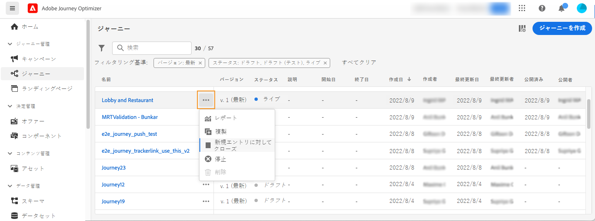

# ジャーニーの終了 {#journey-ending}

## ライブジャーニーの終了方法

ジャーニーは、グローバルジャーニーのタイムアウトに達したとき、または繰り返しオーディエンスベースのジャーニーが最後に発生した後に閉じられます。 [ ジャーニーのクローズ方法を説明します ](#close-journey)。

ライブジャーニーを終了する必要がある場合は、[ ジャーニーをクローズする ](#close-to-new-entrances) 手動でおこなうことをお勧めします。 その後、ジャーニーでの新規顧客のエントリはブロックされます。 既にジャーニーにエントリしているプロファイルは、最後までジャーニーを進めることができます。

また、緊急の場合およびすべてのジャーニー処理を直ちに終了する必要がある場合にのみ、[ ジャーニーを停止 ](#stop-journey) することもできます。 既にジャーニーにエントリしている人物は全員、進行が停止します。

>[!IMPORTANT]
>
>* [ クローズ済み ](#close-journey) または [ 停止した ](#stop-journey) ジャーニーを再開または削除することはできません。 [ 新しいバージョンを作成 ](publishing-the-journey.md#journey-versions-journey-versions) するか、[ 複製 ](journey-ui.md#duplicate-a-journey-duplicate-a-journey) できます。
>
>* 削除できるのは完了したジャーニーのみです。

## プロファイルがジャーニーを終了する方法

ジャーニーは、次の 2 つの特定のコンテキストで個人に対して終了します。

* 個人がパスの最後のアクティビティに到達すると、[ 終了タグ ](#end-tag) に移動します。
* 個人が **条件** アクティビティ（または条件を含む **待機** アクティビティ）に到達したが、どの条件にも一致しない。

再エントリが許可されている場合、個人はジャーニーに再エントリできます。 [ エントリ/再エントリ管理の詳細 ](../building-journeys/journey-properties.md#entrance)

## ジャーニー終了タグ {#end-tag}

ジャーニーの作成時に、各パスの末尾に終了タグが表示されます。 このノードは、ユーザーが追加できず、削除もできず、ラベルのみ変更できます。ジャーニーの各パスの末尾を示します。

ジャーニーに複数のパスがある場合は、レポートを読みやすくするために、各末尾にラベルを追加することをお勧めします。[ ジャーニーレポート ](../reports/live-report.md) について説明します。

## ジャーニーをクローズ {#close-journey}

ジャーニーは、次の理由でクローズすることがあります。

* セグメントベースの 1 回限りのジャーニーが実行を終了し、91 日のグローバルタイムアウトに達した。
* オーディエンスベースの繰り返しジャーニーの最後の回が終了した後。
* 「[**[!UICONTROL 新規エントリに対してクローズ]**](#close-to-new-entrances)」ボタンを使用して手動でジャーニーをクローズする。

**91 日のジャーニーのグローバルタイムアウト** が経過すると、オーディエンスを読み取りジャーニーは **完了** ステータスに切り替わります。 ジャーニーにエントリしたプロファイルに関するすべての情報は、ジャーニーへのエントリから 91 日後に削除されるので、この動作は 91 日間のみ設定されます。 ジャーニーにまだ留まっているユーザーは、自動的に影響を受けます。91 日のタイムアウトの後にジャーニーを終了します。  詳しくは、[ ジャーニーのグローバルタイムアウト ](../building-journeys/journey-properties.md#global_timeout) を参照してください。

>[!TIP]
>
>1 回限りのセグメントベースのジャーニーでは、1 回実行した後も **ライブ** ステータスが保持されます。 プロファイルは完了後に再入力することはできませんが、デフォルトのグローバルタイムアウトが期限切れになるまで、ジャーニーは **ライブ** ステータスのままになります。 「**新規エントリに対してクローズ** オプションを使用して、より早く手動でクローズできます。

### 新規エントリに対してクローズ {#close-to-new-entrances}

ジャーニーを手動でクローズすると、既にジャーニーにエントリしている顧客はパスを終了できますが、新しいユーザーはジャーニーにエントリできなくなります。（上記の理由のいずれかにより）ジャーニーをクローズした場合、ステータスは「**[!UICONTROL クローズド]**」になります。ジャーニーは、新しい個人がジャーニーにエントリするのを停止します。既にジャーニーにエントリしているプロファイルは、通常どおりにジャーニーを終了できます。 デフォルトのグローバルタイムアウトである 91 日が経過すると、ジャーニーは **完了** ステータスに切り替わります。

ジャーニーのリストからジャーニーをクローズするには、ジャーニー名の右側にある&#x200B;**[!UICONTROL 省略記号]**&#x200B;ボタンをクリックし、「**[!UICONTROL 新しいエントリをクローズ]**」を選択します。

以下の手順でも可能です。

1. **[!UICONTROL ジャーニー]**&#x200B;リストで、クローズするジャーニーをクリックします。
1. 右上の下向き矢印をクリックします。

   {width="50%" align="left" zoomable="yes"}

1. 「**[!UICONTROL 新規エントリに対してクローズ]**」をクリックし、ダイアログボックスで確定します。

## ジャーニーを停止 {#stop-journey}

必要に応じて、ジャーニー内のすべての個人の進行を停止することもできます。ジャーニーを停止すると、ジャーニー内のすべての個人がタイムアウトになる。 ただし、ジャーニーを停止すると、既にジャーニーにエントリしている人物は全員、進行が停止します。ジャーニーは基本的にオフになります。ジャーニーを終了する場合は、[ ジャーニーをクローズする ](#close-journey) ことがベストプラクティスです。

例えば、ジャーニーが誤ったオーディエンスをターゲットにしていることをマーケターが認識した場合や、メッセージの配信に想定されるカスタムアクションが正しく機能していない場合に、ジャーニーを停止できます。ジャーニーのリストからジャーニーを停止するには、ジャーニー名の右側にある&#x200B;**[!UICONTROL 省略記号]**&#x200B;ボタンをクリックし、「**[!UICONTROL 停止]**」を選択します。

以下の手順でも可能です。

1. **[!UICONTROL ジャーニー]**&#x200B;リストで、停止するジャーニーをクリックします。
1. 右上の下向き矢印をクリックします。

   {width="50%" align="left" zoomable="yes"}

1. 「**[!UICONTROL 停止]**」をクリックし、ダイアログボックスで確定します。

停止すると、ジャーニーのステータスは&#x200B;**[!UICONTROL 停止済み]**&#x200B;に設定されます。
