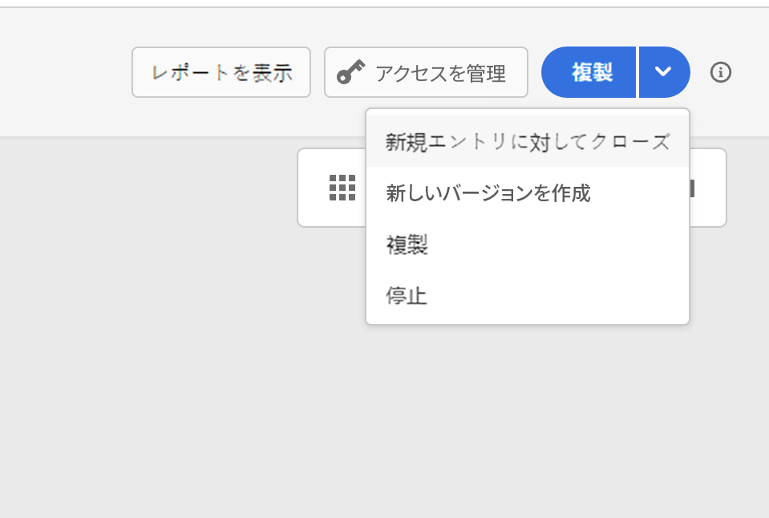

# 旅の終了{#journey-ending}

次の2つの特定のコンテキストで個々の人物に対する旅が終了します。

* パスの最後のアクティビティに送られます。
* この人物は、condition **アクティビティ (または** 条件付きの待機 **アクティビティー) に到着し、条件に一致する** ことはありません。

これにより、re が再入可能な場合には、その人物が再入力できるようになります。 このページを参照してください [ 。](../building-journeys/journey-gs.md#change-properties)

ライブフライトを終了するには、そのライブフライトを閉じることが推奨されます。 これにより、この旅において新規顧客が到着するのをブロックすることになります。 この旅に既に入力されているお客様は、最後までご登録いただくことができます。 この項を参照してください [ 。](../building-journeys/journey.md#close-journey)

緊急に発生して、すべての処理を1つの旅に直ちに終了する必要がある場合にのみ、旅を停止させることができます。 既に旅に入った人物はすべて、進行中に停止されます。 この項を参照してください [ 。](../building-journeys/journey.md#stop-journey)

>[!NOTE]
>
>閉じられたフライトや停止した旅は再開できないことに注意してください。

## 道の終了タグ{#end-tag}

各パスの最後に「終了タグ」が表示されます。 このノードは、ユーザーが追加することはできません。削除することはできません。また、ラベルのみを変更することもできます。 これは、旅の各パスの終わりを示します。 旅に複数のパスが含まれている場合は、レポートが読みやすくなるように、それぞれの端にラベルを追加することをお勧めします。 このページ ](../reports/live-report.md) を参照してください [ 。

<!--

### End activity{#journey-end-activity}

The **[!UICONTROL End]** activity allows you to mark the end of each path of the journey. It is not mandatory but recommended for visual clarity. See [this page](../building-journeys/end-activity.md)

-->

## 旅を閉じる{#close-journey}

次のような理由から、旅は終了します。

* ボタンを **[!UICONTROL Close to new entrances]** クリックすると、手動で旅が閉じられます。
* 実行が完了した1回のセグメントベースの旅
* 定期的なセグメントベースの旅が最後に発生した後に実行されます。

手動で旅を閉じると、旅に出たことのあるお客様は経路を終えることができますが、新規ユーザーは旅に入ることはできません。 (上記のいずれかの理由で) 旅がクローズした場合、状態 **[!UICONTROL Closed]** が表示されます。 新しいユーザーが旅に入るのを防ぐことができます。 既に旅にいた人物は、通常どおりに旅を完了させることができます。 デフォルトでは、30日間が経過すると、その処理は完了 **状態に** なります。この [ 項 ](../building-journeys/journey-gs.md#global_timeout) を参照してください。

「クローズドな旅」バージョンは、再実行したり削除したりすることはできません。 新しいバージョンを作成したり、複製したりすることができます。 終了した journeys のみ削除することができます。

Journeys のリストからの旅を閉じるには、旅名の右側にあるボタンをクリック **[!UICONTROL Ellipsis]** し、を選択 **[!UICONTROL Close to new entrances]** します。

次のこともできます。

1. **[!UICONTROL Journeys]**&#x200B;リストで、クローズする旅をクリックします。
1. 右上にある下向き矢印をクリックします。

   

1. 「」をクリックし、ダイアログボックスで「確認」をクリック **[!UICONTROL Close to new entrances]** します。

## 旅の停止{#stop-journey}

このような場合は、すべての個人の進行状況を停止させることができます。 旅を停止すると、その過程にあるすべての人物がタイムアウトになります。 ただし、旅に参加したことがある場合は、既に旅に入った人物はすべて、進行中に停止します。 この旅は基本的にはオフになっています。 このような場合は、終了することをお勧めします。

中止した旅のバージョンは、再起動できません。

停止した場合、旅の状態はに **[!UICONTROL Stopped]** 設定されます。

このような場合は、marketer を使用して、旅に問題があると考えられる場合や、メッセージを配信するためのカスタムアクションが正常に機能しないことがわかっている場合などです。 Journeys のリストからの旅を停止するには、旅名の右側にあるボタンをクリック **[!UICONTROL Ellipsis]** して、を選択 **[!UICONTROL Stop]** します。

次のこともできます。

1. **[!UICONTROL Journeys]**&#x200B;リストで、停止する旅をクリックします。
1. 右上にある下向き矢印をクリックします。
   
1. 「」をクリックし、ダイアログボックスで「確認」をクリック **[!UICONTROL Stop]** します。
