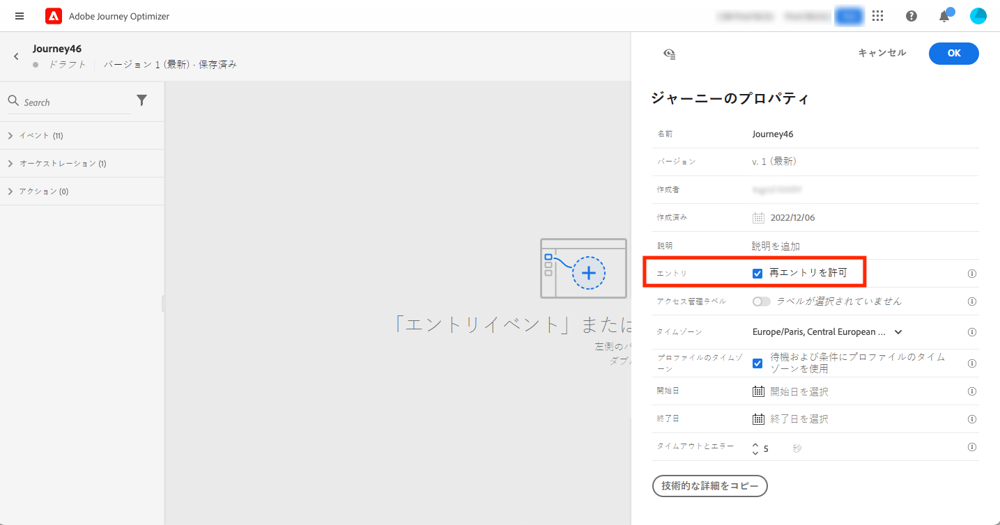
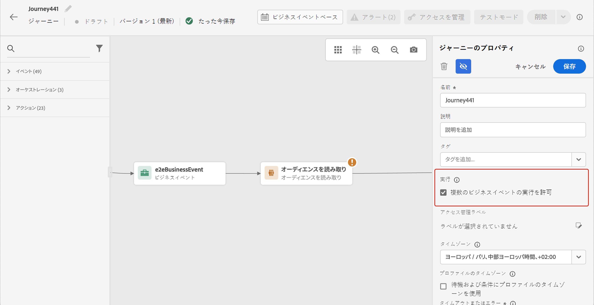

# プロファイルエントリ管理 {#entry-management}

プロファイルエントリ管理は、ジャーニーのタイプに応じて異なります。

>[!TIP]
>
>実際の例を使用した実用的なガイダンスをお探しですか？ウェルカムキャンペーン、放棄された買い物かごの復元、ロイヤルティプログラムなどのユースケースと、完全なエントリ設定と終了設定の例を含む、[ジャーニーのエントリ条件と終了条件に対する包括的なガイド](entry-exit-criteria-guide.md)を参照してください。

## ジャーニーのタイプ {#types-of-journeys}

[!DNL Adobe Journey Optimizer]では、次の種類のジャーニーを作成できます。

* **単一イベント**&#x200B;ジャーニー：単一イベントから開始するジャーニーです。イベントを受信すると、関連付けられたプロファイルがジャーニーにエントリします。[詳細情報](#entry-unitary)

* **ビジネスイベント**&#x200B;ジャーニー：ビジネスイベントから開始し、その直後に&#x200B;**オーディエンスを読み取り**&#x200B;アクティビティが続くジャーニーです。イベントを受信すると、ターゲットオーディエンスに属するプロファイルがジャーニーにエントリします。このジャーニーのインスタンスが各プロファイルに対して 1 つ作成されます。[詳細情報](#entry-business)

* **オーディエンスを読み取り**&#x200B;ジャーニー：**オーディエンスを読み取り**&#x200B;アクティビティから開始するジャーニーです。ジャーニーを実行すると、ターゲットオーディエンスに属するプロファイルがジャーニーにエントリします。このジャーニーのインスタンスが各プロファイルに対して 1 つ作成されます。これらのジャーニーは、繰り返しの場合もあれば、「1 回限り」の場合もあります。[詳細情報](#entry-read-audience)

* **オーディエンスの選定**&#x200B;ジャーニー：オーディエンスの選定イベントから開始するジャーニーです。これらのジャーニーは、オーディエンス内のプロファイルのエントリと離脱をリッスンします。これが発生すると、関連付けられたプロファイルがジャーニーにエントリします。[詳細情報](#entry-unitary)

[ユースケースを含むすべてのジャーニータイプの比較 →](journey.md#journey-types)

すべてのジャーニータイプで、プロファイルは、すべてのアクティブな[ジャーニーバージョン](publish-journey.md#journey-versions)に対して、同じジャーニー内に同時に複数回存在することはできません。ユーザーがジャーニー内に存在することを確認するには、プロファイル ID をキーとして使用します。同じキー（キー `CRMID=3224` など）を同じジャーニー内の異なる場所に配置することはできません。

## ジャーニーの処理率 {#journey-processing-rate}

ジャーニーの処理率は、プロファイルがジャーニーを通じてフローする仕組みを決定する複数の要因で影響を受けます。

### プロファイルのエントリ率 {#profile-entrance-rate}

プロファイルがジャーニーにエントリする方法とその予想率は、使用される最初のアクティビティに応じて異なります。

* **オーディエンスの読み取り** ジャーニー（プロファイルのオーディエンスをターゲットにし、そのオーディエンスのジャーニーをトリガーするバッチシナリオ）：最大20,000 TPS （1秒あたりのトランザクション数）です。 これは、**サンドボックスレベル**&#x200B;で使用できる割り当て量です。 そのサンドボックスで複数のジャーニーを同時に実行すると、20,000 TPSを達成できない可能性があります。 この最大値をベストケースのシナリオとして考えます。

* **オーディエンスの選定**&#x200B;ジャーニー（プロファイルがストリーミングオーディエンスとして選定または不選定された際にジャーニーをトリガーする単一シナリオ）：最大値は 5,000 TPS です。これは、イベントで開始するジャーニーで共有される制限で、**組織レベル**&#x200B;のジャーニー間でも共有されます。

* **単一イベント**&#x200B;ジャーニー（プロファイルからイベントが発生した際にジャーニーをトリガーする単一シナリオ）：上記と同じで、どちらも同じ 5,000 TPS 制限を共有します。ジャーニーイベントスループットについて詳しくは、[この節](../event/about-events.md#event-thoughput)を参照してください。

* **ビジネスイベント**&#x200B;のジャーニー（ビジネスイベントの後には常に「オーディエンスを読み取り」が続くため、単一からバッチへのシナリオ）：ビジネスイベントは5,000 TPSの割り当てにカウントされます。 続く「オーディエンスを読み取り」アクティビティには、オーディエンスを読み取り（20,000 TPS）で始まるジャーニーと同じ制限があります。

### ジャーニー内のイベントとオーディエンスの選定 {#events-inside-journeys}

エントリ後は、ジャーニー内で&#x200B;**単一イベント**&#x200B;アクティビティまたは&#x200B;**オーディエンスの選定**&#x200B;アクティビティを使用できます。プロファイルは、上記の 4 つのタイプのジャーニーのいずれかにエントリし、イベントが発生するのを待つか、このプロファイルがオーディエンスに選定されるまで待つことができます。これらの単一イベントおよびオーディエンスの選定は、上記の割り当て量にカウントされます。例：オーディエンスを読み取り（最大 20,000 TPS）でジャーニーを開始し、直後にイベントが発生した場合、このイベントは最大 5,000 TPS になります。

### 待機アクティビティの影響 {#wait-activities-impact}

ジャーニーの&#x200B;**待機**&#x200B;アクティビティは、特定の時間にジャーニーを通じてフローするプロファイルの数にも影響を与える場合があります。通常、待機アクティビティは相対時間に基づいています（例：待機にエントリしてから 2 時間後に終了するので、すべてのプロファイルが同時に退出することはありません）。ただし、その待機アクティビティに固定時間が定義されている場合は、複数のプロファイルがまったく同時にそのジャーニーを退出することがあります。これは推奨されるプラクティスではありません。その後、大量のデータが確認され、この時点以降の TPS は 20,000 TPS を超える場合があります。

### アクションアクティビティ {#action-activities-impact}

最後に、**アクション**&#x200B;のアクティビティは、ジャーニーからのプロファイル読み込みの影響を受ける可能性があり、処理速度にも影響する可能性があります。 これには、電子メール、SMS、プッシュ通知などのネイティブチャネルに加えて、カスタムアクション、他のジャーニーへのジャンプ、プロファイルアクティビティの更新などが含まれます。 例えば、応答時間が長い外部エンドポイントをターゲットにするカスタムアクションでは、ジャーニーの処理率が低下します。

カスタムアクションの場合、デフォルトのキャップは 1 分あたり 300,000 回の呼び出しですが、カスタムキャップポリシーで変更できます。カスタムアクションのキャップについて詳しくは、[この節](../configuration/external-systems.md#capping)を参照してください。

## 単一イベントおよびオーディエンスの選定ジャーニー{#entry-unitary}

**単一イベント**&#x200B;および&#x200B;**オーディエンスの選定**&#x200B;ジャーニーでは、再エントリを有効または無効にできます。

* 再エントリが有効な場合、プロファイルはジャーニーに複数回エントリできますが、以前のジャーニーインスタンスから完全に離脱するまでは実行できません。

* 再エントリが無効な場合、プロファイルはグローバルジャーニータイムアウト期間内に同じジャーニーに複数回エントリできません。詳しくは、この[節](../building-journeys/journey-properties.md#global_timeout)を参照してください。

デフォルトでは、ジャーニーで再エントリが許可されています。「**再エントリを許可**」オプションがアクティブ化されると、「**再エントリ待機期間**」フィールドが表示されます。プロファイルがジャーニーに再度エントリできるようになるまでの待機時間を定義できます。これにより、ジャーニーが同じイベントに対して誤って複数回トリガーされるのを防ぎます。デフォルトでは、このフィールドは 5 分に設定されています。最大期間は 91 日間（[グローバルタイムアウト](journey-properties.md#global_timeout)）です。

<!--
When a journey ends, its status is **[!UICONTROL Closed]**. New individuals can no longer enter the journey. Persons already in the journey automatically exit the journey. 
-->

再エントリ期間を過ぎると、プロファイルはジャーニーに再エントリできます。これを回避し、これらのプロファイルの再エントリを完全に無効にするには、プロファイルまたはオーディエンスデータを使用して、プロファイルが既にエントリ済みかどうかをテストする条件を追加できます。

<!--
Due to the 30-day journey timeout, when journey reentrance is not allowed, we cannot make sure the reentrance blocking will work more than 91 days. Indeed, as we remove all information about persons who entered the journey 91 days after they enter, we cannot know the person entered previously, more than 91 days ago. 
-->

## ビジネスジャーニー {#entry-business}

<!--
Business events follow reentrance rules in the same way as for unitary events. If a journey allows reentrance, the next business event will be processed.
-->

**ビジネスジャーニー**&#x200B;で、複数のビジネスイベントの実行を許可するには、ジャーニープロパティの「**[!UICONTROL 実行]**」セクションで、対応するオプションを有効にします。

ビジネスイベントの場合、特定のジャーニーについて、最初の実行時に取得されたオーディエンスデータが 1 時間の時間枠で再利用されます。

プロファイルは、同じジャーニー内で同時に複数回存在できますが、異なるビジネスイベントのコンテキスト内で存在できます。

詳しくは、この[節](../event/about-creating-business.md)を参照してください。

## 「オーディエンスを読み取り」ジャーニー {#entry-read-audience}

**オーディエンスを読み取り**&#x200B;ジャーニーは、繰り返しの場合もあれば、「1 回限り」の場合もあります。

* 繰り返し発生しない／「1 回限り」のジャーニーの場合：プロファイルはジャーニーに 1 回のみエントリします。

* 繰り返しジャーニーの場合：デフォルトでは、オーディエンスに属するすべてのプロファイルが、繰り返しのたびにジャーニーにエントリします。プロファイルは、別のオカレンスに再エントリする前に、ジャーニーを終了する必要があります。

繰り返しの「オーディエンスを読み取り」ジャーニーには、いくつかのオプションがあります。詳しくは、[ジャーニーでのオーディエンスの使用](../building-journeys/read-audience.md)の節を参照してください。

<!--
After 91 days, a Read audience journey switches to the **Finished** status. This behavior is set for 91 days only (i.e. journey timeout default value) as all information about profiles who entered the journey is removed 91 days after they entered. Persons still in the journey automatically are impacted. They exit the journey after the 30 day timeout. 
-->

## 関連トピック

* [ジャーニーのエントリ条件と終了条件ガイド](entry-exit-criteria-guide.md) - 実際の例とベストプラクティスを含む完全なガイド
* [終了条件の設定](journey-properties.md#exit-criteria) - プロファイルがジャーニーを離脱するタイミングを定義します
* [ジャーニーの終了](end-journey.md) - ジャーニーのクローズ方法と終了方法について説明します
* [ジャーニーユースケース](jo-use-cases.md) - エントリ設定と終了設定の完全な例を参照してください
